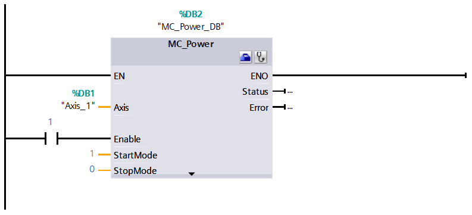
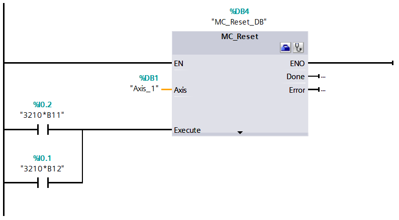
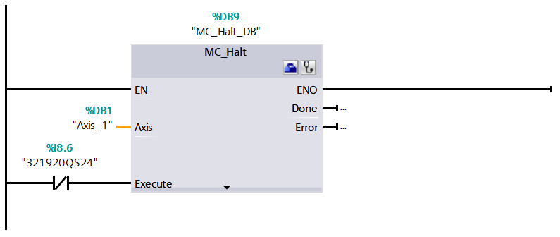
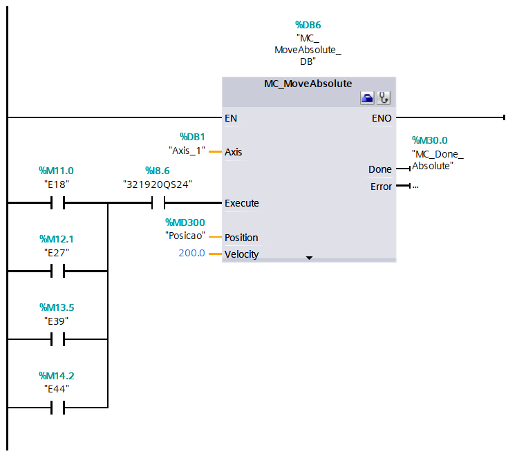
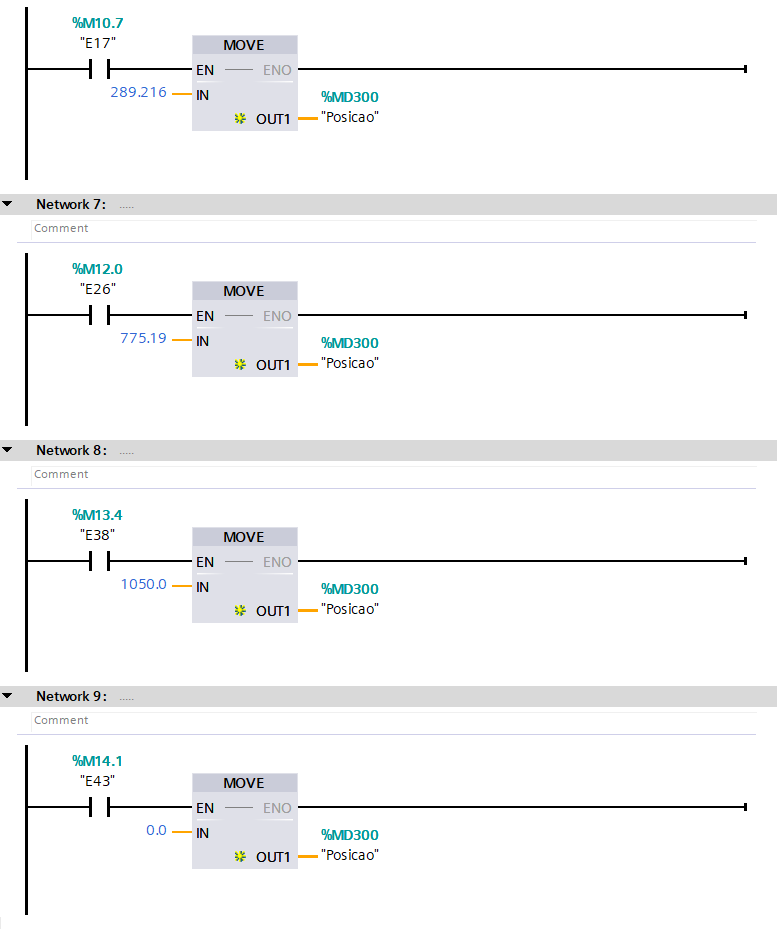
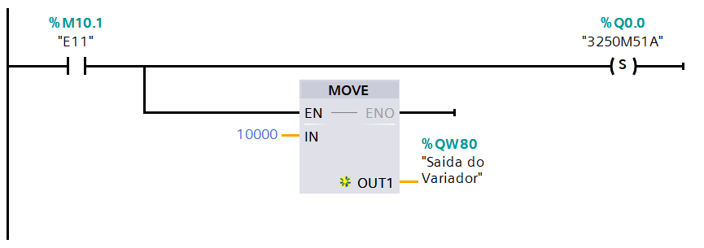
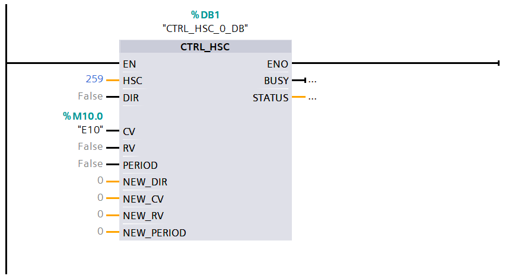

# Line 32

**Autor:** *Luís Barroso*

**Data:** *11/06/2021, 12h08*

- [Trabalho fora da Line](./o_lines/o_lines.md)
- [Introdução](#introducao)
- [Processo](#processo)
    - [Peças](#pecas)
    - [Estações](#estacoes)
        - [Estação 10](#estacao-10)
        - [Estação 20](#estacao-20)
        - [Estação 30](#estacao-30) 
        - [Estação 40](#estacao-40)
        - [Estação 50](#estacao-50)
    - [Modo de Funcionamento](#modo-de-funcionamento) #Tesla,Local,HMI
- [Trabalho Realizado](#trabalho-realizado)
    - [Classificação](#classificacao)
        - [Estação 10](#estacao-10-classificacao)
        - [Estação 20](#estacao-20-classificacao)
        - [Estação 30](#estacao-30-classificacao) 
        - [Estação 40](#estacao-40-classificacao)
        - [Estação 50](#estacao-50-classificacao)
    - [Software](#software)
        - [Grafcets](#grafcets)
            - [Estação 10](#estacao-10-grafcet)
            - [Estação 20](#estacao-20-grafcet)
            - [Estação 30](#estacao-30-grafcet) 
            - [Estação 40](#estacao-40-grafcet)
            - [Estação 50](#estacao-50-grafcet)
        - [Programação](#programacao)
        - [Gemma](#gemma)
            - [Esquema](#esquema)
            - [Guia de Iluminação](#guia-de-iluminacao)
            - [Grafcet’s](#grafcet-s)
                - [Gemma Master](#gemma-master)
                - [Gemma Estações](#gemma-estacoes)
                - [Gemma Iluminação](#gemma-iluminacao)
            - [Modos de Marcha]
            - [Classificação]
                - [Master]
                - [Estação 10]
                - [Estação 20]
                - [Estação 30]
                - [Estação 40]
                - [Estação 50]
        - [HMI](#HMI)  
        - [Tesla Scada](#tesla-scada)
        - [Anexos](#anexos)

## Introdução

A Line 32 é uma das Lines do Grupo 30. Divida em 5 estações das quais resultam: **"Transporte (Estação 10)"**, **"Aplicação (Estação 30)"**, **"Alimentação (Corpo (Estação 20) e Miolo (Estação 40))"** e **"Seleção (Estação 50)"**.

## Processo

A Line 32, do Grupo 30, consiste num conjunto de estações, **cada uma com Equipamentos/Componentes independentes**. A Line 32, assim com cada uma da estações, funcionam usando **sistemas pneumáticos** e **sistemas eletromecânicos**.

Os **sistemas pneumáticos** estão presentes em todas as estações. Responsáveis pelos movimentos dos Cilindros, ou seja, avanço e recuo. Já os **sistemas eletromecânicos** só estão presentes nas estações 10 e 50. Na estação 10, são responsáveis pelo movimento do **robô**. Este robô é utilizado para o transporte das peças pelas diversas estações. Acoplado ao robô, temos uma **garra**, sendo assim possível realizar as tarefas pretendidas, com por exemplo, o avança e recuo da garra. Para se deslocar pelas diversas estações, o robô, está conectado a um **Servo Motor** (Simotics S-1FL6) e um **Inversor de Frequência** (Siemens V90); Na estação 50, são responsáveis pelo movimento do tapete. Para o movimento deste tapete é usado um **Motor Trifásico** que acoplado tem um **Enconder**, que, através da sua posição é possível fazer o encaminhamento das peças. Para a movimento do Motor é utilizado um **Inversor de Frequência** (Siemens G120C), que converte o sinal elétrico em sinal analógico sendo assim possível fazer o 
movimento do tapete e controlo da velocidade.

Para o controlo das peças são usados Sensores, como: **Sensores Fotoelétricos**, usados para a deteção das peças em determinadas posições; **Sensores Indutivos** usados para distinguir as peças metálicas das peças de plástico; **Sensores Óticos** usados para distinguir a peças brancas das peças pretas e **Sensores Magnéticos** usados para detetar a posição da haste do cilindro.

Para a comunicação entre as diversas estações é usado o protocolo de comunicação **PROFINET**, este protocolo é baseado em **Ethernet**, ou seja, todas as comunicações entre PC/PLC ou PLC/PLC são feitas em rede. No programa TIA Portal é definida uma área de transferência de Bytes, desta forma, tanto o Master com os Slaves podem operar na zona definida. 

### Peças

Peças, constituídas por Corpo (Parte Exterior) e por um Miolo (Parte Interior). Representa o objeto processado na Line32, quando os elementos são unificados representam o produto final. Podem ser classificadas de 9 maneiras, como nos mostra a tabela abaixo.

||Metálico|Branco|Preto|
-| ------ | ---- | --- |
Metálico|**x**|x|x|
Branco|x|**x**|x|
Preto|x|x|**x**|

Os **x** a negrito indicados as combinações pretendidas, quando essas combinações são processadas são encaminhadas para o respetivo armazém.

### Estações

#### Estação 10

A Estação 10, **estação de transporte da peça**, desde a sua fase inicial até à sua finalização. A Estação 10 é constituída por 7 sensores e 6 cilindros, dos quais resultam: Sensor de Garra em baixo, Sensor de Garra em cima, Sensor de Garra de rotação à esquerda, Sensor de Garra de rotação à direita, Sensor de Garra avançada, Sensor de Garra recuada, Sensor de Garra fechada; Cilindro de Garra subida e descida, Cilindro de rotação à esquerda da Garra, Cilindro de rotação à direita da Garra, Cilindro de Garra avançada e recuada, Cilindro de fecho da Garra, Cilindro de abertura da Garra.

**Modo de Funcionamento da Estação 10**: Assim que o corpo da peça é processado pela estação 20, a garra avança, fecha e soube. Assim que concluído este processo avança para a próxima estação. Já na estação 30, a garra avança, baixa, abre, recua e aguarda que a peça seja processada pela estação 30. Assim que concluído este processo, a garra avança, fecha, soube, recua e avança para a próxima estação. Já na estação 40, a garra avança, baixa, abre, recua e aguarda que a peça seja processada pela estação 40. Assim que concluído este processo, a garra avança, baixa, fecha, soube, recua, roda para a esquerda e avança para a próxima estação. Já na estação 50, a garra avança, baixa, abre, recua. Assim que concluído este processo, retorna para a sua posição de *home*. Quando alcançar a posição de *home*, a garra, roda para a direita, desta forma, está pronta para começar um novo ciclo.

        Futuramente: Video!

#### Estação 20

A Estação 20, **estação de alimentação do corpo da peça**, o corpo da peça, é colocado no funil para ser processado. A Estação 20 é constituída por 8 sensores e 2 cilindros, dos quais resultam: Sensor de Peça à Frente, Sensor Cilindro1 Avançado, Sensor Cilindro1 Recuado, Sensor Cilindro2 Avançado, Sensor Cilindro2 Recuado, Sensor no Funil (Cima), Sensor no Funil (Baixo), Sensor de Peça Metálica; Cilindro 1, Cilindro 2.

**Modo de Funcionamento da Estação 20**: Assim que o corpo da peça é detectado pelo sensor (Sensor no Funil (Baixo)), o Cilindro 2 avança, isto para evitar que a segunda peça caia antes do Cilindro 1 recuar. Com o Cilindro 2 avançado, o Cilindro 1 avança, colocando a peça á frente, em posição para a Estação 10 a processar. Enquanto a peça se encontrar á frente não será processada mais nenhuma peça. Quando esta peça for retirada pelo robô, uma nova peça ser+a processada.

        Futuramente: Video!

#### Estação 30

A Estação 30, **estação de aplicação**, é aplicada uma *cola* para fixar o miolo ao corpo da peça. A Estação 30 é constituída por 7 sensores e 6 cilindros, dos quais resultam: Sensor de peça na Pinça, Sensor de Pinça aberta e fechada, Sensor de Pinça avancada, Sensor de Pinça recuada, Sensor de Prensa subida, Sensor de Prensa descida; Cilindro de fecho da Pinça, Cilindro de Pinça avançada e recuada, Cilindro da Prensa subida e descida.

**Modo de Funcionamento da Estação 30**: Assim que o corpo da peça é detectado pelo sensor (Sensor de peça na Pinça), a Pinça fecha e recua. Quando for deteta pelo sensor (Sensor de Pinça recuada), a peça, é processada pela prensa. Assim que concluído este processamento, a pinça, avança e abre para que o corpo da peça possa seguir para a próxima estação.

        Futuramente: Video!

#### Estação 40

A Estação 40, **estação de alimentação do miolo da peça**, o miolo da peça, é colocado na funil para ser processado. A Estação 40 é constituída por 16 sensores e 6 cilindros, dos quais resultam: Sensor Cilindro1 Avançado, Sensor Cilindro1 Recuado, Sensor Cilindro2 Avançado, Sensor Cilindro2 Recuado, Sensor Prato de rotação à esquerda, Sensor Prato de rotação à direita, Sensor copo em cima, Sensor copo em baixo, Sensor do Prato à esquerda, Sensor do Prato à direita, Sensor de Garra avançada, Sensor de Garra recuada, Sensor de Garra subida, Sensor de Garra descida, Sensor de Garra fechada, Sensor de Peça à frente; Cilindro 1, Cilindro 2, Cilindro Prato, Cilindro da Garra avançada e recuada, Cilindro da Garra subida e descida, Cilindro da Garra aberta e fechada.

**Modo de Funcionamento da Estação 40**: Assim que o miolo da peça é detetada pelo sensor (Sensor copo em baixo), o miolo é processado, ou seja, cai e o prato roda para que depois seja colocado no corpo da peça. Esta informação fica guardada e assim que o corpo da peça foi recebido pela estação, a garra processa o miolo, colocando-o no corpo da peça. Assim que concluído este processo a peça esta concluída e pronta a seguir para a próxima estação.

        Futuramente: Video!

#### Estação 50

A Estação 50, **estação de seleção**, responsável por ordenar as peças no respetivo armazém.  Estação 40 é constituída por 6 sensores e 3 cilindros, dos quais resultam:
Sensor de Peça no Tapete, Sensor de Peça Metálica, Sensor de Peça Branca/Metálica, Sensor Cilindro1 Avançado, Sensor Cilindro2 Avançado, Sensor Cilindro3 Avançado; Cilindro 1, Cilindro 2, Cilindro 3.

**Modo de Funcionamento da Estação 40**: Assim que a peça é detetada pelo sensor (Sensor de Peça no Tapete), o tapete entra em funcionamento, a peça é identificada, pelos sensores e encaminhada. Caso for uma peça pretendida (Metálico/Metálico; Branco/Branco; Preto/Preto) é encaminhada para o respetivo armazém, senão, a peça é rejeitada. 

        Futuramente: Video!

### Modo de Funcionamento

Assim que a estação 20 for alimentada com o corpo da peça, essa informação é enviada para o PLC Master (Estação 10), assim que recebida, a peça é processada. Quando concluído o processamento, a peça, esta pronta para o robô a processar e avançar para a próxima estação. Quando o robô estiver na posição relativa à estação 30, a garra avança e pousa a peça na pinça e a peça é processada. Quando concluído o processamento, a peça, esta pronta para o robô a processar e avançar para a próxima estação. Quando o robô estiver na posição relativa à estação 40, a garra avança e pousa a peça *suporte*. Assim que o corpo da peça for recebido pela estação 40, a estação entra em processamento, ou seja, o miolo é colocado no corpo da peça. Quando concluído o processamento, a peça, esta pronta para o robô a processar e avançar para a próxima estação. Quando o robô estiver na posição relativa à estação 50, a garra avança e pousa a peça no tapete. O tapete entra em funcionamento, a peça é identificada, pelos sensores e encaminhada. Caso for uma peça pretendida (Metálico/Metálico; Branco/Branco; Preto/Preto) é encaminhada para o respetivo armazém, senão, a peça é rejeitada. Depois do robô, pousar a peça no tapete da estação 50, retorna para a sua posição de *home* e desta forma o ciclo foi concluído e pronto a realizar um novo ciclo. 

        Futuramente: Video!

## Trabalho Realizado
### Classificação
#### Estação 10 (Classificação)
*Entradas dos 19PLC*

|Label |Endereço  | Comentário|
--- | --- | ---
3211*B42|%I0.3|Sensor de Garra em Baixo
3211*B41|%I0.4|Sensor de Garra em Cima
3211*B32|%I0.5|Sensor Garra (Rotação)
3211*B31|%I0.6|Sensor Garra (Posição Inicial)
3211*B21|%I0.7|Sensor de Garra á Frente
3211*B22|%I1.0|Sensor de Garra Atrás
3211*B11|%I1.1|Sensor de Garra Fechada
321920SB22|%I8.4|Botão Vermelho
321920SB21|%I8.5|Botão Verde
321920QS24|%I8.6|Botão Emergência
321920SA23|%I8.7|Seletor

*Saídas dos 19PLC*

|Label |Endereço  | Comentário|
--- | --- | ---
3211*Y40|%Q0.3|Cilindro da Garra (Sobe e Baixa)
3211*Y30B|%Q0.4|Cilindro da Garra (Rotação)
3211*Y30A|%Q0.5|Cilindro da Garra (Posição Inicial)
3211*Y20|%Q0.6|Cilindro da Garra (Frente e Atrás)
3211*Y10B|%Q0.7|Cilindro de Fecho Garra
3211*Y10A|%Q1.0|Cilindro de Abertura da Garra
321920HL11|%Q8.5|Painel Luz Laranja
321920HL12|%Q8.6|Painel Luz Verde
321920HL13|%Q8.7|Painel Luz Vermelha

#### Estação 20 (Classificação)
*Entradas dos 29PLC*

|Label |Endereço  | Comentário|
--- | --- | ---
3220*B11|%I0.4|Sensor de Peça à Frente
3221*B11|%I0.0|Sensor Cilindro1 Avançado
3221*B12|%I0.1|Sensor Cilindro1 Recuado
3221*B21|%I0.2|Sensor Cilindro2 Avançado
3221*B22|%I0.3|Sensor Cilindro2 Recuado
3221*B32|%I0.5|Sensor no Copo (Cima)
3221*B33|%I0.6|Sensor no Copo (Baixo)
3221*B31|%I0.7|Sensor de Peça Metálica
322920SB22|%I1.2|Botão Vermelho
322920SB21|%I1.3|Botão Verde
322920QS24|%I1.4|Botão Emergência
322920SA23|%I1.5|Seletor

*Saídas dos 29PLC*

|Label |Endereço  | Comentário|
--- | --- | ---
3221*Y10|%Q0.0|Cilindro 1
3221*Y20|%Q0.1|Cilindro 2
322920HL11|%Q0.7|Painel Luz Laranja
322920HL12|%Q1.0|Painel Luz Verde
322920HL13|%Q1.1|Painel Luz Vermelha

#### Estação 30 (Classificação)
*Entradas dos 39PLC*

|Label |Endereço  | Comentário|
--- | --- | ---
3231*B11|%I0.0|Sensor Peça na Pinça
3231*B21|%I0.1|Sensor da Pinça (Abrir/Fechar)
3231*B31|%I0.2|Sensor de Pinça Avançada
3231*B32|%I0.3|Sensor de Pinça Recuada
3232*B11|%I0.4|Sensor de Prensa Subida
3232*B12|%I0.5|Sensor de Prensa Descida
323920SB22|%I1.2|Botão Vermelho
323920SB21|%I1.3|Botão Verde
323920QS24|%I1.4|Botão Emergência
323920SA23|%I1.5|Seletor

*Saídas dos 39PLC*

|Label |Endereço  | Comentário|
--- | --- | ---
3231*Y20|%Q0.0|Cilindro de Fechar a Pinça
3231*Y20|%Q0.2|Cilindro da Pinça (Avanço e Recuo)
3232*Y10|%Q0.3|Cilindro da Prensa (Sobe e Desce)
323920HL11|%Q0.7|Painel Luz Laranja
323920HL12|%Q1.0|Painel Luz Verde
323920HL13|%Q1.1|Painel Luz Vermelha

#### Estação 40 (Classificação)
*Entradas dos 49PLC*

|Label |Endereço  | Comentário|
--- | --- | ---
3241*B11|%I0.5|Sensor Cilindro1 Avançado
3241*B12|%I0.6|Sensor Cilindro1 Recuado
3241*B21|%I0.7|Sensor Cilindro2 Avançado
3241*B22|%I1.0|Sensor Cilindro2 Recuado
3241*B31|%I1.1|Sensor Prato (Posição Inicial)
3241*B32|%I1.2|Sensor Prato (Rotação)
3241*B41|%I0.0|Sensor no Copo (Cima)
3241*B42|%I0.1|Sensor no Copo (Baixo)
3241*B43|%I0.2|Sensor do Prato (Esquerdo)
3241*B44|%I0.3|Sensor do Prato (Direito)
3242*B11|%I8.1|Sensor de Garra á Frente
3242*B12|%I8.0|Sensor de Garra Atrás
3242*B21|%I1.5|Sensor de Garra em Cima
3242*B22|%I1.4|Sensor de Garra em Baixo
3242*B31|%I1.3|Sensor de Garra (Abrir/Fechar)
3242*B41|%I0.4|Sensor de Peça à Frente
324920SB22|%I8.4|Botão Vermelho
324920SB21|%I8.5|Botão Verde
324920QS24|%I8.6|Botão Emergência
324920SA23|%I8.7|Seletor

*Saídas dos 49PLC*

|Label |Endereço  | Comentário|
--- | --- | ---
3240*H13|%Q0.6|Semáforo Vermelho
3240*H12|%Q0.7|Semáforo Amarelo
3240*H11|%Q1.0|Semáforo Verde
3241*Y10|%Q0.1|Cilindro 1 Tubo
3241*Y20|%Q0.0|Cilindro 2 Tubo
3241*Y30|%Q0.2|Cilindro Prato
3242*Y10|%Q0.5|Cilindro da Garra (Frente e Trás)
3242*Y20|%Q0.4|Cilindro da Garra (Cima e Baixo)
3242*Y30|%Q0.3|Cilindro da Garra (Abrir e Fechar)
324920HL11|%Q8.5|Luz do Painel (Laranja)
324920HL12|%Q8.6|Luz do Painel (Verde)
324920HL13|%Q8.7|Luz do Painel (Vermelha)

#### Estação 50 (Classificação)
*Entradas dos 59PLC*

|Label |Endereço  | Comentário|
--- | --- | ---
Enconder_A|%I0.0|Enconder A
Enconder_B|%I0.1|Enconder B
Enconder_Z|%I0.2|Enconder Z
325010B11|%I0.3|Sensor de Peça (Tapete)
325010B13|%I0.4|Sensor de Peça Metálica
325010B12|%I0.5|Sensor de Peça Branca/Metálica
325010B21|%I0.7|Sensor Cilindro1 Avançado
325010B31|%I1.0|Sensor Cilindro2 Avançado
325010B41|%I1.1|Sensor Cilindro3 Avançado
325920SB22|%I1.2|Botão Vermelho
325920SB21|%I1.3|Botão Verde
325920QS24|%I1.4|Botão Emergência
325920SA23|%I1.5|Seletor

*Saídas dos 59PLC*

|Label |Endereço  | Comentário|
--- | --- | ---
3250M51A|%Q0.0|Inversores de Freq. (Frente)
3250M51B|%Q0.1|Inversores de Freq. (Atrás)
325010Y20|%Q0.4|Cilindro 1
325010Y30|%Q0.5|Cilindro 2
325010Y40|%Q0.6|Cilindro 3
325920HL11|%Q0.7|Luz do Painel (Laranja)
325920HL12|%Q1.0|Luz do Painel (Verde)
325920HL13|%Q1.1|Luz do Painel (Vermelha)

### Software
#### Grafcets
##### Estação 10 (Grafcet)

##### Estação 20 (Grafcet)

##### Estação 30 (Grafcet)

##### Estação 40 (Grafcet)

##### Estação 50 (Grafcet)

#### Programação

A programação das Line 32 foi feita usando o programa TIA Portal. A Programação pode ser encontrada na integra usando o QR abaixo. Desta forma, aqui, serão apenas abordados o blocos mais importantes e fundamentais para o funcionamento da Line32.

**Estação 10**

Como já foi dito anteriormente a estação 10 possui um robô. Para a realização dos seus movimentos são necessários alguns blocos, como: **MC_Power**, **MC_Home**, **MC_Reset**, **MC_Halt**, **MC_MoveAbsolute**-

**MC_Power** – é uma função que deve ser chamada e ligada antes de qualquer instrução de movimento, sem ela não será possível comando o servo.

**Principais parâmetros:**
- **Axis:** Nome do servo/eixo configurado
- **Enable:** Entrada do sinal que irá ligar o servo

**MC_Home** – é a função responsável de levar o servo até ao local onde está situado o sensor configurado para “homing”, a sua posição inicial.

**Principais parâmetros:**
- **Axis:** Nome do servo/eixo configurado
- **Execute:** Entrada do sinal que irá ditar a ordem de movimento do servo
- **Position:** Valor absoluto da localização do servo, após ter chegado à posição home (coordenada absoluta de home)
- **Mode:** Permite escolher entre os diferentes tipos de **“homing”**

**MC_Reset** – é a função que permite ignorar erros causados pela paragem do servo ao entrar em contacto com um fim de curso ou erros de configuração.

**Principais parâmetros:**
- **Axis:** Nome do servo/eixo configurado
- **Enable:** Entrada do sinal que irá ditar a ordem de reset

**MC_Halt** – é a função que para os movimentos do servo.

**Principais parâmetros:**
- **Axis:** Nome do servo/eixo configurado
- **Enable:** Entrada do sinal que irá parar o servo

**MC_MoveAbsolute** – é a função responsável por levar o servo até uma posição absoluta através de uma coordenada.

**Principais parâmetros:**
- **Axis:** Nome do servo/eixo configurado
- **Execute:** Entrada do sinal que irá ditar a ordem de movimento do servo
- **Position:** Coordenada absoluta para a qual o servo se irá mover
- **Velocity:** Velocidade com a qual o servo executará o movimento

Para não sobrecarregar o código com 4 funções **MC_MoveAbsolute** foi criado com conjunto de **Moves** (como o próprio nome indica, mover valores de entrada de forma a serem aplicados numa saída) na entrada é colocado o valor, em mm, da posição do carro relativa a cada estação; na saída é colocado uma memória do tipo Real, com a função de guardar esse valor e enviar para o  **MC_MoveAbsolute**.

**Estação 50**

Como já foi dito anteriormente a estação 50 possui um tapete para transporte das peças processadas. Para o controlo da velocidade do tapete é usada uma função **Move** (como o próprio nome indica, mover valores de entrada de forma a serem aplicados numa saída) na entrada é colocado o valor analógico da velocidade; na saída é saída do Inversor de Frequência. Este valor analógico é enviado para o Inversor de Frequência e convertido em tensão.

Assim que este tapete é posto em funcionamento, por sua vez, o enconder, acoplado ao motor entra em funcionamento. Para analise das posições do enconder é usado um CTRL_HSC, quando configurado, torna-se num contador de alta velocidade. Desta forma, como os valores do enconder, é possível fazer o encaminhamento de cada peça. 

#### Gemma

O Gemma consiste num Guia de estudo dos modos de Marcha e Paragem. Num processo automatizado, por necessidade, é necessário prever todos os estados possíveis, desta forma, com o Gemma, é possível executar arranques ou paragens de forma segura sem prejudicar ou Homem ou a Máquina.

Como podemos observar na figura a baixo, o Gemma, divide-se em 3 grande blocos: “Procedimentos de paragem” , “Procedimentos de execução” , “Procedimentos de falha” e a cada um dele correspondem um conjunto de funções/tarefas.

Considerações:
- Modos de Marcha: Automático, Ciclo e Manual
- Modos de Paragem: Solicitada e Emergência
- Implementação de Sinalização

##### Esquema  

**Proposta Inicial:**

**Conseguido:**

##### Guia de Iluminação 

|Amarelo |Verde |Vermelho |Função |Código Gemma|Observações
--- | --- | --- | --- | --- | --- 
Fixo|-|-|Parado no estado inicial|A1|
Piscar (500ms)|Fixo|-|Paragem solicitada|A3|
Piscar (500ms)|Piscar (500ms)|-|Paragem finalizada|A4|
Piscar (500ms)|-|-|Colocação no estado inicial|A6|
-|-|Fixo|Paragem de emergência|D1|
-|Fixo|-|Marcha de produção com ordem|F1|
Fixo|Piscar (500ms)|-|Marcha de preparação|F2|
-|Piscar (500ms)|-|Marcha de verificação com Ordem|F5| Apenas na Sinalização da Line

##### Modos de Marcha

A Line 32 pode operar em 3 modos diferentes: **Automático, Ciclo, Manual.** 

No **Modo Automático** a Line está a funcionar de forma automática, ou seja, não é necessária qualquer Ordem de Start; No **Modo Ciclo** a Line está a funcionar de forma cíclica, ou seja, é necessária a **Ordem de Start** na etapa inicial do Grafcet de Funcionamento; No **Modo Manual** é possível fazer a ativação de qualquer cilindro ou lâmpada, consultar o estado de um sensor, comandar o robô, ativar/desativar o tapete e consultar o valor do enconder. Para evitar conflitos, o Grafcet de Funcionamento é *comentado* para evitar conflitos. Para fazer a escolha do Modo de Marcha é usada a HMI.

                Imagens HMI!

##### Grafcet's
###### Gemma Master

- **Etapa A6** - Parado no estado inicial, assim que o PLC entrar em **Modo Run**, a *Function (FC)* **Init** é executada. Assim que o Grafcet de Funcionamento estiver a primeira Etapa do Grafcet Gemma segue para a próxima etapa. 

- **Etapa A1** - Parado no estado inicial, nesta etapa, é dada a Ordem de Start (O_Start), permitindo assim, o arranque o processo. 

- **Etapa F2** - Marcha de preparação, nesta etapa, com a Ordem de Start executada, verificamos se as **Estações 20 e 40** contém peças para começar o processo e se o **Modo de Marcha, Automático e Ciclo** foi escolhido para todas as estações. 

      Através da **HMI** é possível escolher o modo de funcionamento de cada estação, na Janela **Line 32**

- **Etapa F1** - Marcha de produção com ordem, nesta etapa, o processo está a funcionar de forma automática, ou seja, não é necessária qualquer Ordem de Start.

- **Etapa F5** - Marchas de verificação com ordem, nesta etapa, o processo está a funcionar de forma cíclica, ou seja, é necessária a Ordem de Start na Etapa Inicial do Grafcet de Funcionamento.

- **Etapa A3** - Paragem solicitado, através da **Ordem de Stop** é possível proceder a paragem da Line e de todas as estações.

- **Etapa A4** - Paragem finalizada, após paragem solicitada estar concluída (Na line e nas estações) e como o Modo de Marcha selecionado, voltamos à **Marcha de produção com ordem**, voltando assim o processo a ser executado no estado onde ficou parado.

- **Etapa D1** - Paragem de emergência, através da **Ordem de Emergência** é possível proceder a paragem de emergência da line e das estações. Assim que a line e as estações saírem da situação de emergência, a **Etapas A6** é executada, ou seja, a *Function (FC)* **Init** é executada.

###### Gemma Estações

**Estação 10**

- **Etapa A6** - Parado no estado inicial, assim que o PLC entrar em **Modo Run**, a *Function (FC)* **Init** é executada. Assim que o Grafcet de Funcionamento estiver a primeira Etapa do Grafcet Gemma segue para a próxima etapa. 

- **Etapa A1** - Parado no estado inicial, nesta etapa, é dada a Ordem de Start (O_Start), permitindo assim, o arranque da estação. 

- **Etapa F2** - Marcha de preparação, nesta etapa, com a Ordem de Start executada, verificamos se o robô esta na posição *Home* e se o **Modo de Marcha, Automático e Ciclo** foi escolhido. 

- **Etapa F1** - Marcha de produção com ordem, nesta etapa, o processo está a funcionar de forma automática, ou seja, não é necessária qualquer Ordem de Start.

- **Etapa F5** - Marchas de verificação com ordem, nesta etapa, o processo está a funcionar de forma cíclica, ou seja, é necessária a Ordem de Start na Etapa Inicial do Grafcet de Funcionamento.

        Nota: Os Modos de Marcha, são selecionados pelo Gemma Master.

- **Etapa A3** - Paragem solicitado, através da **Ordem de Stop** é possível proceder a paragem das estações.

- **Etapa A4** - Paragem finalizada, após paragem solicitada estar concluída e como o Modo de Marcha selecionado, voltamos à **Marcha de produção com ordem**, desta forma, a estação, entra em execução no estado onde ficou parado.

- **Etapa D1** - Paragem de emergência, através da **Ordem de Emergência** é possível proceder a paragem de emergência da estação. Assim que a estação saír da situação de emergência, a **Etapas A6** é executada, ou seja, a *Function (FC)* **Init** é executada.

**Estação 20**

- **Etapa A6** - Parado no estado inicial, assim que o PLC entrar em **Modo Run**, a *Function (FC)* **Init** é executada. Assim que o Grafcet de Funcionamento estiver a primeira Etapa do Grafcet Gemma segue para a próxima etapa. 

- **Etapa A1** - Parado no estado inicial, nesta etapa, é dada a Ordem de Start (O_Start), permitindo assim, o arranque da estação. 

- **Etapa F2** - Marcha de preparação, nesta etapa, com a Ordem de Start executada, verificamos se a estação **contém peças** para começar o processo e se o **Modo de Marcha, Automático e Ciclo** foi escolhido. 

- **Etapa F1** - Marcha de produção com ordem, nesta etapa, o processo está a funcionar de forma automática, ou seja, não é necessária qualquer Ordem de Start.

- **Etapa F5** - Marchas de verificação com ordem, nesta etapa, o processo está a funcionar de forma cíclica, ou seja, é necessária a Ordem de Start na Etapa Inicial do Grafcet de Funcionamento.

        Nota: Os Modos de Marcha, são selecionados pelo Gemma Master.

- **Etapa A3** - Paragem solicitado, através da **Ordem de Stop** é possível proceder a paragem das estações.

- **Etapa A4** - Paragem finalizada, após paragem solicitada estar concluída e como o Modo de Marcha selecionado, voltamos à **Marcha de produção com ordem**, desta forma, a estação, entra em execução no estado onde ficou parado.

- **Etapa D1** - Paragem de emergência, através da **Ordem de Emergência** é possível proceder a paragem de emergência da estação. Assim que a estação saír da situação de emergência, a **Etapas A6** é executada, ou seja, a *Function (FC)* **Init** é executada.

**Estação 30**

- **Etapa A6** - Parado no estado inicial, assim que o PLC entrar em **Modo Run**, a *Function (FC)* **Init** é executada. Assim que o Grafcet de Funcionamento estiver a primeira Etapa do Grafcet Gemma segue para a próxima etapa. 

- **Etapa A1** - Parado no estado inicial, nesta etapa, é dada a Ordem de Start (O_Start), permitindo assim, o arranque da estação. 

- **Etapa F2** - Marcha de preparação, nesta etapa, com a Ordem de Start executada, verificamos se a estação **não contém peça na pinça** e se o **Modo de Marcha, Automático e Ciclo** foi escolhido. 

- **Etapa F1** - Marcha de produção com ordem, nesta etapa, o processo está a funcionar de forma automática, ou seja, não é necessária qualquer Ordem de Start.

- **Etapa F5** - Marchas de verificação com ordem, nesta etapa, o processo está a funcionar de forma cíclica, ou seja, é necessária a Ordem de Start na Etapa Inicial do Grafcet de Funcionamento.

        Nota: Os Modos de Marcha, são selecionados pelo Gemma Master.

- **Etapa A3** - Paragem solicitado, através da **Ordem de Stop** é possível proceder a paragem das estações.

- **Etapa A4** - Paragem finalizada, após paragem solicitada estar concluída e como o Modo de Marcha selecionado, voltamos à **Marcha de produção com ordem**, desta forma, a estação, entra em execução no estado onde ficou parado.

- **Etapa D1** - Paragem de emergência, através da **Ordem de Emergência** é possível proceder a paragem de emergência da estação. Assim que a estação saír da situação de emergência, a **Etapas A6** é executada, ou seja, a *Function (FC)* **Init** é executada.

**Estação 40**

- **Etapa A6** - Parado no estado inicial, assim que o PLC entrar em **Modo Run**, a *Function (FC)* **Init** é executada. Assim que o Grafcet de Funcionamento estiver a primeira Etapa do Grafcet Gemma segue para a próxima etapa. 

- **Etapa A1** - Parado no estado inicial, nesta etapa, é dada a Ordem de Start (O_Start), permitindo assim, o arranque da estação. 

- **Etapa F2** - Marcha de preparação, nesta etapa, com a Ordem de Start executada, verificamos se a estação **contém peças** para começar o processo e se o **Modo de Marcha, Automático e Ciclo** foi escolhido. 

- **Etapa F1** - Marcha de produção com ordem, nesta etapa, o processo está a funcionar de forma automática, ou seja, não é necessária qualquer Ordem de Start.

- **Etapa F5** - Marchas de verificação com ordem, nesta etapa, o processo está a funcionar de forma cíclica, ou seja, é necessária a Ordem de Start na Etapa Inicial do Grafcet de Funcionamento.

        Nota: Os Modos de Marcha, são selecionados pelo Gemma Master.

- **Etapa A3** - Paragem solicitado, através da **Ordem de Stop** é possível proceder a paragem das estações.

- **Etapa A4** - Paragem finalizada, após paragem solicitada estar concluída e como o Modo de Marcha selecionado, voltamos à **Marcha de produção com ordem**, desta forma, a estação, entra em execução no estado onde ficou parado.

- **Etapa D1** - Paragem de emergência, através da **Ordem de Emergência** é possível proceder a paragem de emergência da estação. Assim que a estação saír da situação de emergência, a **Etapas A6** é executada, ou seja, a *Function (FC)* **Init** é executada.

**Estação 50**

- **Etapa A6** - Parado no estado inicial, assim que o PLC entrar em **Modo Run**, a *Function (FC)* **Init** é executada. Assim que o Grafcet de Funcionamento estiver a primeira Etapa do Grafcet Gemma segue para a próxima etapa. 

- **Etapa A1** - Parado no estado inicial, nesta etapa, é dada a Ordem de Start (O_Start), permitindo assim, o arranque da estação. 

- **Etapa F2** - Marcha de preparação, nesta etapa, com a Ordem de Start executada, verificamos se a estação **não contém peça no tapete** e se o **Modo de Marcha, Automático e Ciclo** foi escolhido. 

- **Etapa F1** - Marcha de produção com ordem, nesta etapa, o processo está a funcionar de forma automática, ou seja, não é necessária qualquer Ordem de Start.

- **Etapa F5** - Marchas de verificação com ordem, nesta etapa, o processo está a funcionar de forma cíclica, ou seja, é necessária a Ordem de Start na Etapa Inicial do Grafcet de Funcionamento.

        Nota: Os Modos de Marcha, são selecionados pelo Gemma Master.

- **Etapa A3** - Paragem solicitado, através da **Ordem de Stop** é possível proceder a paragem das estações.

- **Etapa A4** - Paragem finalizada, após paragem solicitada estar concluída e como o Modo de Marcha selecionado, voltamos à **Marcha de produção com ordem**, desta forma, a estação, entra em execução no estado onde ficou parado.

- **Etapa D1** - Paragem de emergência, através da **Ordem de Emergência** é possível proceder a paragem de emergência da estação. Assim que a estação saír da situação de emergência, a **Etapas A6** é executada, ou seja, a *Function (FC)* **Init** é executada.

###### Gemma Iluminação Master

###### Gemma Iluminação Estações

**Estação 10**

**Estação 20**

**Estação 30**

**Estação 40**

**Estação 50**

##### Classificação 
###### Zonas de Comunicação

|||||||||	
--- | --- | --- | --- | --- | --- | --- | ---
--- | --- | --- | --- | 19PLC | --- | --- | ---
I100|I101|I102|I103|Q100|Q101|Q102|Q103
Q100|Q101|Q102|Q103|I100|I101|I102|I103
--- | --- | --- | --- | 29PLC | --- | --- | ---
I104|I105|I106|I107|Q104|I105|Q106|Q107
Q104|I105|Q106|Q107|I104|I105|I106|I107
--- | --- | --- | --- | 39PLC | --- | --- | --- 
I108|I109|I110|I111|Q108|Q109|Q110|Q111
Q108|Q109|Q110|Q111|I108|I109|I110|I111
--- | --- | --- | --- | 59PLC | --- | --- | --- 
I112|I113|I114|I115|Q112|Q113|Q114|Q115
Q112|Q113|Q114|Q115|I112|I113|I114|I115
--- | --- | --- | --- | 59PLC | --- | --- | ---
I116|I117|I118|I119|Q116|Q117|Q118|Q119
Q116|Q117|Q118|Q119|I116|I117|I118|I119

###### Master

###### Estação 10

###### Estação 20

###### Estação 30

###### Estação 40

###### Estação 50
