# Line 32

**Autor:** *Luís Barroso*

Last Upgrade: 28/06/2021, 05h21

- [Introdução](#introducao)
- [Processo](#processo)
    - [Peças](#pecas)
    - [Estações](#estacoes)
        - [Estação 10](#est-estacao-10)
        - [Estação 20](#est-estacao-20)
        - [Estação 30](#est-estacao-30)
        - [Estação 40](#est-estacao-40)
        - [Estação 50](#est-estacao-50)
    - [Modo de Funcionamento](#modo-de-funcionamento)
    - [Comunicações](#comunicacoes)
        - [Modbus](#modbus)
            - [Zonas de Comunicação](#modbus-zonas-de-comunicacao)
        - [Profinet](#profinet)
            - [Zonas de Comunicação](#profinet-zonas-de-comunicacao)
- [Trabalho Realizado](#trabalho-realizado)
    - [Modelo de Classificação](#modelo-de-classificacao)
        - [Aplicação do Modelo de Classificação](#aplicacao-do-modelo-de-classificacao)
    - [Classificação](#classificacao)
        - [Estação 10](#class-est10)
            - [Entradas e Saidas (PLC)](#est-10-entradas-e-saidas-plc)
            - [Memórias](#est-10-memorias)
            - [Comunicações](#est-10-comunicacoes)
        - [Estação 20](#class-est20)
            - [Entradas e Saidas (PLC)](#est-20-entradas-e-saidas-plc)
            - [Memórias](#est-20-memorias)
            - [Comunicações](#est-20-comunicacoes)
        - [Estação 30](#class-est30)
            - [Entradas e Saidas (PLC)](#est-30-entradas-e-saidas-plc)
            - [Memórias](#est-30-memorias)
            - [Comunicações](#est-30-comunicacoes)
        - [Estação 40](#class-est40)
            - [Entradas e Saidas (PLC)](#est-40-entradas-e-saidas-plc)
            - [Memórias](#est-40-memorias)
            - [Comunicações](#est-40-comunicacoes)
        - [Estação 50](#class-est50)
            - [Entradas e Saidas (PLC)](#est-50-entradas-e-saidas-plc)
            - [Memórias](#est-50-memorias)
            - [Comunicações](#est-50-comunicacoes)  
    - [Software](#software)
        - [Grafcets](#grafcets)
            - [Estação 10](#graf-estacao-10)
            - [Estação 20](#graf-estacao-20)
            - [Estação 30](#graf-estacao-30) 
            - [Estação 40](#graf-estacao-40)
            - [Estação 50](#graf-estacao-50)
        - [Gemma](#gemma)
            - [Esquema](#esquema)
            - [Guia de Iluminação](#guia-de-iluminacao)
            - [Modos de Marcha](#modos-de-marcha)   
            - [Grafcet’s - Funcionamento Gemma](#grafcets-funcionamento-gemma)
                - [Gemma Master](#gemma-master)
                - [Gemma Estações](#gemma-estacoes)
            - [Grafcet’s - Iluminação Gemma](#grafcets-iluminacao-gemma)
                - [Gemma Master](#gemma-master)
                - [Gemma Estações](#gemma-estacoes)        
        - [Programação](#programacao)
            - [Estação 10](#prog-estacao-10)
            - [Estação 50](#prog-estacao-50)
            - [Inicialização](#inicializacao)        
            - [Modos de Funcionamento](#prog-modo-de-funcionamento)
            - [Modos de Marcha](#modos-de-marcha)
            - [Botões](#botoes)
        - [HMI](#hmi)
            - [Classificação](#hmi-classificacao)
            - [Ecrãs](#hmi-ecras)
        - [Tesla Scada](#tesla-scada)
            - [Servidor](#servidor)   
            - [Classificação](#scada-classificacao)
            - [Ecrãs](#scada-ecras)
- [Anexos](#anexos)

## Introdução

A Linha 32 é uma das Linhas do Grupo 30. Divida em 5 estações das quais resultam: **"Transporte (Estação 10)"**, **"Aplicação (Estação 30)"**, **"Alimentação (Corpo (Estação 20) e Miolo (Estação 40))"** e **"Seleção (Estação 50)"**.

## Processo

A Linha 32, do Grupo 30, consiste num conjunto de estações, **cada uma com Equipamentos/Componentes independentes**. A Linha 32, assim com cada uma da estações, funcionam usando **sistemas pneumáticos** e **sistemas eletromecânicos**.

Os **sistemas pneumáticos** estão presentes em todas as estações. Responsáveis pelos movimentos dos Cilindros, ou seja, avanço e recuo. Já os **sistemas eletromecânicos** só estão presentes nas estações 10 e 50. Na estação 10, são responsáveis pelo movimento do **robô**. Este robô é utilizado para o transporte das peças pelas diversas estações. Acoplado ao robô, temos uma **garra**, sendo assim possível realizar as tarefas pretendidas, com por exemplo, o avança e recuo da garra. Para se deslocar pelas diversas estações, o robô, está conectado a um **Servo Motor** (Simotics S-1FL6) e um **Inversor de Frequência** (Siemens V90); Na estação 50, são responsáveis pelo movimento do tapete. Para o movimento deste tapete é usado um **Motor Trifásico** que acoplado tem um **Enconder**, que, através da sua posição é possível fazer o encaminhamento das peças. Para a movimento do Motor é utilizado um **Inversor de Frequência** (Siemens G120C), que converte o sinal elétrico em sinal analógico sendo assim possível fazer o movimento do tapete e controlo da velocidade.

Para o controlo das peças são usados Sensores, como: **Sensores Fotoelétricos**, usados para a deteção das peças em determinadas posições; **Sensores Indutivos** usados para distinguir as peças metálicas das peças de plástico; **Sensores Óticos** usados para distinguir a peças brancas das peças pretas e **Sensores Magnéticos** usados para detetar a posição da haste do cilindro.

Para a comunicação entre as diversas estações é usado o protocolo de comunicação **PROFINET**, este protocolo é baseado em **Ethernet**, ou seja, todas as comunicações entre PC/PLC ou PLC/PLC são feitas em rede. No programa TIA Portal é definida uma área de transferência de Bytes, desta forma, tanto o Master com os *Slaves* podem operar na zona definida. 

### Peças

Peças, constituídas por Corpo (Parte Exterior) e por um Miolo (Parte Interior). Representa o objeto processado na Linha 32, quando os elementos são unificados representam o produto final. Podem ser classificadas de 9 maneiras, como nos mostra a tabela abaixo.

||Metálico|Branco|Preto|
-| ------ | ---- | --- |
Metálico|**x**|x|x|
Branco|x|**x**|x|
Preto|x|x|**x**|

Os **x** a negrito indicados as combinações pretendidas, quando essas combinações são processadas são encaminhadas para o respetivo armazém.

### Estações
#### Estação 10

A Estação 10, **estação de transporte da peça**, desde a sua fase inicial até à sua finalização. A Estação 10 é constituída por 7 sensores e 6 cilindros, dos quais resultam: Sensor de Garra em baixo, Sensor de Garra em cima, Sensor de Garra de rotação à esquerda, Sensor de Garra de rotação à direita, Sensor de Garra avançada, Sensor de Garra recuada, Sensor de Garra fechada; Cilindro de Garra subida e descida, Cilindro de rotação à esquerda da Garra, Cilindro de rotação à direita da Garra, Cilindro de Garra avançada e recuada, Cilindro de fecho da Garra, Cilindro de abertura da Garra.

**Modo de Funcionamento da Estação 10**: Assim que o corpo da peça é processado pela estação 20, a garra avança, fecha e soube. Assim que concluído este processo avança para a próxima estação. Já na estação 30, a garra avança, baixa, abre, recua e aguarda que a peça seja processada pela estação 30. Assim que concluído este processo, a garra avança, fecha, soube, recua e avança para a próxima estação. Já na estação 40, a garra avança, baixa, abre, recua e aguarda que a peça seja processada pela estação 40. Assim que concluído este processo, a garra avança, baixa, fecha, soube, recua, roda para a esquerda e avança para a próxima estação. Já na estação 50, a garra avança, baixa, abre, recua. Assim que concluído este processo, retorna para a sua posição de *home*. Quando alcançar a posição de *home*, a garra, roda para a direita, desta forma, está pronta para começar um novo ciclo.

#### Estação 20

A Estação 20, **estação de alimentação do corpo da peça**, o corpo da peça, é colocado no funil para ser processado. A Estação 20 é constituída por 8 sensores e 2 cilindros, dos quais resultam: Sensor de Peça à Frente, Sensor Cilindro1 Avançado, Sensor Cilindro1 Recuado, Sensor Cilindro2 Avançado, Sensor Cilindro2 Recuado, Sensor no Funil (Cima), Sensor no Funil (Baixo), Sensor de Peça Metálica; Cilindro 1, Cilindro 2.

**Modo de Funcionamento da Estação 20**: Assim que o corpo da peça é detetado pelo sensor (Sensor no Funil (Baixo)), o Cilindro 2 avança, isto para evitar que a segunda peça caia antes do Cilindro 1 recuar. Com o Cilindro 2 avançado, o Cilindro 1 avança, colocando a peça á frente, em posição para a Estação 10 a processar. Enquanto a peça se encontrar á frente não será processada mais nenhuma peça. Quando esta peça for retirada pelo robô, uma nova peça ser+a processada.

#### Estação 30

A Estação 30, **estação de aplicação**, é aplicada uma *cola* para fixar o miolo ao corpo da peça. A Estação 30 é constituída por 7 sensores e 6 cilindros, dos quais resultam: Sensor de peça na Pinça, Sensor de Pinça aberta e fechada, Sensor de Pinça avançada, Sensor de Pinça recuada, Sensor de Prensa subida, Sensor de Prensa descida; Cilindro de fecho da Pinça, Cilindro de Pinça avançada e recuada, Cilindro da Prensa subida e descida.

**Modo de Funcionamento da Estação 30**: Assim que o corpo da peça é detetado pelo sensor (Sensor de peça na Pinça), a Pinça fecha e recua. Quando for deteta pelo sensor (Sensor de Pinça recuada), a peça, é processada pela prensa. Assim que concluído este processamento, a pinça, avança e abre para que o corpo da peça possa seguir para a próxima estação.

#### Estação 40

A Estação 40, **estação de alimentação do miolo da peça**, o miolo da peça, é colocado na funil para ser processado. A Estação 40 é constituída por 16 sensores e 6 cilindros, dos quais resultam: Sensor Cilindro1 Avançado, Sensor Cilindro1 Recuado, Sensor Cilindro2 Avançado, Sensor Cilindro2 Recuado, Sensor Prato de rotação à esquerda, Sensor Prato de rotação à direita, Sensor copo em cima, Sensor copo em baixo, Sensor do Prato à esquerda, Sensor do Prato à direita, Sensor de Garra avançada, Sensor de Garra recuada, Sensor de Garra subida, Sensor de Garra descida, Sensor de Garra fechada, Sensor de Peça à frente; Cilindro 1, Cilindro 2, Cilindro Prato, Cilindro da Garra avançada e recuada, Cilindro da Garra subida e descida, Cilindro da Garra aberta e fechada.

**Modo de Funcionamento da Estação 40**: Assim que o miolo da peça é detetada pelo sensor (Sensor copo em baixo), o miolo é processado, ou seja, cai e o prato roda para que depois seja colocado no corpo da peça. Esta informação fica guardada e assim que o corpo da peça foi recebido pela estação, a garra processa o miolo, colocando-o no corpo da peça. Assim que concluído este processo a peça esta concluída e pronta a seguir para a próxima estação.

#### Estação 50

A Estação 50, **estação de seleção**, responsável por ordenar as peças no respetivo armazém.  Estação 40 é constituída por 6 sensores e 3 cilindros, dos quais resultam:
Sensor de Peça no Tapete, Sensor de Peça Metálica, Sensor de Peça Branca/Metálica, Sensor Cilindro1 Avançado, Sensor Cilindro2 Avançado, Sensor Cilindro3 Avançado; Cilindro 1, Cilindro 2, Cilindro 3.

**Modo de Funcionamento da Estação 40**: Assim que a peça é detetada pelo sensor (Sensor de Peça no Tapete), o tapete entra em funcionamento, a peça é identificada, pelos sensores e encaminhada. Caso for uma peça pretendida (Metálico/Metálico; Branco/Branco; Preto/Preto) é encaminhada para o respetivo armazém, senão, a peça é rejeitada. 

### Modo de Funcionamento

Assim que a Estação 20 for alimentada com o corpo da peça, essa informação é enviada para o PLC Master (Estação 10), assim que recebida, a peça é processada. Quando concluído o processamento, a peça, esta pronta para o robô a processar e avançar para a próxima estação. Quando o robô estiver na posição relativa à estação 30, a garra avança e pousa a peça na pinça e a peça é processada. Quando concluído o processamento, a peça, esta pronta para o robô a processar e avançar para a próxima estação. Quando o robô estiver na posição relativa à estação 40, a garra avança e pousa a peça *suporte*. Assim que o corpo da peça for recebido pela estação 40, a estação entra em processamento, ou seja, o miolo é colocado no corpo da peça. Quando concluído o processamento, a peça, esta pronta para o robô a processar e avançar para a próxima estação. Quando o robô estiver na posição relativa à estação 50, a garra avança e pousa a peça no tapete. O tapete entra em funcionamento, a peça é identificada, pelos sensores e encaminhada. Caso for uma peça pretendida (Metálico/Metálico; Branco/Branco; Preto/Preto) é encaminhada para o respetivo armazém, senão, a peça é rejeitada. Depois do robô, pousar a peça no tapete da estação 50, retorna para a sua posição de *home* e desta forma o ciclo foi concluído e pronto a realizar um novo ciclo. 

A Linha 32 é composta por 3 modos de funcionamento: **Local**, **HMI** e **Remoto**. **No Modo de Funcionamento Local**, os comandos para as estações são dados através da Botoneiras. Já os comandos para a linha são dados pela HMI. **No Modo de Funcionamento HMI**, todos os comandos, tanto para as estações como para a linha, são dados pela HMI. **No Modo de Funcionamento Remoto**, todos os comandos, tanto para as estações como para a linha, são dados remotamente, usando o software Tesla Scada. Quando um destes Modos de Funcionamento é selecionado, na HMI, os outros dois modos, mesmo que sejam selecionados, não terão efeito, prevenido assim qualquer acidente ou falha no sistema. Assim que um destes três modos de funcionamento for selecionados, todos os comandos, depende do modo selecionado. Por exemplo: se estivermos a funcionar em modo HMI, se forem dados comandos através da Botoneiras ou através do Tesla Scada, este comandos não funcionaram, pois o Modo HMI está selecionado. 

        Futuramente: Video!

### Comunicações

Como comunicação, a linha 32, usa dois protocolos de comunicação: **Profinet**, permite a comunicação entre os vários PLC's; **Modbus**, permite ordens para a linha ou para as Estações sejam dadas remotamente.

### Modbus

ModBus é um protocolo de comunicação de *Send/Receive* que utiliza um relacionamento **Master/Slave**. A comunicação **Master/Slave** ocorre em pares, ou seja, assim que o **Slave** fizer um pedido, fica aguardar a resposta por parte do **Master**. Assim que **Master** receber este pedido envia a informação pretendida para o **Slave**.

O Modbus é constituído por 4 zonas de memorias, como mostra a tabela abaixo: 

| Tipo de Objeto   | Acesso     | Tamanho    | Espaço de Endereços |
|:----------------:|:----------:|:----------:|:-------------------:|
| Holding Coil     | Read-write | 1 bit      | 00001 - 09999       |
| Discrete input   | Read-only  | 1 bit      | 10001 - 19999       |
| Input register   | Read-only  | 16 bits    | 30001 - 39999       |
| Holding register | Read-write | 16 bits    | 40001 - 49999       |

Este protocolo de comunicação é usado pelo software Tesla Scada, permitindo assim que ordens para a linha ou para as Estações sejam dadas remotamente.

#### Zonas de Comunicação

| Label                       | Endereço | Comentário                                                                         |
|:---------------------------:|:--------:|:----------------------------------------------------------------------------------:|
| Reset_Scada_Memorys         | %QB2     | Byte dos Inputs, usado na Inicialização para garantir que todos o Bits estão a 0 |
| Scada_Init_Manual_All_STS   | %Q2.0    | Ordem de Inicialização para o Master, dada pelo Tesla Scada                        |
| Scada_Init_Manual_ST10      | %Q2.1    | Ordem de Inicialização para a ST10, dada pelo Tesla Scada                          |
| Scada_Init_Manual_ST20      | %Q2.2    | Ordem de Inicialização para a ST20, dada pelo Tesla Scada                          |
| Scada_Init_Manual_ST30      | %Q2.3    | Ordem de Inicialização para a ST30, dada pelo Tesla Scada                          |
| Scada_Init_Manual_ST40      | %Q2.4    | Ordem de Inicialização para a ST40, dada pelo Tesla Scada                          |
| Scada_Init_Manual_ST50      | %Q2.5    | Ordem de Inicialização para a ST50, dada pelo Tesla Scada                          |
| Scada_O_Emerg_Master        | %Q2.6    | Ordem de Stop, dada pelo Tesla Scada para o Master                                 |
| Scada_O_Emerg_ST10          | %Q2.7    | Ordem de Emergência, dada pelo Tesla Scada para a ST10                             |
| Reset_Scada_Memorys_1       | %QB3     | Byte dos Inputs, usado na Inicialização para garantir que todos o Bits estão a 0 |
| Scada_O_Emerg_ST20          | %Q3.0    | Ordem de Emergência, dada pelo Tesla Scada para a ST20                             |
| Scada_O_Emerg_ST30          | %Q3.1    | Ordem de Emergência, dada pelo Tesla Scada para a ST30                             |
| Scada_O_Emerg_ST40          | %Q3.2    | Ordem de Emergência, dada pelo Tesla Scada para a ST40                             |
| Scada_O_Emerg_ST50          | %Q3.3    | Ordem de Emergência, dada pelo Tesla Scada para a ST50                             |
| Scada_O_Start_Master        | %Q3.4    | Ordem de Start, dada pelo Tesla Scada para o Master                                |
| Scada_O_Start_ST10          | %Q3.5    | Ordem de Start, dada pelo Tesla Scada para a ST10                                  |
| Scada_O_Start_ST20          | %Q3.6    | Ordem de Start, dada pelo Tesla Scada para a ST20                                  |
| Scada_O_Start_ST30          | %Q3.7    | Ordem de Start, dada pelo Tesla Scada para a ST30                                  |
| Reset_Scada_Memorys_2       | %QB4     | Byte dos Inputs, usado na Inicialização para garantir que todos o Bits estão a 0 |
| Scada_O_Start_ST40          | %Q4.0    | Ordem de Start, dada pelo Tesla Scada para a ST40                                  |
| Scada_O_Start_ST50          | %Q4.1    | Ordem de Start, dada pelo Tesla Scada para a ST50                                  |
| Scada_O_Stop_Master         | %Q4.2    | Ordem de Stop, dada pelo Tesla Scada para a ST10                                   |
| Scada_O_Stop_ST10           | %Q4.3    | Ordem de Stop, dada pelo Tesla Scada para a ST10                                   |
| Scada_O_Stop_ST20           | %Q4.4    | Ordem de Stop, dada pelo Tesla Scada para a ST20                                   |
| Scada_O_Stop_ST30           | %Q4.5    | Ordem de Stop, dada pelo Tesla Scada para a ST30                                   |
| Scada_O_Stop_ST40           | %Q4.6    | Ordem de Stop, dada pelo Tesla Scada para a ST40                                   |
| Scada_O_Stop_ST50           | %Q4.7    | Ordem de Stop, dada pelo Tesla Scada para a ST50                                   |
| Reset_Scada_Memorys_3       | %QB5     | Byte dos Inputs, usado na Inicialização para garantir que todos o Bits estão a 0 |
| Scada_MM_Automatico         | %Q5.0    | Ordem de Marcha, Automático,  dada pelo Tesla Scada                                |
| Scada_MM_Ciclo              | %Q5.1    | Ordem de Marcha, Ciclo, dada pelo Tesla Scada                                      |
| Scada_MM_Manual             | %Q5.2    | Ordem de Marcha, Manual, dada pelo Tesla Scada                                     |
| Scada_MC_Home_Execute       | %Q5.3    | Ordem de Home para o Robô, dada pelo Tesla Scada                                   |
| Scada_O_Start_ST10_ST20     | %Q106.4  | Ordem de Start, dada Tesla Scada, da ST10 para a ST20                              |
| Scada_O_Stop_ST10_ST20      | %Q106.5  | Ordem de Stop, dada Tesla Scada, da ST10 para a ST20                               |
| Scada_O_Emerg_ST10_ST20     | %Q106.6  | Ordem de Emergencia, dada Tesla Scada, da ST10 para a ST20                         |
| Scada_Init_Manual_ST10_ST20 | %Q106.7  | Ordem de Inicialização Manual, dada Tesla Scada, da ST10 para a ST20               |
| Scada_O_Start_ST10_ST30     | %Q110.4  | Ordem de Start, dada Tesla Scada, da ST10 para a ST30                              |
| Scada_O_Stop_ST10_ST30      | %Q110.5  | Ordem de Stop, dada Tesla Scada, da ST10 para a ST30                               |
| Scada_O_Emerg_ST10_ST30     | %Q110.6  | Ordem de Emergencia, dada Tesla Scada, da ST10 para a ST30                         |
| Scada_Init_Manual_ST10_ST30 | %Q110.7  | Ordem de Inicialização Manual, dada Tesla Scada, da ST10 para a ST30               |
| Scada_Init_Manual_ST10_ST40 | %Q113.7  | Ordem de Start, dada Tesla Scada, da ST10 para a ST40                              |
| Scada_O_Start_ST10_ST40     | %Q115.5  | Ordem de Stop, dada Tesla Scada, da ST10 para a ST40                               |
| Scada_O_Stop_ST10_ST40      | %Q115.6  | Ordem de Emergencia, dada Tesla Scada, da ST10 para a ST40                         |
| Scada_O_Emerg_ST10_ST40     | %Q115.7  | Ordem de Inicialização Manual, dada Tesla Scada, da ST10 para a ST40               |
| Scada_O_Start_ST10_ST50     | %Q118.4  | Ordem de Start, dada Tesla Scada, da ST10 para a ST50                              |
| Scada_O_Stop_ST10_ST50      | %Q118.5  | Ordem de Stop, dada Tesla Scada, da ST10 para a ST50                               |
| Scada_O_Emerg_ST10_ST50     | %Q118.6  | Ordem de Emergencia, dada Tesla Scada, da ST10 para a ST50                         |
| Scada_Init_Manual_ST10_ST50 | %Q118.7  | Ordem de Inicialização Manual, dada Tesla Scada, da ST10 para a ST50               |

        NOTA: Tabela vista do lado do Master.

### Profinet

Profinet é um protocolo de comunicação baseado em **Ethernet**, este protocolo destina-se ao **controle de dispositivos de campo** como: Cilindros, Motores, Inversores, Válvulas, Sensores, entre outros, como acontece na linha 32. O Profinet, assim como o ModBus, é um protocolo de comunicação de *Send/Receive* que utiliza um relacionamento **Master/Slave**. O 19PLC, o PLC da ST10, foi definido como o PLC Master, responsável por receber e enviar ordem de todas as estações, que foram definidas como Slaves. 

Em todos os PLC's foi definida uma Área de Transferência de Bytes, para que estas comunicações ocorram de forma segura e eficaz, como podemos observar na tabela abaixo.

#### Zonas de Comunicação

| PLC   | Address in I/O Controller  |   | Address in I-Device      |
|:-----:|:--------------------------:|:-:|:------------------------:|
| 19PLC | I100, I101, I102, I103     | ← | Q100, Q101, Q102, Q103   |
| -     | Q100, Q101, Q102, Q103     | → | I100, I101, I102, I103   |
| 29PLC | I104, I105, I106, I107     | ← | Q104, I105, Q106, Q107   |
| -     | Q104, I105, Q106, Q107     | → | I104, I105, I106, I107   |
| 39PLC | I108, I109, I110, I111     | ← | Q108, Q109, Q110, Q111   |
| -     | Q108, Q109, Q110, Q111     | → | I108, I109, I110, I111   |
| 49PLC | I112, I113, I114, I115     | ← | Q112, Q113, Q114, Q115   |
| -     | Q112, Q113, Q114, Q115     | → | I112, I113, I114, I115   |
| 59PLC | I116, I117, I118, I119     | ← | Q116, Q117, Q118, Q119   |
| -     | Q116, Q117, Q118, Q119     | → | I116, I117, I118, I119   |

Por exemplo: a ST20 envia uma informação para o PLC Master, usando uma saída. O PLC Master recebe esta informação, em Input. O Contrario também é valido, pou seja, o PLC Master envia uma informação para a ST20, usando uma saída. A ST20 recebe esta informação, em Input.

## Trabalho Realizado
## Modelo de Classificação

Pra identificar cada componente mais facilmente, seja localmente ou no Software, foi criado um Modelo de Classificação. Este modelo divide-se em 4 *blocos* e cada um deste *blocos* ainda se pode desdobrar, como podemos observar na figura abaixo.

- Grupo: *Falta a definição*

Os Grupos, classificação-se com um **número (N)** e um **zero (0)**. Por exemplo: Grupo 10, Grupo 20 e Grupo 30. 

- Linha: *Falta a definição*

As Linhas, classificação-se com um **número (N)** e outro **número (N)**. Por exemplo: Linha 31, Linha 32, Linha 33.

- Estação: *Falta a definição*

As Estações, classificação-se com um **número (N)** e um **zero (0)**. Por exemplo: Estação 10, Estação 20, Estação 30.

- Subestação: *Falta a definição*

As Subestações, classificação-se com um **número (N)** e um **zero (N)**. Por exemplo: Subestação 11, Subestação 21. 

- Equipamento: *Falta a definição*

Os Equipamentos, classificação-se com um **número (N)** e um **zero (0)**. Por exemplo: Equipamento 10, Equipamento 20. 

Os equipamentos podem ser classificados como: **Tapetes** (Letra:**TAP**) ou **Motor** (Letra:**M**).

- Subequipamento: *Falta a definição*

Os Subequipamentos, classificação-se com um **número (N)** e um **zero (N)**. Por exemplo: Subequipamento 31, Subequipamento 32. 

- Componentes: *Falta a definição*

Os Componentes, classificação-se com um **número (N)** e um **zero (0)**. Por exemplo: Componente 10, Componente 20. 

Os componentes podem ser classificados como: **Sensores** (Letra:**B**), **Vávulas** (Letra:**Y**) ou **Motor** (Letra:**M**).

- Subcomponente: *Falta a definição*

Os Subcomponentes, classificação-se com um **número (N)** e um **zero (0)**. Por exemplo: Subcomponente 11, Subcomponente 32. 

A classificação dos Grupos, Estações, Equipamentos, Componentes, Subcomponente vai depender a sua localização e da sua função. Para perceber melhor este conceito olhemos para as imagens, da estação 40.

### Aplicação do Modelo de Classificação

A Estação 40 pode ser dividida em 2 Subestações, porque acontecem dois processos diferentes: o Armazenamento do Miolo da Peça e a sua colocação no Corpo da Peça. A **Laranja** a **Subestação 41** e **Azul** a **Subestação 42**.

- A Subestação 41 possui 10 sensores, classificados de cima para baixo e da esqueda para a direita, começando pelos sensores que estão associados aos cilindros: Temos os Sensores B11 e B12, que estão associados ao cilindro Y10; os Sensores B21 e B22, que estão associados ao cilindro Y20; os Sensores B31 e B32, que estão associados ao cilindro Y30 e por ultimo o Grupo de Sensores B40, constituidos pelo B41, B42, B43, B44. Este sensores como não estão associados a nenhum cilindro e como pertencem à Subestação foram agrupados e seguem a numeração.

- A Subestação 41 possui 6 sensores, classificados de cima para baixo e da esqueda para a direita, começando pelos sensores que estão associados aos cilindros: Temos os Sensores B11 e B12, que estão associados ao cilindro Y10; os Sensores B21 e B22, que estão associados ao cilindro Y20; o Sensores B31, que está associado ao cilindro Y30 e por ultimo o sensor B41. Este sensores como não estão associados a nenhum cilindro e como pretencem à Subestação segue a numeração.

Como defenida a classificação a Label apresenta o seguinte formato: 

*Cilindro 20*

*Sensores do Cilindro 20, avanço e recuo*

### Classificação

A Classificação das 5 Estações divide-se em 3 grupo: **Entradas e Saídas do PLC**, **Memórias** e **Comunicações**.

#### Estação 10

##### Entradas e Saídas (PLC)

|                             | Entradas |                                                                                    |       
|:---------------------------:|:--------:|:----------------------------------------------------------------------------------:|
| 3210*B13                    | %I0.0    | Sensor Home                                                                        |
| 3210*B12                    | %I0.1    | Fim de Curso (Direita)                                                             |
| 3210*B11                    | %I0.2    | Fim de Curso (Esquerda)                                                            |
| 3211*B42                    | %I0.3    | Sensor Garra Baixo                                                                 |
| 3211*B41                    | %I0.4    | Sensor Garra Cima                                                                  |
| 3211*B32                    | %I0.5    | Sensor Garra Esquerda                                                              |
| 3211*B31                    | %I0.6    | Sensor Garra Posicao Inicial                                                       |
| 3211*B21                    | %I0.7    | Sensor Garra Frente                                                                |
| 3211*B22                    | %I1.0    | Sensor Garra Atras                                                                 |
| 3211*B11                    | %I1.1    | Sensor Garra Fechada                                                               |
| Reset_HMI_Inputs            | %IB2     | Byte dos Inputs, usado na Inicialização para garantir que todos o Bits estão a 0   |
| HMI_SB1                     | %I2.0    | Input de Start do Gemma Master                                                     |
| HMI_SB2                     | %I2.1    | Input de Stop do Gemma Master                                                      |
| HMI_QS                      | %I2.2    | Input de Emergencia do Gemma Master                                                |
| HMI_SB1_ST10                | %I2.3    | Input de Start do Gemma Master                                                     |
| HMI_SB2_ST10                | %I2.4    | Input de Stop do Gemma                                                             |
| HMI_QS_ST10                 | %I2.5    | Input de Emergencia do Gemma                                                       |
| Reset_HMI_Inputs_2          | %IB3     | Byte dos Inputs, usado na Inicialização para garantir que todos o Bits estão a 0   |
| Init_Manual                 | %I3.1    | Input de seleção do modo de funcionamento                                          |
| HMI_MM_Automatico           | %I3.2    | Input que permite na Inicialização manual da ST10                                  |
| HMI_MM_Ciclo                | %I3.3    | Input de seleção do modo de marcha                                                 |
| HMI_MC_Power_Enable         | %I3.5    | Input de seleção do modo de marcha                                                 |
| HMI_MC_Home_Execute_A       | %I3.6    | Input de seleção do modo de marcha                                                 |
| HMI_MC_Home_Execute         | %I3.7    | Em Modo Manual, input que permite o Enable do MC_Power                             |
| Reset_HMI_Inputs_3          | %IB4     | Input que permite o homing do Robô                                                 |
| HMI_MC_Reset_Execute        | %I4.0    | Em Modo Manual, input que permite o homing do Robô                                 |
| HMI_MC_MoveJog_Esq          | %I4.1    | Byte dos Inputs, usado na Inicialização para garantir que todos o Bits estão a 0   |
| HMI_MC_MoveJog_Drt          | %I4.2    | Em Modo Manual, input que permite o Execcute do MC_Reset                           |
| HMI_MC_MoveAbsolute_Execute | %I4.3    | Em Modo Manual, input que permite o movimento para a Esquerda do Robô              |
| HMI_MC_MoveRelative_Execute | %I4.4    | Em Modo Manual, input que permite o movimento para a Direita do Robô               |
| HMI_MC_Halt_Execute         | %I4.5    | Em Modo Manual, input que permite o Execute do MC_MoveAbsolute                     |
| HMI_Posicao_ST20            | %I4.7    | Em Modo Manual, input que permite o Execute do MC_MoveRelative                     |
| Reset_HMI_Inputs_4          | %IB5     | Em Modo Manual, input que permite o Execute do MC_Halt                             |
| HMI_Posicao_ST30            | %I5.0    | Em Modo Manual, Posição Absoluta da ST20                                           |
| HMI_Posicao_ST40            | %I5.1    | Byte dos Inputs, usado na Inicialização para garantir que todos o Bits estão a 0   |
| HMI_Posicao_ST50            | %I5.2    | Em Modo Manual, Posição Absoluta da ST30                                           |
| HMI_Teste_Luzes             | %I5.3    | Em Modo Manual, Posição Absoluta da ST40                                           |
| HMI_Init_Manual_All_STS     | %I6.0    | Em Modo Manual, Posição Absoluta da ST50                                           |
| HMI_Modo_HMI                | %I6.1    | Botão de Teste de toda a Iluminação                                                |
| HMI_Modo_Local              | %I6.2    | Inicialização Manual de todas as ST (Ordem do Master)                              |
| HMI_Modo_Scada              | %I6.3    | Input de seleção do modo de funcionamento                                          |
| HMI_MM_Manual               | %I6.4    | Input de seleção do modo de funcionamento                                          |
| 321920SB22                  | %I8.4    | Input de seleção do modo de funcionamento                                          |
| 321920SB21                  | %I8.5    | Input de seleção do modo de marcha                                                 |
| 321920QS24                  | %I8.6    | Botao Vermelho                                                                     |
| 321920SA23                  | %I8.7    | Botao Verde                                                                        |

|            | Saidas   |                                     |
|:----------:|:--------:|:-----------------------------------:|
| Label      | Endereço | Comentário                          |
| 3211*Y40   | %Q0.3    | Sobe e Baixa Garra                  |
| 3211*Y30B  | %Q0.4    | Rodar Esquerda Garra                |
| 3211*Y30A  | %Q0.5    | Rodar Direita Garra                 |
| 3211*Y20   | %Q0.6    | Frente e Atrás Garra                |
| 3211*Y10B  | %Q0.7    | Fechar Garra                        |
| 3211*Y10A  | %Q1.0    | Abrir Garra                         |
| 321920HL11 | %Q8.5    | Painel Luz Laranja                  |
| 321920HL12 | %Q8.6    | Painel Luz Verde                    |
| 321920HL13 | %Q8.7    | Painel Luz Vermelha                 |

##### Memórias

| Label                        | Endereço | Comentário                                                                                                                              |
|:----------------------------:|:--------:|:---------------------------------------------------------------------------------------------------------------------------------------:|
| Grafcet_10                   | %MB10    | Byte das Etapas do Grafcet de Funcionamento, usado na Inicialização para garantir que todos o Bits estão a 0                            |
| E10                          | %M10.0   | Etapa de Grafcet de Funcionamento                                                                                                       |
| E11                          | %M10.1   | Etapa de Grafcet de Funcionamento                                                                                                       |
| E12                          | %M10.2   | Etapa de Grafcet de Funcionamento                                                                                                       |
| E13                          | %M10.3   | Etapa de Grafcet de Funcionamento                                                                                                       |
| E14                          | %M10.4   | Etapa de Grafcet de Funcionamento                                                                                                       |
| E15                          | %M10.5   | Etapa de Grafcet de Funcionamento                                                                                                       |
| E16                          | %M10.6   | Etapa de Grafcet de Funcionamento                                                                                                       |
| E17                          | %M10.7   | Etapa de Grafcet de Funcionamento                                                                                                       |
| Grafcet_10_1                 | %MB11    | Etapa de Grafcet de Funcionamento                                                                                                       |
| E18                          | %M11.0   | Etapa de Grafcet de Funcionamento                                                                                                       |
| E19                          | %M11.1   | Etapa de Grafcet de Funcionamento                                                                                                       |
| E20                          | %M11.2   | Etapa de Grafcet de Funcionamento                                                                                                       |
| E21                          | %M11.3   | Etapa de Grafcet de Funcionamento                                                                                                       |
| E22                          | %M11.4   | Etapa de Grafcet de Funcionamento                                                                                                       |
| E23                          | %M11.5   | Etapa de Grafcet de Funcionamento                                                                                                       |
| E24                          | %M11.6   | Etapa de Grafcet de Funcionamento                                                                                                       |
| E25                          | %M11.7   | Etapa de Grafcet de Funcionamento                                                                                                       |
| Grafcet_10_2                 | %MB12    | Byte das Etapas do Grafcet de Funcionamento, usado na Inicialização para garantir que todos o Bits estão a 0                            |
| E26                          | %M12.0   | Etapa de Grafcet de Funcionamento                                                                                                       |
| E27                          | %M12.1   | Etapa de Grafcet de Funcionamento                                                                                                       |
| E28                          | %M12.2   | Etapa de Grafcet de Funcionamento                                                                                                       |
| E29                          | %M12.3   | Etapa de Grafcet de Funcionamento                                                                                                       |
| E30                          | %M12.4   | Etapa de Grafcet de Funcionamento                                                                                                       |
| E31                          | %M12.5   | Etapa de Grafcet de Funcionamento                                                                                                       |
| E32                          | %M12.6   | Etapa de Grafcet de Funcionamento                                                                                                       |
| E33                          | %M12.7   | Etapa de Grafcet de Funcionamento                                                                                                       |
| Grafcet_10_3                 | %MB13    | Byte das Etapas do Grafcet de Funcionamento, usado na Inicialização para garantir que todos o Bits estão a 0                            |
| E34                          | %M13.0   | Etapa de Grafcet de Funcionamento                                                                                                       |
| E35                          | %M13.1   | Etapa de Grafcet de Funcionamento                                                                                                       |
| E36                          | %M13.2   | Etapa de Grafcet de Funcionamento                                                                                                       |
| E37                          | %M13.3   | Etapa de Grafcet de Funcionamento                                                                                                       |
| E38                          | %M13.4   | Etapa de Grafcet de Funcionamento                                                                                                       |
| E39                          | %M13.5   | Etapa de Grafcet de Funcionamento                                                                                                       |
| E40                          | %M13.6   | Etapa de Grafcet de Funcionamento                                                                                                       |
| E41                          | %M13.7   | Etapa de Grafcet de Funcionamento                                                                                                       |
| Grafcet_10_4                 | %MB14    | Byte das Etapas do Grafcet de Funcionamento, usado na Inicialização para garantir que todos o Bits estão a 0                            |
| E42                          | %M14.0   | Etapa de Grafcet de Funcionamento                                                                                                       |
| E43                          | %M14.1   | Etapa de Grafcet de Funcionamento                                                                                                       |
| E44                          | %M14.2   | Etapa de Grafcet de Funcionamento                                                                                                       |
| E45                          | %M14.3   | Etapa de Grafcet de Funcionamento                                                                                                       |
| E46                          | %M14.4   | Etapa de Grafcet de Funcionamento                                                                                                       |
| MC_Absolute_Done             | %M15.0   | Confirmação do Movimento Absoluto do Robô                                                                                               |
| MC_Relative_Done             | %M15.1   | Confirmação do Movimento Relativo do Robô                                                                                               |
| MC_Home_Done                 | %M15.2   | Confirmação da posição de Home do Robô                                                                                                  |
| MC_Halt_Done                 | %M15.3   | Confirmação da paragem do Robô                                                                                                          |
| Grafcet_Gemma_M              | %MB16    | Byte das Etapas do Grafcet Gemma Master, usado na Inicialização para garantir que todos o Bits estão a 0                                |
| A6_M                         | %M16.0   | Etapa de Grafcet do Gemma Master                                                                                                        |
| A1_M                         | %M16.1   | Etapa de Grafcet do Gemma Master                                                                                                        |
| F2_M                         | %M16.2   | Etapa de Grafcet do Gemma Master                                                                                                        |
| F1_M                         | %M16.3   | Etapa de Grafcet do Gemma Master                                                                                                        |
| F5_M                         | %M16.4   | Etapa de Grafcet do Gemma Master                                                                                                        |
| F6_M                         | %M16.5   | Etapa de Grafcet do Gemma Master                                                                                                        |
| A3_M                         | %M16.6   | Etapa de Grafcet do Gemma Master                                                                                                        |
| A4_M                         | %M16.7   | Etapa de Grafcet do Gemma Master                                                                                                        |
| Grafcet_Gemma_M_1            | %MB17    | Byte das Etapas do Grafcet Gemma Master, usado na Inicialização para garantir que todos o Bits estão a 0                                |
| D1_M                         | %M17.0   | Etapa de Grafcet do Gemma Master                                                                                                        |
| Grafcet_Gemma                | %MB18    | Byte das Etapas do Grafcet Gemma, usado na Inicialização para garantir que todos o Bits estão a 0                                       |
| A6                           | %M18.0   | Etapa de Grafcet do Gemma                                                                                                               |
| A1                           | %M18.1   | Etapa de Grafcet do Gemma                                                                                                               |
| F2                           | %M18.2   | Etapa de Grafcet do Gemma                                                                                                               |
| F1                           | %M18.3   | Etapa de Grafcet do Gemma                                                                                                               |
| F1_1                         | %M18.4   | Etapa de Grafcet do Gemma                                                                                                               |
| F5                           | %M18.5   | Etapa de Grafcet do Gemma                                                                                                               |
| A3                           | %M18.6   | Etapa de Grafcet do Gemma                                                                                                               |
| A4                           | %M18.7   | Etapa de Grafcet do Gemma                                                                                                               |
| Grafcet_Gemma_1              | %MB19    | Byte das Etapas do Grafcet Gemma, usado na Inicialização para garantir que todos o Bits estão a 0                                       |
| D1                           | %M19.0   | Etapa de Grafcet Gemma                                                                                                                  |
| Reset_ST10_Memorys           | %MB20    | Byte das memórias usadas na ST10, usado na Inicialização para gararantir que todos o Bits estão a 0                                     |
| Grafcet_Parado               | %M20.0   | Grafcet Parado por ordem do Gemma                                                                                                       |
| Grafcet_Emergencia           | %M20.1   | Grafcet em Emergencia por ordem do Gemma                                                                                                |
| O_Start                      | %M20.2   | Ordem de Start, dada pela HMI, Tesla ou Localmente para o Gemma                                                                         |
| O_Stop                       | %M20.3   | Ordem de Stop, dada pela HMI, Tesla ou Localmente  para o Gemma                                                                         |
| O_Emerg                      | %M20.4   | Ordem de Emergencia, dada pela HMI, Tesla ou Localmente  para o Gemma                                                                   |
| O_Marcha_A                   | %M20.5   | Ordem de Marcha, Automático, dada pelo Gemma Master                                                                                     |
| O_Marcha_C                   | %M20.6   | Ordem de Marcha, Ciclo, dada pelo Gemma Master                                                                                          |
| A6_ST10                      | %M20.7   | Informação do estado da Etapa, que será enviada para o Gemma Master                                                                     |
| Reset_ST10_Memorys_1         | %MB21    | Byte das memórias usadas na ST10, usado na Inicialização para garantir que todos o Bits estão a 0                                       |
| A1_ST10                      | %M21.0   | Informação do estado da Etapa, que será enviada para o Gemma Master                                                                     |
| F2_ST10                      | %M21.1   | Informação do estado da Etapa, que será enviada para o Gemma Master                                                                     |
| F1_ST10                      | %M21.2   | Informação do estado da Etapa, que será enviada para o Gemma Master                                                                     |
| F5_ST10                      | %M21.3   | Informação do estado da Etapa, que será enviada para o Gemma Master                                                                     |
| A3_ST10                      | %M21.5   | Informação do estado da Etapa, que será enviada para o Gemma Master                                                                     |
| A4_ST10                      | %M21.6   | Informação do estado da Etapa, que será enviada para o Gemma Master                                                                     |
| D1_ST10                      | %M21.7   | Informação do estado da Etapa, que será enviada para o Gemma Master                                                                     |
| Reset_ST10_Memorys_2         | %MB22    | Byte das memórias usadas na ST10, usado na Inicialização para garantir que todos o Bits estão a 0                                       |
| Emerg_M_ST10                 | %M22.0   | Ordem de Emergencia, dada pelo Gemma Master                                                                                             |
| Stop_M_ST10                  | %M22.1   | Ordem de Stop, dada pelo Gemma Master                                                                                                   |
| Init_M_ST10                  | %M22.2   | Ordem de Inicialização Manual, dada pelo Gemma Master                                                                                   |
| MM_A_ST10                    | %M22.3   | Ordem de Marcha, Automático, dada pelo Gemma Master.                                                                                    |
| MM_C_ST10                    | %M22.4   | Ordem de Marcha, Ciclo, dada pelo Gemma Master                                                                                          |
| MM_M_ST10                    | %M22.5   | Ordem de Marcha, Manual, dada pelo Gemma Master                                                                                         |
| MF_HMI_ST10                  | %M22.6   | Ordem de Funcionamento, Modo HMI, dada pelo Gemma Master                                                                                |
| MF_SCADA_ST10                | %M22.7   | Ordem de Funcionamento, Modo Scada, dada pelo Gemma Master                                                                              |
| Reset_ST10_Memorys_3         | %MB23    | Byte das memórias usadas na ST10, usado na Inicialização para garantir que todos o Bits estão a 0                                       |
| MF_Local_ST10                | %M23.0   | Ordem de Funcionamento, Modo Local, dada pelo Gemma Master                                                                              |
| O_Start_M                    | %M23.1   | Ordem de Start, dada pela HMI, para o Gemma Master                                                                                      |
| O_Stop_M                     | %M23.2   | Ordem de Stop, dada pela HMI, para o Gemma Master                                                                                       |
| O_Emerg_M                    | %M23.3   | Ordem de Emergencia, dada pela HMI, para o Gemma Master                                                                                 |
| HMI_Inf_MF                   | %M23.4   | Informação se algum Modo de Funcionamento está selecionado                                                                              |
| HL11_Cond                    | %M30.0   | Memória do estado da Iluminação HL11                                                                                                    |
| HL12_Cond                    | %M30.1   | Memória do estado da Iluminação HL12                                                                                                    |
| HL13_Cond                    | %M30.2   | Memória do estado da Iluminação HL13                                                                                                    |
| MC_MoveAbsolute_Position     | %MD300   | Memoria onde é guardado o valor da posições em modo Automático ou Ciclo                                                                 |
| HMI_MC_MoveRelative_Distance | %MD304   | Em Modo Manual, no Display Númerico é possivel fazer a escolha da posição relativa. Esse valor é guardado nesta memória                 |
| HMI_MC_MoveAbsolute_Position | %MD308   | Em Modo Manual, no Display Númerico é possivel fazer a escolha da posição absoluta (Máx: 1051.727). Esse valor é guardado nesta memória |
| HMI_MC_MoveRelative_Velocity | %MD312   | Em Modo Manual, no Display Númerico é possivel fazer a escolha da velocidade (Máx: 400). Esse valor é guardado nesta memória            |
| HMI_MC_MoveAbsolute_Velocity | %MD316   | Em Modo Manual, no Display Númerico é possivel fazer a escolha da velocidade (Máx: 400). Esse valor é guardado nesta memória            |
| HMI_MC_MoveJog_Velocity      | %MD320   | Em Modo Manual, no Display Númerico é possivel fazer a escolha da velocidade (Máx: 400). Esse valor é guardado nesta memória            |

##### Comunicações

|             | Entradas |                                                                             |
|:-----------:|:--------:|:---------------------------------------------------------------------------:|
| Label       | Endereço | Comentário                                                                  |
| NA          | %IB100   | Não aplicado, esta Zona está reservada caso se pretenda trocar o PLC Master |
| NA          | %IB101   | Não aplicado, esta Zona está reservada caso se pretenda trocar o PLC Master |
| NA          | %IB102   | Não aplicado, esta Zona está reservada caso se pretenda trocar o PLC Master |
| NA          | %IB103   | Não aplicado, esta Zona está reservada caso se pretenda trocar o PLC Master |
| ST20_ST10_1 | %IB104   | Byte de Comunicação, a ST20 envia informação para a ST10 (Master)           |
| ST20_Ok     | %I104.1  | Informação que a ST20 está pronta a operar                                  |
| A6_ST20     | %I104.2  | Informação do estado da Etapa do Grafcet do Gemma (ST20)                    |
| A1_ST20     | %I104.3  | Informação do estado da Etapa do Grafcet do Gemma (ST20)                    |
| F2_ST20     | %I104.4  | Informação do estado da Etapa do Grafcet do Gemma (ST20)                    |
| F1_ST20     | %I104.5  | Informação do estado da Etapa do Grafcet do Gemma (ST20)                    |
| A3_ST20     | %I104.6  | Informação do estado da Etapa do Grafcet do Gemma (ST20)                    |
| F5_ST20     | %I104.7  | Informação do estado da Etapa do Grafcet do Gemma (ST20)                    |
| ST20_ST10_2 | %IB105   | Byte de Comunicação, a ST20 envia informação para a ST10 (Master)           |
| A4_ST20     | %I105.0  | Informação do estado da Etapa do Grafcet do Gemma (ST20)                    |
| D1_ST20     | %I105.1  | Informação do estado da Etapa do Grafcet do Gemma (ST20)                    |
| ST20_ST10_3 | %IB106   | Byte de Comunicação, a ST20 envia informação para a ST10 (Master)           |
| ST20_ST10_4 | %IB107   | Byte de Comunicação, a ST20 envia informação para a ST10 (Master)           |
| ST30_ST10_1 | %IB108   | Byte de Comunicação, a ST30 envia informação para a ST10 (Master)           |
| ST30_Ok     | %I108.1  | Informação que a ST30 está pronta a operar                                  |
| A6_ST30     | %I108.2  | Informação do estado da Etapa do Grafcet do Gemma (ST30)                    |
| A1_ST30     | %I108.3  | Informação do estado da Etapa do Grafcet do Gemma (ST30)                    |
| F2_ST30     | %I108.4  | Informação do estado da Etapa do Grafcet do Gemma (ST30)                    |
| F1_ST30     | %I108.5  | Informação do estado da Etapa do Grafcet do Gemma (ST30)                    |
| F5_ST30     | %I108.6  | Informação do estado da Etapa do Grafcet do Gemma (ST30)                    |
| A3_ST30     | %I108.7  | Informação do estado da Etapa do Grafcet do Gemma (ST30)                    |
| ST30_ST10_2 | %IB109   | Byte de Comunicação, a ST30 envia informação para a ST10 (Master)           |
| A4_ST30     | %I109.0  | Informação do estado da Etapa do Grafcet do Gemma (ST30)                    |
| D1_ST30     | %I109.1  | Informação do estado da Etapa do Grafcet do Gemma (ST30)                    |
| ST30_ST10_3 | %IB110   | Byte de Comunicação, a ST30 envia informação para a ST10 (Master)           |
| ST30_ST10_4 | %IB111   | Byte de Comunicação, a ST30 envia informação para a ST10 (Master)           |
| ST40_ST10_1 | %IB112   | Byte de Comunicação, a ST40 envia informação para a ST10 (Master)           |
| ST40_Ok     | %I112.1  | Informação que a ST40 está pronta a operar                                  |
| A6_ST40     | %I112.2  | Informação do estado da Etapa do Grafcet do Gemma (ST40)                    |
| A1_ST40     | %I112.3  | Informação do estado da Etapa do Grafcet do Gemma (ST40)                    |
| F2_ST40     | %I112.4  | Informação do estado da Etapa do Grafcet do Gemma (ST40)                    |
| F1_ST40     | %I112.5  | Informação do estado da Etapa do Grafcet do Gemma (ST40)                    |
| F5_ST40     | %I112.6  | Informação do estado da Etapa do Grafcet do Gemma (ST40)                    |
| A4_ST40     | %I112.7  | Informação do estado da Etapa do Grafcet do Gemma (ST40)                    |
| ST40_ST10_2 | %IB113   | Byte de Comunicação, a ST40 envia informação para a ST10 (Master)           |
| A3_ST40     | %I113.0  | Informação do estado da Etapa do Grafcet do Gemma (ST40)                    |
| D1_ST40     | %I113.1  | Informação do estado da Etapa do Grafcet do Gemma (ST40)                    |
| ST40_ST10_3 | %IB114   | Byte de Comunicação, a ST40 envia informação para a ST10 (Master)           |
| ST40_ST10_4 | %IB115   | Byte de Comunicação, a ST40 envia informação para a ST10 (Master)           |
| ST50_ST10_1 | %IB116   | Byte de Comunicação, a ST50 envia informação para a ST10 (Master)           |
| ST50_Ok     | %I116.1  | Informação que a ST40 está pronta a operar                                  |
| A6_ST50     | %I116.2  | Informação do estado da Etapa do Grafcet do Gemma (ST50)                    |
| A1_ST50     | %I116.3  | Informação do estado da Etapa do Grafcet do Gemma (ST50)                    |
| F2_ST50     | %I116.4  | Informação do estado da Etapa do Grafcet do Gemma (ST50)                    |
| F1_ST50     | %I116.5  | Informação do estado da Etapa do Grafcet do Gemma (ST50)                    |
| F5_ST50     | %I116.6  | Informação do estado da Etapa do Grafcet do Gemma (ST50)                    |
| A3_ST50     | %I116.7  | Informação do estado da Etapa do Grafcet do Gemma (ST50)                    |
| ST50_ST10_2 | %IB117   | Byte de Comunicação, a ST50 envia informação para a ST10 (Master)           |
| A4_ST50     | %I117.0  | Informação do estado da Etapa do Grafcet do Gemma (ST50)                    |
| D1_ST50     | %I117.1  | Informação do estado da Etapa do Grafcet do Gemma (ST50)                    |
| ST50_ST10_3 | %IB118   | Byte de Comunicação, a ST50 envia informação para a ST10 (Master)           |
| ST50_ST10_4 | %IB119   | Byte de Comunicação, a ST50 envia informação para a ST10 (Master)           |

|                             | Saidas   |                                                                                   |
|:---------------------------:|:--------:|:---------------------------------------------------------------------------------:|
| Label                       | Endereço | Comentário                                                                        |
| NA                          | %QB100   | Não aplicado, esta Zona está reservada caso se pretenda trocar o PLC Master       |
| NA                          | %QB101   | Não aplicado, esta Zona está reservada caso se pretenda trocar o PLC Master       |
| NA                          | %QB102   | Não aplicado, esta Zona está reservada caso se pretenda trocar o PLC Master       |
| NA                          | %QB103   | Não aplicado, esta Zona está reservada caso se pretenda trocar o PLC Master       |
| ST10_ST20_1                 | %QB104   | Byte de Comunicação, a ST10 recebe informação da ST20                             |
| ST10_Ok_ST20                | %Q104.0  | Informação que o Robô está em posição para operar na ST20                         |
| ST10_ST20_2                 | %QB105   | Byte de Comunicação, a ST10 recebe informação da ST20                             |
| Emerg_M_ST20                | %Q105.2  | Ordem de Emergencia, dada pelo Gemma Master para a ST20                           |
| Stop_M_ST20                 | %Q105.3  | Ordem de Stop, dada pelo Gemma Master para a ST20                                 |
| Init_M_ST20                 | %Q105.4  | Ordem de Inicialização Manual, dada pelo Gemma Master para a ST20                 |
| MM_A_ST20                   | %Q105.5  | Modo de Macha Automático, escolhido pelo Gemma Master para a ST20                 |
| MM_C_ST20                   | %Q105.6  | Modo de Macha Ciclo, escolhido pelo Gemma Master para a ST20                      |
| MM_M_ST20                   | %Q105.7  | Modo de Macha Manual, escolhido pelo Gemma Master para a ST20                     |
| ST10_ST20_3                 | %QB106   | Byte de Comunicação, a ST10 recebe informação da ST20                             |
| MF_HMI_ST20                 | %Q106.0  | Modo de Funcionamento HMI, escolhido pelo Gemma Master para a ST20                |
| MF_SCADA_ST20               | %Q106.1  | Modo de Funcionamento SCADA, escolhido pelo Gemma Master para a ST20              |
| MF_Local_ST20               | %Q106.2  | Modo de Funcionamento Local, escolhido pelo Gemma Master para a ST20              |
| HLs_ST20                    | %Q106.3  | Ordem de teste da Iluminação na ST20                                              |
| Scada_O_Start_ST10_ST20     | %Q106.4  | Ordem de Start, dada Tesla Scada, da ST10 para a ST20                             |
| Scada_O_Stop_ST10_ST20      | %Q106.5  | Ordem de Stop, dada Tesla Scada, da ST10 para a ST20                              |
| Scada_O_Emerg_ST10_ST20     | %Q106.6  | Ordem de Emergencia, dada Tesla Scada, da ST10 para a ST20                        |
| Scada_Init_Manual_ST10_ST20 | %Q106.7  | Ordem de Inicialização Manual, dada Tesla Scada, da ST10 para a ST20              |
| ST10_ST20_4                 | %QB107   | Byte de Comunicação, a ST10 recebe informação da ST20                             |
| ST10_ST30_1                 | %QB108   | Byte de Comunicação, a ST10 recebe informação da ST30                             |
| ST10_Ok_ST30                | %Q108.0  | Informação que o Robô está em posição para operar na ST30                         |
| ST10_ST30_2                 | %QB109   | Byte de Comunicação, a ST10 recebe informação da ST30                             |
| Emerg_M_ST30                | %Q109.2  | Ordem de Emergencia, dada pelo Gemma Master para a ST30                           |
| Stop_M_ST30                 | %Q109.3  | Ordem de Stop, dada pelo Gemma Master para a ST30                                 |
| Init_M_ST30                 | %Q109.4  | Ordem de Inicialização Manual, dada pelo Gemma Master para a ST30                 |
| MM_A_ST30                   | %Q109.5  | Modo de Macha Automático, escolhido pelo Gemma Master para a ST30                 |
| MM_C_ST30                   | %Q109.6  | Modo de Macha Ciclo, escolhido pelo Gemma Master para a ST30                      |
| MM_M_ST30                   | %Q109.7  | Modo de Macha Manual, escolhido pelo Gemma Master para a ST30                     |
| ST10_ST30_3                 | %QB110   | Byte de Comunicação, a ST10 recebe informação da ST30                             |
| MF_HMI_ST30                 | %Q110.0  | Modo de Funcionamento HMI, escolhido pelo Gemma Master para a ST30                |
| MF_Local_ST30               | %Q110.1  | Modo de Funcionamento Local, escolhido pelo Gemma Master para a ST30              |
| MF_SCADA_ST30               | %Q110.2  | Modo de Funcionamento SCADA, escolhido pelo Gemma Master para a ST30              |
| HLs_ST30                    | %Q110.3  | Ordem de teste da Iluminação na ST30                                              |
| Scada_O_Start_ST10_ST30     | %Q110.4  | Ordem de Start, dada Tesla Scada, da ST10 para a ST30                             |
| Scada_O_Stop_ST10_ST30      | %Q110.5  | Ordem de Stop, dada Tesla Scada, da ST10 para a ST30                              |
| Scada_O_Emerg_ST10_ST30     | %Q110.6  | Ordem de Emergencia, dada Tesla Scada, da ST10 para a ST30                        |
| Scada_Init_Manual_ST10_ST30 | %Q110.7  | Ordem de Inicialização Manual, dada Tesla Scada, da ST10 para a ST30              |
| ST10_ST30_4                 | %QB111   | Byte de Comunicação, a ST10 recebe informação da ST30                             |
| ST10_ST40_1                 | %QB112   | Byte de Comunicação, a ST10 recebe informação da ST40                             |
| ST10_Ok_ST40                | %Q112.0  | Informação que o Robô está em posição para operar na ST40                         |
| ST10_ST40_2                 | %QB113   | Byte de Comunicação, a ST10 recebe informação da ST40                             |
| A6_M_ST40                   | %Q113.2  | Informação do estado da Etapa do Grafcet do Gemma Master, usada para a Iluminação |
| A1_M_ST40                   | %Q113.3  | Informação do estado da Etapa do Grafcet do Gemma Master, usada para a Iluminação |
| F2_M_ST40                   | %Q113.4  | Informação do estado da Etapa do Grafcet do Gemma Master, usada para a Iluminação |
| F1_M_ST40                   | %Q113.5  | Informação do estado da Etapa do Grafcet do Gemma Master, usada para a Iluminação |
| F5_M_ST40                   | %Q113.6  | Informação do estado da Etapa do Grafcet do Gemma Master, usada para a Iluminação |
| Scada_O_Start_ST10_ST40     | %Q115.5  | Ordem de Start, dada Tesla Scada, da ST10 para a ST40                             |
| F6_M_ST40                   | %Q113.7  | Informação do estado da Etapa do Grafcet do Gemma Master, usada para a Iluminação |
| ST10_ST40_3                 | %QB114   | Byte de Comunicação, a ST10 recebe informação da ST40                             |
| A3_M_ST40                   | %Q114.0  | Informação do estado da Etapa do Grafcet do Gemma Master, usada para a Iluminação |
| A4_M_ST40                   | %Q114.1  | Informação do estado da Etapa do Grafcet do Gemma Master, usada para a Iluminação |
| D1_M_ST40                   | %Q114.2  | Informação do estado da Etapa do Grafcet do Gemma Master, usada para a Iluminação |
| Emerg_M_ST40                | %Q114.3  | Ordem de Emergencia, dada pelo Gemma Master para a ST40                           |
| Stop_M_ST40                 | %Q114.4  | Ordem de Stop, dada pelo Gemma Master para a ST40                                 |
| Init_M_ST40                 | %Q114.5  | Ordem de Inicialização Manual, dada pelo Gemma Master para a ST40                 |
| MM_A_ST40                   | %Q114.6  | Modo de Macha Automático, escolhido pelo Gemma Master para a ST40                 |
| MM_C_ST40                   | %Q114.7  | Modo de Macha Ciclo, escolhido pelo Gemma Master para a ST40                      |
| ST10_ST40_4                 | %QB115   | Byte de Comunicação, a ST10 recebe informação da ST40                             |
| MM_M_ST40                   | %Q115.0  | Modo de Macha Manual, escolhido pelo Gemma Master para a ST40                     |
| MF_HMI_ST40                 | %Q115.1  | Modo de Funcionamento HMI, escolhido pelo Gemma Master para a ST40                |
| MF_SCADA_ST40               | %Q115.2  | Modo de Funcionamento SCADA, escolhido pelo Gemma Master para a ST40              |
| MF_Local_ST40               | %Q115.3  | Modo de Funcionamento Local, escolhido pelo Gemma Master para a ST40              |
| HLs_ST40                    | %Q115.4  | Ordem de teste da Iluminação na ST40                                              |
| Scada_O_Stop_ST10_ST40      | %Q115.6  | Ordem de Stop, dada Tesla Scada, da ST10 para a ST40                              |
| Scada_O_Emerg_ST10_ST40     | %Q115.7  | Ordem de Emergencia, dada Tesla Scada, da ST10 para a ST40                        |
| ST10_ST50_1                 | %QB116   | Byte de Comunicação, a ST10 recebe informação da ST50                             |
| ST10_Ok_ST50                | %Q116.0  | Informação que o Robô está em posição para operar na ST50                         |
| ST10_ST50_2                 | %QB117   | Byte de Comunicação, a ST10 recebe informação da ST50                             |
| Emerg_M_ST50                | %Q117.2  | Ordem de Emergencia, dada pelo Gemma Master para a ST50                           |
| Stop_M_ST50                 | %Q117.3  | Ordem de Stop, dada pelo Gemma Master para a ST50                                 |
| Init_M_ST50                 | %Q117.4  | Ordem de Inicialização Manual, dada pelo Gemma Master para a ST50                 |
| MM_A_ST50                   | %Q117.5  | Modo de Macha Automático, escolhido pelo Gemma Master para a ST50                 |
| MM_C_ST50                   | %Q117.6  | Modo de Macha Ciclo, escolhido pelo Gemma Master para a ST50                      |
| MM_M_ST50                   | %Q117.7  | Modo de Macha Manual, escolhido pelo Gemma Master para a ST50                     |
| ST10_ST50_3                 | %QB118   | Byte de Comunicação, a ST10 recebe informação da ST50                             |
| MF_HMI_ST50                 | %Q118.0  | Modo de Funcionamento HMI, escolhido pelo Gemma Master para a ST50                |
| MF_SCADA_ST50               | %Q118.1  | Modo de Funcionamento SCADA, escolhido pelo Gemma Master para a ST50              |
| MF_Local_ST50               | %Q118.2  | Modo de Funcionamento Local, escolhido pelo Gemma Master para a ST50              |
| HLs_ST50                    | %Q118.3  | Ordem de teste da Iluminação na ST50                                              |
| Scada_O_Start_ST10_ST50     | %Q118.4  | Ordem de Start, dada Tesla Scada, da ST10 para a ST50                             |
| Scada_O_Stop_ST10_ST50      | %Q118.5  | Ordem de Stop, dada Tesla Scada, da ST10 para a ST50                              |
| Scada_O_Emerg_ST10_ST50     | %Q118.6  | Ordem de Emergencia, dada Tesla Scada, da ST10 para a ST50                        |
| Scada_Init_Manual_ST10_ST50 | %Q118.7  | Ordem de Inicialização Manual, dada Tesla Scada, da ST10 para a ST50              |
| ST10_ST50_4                 | %QB119   | Byte de Comunicação, a ST10 recebe informação da ST50                             |

#### Estação 20

|                  | Entradas |                                                                                    |          
|:----------------:|:--------:|:----------------------------------------------------------------------------------:|
| Label            | Endereço | Comentário                                                                         |
| 3221*B11         | %I0.0    | Sensor Cilindro1 Avancado                                                          |
| 3221*B12         | %I0.1    | Sensor Cilindro1 Recuado                                                           |
| 3221*B21         | %I0.2    | Sensor Cilindro2 Avancado                                                          |
| 3221*B22         | %I0.3    | Sensor Cilindro2 Recuado                                                           |
| 3220*B11         | %I0.4    | Sensor Peca Frente                                                                 |
| 3221*B31         | %I0.5    | Sensor Funil Cima                                                                  |
| 3221*B32         | %I0.6    | Sensor Funil Baixo                                                                 |
| 3221*B33         | %I0.7    | Sensor Peça Metalica                                                               |
| 322920SB22       | %I1.2    | Botao Vermelho                                                                     |
| 322920SB21       | %I1.3    | Botao Verde                                                                        |
| 322920QS24       | %I1.4    | Botao Emergencia                                                                   |
| 322920SA23       | %I1.5    | SA                                                                                 |
| Reset_HMI_Inputs | %IB2     | Byte dos Inputs, usado na Inicialização para gararantir que todos o Bits estão a 0 |
| HMI_SB1          | %I2.0    | Input de Start do Gemma Master                                                     |
| HMI_SB2          | %I2.1    | Input de Stop do Gemma                                                             |
| HMI_QS           | %I2.2    | Input de Emergencia do Gemma                                                       |
| Init_Manual      | %I2.3    | Input que permite na Inicialização manual                                          |

|            | Saidas   |                     |
|:----------:|:--------:|:-------------------:|
| Label      | Endereço | Comentário          |
| 3221*Y10   | %Q0.0    | Cilindro 1          |
| 3221*Y20   | %Q0.1    | Cilindro 2          |
| 322920HL11 | %Q0.7    | Painel Luz Laranja  |
| 322920HL12 | %Q1.0    | Painel Luz Verde    |
| 322920HL13 | %Q1.1    | Painel Luz Vermelha |

##### Memórias

| Label                       | Endereço | Comentário                                                                                                     |
|:---------------------------:|:--------:|:--------------------------------------------------------------------------------------------------------------:|
| Label                       | Endereço | Comentário                                                                                                     |
| Grafcet_10                  | %MB10    | Byte das Etapas do Grafcet de Funcionamento, usado na Inicialização para gararantir que todos o Bits estão a 0 |
| E10                         | %M10.0   | Etapa de Grafcet (Funcionamento)                                                                               |
| E11                         | %M10.1   | Etapa de Grafcet (Funcionamento)                                                                               |
| E12                         | %M10.2   | Etapa de Grafcet (Funcionamento)                                                                               |
| E13                         | %M10.3   | Etapa de Grafcet (Funcionamento)                                                                               |
| E14                         | %M10.4   | Etapa de Grafcet (Funcionamento)                                                                               |
| E15                         | %M10.5   | Etapa de Grafcet (Funcionamento)                                                                               |
| E16                         | %M10.6   | Etapa de Grafcet (Funcionamento)                                                                               |
| E17                         | %M10.7   | Etapa de Grafcet (Funcionamento)                                                                               |
| Grafcet_10_1                | %MB11    | Byte das Etapas do Grafcet de Funcionamento, usado na Inicialização para gararantir que todos o Bits estão a 0 |
| E18                         | %M11.0   | Etapa de Grafcet (Funcionamento)                                                                               |
| Grafcet_Gemma               | %MB12    | Byte das Etapas do Grafcet Gemma, usado na Inicialização para gararantir que todos o Bits estão a 0            |
| A6                          | %M12.0   | Etapa de Grafcet do Gemma                                                                                      |
| A1                          | %M12.1   | Etapa de Grafcet do Gemma                                                                                      |
| F2                          | %M12.2   | Etapa de Grafcet do Gemma                                                                                      |
| F1                          | %M12.3   | Etapa de Grafcet do Gemma                                                                                      |
| F1_1                        | %M12.4   | Etapa de Grafcet do Gemma                                                                                      |
| F5                          | %M12.5   | Etapa de Grafcet do Gemma                                                                                      |
| A3                          | %M12.6   | Etapa de Grafcet do Gemma                                                                                      |
| A4                          | %M12.7   | Etapa de Grafcet do Gemma                                                                                      |
| Grafcet_Gemma_1             | %MB13    | Byte das Etapas do Grafcet Gemma, usado na Inicialização para gararantir que todos o Bits estão a 0            |
| D1                          | %M13.0   | Etapa de Grafcet do Gemma                                                                                      |
| Grafcet_Parado              | %M13.1   | Etapa de Grafcet do Gemma                                                                                      |
| Grafcet_Emergencia          | %M13.2   | Byte das memórias usadas na ST20, usado na Inicialização para gararantir que todos o Bits estão a 0            |
| O_Start                     | %M13.3   | Grafcet Parado por ordem do Gemma                                                                              |
| O_Stop                      | %M13.4   | Grafcet em Emergencia por ordem do Gemma                                                                       |
| O_Emerg                     | %M13.5   | Ordem de Start, dada pela HMI, Tesla ou Localmente para o Gemma                                                |
| O_Marcha_A                  | %M13.6   | Ordem de Stop, dada pela HMI, Tesla ou Localmente  para o Gemma                                                |
| O_Marcha_C                  | %M13.7   | Ordem de Emergencia, dada pela HMI, Tesla ou Localmente  para o Gemma                                          |
| HL11_Cond                   | %M14.0   | Ordem de Marcha, Automático, dada pelo Gemma Master                                                            |
| HL12_Cond                   | %M14.1   | Ordem de Marcha, Ciclo, dada pelo Gemma Master                                                                 |
| HL13_Cond                   | %M14.2   | Memória do estado da Iluminação HL11                                                                           |
	
##### Comunicações

|                    | Entradas |                                                                |
|:------------------:|:--------:|:--------------------------------------------------------------:|
| Label              | Endereço | Comentário                                                     |
| ST20_ST10_1   | %IB104  | Byte de Comunicação, a ST10 recebe informação da ST20                |
| ST10_Ok_ST20  | %I104.0 | Informação que o Robô está em posição para operar na ST20            |
| ST20_ST10_2   | %IB105  | Byte de Comunicação, a ST10 recebe informação da ST20                |
| Emerg_M_ST20  | %I105.2 | Ordem de Emergencia, dada pelo Gemma Master para a ST20              |
| Stop_M_ST20   | %I105.3 | Ordem de Stop, dada pelo Gemma Master para a ST20                    |
| Init_M_ST20   | %I105.4 | Ordem de Inicialização Manual, dada pelo Gemma Master para a ST20    |
| MM_A_ST20     | %I105.5 | Modo de Macha Automático, escolhido pelo Gemma Master para a ST20    |
| MM_C_ST20     | %I105.6 | Modo de Macha Ciclo, escolhido pelo Gemma Master para a ST20         |
| MM_M_ST20     | %I105.7 | Modo de Macha Manual, escolhido pelo Gemma Master para a ST20        |
| ST20_ST10_3   | %IB106  | Byte de Comunicação, a ST10 recebe informação da ST20                |
| MF_HMI_ST20   | %I106.0 | Modo de Funcionamento HMI, escolhido pelo Gemma Master para a ST20   |
| MF_SCADA_ST20 | %I106.1 | Modo de Funcionamento SCADA, escolhido pelo Gemma Master para a ST20 |
| MF_Local_ST20 | %I106.2 | Modo de Funcionamento Local, escolhido pelo Gemma Master para a ST20 |
| HLs_ST20      | %I106.3 | Ordem de teste da Iluminação na ST20                                 |
| ST20_ST10_4   | %IB107  | Byte de Comunicação, a ST10 recebe informação da ST20                |

|             | Saidas   |                                                                   |
|:-----------:|:--------:|:-----------------------------------------------------------------:|
| Label       | Endereço | Comentário                                                        |
| ST10_ST20_1 | %QB104   | Byte de Comunicação, a ST20 envia informação para a ST10 (Master) |
| ST20_Ok     | %Q104.1  | Informação que a ST20 está pronta a operar                        |
| A6_ST20     | %Q104.2  | Informação do estado da Etapa do Grafcet do Gemma (ST20)          |
| A1_ST20     | %Q104.3  | Informação do estado da Etapa do Grafcet do Gemma (ST20)          |
| F2_ST20     | %Q104.4  | Informação do estado da Etapa do Grafcet do Gemma (ST20)          |
| F1_ST20     | %Q104.5  | Informação do estado da Etapa do Grafcet do Gemma (ST20)          |
| A3_ST20     | %Q104.6  | Informação do estado da Etapa do Grafcet do Gemma (ST20)          |
| F5_ST20     | %Q104.7  | Informação do estado da Etapa do Grafcet do Gemma (ST20)          |
| A4_ST20     | %QB105   | Byte de Comunicação, a ST20 envia informação para a ST10 (Master) |
| ST10_ST20_2 | %Q105.0  | Informação do estado da Etapa do Grafcet do Gemma (ST20)          |
| D1_ST20     | %Q105.1  | Informação do estado da Etapa do Grafcet do Gemma (ST20)          |
| ST10_ST20_3 | %QB106   | Informação do estado da Etapa do Grafcet do Gemma (ST20)          |
| ST10_ST20_4 | %QB107   | Byte de Comunicação, a ST20 envia informação para a ST10 (Master) |

#### Estação 30

##### Entradas e Saídas (PLC)

|                  | Entradas |                                                                                    |
|:----------------:|:--------:|:----------------------------------------------------------------------------------:|
| Label            | Endereço | Comentário                                                                         |
| 3231*B31         | %I0.0    | Sensor Peça na Pinça                                                               |
| 3231*B11         | %I0.1    | Sensor da Pinça (Abrir/Fechar)                                                     |
| 3231*B21         | %I0.2    | Sensor de Pinça Avancada                                                           |
| 3231*B22         | %I0.3    | Sensor de Pinça Recuada                                                            |
| 3232*B11         | %I0.4    | Sensor de Prensa Subida                                                            |
| 3232*B12         | %I0.5    | Sensor de Prensa Descida                                                           |
| 323920SB22       | %I1.2    | Botão Vermelho                                                                     |
| 323920SB21       | %I1.3    | Botão Verde                                                                        |
| 323920QS24       | %I1.4    | Botão Emergência                                                                   |
| 323920SA23       | %I1.5    | Seletor                                                                            |
| Reset_HMI_Inputs | %IB2     | Byte dos Inputs, usado na Inicialização para gararantir que todos o Bits estão a 0 |
| HMI_SB1          | %I2.0    | Input de Start do Gemma Master                                                     |
| HMI_SB2          | %I2.1    | Input de Stop do Gemma                                                             |
| HMI_QS           | %I2.2    | Input de Emergencia do Gemma                                                       |
| Init_Manual      | %I2.3    | Input que permite na Inicialização manual                                          |

|            | Saidas   |                                    |
|:----------:|:--------:|:----------------------------------:|
| Label      | Endereço | Comentário                         |
| 3231*Y20   | %Q0.0    | Cilindro de Fechar a Pinça         |
| 3231*Y20   | %Q0.2    | Cilindro da Pinça (Avanço e Recuo) |
| 3232*Y10   | %Q0.3    | Cilindro da Prensa (Sobe e Desce)  |
| 323920HL11 | %Q0.7    | Painel Luz Laranja                 |
| 323920HL12 | %Q1.0    | Painel Luz Verde                   |
| 323920HL13 | %Q1.1    | Painel Luz Vermelha                |

##### Memórias

| Label                       | Endereço | Comentário                                                                                                     |
|:---------------------------:|:--------:|:--------------------------------------------------------------------------------------------------------------:|
| Label                       | Endereço | Comentário                                                                                                     |
| Grafcet_10                  | %MB10    | Byte das Etapas do Grafcet de Funcionamento, usado na Inicialização para gararantir que todos o Bits estão a 0 |
| E10                         | %M10.0   | Etapa de Grafcet (Funcionamento)                                                                               |
| E11                         | %M10.1   | Etapa de Grafcet (Funcionamento)                                                                               |
| E12                         | %M10.2   | Etapa de Grafcet (Funcionamento)                                                                               |
| E13                         | %M10.3   | Etapa de Grafcet (Funcionamento)                                                                               |
| E14                         | %M10.4   | Etapa de Grafcet (Funcionamento)                                                                               |
| E15                         | %M10.5   | Etapa de Grafcet (Funcionamento)                                                                               |
| E16                         | %M10.6   | Etapa de Grafcet (Funcionamento)                                                                               |
| E17                         | %M10.7   | Etapa de Grafcet (Funcionamento)                                                                               |
| Grafcet_10_1                | %MB11    | Byte das Etapas do Grafcet de Funcionamento, usado na Inicialização para gararantir que todos o Bits estão a 0 |
| E18                         | %M11.0   | Etapa de Grafcet (Funcionamento)                                                                               |
| E19                         | %M11.1   | Etapa de Grafcet (Funcionamento)                                                                               |
| Grafcet_Gemma               | %MB12    | Byte das Etapas do Grafcet Gemma, usado na Inicialização para gararantir que todos o Bits estão a 0            |
| A6                          | %M12.0   | Etapa de Grafcet do Gemma                                                                                      |
| A1                          | %M12.1   | Etapa de Grafcet do Gemma                                                                                      |
| F2                          | %M12.2   | Etapa de Grafcet do Gemma                                                                                      |
| F1                          | %M12.3   | Etapa de Grafcet do Gemma                                                                                      |
| F1_1                        | %M12.4   | Etapa de Grafcet do Gemma                                                                                      |
| F5                          | %M12.5   | Etapa de Grafcet do Gemma                                                                                      |
| A3                          | %M12.4   | Etapa de Grafcet do Gemma                                                                                      |
| F5                          | %M12.6   | Etapa de Grafcet do Gemma                                                                                      |
| Grafcet_Gemma_1             | %MB13    | Byte das Etapas do Grafcet Gemma, usado na Inicialização para gararantir que todos o Bits estão a 0            |
| A4                          | %M12.7   | Etapa de Grafcet do Gemma                                                                                      |
| D1                          | %M13.0   | Etapa de Grafcet do Gemma                                                                                      |
| Reset_ST30_Memorys          | %MB14    | Byte das memórias usadas na ST20, usado na Inicialização para gararantir que todos o Bits estão a 0            |
| Grafcet_Parado              | %M14.0   | Grafcet Parado por ordem do Gemma                                                                              |
| Grafcet_Emergencia          | %M14.1   | Grafcet em Emergencia por ordem do Gemma                                                                       |
| O_Start                     | %M14.2   | Ordem de Start, dada pela HMI, Tesla ou Localmente para o Gemma                                                |
| O_Stop                      | %M14.3   | Ordem de Stop, dada pela HMI, Tesla ou Localmente  para o Gemma                                                |
| O_Emerg                     | %M14.4   | Ordem de Emergencia, dada pela HMI, Tesla ou Localmente  para o Gemma                                          |
| O_Marcha_A                  | %M14.5   | Ordem de Marcha, Automático, dada pelo Gemma Master                                                            |
| O_Marcha_C                  | %M14.6   | Ordem de Marcha, Ciclo, dada pelo Gemma Master                                                                 |
| HL11_Cond                   | %M15.0   | Memória do estado da Iluminação HL11                                                                           |
| HL12_Cond                   | %M15.1   | Memória do estado da Iluminação HL12                                                                           |
| HL13_Cond                   | %M15.2   | Memória do estado da Iluminação HL13                                                                           |

##### Comunicações

|               | Entradas |                                                                      |
|:-------------:|:--------:|:--------------------------------------------------------------------:|
| Label         | Endereço | Comentário                                                           |
| ST30_ST10_1   | %IB108   | Byte de Comunicação, a ST10 recebe informação da ST30                |
| ST10_Ok_ST30  | %I108.0  | Informação que o Robô está em posição para operar na ST30            |
| ST30_ST10_2   | %IB109   | Byte de Comunicação, a ST10 recebe informação da ST30                |
| Emerg_M_ST30  | %I109.2  | Ordem de Emergencia, dada pelo Gemma Master para a ST30              |
| Stop_M_ST30   | %I109.3  | Ordem de Stop, dada pelo Gemma Master para a ST30                    |
| Init_M_ST30   | %I109.4  | Ordem de Inicialização Manual, dada pelo Gemma Master para a ST30    |
| MM_A_ST30     | %I109.5  | Modo de Macha Automático, escolhido pelo Gemma Master para a ST30    |
| MM_C_ST30     | %I109.6  | Modo de Macha Ciclo, escolhido pelo Gemma Master para a ST30         |
| MM_M_ST30     | %I109.7  | Modo de Macha Manual, escolhido pelo Gemma Master para a ST30        |
| ST30_ST10_3   | %IB110   | Byte de Comunicação, a ST10 recebe informação da ST30                |
| MF_HMI_ST30   | %I110.0  | Modo de Funcionamento HMI, escolhido pelo Gemma Master para a ST30   |
| MF_Local_ST30 | %I110.1  | Modo de Funcionamento Local, escolhido pelo Gemma Master para a ST30 |
| MF_SCADA_ST30 | %I110.2  | Modo de Funcionamento SCADA, escolhido pelo Gemma Master para a ST30 |
| HLs_ST30      | %I110.3  | Ordem de teste da Iluminação na ST30                                 |
| ST30_ST10_4   | %IB111   | Ordem de Start, dada pelo Tesla Scada para a ST30                    |

|             | Saidas   |                                                                   |
|:-----------:|:--------:|:-----------------------------------------------------------------:|
| Label       | Endereço | Comentário                                                        |
| ST10_ST30_1 | %QB108   | Byte de Comunicação, a ST30 envia informação para a ST10 (Master) |
| ST30_Ok     | %Q108.1  | Informação que a ST30 está pronta a operar                        |
| A6_ST30     | %Q108.2  | Informação do estado da Etapa do Grafcet do Gemma (ST30)          |
| A1_ST30     | %Q108.3  | Informação do estado da Etapa do Grafcet do Gemma (ST30)          |
| F2_ST30     | %Q108.4  | Informação do estado da Etapa do Grafcet do Gemma (ST30)          |
| F1_ST30     | %Q108.5  | Informação do estado da Etapa do Grafcet do Gemma (ST30)          |
| F5_ST30     | %Q108.6  | Informação do estado da Etapa do Grafcet do Gemma (ST30)          |
| A3_ST30     | %Q108.7  | Informação do estado da Etapa do Grafcet do Gemma (ST30)          |
| ST10_ST30_2 | %QB109   | Byte de Comunicação, a ST30 envia informação para a ST10 (Master) |
| A4_ST30     | %Q109.0  | Informação do estado da Etapa do Grafcet do Gemma (ST30)          |
| D1_ST30     | %Q109.1  | Informação do estado da Etapa do Grafcet do Gemma (ST30)          |
| ST10_ST30_3 | %QB110   | Byte de Comunicação, a ST30 envia informação para a ST10 (Master) |
| ST10_ST30_4 | %QB111   | Byte de Comunicação, a ST30 envia informação para a ST10 (Master) |

#### Estação 40

##### Entradas e Saídas (PLC)

|                  | Entradas |                                                                                    |
|:----------------:|:--------:|:----------------------------------------------------------------------------------:|
| Label            | Endereço | Comentário                                                                         |
| 3241*B41         | %I0.0    | Sensor Cima Funil                                                                  |
| 3241*B42         | %I0.1    | Sensor Baixo Funil                                                                 |
| 3241*B43         | %I0.2    | Sensor Miolo Esquerdo                                                              |
| 3241*B44         | %I0.3    | Sensor Miolo Direito                                                               |
| 3242*B41         | %I0.4    | Sensor Frente Peca                                                                 |
| 3241*B11         | %I0.5    | Sensor Cilindro1 Frente                                                            |
| 3241*B12         | %I0.6    | Sensor Cilindro1 Atras                                                             |
| 3241*B21         | %I0.7    | Sensor Cilindro2 Frente                                                            |
| 3241*B22         | %I1.0    | Sensor Cilindro2 Atras                                                             |
| 3241*B31         | %I1.1    | Sensor BaseMiolo Inicial                                                           |
| 3241*B32         | %I1.2    | Sensor BaseMiolo Rotacao                                                           |
| 3242*B31         | %I1.3    | Sensor Abrir Fechar Pinca                                                          |
| 3242*B22         | %I1.4    | Sensor Baixo Pinca                                                                 |
| 3242*B21         | %I1.5    | Sensor Cima Pinca                                                                  |
| Reset_HMI_Inputs | %IB2     | Byte dos Inputs, usado na Inicialização para gararantir que todos o Bits estão a 0 |
| HMI_SB1          | %I2.0    | Input de Start do Gemma Master                                                     |
| HMI_SB2          | %I2.1    | Input de Stop do Gemma                                                             |
| HMI_QS           | %I2.2    | Input de Emergencia do Gemma                                                       |
| Init_Manual      | %I2.3    | Input que permite na Inicialização manual                                          |
| 3242*B12         | %I8.0    | Sensor Atras Pinca                                                                 |
| 3242*B11         | %I8.1    | Sensor Frente Pinca                                                                |
| 324920SB22       | %I8.4    | Botao Vermelho                                                                     |
| 324920SB21       | %I8.5    | Botao Verde                                                                        |
| 324920QS24       | %I8.6    | Botao de Emergencia                                                                |
| 324920SA23       | %I8.7    | SA                                                                                 |

|            | Saidas   |                      |
|:----------:|:--------:|:--------------------:|
| 3241*Y20   | %Q0.0    | Cilindro 2           |
| 3241*Y10   | %Q0.1    | Cilindro 1           |
| 3241*Y30   | %Q0.2    | Base Miolo           |
| 3242*Y30   | %Q0.3    | Abrir e Fechar Pinca |
| 3242*Y20   | %Q0.4    | Cima e Baixo Pinca   |
| 3242*Y10   | %Q0.5    | Frente e Tras Pinca  |
| 3240*H13   | %Q0.6    | Semáforo Vermelho    |
| 3240*H12   | %Q0.7    | Semáforo Amarelo     |
| 3240*H11   | %Q1.0    | Semáforo Verde       |
| 324920HL11 | %Q8.5    | Painel Luz Laranja   |
| 324920HL12 | %Q8.6    | Painel Luz Verde     |
| 324920HL13 | %Q8.7    | Painel Luz Vermelha  |

##### Memórias

| Label                       | Endereço | Comentário                                                                                                     |
|:---------------------------:|:--------:|:--------------------------------------------------------------------------------------------------------------:|
| Grafcet_10                  | %MB10    | Byte das Etapas do Grafcet de Funcionamento, usado na Inicialização para gararantir que todos o Bits estão a 0 |
| E10                         | %M10.0   | Etapa de Grafcet de Funcionamento                                                                              |
| E11                         | %M10.1   | Etapa de Grafcet de Funcionamento                                                                              |
| E12                         | %M10.2   | Etapa de Grafcet de Funcionamento                                                                              |
| E13                         | %M10.3   | Etapa de Grafcet de Funcionamento                                                                              |
| E14                         | %M10.4   | Etapa de Grafcet de Funcionamento                                                                              |
| E15                         | %M10.5   | Etapa de Grafcet de Funcionamento                                                                              |
| Grafcet_20                  | %MB11    | Byte das Etapas do Grafcet de Funcionamento, usado na Inicialização para gararantir que todos o Bits estão a 0 |
| E20                         | %M11.0   | Etapa de Grafcet de Funcionamento                                                                              |
| E21                         | %M11.1   | Etapa de Grafcet de Funcionamento                                                                              |
| E22                         | %M11.2   | Etapa de Grafcet de Funcionamento                                                                              |
| E23                         | %M11.3   | Etapa de Grafcet de Funcionamento                                                                              |
| Grafcet_30                  | %MB12    | Byte das Etapas do Grafcet de Funcionamento, usado na Inicialização para gararantir que todos o Bits estão a 0 |
| E30                         | %M12.0   | Etapa de Grafcet de Funcionamento                                                                              |
| E31                         | %M12.1   | Etapa de Grafcet de Funcionamento                                                                              |
| E32                         | %M12.2   | Etapa de Grafcet de Funcionamento                                                                              |
| E33                         | %M12.3   | Etapa de Grafcet de Funcionamento                                                                              |
| E34                         | %M12.4   | Etapa de Grafcet de Funcionamento                                                                              |
| E35                         | %M12.5   | Etapa de Grafcet de Funcionamento                                                                              |
| E36                         | %M12.6   | Etapa de Grafcet de Funcionamento                                                                              |
| E37                         | %M12.7   | Etapa de Grafcet de Funcionamento                                                                              |
| Grafcet_30_1                | %MB13    | Byte das Etapas do Grafcet de Funcionamento, usado na Inicialização para gararantir que todos o Bits estão a 0 |
| E38                         | %M13.0   | Etapa de Grafcet (Funcionamento)                                                                               |
| Grafcet_Gemma               | %MB14    | Byte das Etapas do Grafcet Gemma, usado na Inicialização para gararantir que todos o Bits estão a 0            |
| A6                          | %M14.0   | Etapa de Grafcet do Gemma                                                                                      |
| A1                          | %M14.1   | Etapa de Grafcet do Gemma                                                                                      |
| F2                          | %M14.2   | Etapa de Grafcet do Gemma                                                                                      |
| F1                          | %M14.3   | Etapa de Grafcet do Gemma                                                                                      |
| F1_1                        | %M14.4   | Etapa de Grafcet do Gemma                                                                                      |
| F5                          | %M14.5   | Etapa de Grafcet do Gemma                                                                                      |
| A3                          | %M14.6   | Etapa de Grafcet do Gemma                                                                                      |
| A4                          | %M14.7   | Etapa de Grafcet do Gemma                                                                                      |
| Grafcet_Gemma_1             | %MB15    | Byte das Etapas do Grafcet Gemma, usado na Inicialização para gararantir que todos o Bits estão a 0            |
| D1                          | %M15.0   | Etapa de Grafcet do Gemma                                                                                      |
| Reset_ST40_Memorys          | %MB16    | Byte das memórias usadas na ST20, usado na Inicialização para gararantir que todos o Bits estão a 0            |
| Grafcet_Parado              | %M16.0   | Grafcet Parado por ordem do Gemma                                                                              |
| Grafcet_Emergencia          | %M16.1   | Grafcet em Emergencia por ordem do Gemma                                                                       |
| O_Start                     | %M16.2   | Ordem de Start, dada pela HMI, Tesla ou Localmente para o Gemma                                                |
| O_Stop                      | %M16.3   | Ordem de Stop, dada pela HMI, Tesla ou Localmente  para o Gemma                                                |
| O_Emerg                     | %M16.4   | Ordem de Emergencia, dada pela HMI, Tesla ou Localmente  para o Gemma                                          |
| O_Marcha_A                  | %M16.5   | Ordem de Marcha, Automático, dada pelo Gemma Master                                                            |
| O_Marcha_C                  | %M16.6   | Ordem de Marcha, Ciclo, dada pelo Gemma Master                                                                 |
| HL11_M_Cond                 | %M17.0   | Memória do estado da Iluminação HL11 (Gemma Master)                                                            |
| HL11_Cond                   | %M17.1   | Memória do estado da Iluminação HL12 (Gemma)                                                                   |
| HL12_M_Cond                 | %M17.2   | Memória do estado da Iluminação HL12 (Gemma Master)                                                            |
| HL12_Cond                   | %M17.3   | Memória do estado da Iluminação HL12 (Gemma)                                                                   |
| HL13_M_Cond                 | %M17.4   | Memória do estado da Iluminação HL13 (Gemma Master)                                                            |
| HL13_Cond                   | %M17.5   | Memória do estado da Iluminação HL13 (Gemma)                                                                   |

##### Comunicações

|                    | Entradas |                                                                                  |
|:------------------:|:--------:|:--------------------------------------------------------------------------------:|
| Label              | Endereço | Comentário                                                                       |
| ST40_ST10_1        | %IB112  | Byte de Comunicação, a ST10 recebe informação da ST40                             |
| ST10_Ok_ST40       | %I112.0 | Informação que o Robô está em posição para operar na ST40                         |
| ST40_ST10_2        | %IB113  | Byte de Comunicação, a ST10 recebe informação da ST40                             |
| A6_M_ST40          | %I113.2 | Informação do estado da Etapa do Grafcet do Gemma Master, usada para a Iluminação |
| A1_M_ST40          | %I113.3 | Informação do estado da Etapa do Grafcet do Gemma Master, usada para a Iluminação |
| F2_M_ST40          | %I113.4 | Informação do estado da Etapa do Grafcet do Gemma Master, usada para a Iluminação |
| F1_M_ST40          | %I113.5 | Informação do estado da Etapa do Grafcet do Gemma Master, usada para a Iluminação |
| F5_M_ST40          | %I113.6 | Informação do estado da Etapa do Grafcet do Gemma Master, usada para a Iluminação |
| F6_M_ST40          | %I113.7 | Informação do estado da Etapa do Grafcet do Gemma Master, usada para a Iluminação |
| ST40_ST10_3        | %IB114  | Byte de Comunicação, a ST10 recebe informação da ST40                             |
| A3_M_ST40          | %I114.0 | Informação do estado da Etapa do Grafcet do Gemma Master, usada para a Iluminação |
| A4_M_ST40          | %I114.1 | Informação do estado da Etapa do Grafcet do Gemma Master, usada para a Iluminação |
| D1_M_ST40          | %I114.2 | Informação do estado da Etapa do Grafcet do Gemma Master, usada para a Iluminação |
| Emerg_M_ST40       | %I114.3 | Ordem de Emergencia, dada pelo Gemma Master para a ST40                           |
| Stop_M_ST40        | %I114.4 | Ordem de Stop, dada pelo Gemma Master para a ST40                                 |
| Init_M_ST40        | %I114.5 | Ordem de Inicialização Manual, dada pelo Gemma Master para a ST40                 |
| MM_A_ST40          | %I114.6 | Modo de Macha Automático, escolhido pelo Gemma Master para a ST40                 |
| MM_C_ST40          | %I114.7 | Byte de Comunicação, a ST10 recebe informação da ST40                             |
| ST40_ST10_4        | %IB115  | Modo de Macha Ciclo, escolhido pelo Gemma Master para a ST40                      |
| MM_M_ST40          | %I115.0 | Modo de Macha Manual, escolhido pelo Gemma Master para a ST40                     |
| MF_HMI_ST40        | %I115.1 | Modo de Funcionamento HMI, escolhido pelo Gemma Master para a ST40                |
| MF_SCADA_ST40      | %I115.2 | Modo de Funcionamento SCADA, escolhido pelo Gemma Master para a ST40              |
| MF_Local_ST40      | %I115.3 | Modo de Funcionamento Local, escolhido pelo Gemma Master para a ST40              |
| HLs_ST40           | %I115.4 | Ordem de teste da Iluminação na ST40                                              |

|             | Saidas   |                                                                   |
|:-----------:|:--------:|:-----------------------------------------------------------------:|
| Label       | Endereço | Comentário                                                        |
| ST10_ST40_1 | %QB112   | Byte de Comunicação, a ST40 envia informação para a ST10 (Master) |
| ST40_Ok     | %Q112.1  | Informação que a ST40 está pronta a operar                        |
| A6_ST40     | %Q112.2  | Informação do estado da Etapa do Grafcet do Gemma (ST40)          |
| A1_ST40     | %Q112.3  | Informação do estado da Etapa do Grafcet do Gemma (ST40)          |
| F2_ST40     | %Q112.4  | Informação do estado da Etapa do Grafcet do Gemma (ST40)          |
| F1_ST40     | %Q112.5  | Informação do estado da Etapa do Grafcet do Gemma (ST40)          |
| F5_ST40     | %Q112.6  | Informação do estado da Etapa do Grafcet do Gemma (ST40)          |
| A4_ST40     | %Q112.7  | Informação do estado da Etapa do Grafcet do Gemma (ST40)          |
| ST10_ST40_2 | %QB113   | Byte de Comunicação, a ST40 envia informação para a ST10 (Master) |
| A3_ST40     | %Q113.0  | Informação do estado da Etapa do Grafcet do Gemma (ST40)          |
| D1_ST40     | %Q113.1  | Informação do estado da Etapa do Grafcet do Gemma (ST40)          |
| ST10_ST40_3 | %QB114   | Byte de Comunicação, a ST40 envia informação para a ST10 (Master) |
| ST10_ST40_4 | %QB115   | Byte de Comunicação, a ST40 envia informação para a ST10 (Master) |

#### Estação 50

##### Entradas e Saídas (PLC)

|                  | Entradas |                                                                                    |         
|:----------------:|:--------:|:----------------------------------------------------------------------------------:|
| Label            | Endereço | Comentário                                                                         |
| Enconder_A       | %I0.0    | Enconder A                                                                         |
| Enconder_B       | %I0.1    | Enconder B                                                                         |
| Enconder_Z       | %I0.2    | Enconder Z                                                                         |
| 325010B11        | %I0.3    | Sensor de Peça (Tapete)                                                            |
| 325010B13        | %I0.4    | Sensor de Peça Metálica                                                            |
| 325010B12        | %I0.5    | Sensor de Peça Branca/Metálica                                                     |
| 325010B21        | %I0.7    | Sensor Cilindro1 Avançado                                                          |
| 325010B31        | %I1.0    | Sensor Cilindro2 Avançado                                                          |
| 325010B41        | %I1.1    | Sensor Cilindro3 Avançado                                                          |
| 325920SB22       | %I1.2    | Botão Vermelho                                                                     |
| 325920SB21       | %I1.3    | Botão Verde                                                                        |
| 325920QS24       | %I1.4    | Botão Emergência                                                                   |
| 325920SA23       | %I1.5    | Seletor                                                                            |
| Reset_HMI_Inputs | %IB2     | Byte dos Inputs, usado na Inicialização para gararantir que todos o Bits estão a 0 |
| HMI_SB1          | %I2.0    | Input de Start do Gemma Master                                                     |
| HMI_SB2          | %I2.1    | Input de Stop do Gemma                                                             |
| HMI_QS           | %I2.2    | Input de Emergencia do Gemma                                                       |
| Init_Manual      | %I2.3    | Input que permite na Inicialização manual                                          |
| Reset_Contadores | %I2.4    | Reset a todos os Contador                                                          |
| HMI_CV           | %I2.5    | Em Modo Manual, botão de reset do Contador                                         |
| HMI_Start_Tapete | %I2.6    | Em Modo Manual, Start Tapete ST50                                                  |
| HMI_Stop_Tapete  | %I2.7    | Em Modo Manual, Stop Tapete ST50                                                   |

|            | Saidas   |                              |
|:----------:|:--------:|:----------------------------:|
| Label      | Endereço | Comentário                   |
| 3250M51A   | %Q0.0    | Inversores de Freq. (Frente) |
| 3250M51B   | %Q0.1    | Inversores de Freq. (Atrás)  |
| 325010Y20  | %Q0.4    | Cilindro 1                   |
| 325010Y30  | %Q0.5    | Cilindro 2                   |
| 325010Y40  | %Q0.6    | Cilindro 3                   |
| 325920HL11 | %Q0.7    | Luz do Painel (Laranja)      |
| 325920HL12 | %Q1.0    | Luz do Painel (Verde)        |
| 325920HL13 | %Q1.1    | Luz do Painel (Vermelha)     |

##### Memórias

| Label                 | Endereço | Comentário                                                                                                                     |
|:---------------------:|:--------:|:------------------------------------------------------------------------------------------------------------------------------:|
| Grafcet_10            | %MB10    | Byte das Etapas do Grafcet de Funcionamento, usado na Inicialização para gararantir que todos o Bits estão a 0                 |
| E10                   | %M10.0   | Etapa de Grafcet de Funcionamento                                                                                              |
| E11                   | %M10.1   | Etapa de Grafcet de Funcionamento                                                                                              |
| E12                   | %M10.2   | Etapa de Grafcet de Funcionamento                                                                                              |
| E13                   | %M10.3   | Etapa de Grafcet de Funcionamento                                                                                              |
| E14                   | %M10.4   | Etapa de Grafcet de Funcionamento                                                                                              |
| E15                   | %M10.5   | Etapa de Grafcet de Funcionamento                                                                                              |
| E16                   | %M10.6   | Etapa de Grafcet de Funcionamento                                                                                              |
| E17                   | %M10.7   | Etapa de Grafcet de Funcionamento                                                                                              |
| Grafcet_10_1          | %MB11    | Byte das Etapas do Grafcet de Funcionamento, usado na Inicialização para gararantir que todos o Bits estão a 0                 |
| E18                   | %M11.0   | Etapa de Grafcet de Funcionamento                                                                                              |
| E19                   | %M11.1   | Etapa de Grafcet de Funcionamento                                                                                              |
| E20                   | %M11.2   | Etapa de Grafcet de Funcionamento                                                                                              |
| E21                   | %M11.3   | Etapa de Grafcet de Funcionamento                                                                                              |
| E22                   | %M11.4   | Etapa de Grafcet de Funcionamento                                                                                              |
| E23                   | %M11.5   | Etapa de Grafcet de Funcionamento                                                                                              |
| E24                   | %M11.6   | Etapa de Grafcet de Funcionamento                                                                                              |
| E25                   | %M11.7   | Etapa de Grafcet de Funcionamento                                                                                              |
| Grafcet_10_2          | %MB12    | Byte das Etapas do Grafcet de Funcionamento, usado na Inicialização para gararantir que todos o Bits estão a 0                 |
| E26                   | %M12.0   | Etapa de Grafcet de Funcionamento                                                                                              |
| E27                   | %M12.1   | Etapa de Grafcet de Funcionamento                                                                                              |
| E28                   | %M12.2   | Etapa de Grafcet de Funcionamento                                                                                              |
| E29                   | %M12.3   | Etapa de Grafcet de Funcionamento                                                                                              |
| Grafcet_Funcionamento | %M12.4   | Etapa de Informação sobre o estado do Grafcet                                                                                  |
| Grafcet_Gemma         | %MB13    | Byte das Etapas do Grafcet Gemma, usado na Inicialização para gararantir que todos o Bits estão a 0                            |
| A6                    | %M13.0   | Etapa de Grafcet do Gemma                                                                                                      |
| A1                    | %M13.1   | Etapa de Grafcet do Gemma                                                                                                      |
| F2                    | %M13.2   | Etapa de Grafcet do Gemma                                                                                                      |
| F1                    | %M13.3   | Etapa de Grafcet do Gemma                                                                                                      |
| F1_1                  | %M13.4   | Etapa de Grafcet do Gemma                                                                                                      |
| F5                    | %M13.5   | Etapa de Grafcet do Gemma                                                                                                      |
| A3                    | %M13.6   | Etapa de Grafcet do Gemma                                                                                                      |
| A4                    | %M13.7   | Etapa de Grafcet do Gemma                                                                                                      |
| Grafcet_Gemma_1       | %MB14    | Byte das Etapas do Grafcet Gemma, usado na Inicialização para gararantir que todos o Bits estão a 0                            |
| D1                    | %M14.0   | Etapa de Grafcet do Gemma                                                                                                      |
| Grafcet_Parado        | %M14.1   | Grafcet Parado por ordem do Gemma                                                                                              |
| Grafcet_Emergencia    | %M14.2   | Grafcet em Emergencia por ordem do Gemma                                                                                       |
| O_Start               | %M14.3   | Ordem de Start, dada pela HMI, Tesla ou Localmente para o Gemma                                                                |
| O_Stop                | %M14.4   | Ordem de Stop, dada pela HMI, Tesla ou Localmente  para o Gemma                                                                |
| O_Emerg               | %M14.5   | Ordem de Emergencia, dada pela HMI, Tesla ou Localmente  para o Gemma                                                          |
| O_Marcha_A            | %M14.6   | Ordem de Marcha, Automático, dada pelo Gemma Master                                                                            |
| O_Marcha_C            | %M14.7   | Ordem de Marcha, Ciclo, dada pelo Gemma Master                                                                                 |
| HL11_M_Cond           | %M15.0   | Memória do estado da Iluminação HL11                                                                                           |
| HL12_M_Cond           | %M15.1   | Memória do estado da Iluminação HL12                                                                                           |
| HL13_M_Cond           | %M15.2   | Memória do estado da Iluminação HL13                                                                                           |
| HMI_Velocidade_Tapete | %MD300   | Em Modo Manual, no Display Númerico é possivel fazer a escolha da velocidade (Máx: 30000). Esse valor é guardado nesta memória |

##### Comunicações

|                    | Entradas |                                                                     |
|:------------------:|:--------:|:-------------------------------------------------------------------:|
| Label              | Endereço | Comentário                                                          |
| ST50_ST10_1        | %IB116  | Byte de Comunicação, a ST10 recebe informação da ST50                |
| ST10_Ok_ST50       | %I116.0 | Informação que o Robô está em posição para operar na ST50            |
| ST50_ST10_2        | %IB117  | Byte de Comunicação, a ST10 recebe informação da ST50                |
| Emerg_M_ST50       | %I117.2 | Ordem de Emergencia, dada pelo Gemma Master para a ST50              |
| Stop_M_ST50        | %I117.3 | Ordem de Stop, dada pelo Gemma Master para a ST50                    |
| Init_M_ST50        | %I117.4 | Ordem de Inicialização Manual, dada pelo Gemma Master para a ST50    |
| MM_A_ST50          | %I117.5 | Modo de Macha Automático, escolhido pelo Gemma Master para a ST50    |
| MM_C_ST50          | %I117.6 | Modo de Macha Ciclo, escolhido pelo Gemma Master para a ST50         |
| MM_M_ST50          | %I117.7 | Modo de Macha Manual, escolhido pelo Gemma Master para a ST50        |
| ST50_ST10_3        | %IB118  | Byte de Comunicação, a ST10 recebe informação da ST50                |
| MF_HMI_ST50        | %I118.0 | Modo de Funcionamento HMI, escolhido pelo Gemma Master para a ST50   |
| MF_SCADA_ST50      | %I118.1 | Modo de Funcionamento SCADA, escolhido pelo Gemma Master para a ST50 |
| MF_Local_ST50      | %I118.2 | Modo de Funcionamento Local, escolhido pelo Gemma Master para a ST50 |
| HLs_ST50           | %I118.3 | Ordem de teste da Iluminação na ST50                                 |
| ST50_ST10_4        | %IB119  | Ordem de Start, dada pelo Tesla Scada para a ST50                    |

|             | Saidas   |                                                                   |
|:-----------:|:--------:|:-----------------------------------------------------------------:|
| Label       | Endereço | Comentário                                                        |
| ST10_ST50_1 | %QB116   | Byte de Comunicação, a ST50 envia informação para a ST10 (Master) |
| ST50_Ok     | %Q116.1  | Informação que a ST40 está pronta a operar                        |
| A6_ST50     | %Q116.2  | Informação do estado da Etapa do Grafcet do Gemma (ST50)          |
| A1_ST50     | %Q116.3  | Informação do estado da Etapa do Grafcet do Gemma (ST50)          |
| F2_ST50     | %Q116.4  | Informação do estado da Etapa do Grafcet do Gemma (ST50)          |
| F1_ST50     | %Q116.5  | Informação do estado da Etapa do Grafcet do Gemma (ST50)          |
| F5_ST50     | %Q116.6  | Informação do estado da Etapa do Grafcet do Gemma (ST50)          |
| A3_ST50     | %Q116.7  | Informação do estado da Etapa do Grafcet do Gemma (ST50)          |
| ST10_ST50_2 | %QB117   | Byte de Comunicação, a ST50 envia informação para a ST10 (Master) |
| A4_ST50     | %Q117.0  | Informação do estado da Etapa do Grafcet do Gemma (ST50)          |
| D1_ST50     | %Q117.1  | Informação do estado da Etapa do Grafcet do Gemma (ST50)          |
| ST10_ST50_3 | %QB118   | Byte de Comunicação, a ST50 envia informação para a ST10 (Master) |
| ST10_ST50_4 | %QB119   | Byte de Comunicação, a ST50 envia informação para a ST10 (Master) |

### Software
#### Grafcets
##### Estação 10
 

##### Estação 20
 

##### Estação 30 
 

##### Estação 40 
 

##### Estação 50 
 

#### Gemma

O Gemma consiste num Guia de estudo dos modos de Marcha e Paragem. Num processo automatizado, por necessidade, é necessário prever todos os estados possíveis, desta forma, com o Gemma, é possível executar arranques ou paragens de forma segura sem prejudicar ou Homem ou a Máquina.

Como podemos observar na figura a baixo, o Gemma, divide-se em 3 grande blocos: “Procedimentos de paragem”gg, “Procedimentos de execução”, “Procedimentos de falha” e a cada um dele correspondem um conjunto de funções/tarefas.

Considerações:
- Modos de Marcha: Automático, Ciclo e Manual
- Modos de Paragem: Solicitada e Emergência
- Implementação de Sinalização

##### Esquema  

**Proposta Inicial:**

**Conseguido:**

##### Guia de Iluminação 

| Amarelo        | Verde          | Vermelho | Função                          | Código Gemma | Observaçõe                    |
|:--------------:|:--------------:|:--------:|:-------------------------------:|:------------:|:-----------------------------:|
| Fixo           | -              | -        | Parado no estado inicial        | A1           |                               |
| Piscar (500ms) | Fixo           | -        | Paragem solicitada              | A3           |                               |
| Piscar (500ms) | Piscar (500ms) | -        | Paragem finalizada              | A4           |                               |
| Piscar (500ms) | -              | -        | Colocação no estado inicial     | A6           |                               |
| -              | -              | Fixo     | Paragem de emergência           | D1           |                               |
| -              | Fixo           | -        | Marcha de produção com ordem    | F1           |                               |
| Fixo           | Piscar (500ms) | -        | Marcha de preparação            | F2           |                               |
| -              | Piscar (500ms) | -        | Marcha de verificação com Ordem | F5           | Apenas na Sinalização da linha |

##### Modos de Marcha

A linha 32 pode operar em 3 modos diferentes: **Automático, Ciclo, Manual.** 

No **Modo Automático** a linha está a funcionar de forma automática, ou seja, não é necessária qualquer Ordem de Start; No **Modo Ciclo** a linha está a funcionar de forma cíclica, ou seja, é necessária a **Ordem de Start** na etapa inicial do Grafcet de Funcionamento; No **Modo Manual** é possível fazer a ativação de qualquer cilindro ou lâmpada, consultar o estado de um sensor, comandar o robô, ativar/desativar o tapete e consultar o valor do enconder. Para evitar conflitos, o Grafcet de Funcionamento é *comentado* para evitar conflitos. Para fazer a escolha do Modo de Marcha é usada a HMI.

##### Grafcet’s - Funcionamento Gemma
###### Gemma Master

- **Etapa A6** - Parado no estado inicial, assim que o PLC entrar em **Modo Run**, a *Function (FC)* **Init** é executada. Assim que o Grafcet de Funcionamento estiver a primeira Etapa do Grafcet Gemma segue para a próxima etapa. 

- **Etapa A1** - Parado no estado inicial, nesta etapa, é dada a Ordem de Start (O_Start), permitindo assim, o arranque o processo. 

- **Etapa F2** - Marcha de preparação, nesta etapa, com a Ordem de Start executada, verificamos se as **Estações 20 e 40** contém peças para começar o processo e se o **Modo de Marcha, Automático e Ciclo** foi escolhido para todas as estações. 

      Através da **HMI** é possível escolher o modo de funcionamento de cada estação, na Janela **linha 32**

- **Etapa F1** - Marcha de produção com ordem, nesta etapa, o processo está a funcionar de forma automática, ou seja, não é necessária qualquer Ordem de Start.

- **Etapa F5** - Marchas de verificação com ordem, nesta etapa, o processo está a funcionar de forma cíclica, ou seja, é necessária a Ordem de Start na Etapa Inicial do Grafcet de Funcionamento.

- **Etapa A3** - Paragem solicitado, através da **Ordem de Stop** é possível proceder a paragem da linha e de todas as estações.

- **Etapa A4** - Paragem finalizada, após paragem solicitada estar concluída (Na linha e nas estações) e como o Modo de Marcha selecionado, voltamos à **Marcha de produção com ordem**, voltando assim o processo a ser executado no estado onde ficou parado.

- **Etapa D1** - Paragem de emergência, através da **Ordem de Emergência** é possível proceder a paragem de emergência da linha e das estações. Assim que a linha e as estações saírem da situação de emergência, a **Etapas A6** é executada, ou seja, a *Function (FC)* **Init** é executada.

###### Gemma Estações

- **Etapa A6** - Parado no estado inicial, assim que o PLC entrar em **Modo Run**, a *Function (FC)* **Init** é executada. Assim que o Grafcet de Funcionamento estiver a primeira Etapa do Grafcet Gemma segue para a próxima etapa. 

- **Etapa A1** - Parado no estado inicial, nesta etapa, é dada a Ordem de Start (O_Start), permitindo assim, o arranque da estação. 

- **Etapa F2** - Marcha de preparação, nesta etapa, com a Ordem de Start executada, verificamos para cada umas das estações a seguinte condições:

    - Estação 10: Se o robô na posição *Home*; 
    - Estação 20: Se a estação contém peças, corpo da peça;
    - Estação 30: Se não há peça na pinça;
    - Estação 40: Se a estação contém peças, miolo da peça;
    - Estação 50: Se não há peça no tapete;

Depois destas condicções serem verificadas, também é verificado se o **Modo de Marcha, Automático e Ciclo** foi escolhido. 

- **Etapa F1** - Marcha de produção com ordem, nesta etapa, o processo está a funcionar de forma automática, ou seja, não é necessária qualquer Ordem de Start.

- **Etapa F5** - Marchas de verificação com ordem, nesta etapa, o processo está a funcionar de forma cíclica, ou seja, é necessária a Ordem de Start na Etapa Inicial do Grafcet de Funcionamento.

        Nota: Os Modos de Marcha, são selecionados pelo Gemma Master.

- **Etapa A3** - Paragem solicitado, através da **Ordem de Stop** é possível proceder a paragem das estações.

- **Etapa A4** - Paragem finalizada, após paragem solicitada estar concluída e como o Modo de Marcha selecionado, voltamos à **Marcha de produção com ordem**, desta forma, a estação, entra em execução no estado onde ficou parado.

- **Etapa D1** - Paragem de emergência, através da **Ordem de Emergência** é possível proceder a paragem de emergência da estação. Assim que a estação saír da situação de emergência, a **Etapas A6** é executada, ou seja, a *Function (FC)* **Init** é executada.

*Estação 10*

*Estação 20*

*Estação 30*

*Estação 40*

*Estação 50*

##### Grafcet’s - Iluminação Gemma

O principio de funcionamento dos Grafcets de Iluminação do Gemma, tanto no Master como nas Estações, baseiam-se em iluminação Pisca-Pisca. Para uma determinada **condição de ON/OFF** e um **contacto normalmente fechado** (servirá com memória do estado da lâmpada), assim que a condição de ON/OFF for ativa a lâmpada acende. Com a lâmpada acessa e com o auxilio de um **Temporizador On-delay**, fazemos o **Set** da **Memória do estado da lâmpada** (Por exemplo, no Master, HL11_M_Cond). Com o **Set** desta memória a lâmpada irá desligar, devido ao contacto normalmente fechado aplicado no incio. Com o **Set** desta memória e com o auxilio de um outro **Temporizador On-delay**, fazemos o **Reset** da **Memória do estado da lâmpada**, permitido assim que a Lampada volte a acender. Com isto concluido voltarmos a incio do grafcet.

Este principio também pode ser aplicado para a iluminação fixa, como por exemplo, na Iluminação Verde do Master. Os estados **F1 e A3**, são estados que a iluminação verde está fixa, para isso basta adicionar um **contacto normalmente fechado** na etapa de  **Set** da **Memória do estado da lâmpada**, assim a iluminação mantém-se fixa a ordem em contrário.

O Estado de cada uma das lâmpada para uma deternidada condição nos Grafcets de Iluminação do Gemma, pode ser consultada no [Guia de Iluminação](#guia-de-iluminacao)

###### Gemma Master

*Iluminação Verde*

*Iluminação Amarela*

*Iluminação Vermelha*

###### Gemma Estações

**Estação 10**

*Iluminação Amarela*

*Iluminação Verde*

*Iluminação Vermelha*

**Estação 20**

*Iluminação Amarela*

*Iluminação Verde*

*Iluminação Vermelha*

**Estação 30**

*Iluminação Amarela*

*Iluminação Verde*

*Iluminação Vermelha*

**Estação 40**

*Iluminação Amarela*

*Iluminação Verde*

*Iluminação Vermelha*

**Estação 50**

*Iluminação Amarela*

*Iluminação Verde*

*Iluminação Vermelha*

#### Programação

A programação das linha 32 foi feita usando o programa TIA Portal. A Programação pode ser encontrada na integra na parte dos anexos. Desta forma, aqui, serão apenas abordados o blocos mais importantes e fundamentais para o funcionamento da linha 32.

##### Estação 10

Como já foi dito anteriormente a estação 10 possui um robô. Para a realização dos seus movimentos são necessários alguns blocos, como: **MC_Power**, **MC_Home**, **MC_Reset**, **MC_Halt**, **MC_MoveAbsolute**.

**MC_Power** – é uma função que deve ser chamada e ligada antes de qualquer instrução de movimento, sem ela não será possível comando o servo.

**Principais parâmetros:**
- **Axis:** Nome do servo/eixo configurado
- **Enable:** Entrada do sinal que irá ligar o servo

**MC_Home** – é a função responsável de levar o servo até ao local onde está situado o sensor configurado para “homing”, a sua posição inicial.

**Principais parâmetros:**
- **Axis:** Nome do servo/eixo configurado
- **Execute:** Entrada do sinal que irá ditar a ordem de movimento do servo
- **Position:** Valor absoluto da localização do servo, após ter chegado à posição home (coordenada absoluta de home)
- **Mode:** Permite escolher entre os diferentes tipos de **“homing”**

**MC_Reset** – é a função que permite ignorar erros causados pela paragem do servo ao entrar em contacto com um fim de curso ou erros de configuração.

**Principais parâmetros:**
- **Axis:** Nome do servo/eixo configurado
- **Enable:** Entrada do sinal que irá ditar a ordem de reset

**MC_Halt** – é a função que para os movimentos do servo.

**Principais parâmetros:**
- **Axis:** Nome do servo/eixo configurado
- **Enable:** Entrada do sinal que irá parar o servo

**MC_MoveAbsolute** – é a função responsável por levar o servo até uma posição absoluta através de uma coordenada.

**Principais parâmetros:**
- **Axis:** Nome do servo/eixo configurado
- **Execute:** Entrada do sinal que irá ditar a ordem de movimento do servo
- **Position:** Coordenada absoluta para a qual o servo se irá mover
- **Velocity:** Velocidade com a qual o servo executará o movimento

Para não sobrecarregar o código com 4 funções **MC_MoveAbsolute** foi criado com conjunto de **Moves** (como o próprio nome indica, mover valores de entrada de forma a serem aplicados numa saída) na entrada é colocado o valor, em mm, da posição do carro relativa a cada estação; na saída é colocado uma memória do tipo Real, com a função de guardar esse valor e enviar para o  **MC_MoveAbsolute**.

##### Estação 50
 

Como já foi dito anteriormente a estação 50 possui um tapete para transporte das peças processadas. Para o controlo da velocidade do tapete é usada uma função **Move** (como o próprio nome indica, mover valores de entrada de forma a serem aplicados numa saída) na entrada é colocado o valor analógico da velocidade; na saída é saída do Inversor de Frequência. Este valor analógico é enviado para o Inversor de Frequência e convertido em tensão.

Assim que este tapete é posto em funcionamento, por sua vez, o enconder, acoplado ao motor entra em funcionamento. Para analise das posições do enconder é usado um CTRL_HSC, quando configurado, torna-se num contador de alta velocidade. Desta forma, como os valores do enconder, é possível fazer o encaminhamento de cada peça. 

##### Inicialização

A Inicialização é um processo bastante importante para o bom funcionamento do automatismo, através da inicialização, conseguimos garantir que todos os Bits se encontram a 0 ou que o primeiro bit de um byte se contra a 1, como acontece para o Grafcets. 

A Inicialização na linha 32 pode ser feita de duas maneiras: 

- **No inicio do processo, através de uma 0B100**. Assim que o PLC entra em Modo Run a OB100 é executada, quando concluido este processo, a 0B100 nunca mais volta a ser executada. Para isso foi cridada uma *Function (FC)* (Onde está incluido todo o código para a inicialização) por sua vez esta *Function (FC)* é *chamada* para a OB100.

- **Manualmente**, em algumas situação é necessário inicializar a Line ou alguma estação, para isso foi criado mecanismo que permite isso sem recorrer ao Stop/Run do PLC. A Inicialização, pode ser feita de 3 maneiras: **por ordem do Master**, assim que está ordem for dada é enviada para todas as estações, desta forma todas as estações são inicializadas; **ordem remota**, assim que está ordem for dada é enviada para todas as estações, desta forma todas as estações são inicializadas. A ordem remota também pode ser dada individualmente para cada estação, permitindo assim que só a estação em específico seja inicializada; **localmente (através da HMI)**, assim que está ordem for dada, a estação em específico é inicializada; 

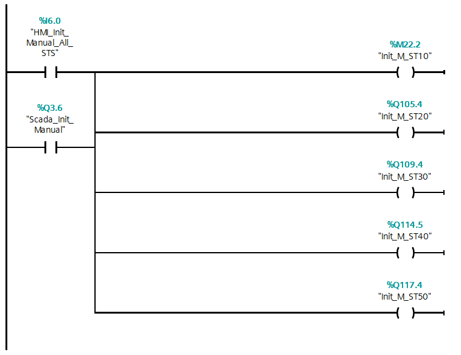

*Ordem de Inicialização para todos as Estações, por parte do Master ou Ordem Remota*

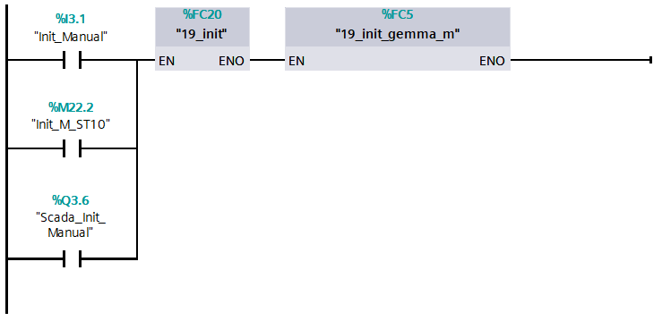

*Inicialização da ST10, por Ordem Local, Ordem do Master ou Ordem Remota*

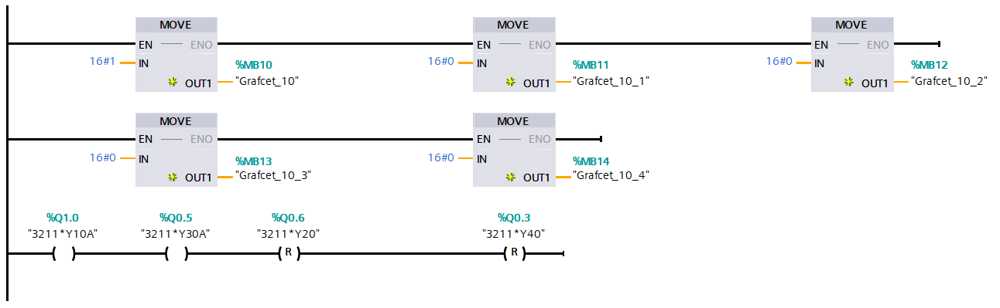

*Codigo de Inicialização da ST10*

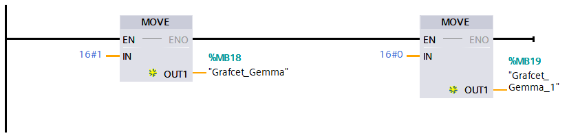

*Codigo de Inicialização da ST10*

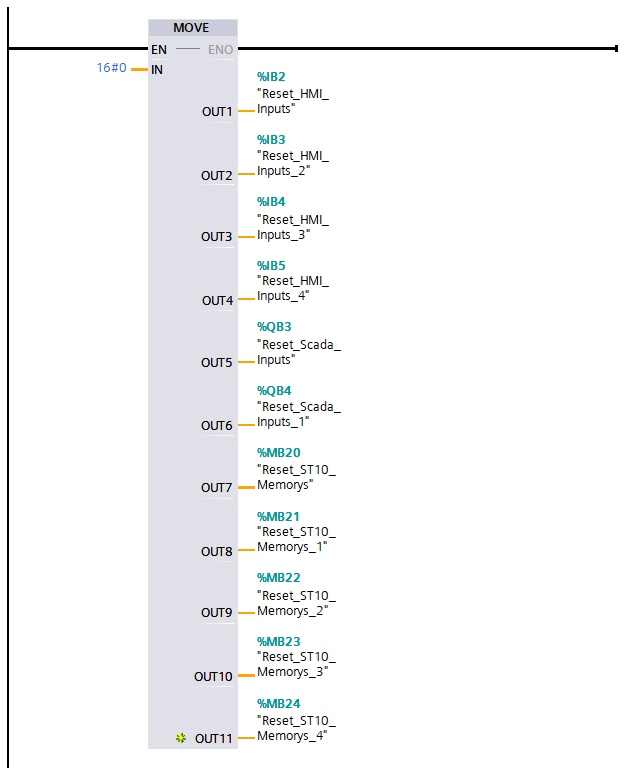

*Codigo de Inicialização da ST10*

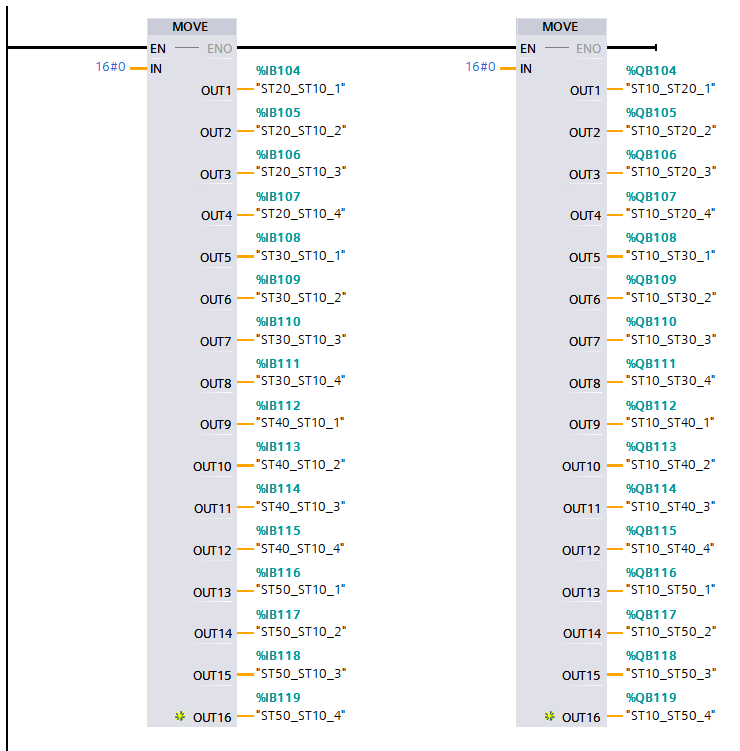

*Codigo de Inicialização da ST10*

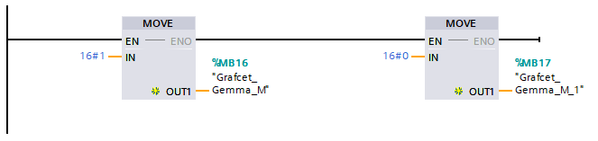

*Codigo de Inicialização da ST10*

        NOTA: A Inicialização das outras estações segue o mesmo princípio.

##### Modo de Funcionamento

Como já foi explicado anteriormente, a linha 32 é composta por 3 modos de funcionamento: **Local**, **HMI** e **Remoto**. **No Modo de Funcionamento Local**. Quando um destes Modos de Funcionamento é selecionado, na HMI, os outros dois modos, mesmo que sejam selecionados, não terão efeito, prevenido assim qualquer acidente ou falha no sistema. Quando selecionado o Modo de Funcionamento essa informação é enviada para todas as Estações, como demonstra a imagem abaixo.

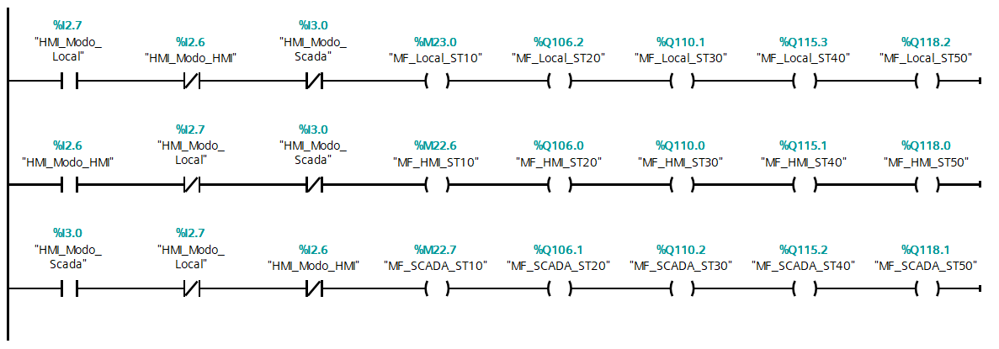

##### Modo de Marcha

Como já foi explicado anteriormente, a linha 32 é composta por 3 modos de marcha: **Automático, Ciclo, Manual.** . Quando um destes Modos de Funcionamento é selecionado, na HMI pela Lina, os outros dois modos, mesmo que sejam selecionados, não terão efeito, prevenido assim qualquer acidente ou falha no sistema. Quando selecionado o Modo de Marcha essa informação é enviada para todas as Estações, como demonstra a imagem abaixo.

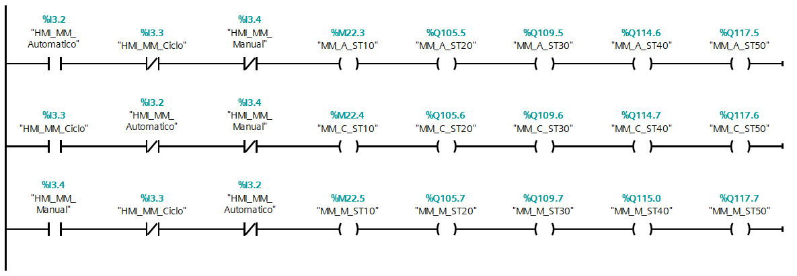

##### Botões

Como o Modo de funcionamento selecionado os comandos para a estações vão depender desse modo, por exemplo, se estivermos a funcionar em Modo HMI, todos os comandos dados para as estações têm que ser dados pela a HMI e não remotamente ou localmente. Para prevenir qualquer acidente ou falha no sistema, quando um Modo de Funcionamento, os comandos dos outros dois modos, ficam desativados, como demonstra a imagem abaixo.

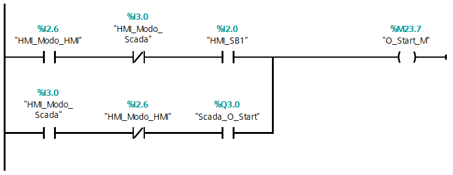

*Ordem de Start - Master*

*Ordem de Stop - Master*

*Ordem de Emergência - Master*

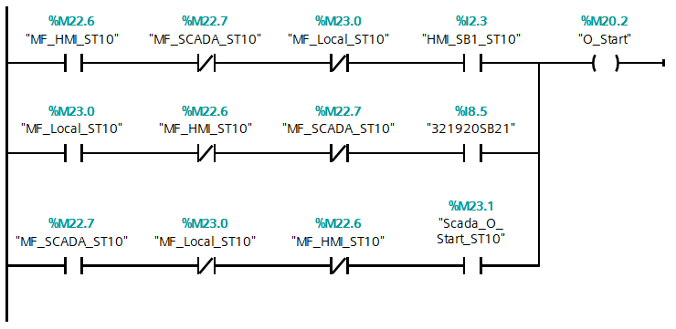

*Ordem de Start - Estações*

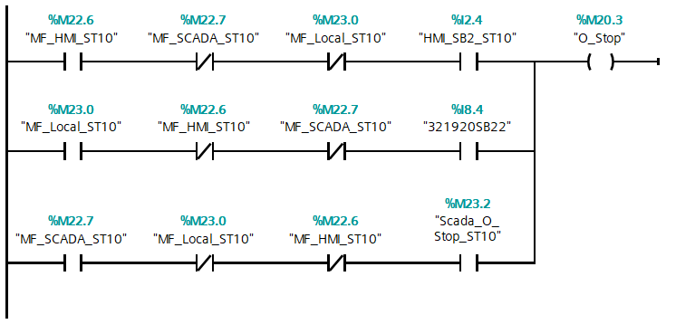

*Ordem de Stop - Estações*

*Ordem de Emergência - Estações*

#### HMI

HMI significa **H**uman **M**achine **I**nterface (Interface Homem-Máquina), consiste num painel que permite o operador comunicar com a máquina. Antes de começar a criar os *Screens*, foi necessário definir as **conexões** na HMI, permitindo que a HMI comunique o todos os PLC da linha.

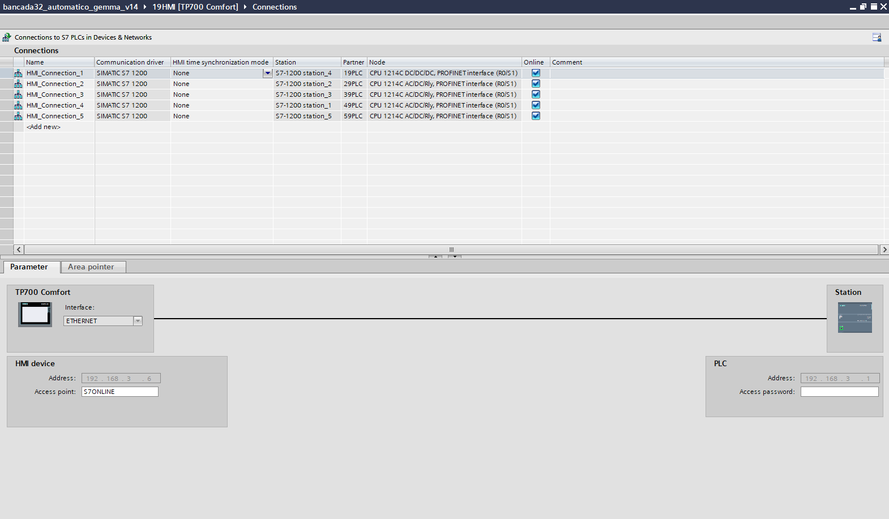

Assim que as **conexões** foram definidas, comecei a criar as **tags** que vão estar associadas a Botões, Iluminacação, Displays, entre outros, desta forma, é possivel controlar e supervisionar a linha cada uma das estações. A Tags da HMI, pode ser consultadas na [Classificação](#classificacao)

Com as **conexões** e as **tags** defenidas já foi possivel começar a criação dos ecrãs. 

##### Classificação

| Label                        | Conexão          | Nome PLC | Label PLC                    | Comentário                                                                                                                              |  
|:----------------------------:|:----------------:|:--------:|:----------------------------:|:---------------------------------------------------------------------------------------------------------------------------------------:|
| 3210*B11                     | HMI_Connection_1 | 19PLC    | 3210*B11                     | Fim de Curso (Esquerda)                                                                                                                 |
| 3210*B12                     | HMI_Connection_1 | 19PLC    | 3210*B12                     | Fim de Curso (Direita)                                                                                                                  |
| 3210*B13                     | HMI_Connection_1 | 19PLC    | 3210*B13                     | Sensor Home                                                                                                                             |
| 3211*B11                     | HMI_Connection_1 | 19PLC    | 3211*B11                     | Sensor Garra Fechada                                                                                                                    |
| 3211*B21                     | HMI_Connection_1 | 19PLC    | 3211*B21                     | Sensor Garra Frente                                                                                                                     |
| 3211*B22                     | HMI_Connection_1 | 19PLC    | 3211*B22                     | Sensor Garra Atras                                                                                                                      |
| 3211*B31                     | HMI_Connection_1 | 19PLC    | 3211*B31                     | Sensor Garra Posicao Inicial                                                                                                            |
| 3211*B32                     | HMI_Connection_1 | 19PLC    | 3211*B32                     | Sensor Garra Esquerda                                                                                                                   |
| 3211*B41                     | HMI_Connection_1 | 19PLC    | 3211*B41                     | Sensor Garra Cima                                                                                                                       |
| 3211*B42                     | HMI_Connection_1 | 19PLC    | 3211*B42                     | Sensor Garra Baixo                                                                                                                      |
| 3211*Y10A                    | HMI_Connection_1 | 19PLC    | 3211*Y10A                    | Abrir Garra                                                                                                                             |
| 3211*Y10B                    | HMI_Connection_1 | 19PLC    | 3211*Y10B                    | Fechar Garra                                                                                                                            |
| 3211*Y20                     | HMI_Connection_1 | 19PLC    | 3211*Y20                     | Frente e Atrás Garra                                                                                                                    |
| 3211*Y30A                    | HMI_Connection_1 | 19PLC    | 3211*Y30A                    | Posiçao Incial Garra                                                                                                                    |
| 3211*Y30B                    | HMI_Connection_1 | 19PLC    | 3211*Y30B                    | Rodar Esquerda Garra                                                                                                                    |
| 3211*Y40                     | HMI_Connection_1 | 19PLC    | 3211*Y40                     | Sobe e Baixa Garra                                                                                                                      |
| 321920HL11                   | HMI_Connection_1 | 19PLC    | 321920HL11                   | Painel Luz Laranja                                                                                                                      |
| 321920HL12                   | HMI_Connection_1 | 19PLC    | 321920HL12                   | Painel Luz Verde                                                                                                                        |
| 321920HL13                   | HMI_Connection_1 | 19PLC    | 321920HL13                   | Painel Luz Vermelha                                                                                                                     |
| 321920QS24                   | HMI_Connection_1 | 19PLC    | 321920QS24                   | Botao Emergencia                                                                                                                        |
| 321920SA23                   | HMI_Connection_1 | 19PLC    | 321920SA23                   | SA                                                                                                                                      |
| 321920SB21                   | HMI_Connection_1 | 19PLC    | 321920SB21                   | Botao Verde                                                                                                                             |
| 321920SB22                   | HMI_Connection_1 | 19PLC    | 321920SB22                   | Botao Vermelho                                                                                                                          |
| 3220*B11                     | HMI_Connection_2 | 29PLC    | 3220*B11                     | Sensor Peca Frente                                                                                                                      |
| 3221*B11                     | HMI_Connection_2 | 29PLC    | 3221*B11                     | Sensor Cilindro1 Avancado                                                                                                               |
| 3221*B12                     | HMI_Connection_2 | 29PLC    | 3221*B12                     | Sensor Cilindro1 Recuado                                                                                                                |
| 3221*B21                     | HMI_Connection_2 | 29PLC    | 3221*B21                     | Sensor Cilindro2 Avancado                                                                                                               |
| 3221*B22                     | HMI_Connection_2 | 29PLC    | 3221*B22                     | Sensor Cilindro2 Recuado                                                                                                                |
| 3221*B31                     | HMI_Connection_2 | 29PLC    | 3221*B31                     | Sensor Funil Cima                                                                                                                       |
| 3221*B32                     | HMI_Connection_2 | 29PLC    | 3221*B32                     | Sensor Funil Baixo                                                                                                                      |
| 3221*B33                     | HMI_Connection_2 | 29PLC    | 3221*B33                     | Sensor Peça Metalica                                                                                                                    |
| 3221*Y10                     | HMI_Connection_2 | 29PLC    | 3221*Y10                     | Cilindro 1                                                                                                                              |
| 3221*Y20                     | HMI_Connection_2 | 29PLC    | 3221*Y20                     | Cilindro 2                                                                                                                              |
| 322920HL11                   | HMI_Connection_2 | 29PLC    | 322920HL11                   | Painel Luz Laranja                                                                                                                      |
| 322920HL12                   | HMI_Connection_2 | 29PLC    | 322920HL12                   | Painel Luz Verde                                                                                                                        |
| 322920HL13                   | HMI_Connection_2 | 29PLC    | 322920HL13                   | Painel Luz Vermelha                                                                                                                     |
| 322920QS24                   | HMI_Connection_2 | 29PLC    | 322920QS24                   | Botao Emergencia                                                                                                                        |
| 322920SA23                   | HMI_Connection_2 | 29PLC    | 322920SA23                   | SA                                                                                                                                      |
| 322920SB21                   | HMI_Connection_2 | 29PLC    | 322920SB21                   | Botao Verde                                                                                                                             |
| 322920SB22                   | HMI_Connection_2 | 29PLC    | 322920SB22                   | Botao Vermelho                                                                                                                          |
| 3231*B11                     | HMI_Connection_3 | 39PLC    | 3231*B11                     | Sensor Peca                                                                                                                             |
| 3231*B21                     | HMI_Connection_3 | 39PLC    | 3231*B21                     | Sensor Abrir Fechar Pinca                                                                                                               |
| 3231*B31                     | HMI_Connection_3 | 39PLC    | 3231*B31                     | Sensor Avancado Pinca                                                                                                                   |
| 3231*B32                     | HMI_Connection_3 | 39PLC    | 3231*B32                     | Sensor Recuado Pinca                                                                                                                    |
| 3231*Y20                     | HMI_Connection_3 | 39PLC    | 3231*Y20                     | Abrir e Fechar a Pinca                                                                                                                  |
| 3231*Y30                     | HMI_Connection_3 | 39PLC    | 3231*Y30                     | Avanca e Recua a Pinca                                                                                                                  |
| 3232*B11                     | HMI_Connection_3 | 39PLC    | 3232*B11                     | Sensor Subido Prensa                                                                                                                    |
| 3232*B12                     | HMI_Connection_3 | 39PLC    | 3232*B12                     | Sensor Descido Prensa                                                                                                                   |
| 3232*Y10                     | HMI_Connection_3 | 39PLC    | 3232*Y10                     | Sobe e Desce Prensa                                                                                                                     |
| 323920HL11                   | HMI_Connection_3 | 39PLC    | 323920HL11                   | Painel Luz Laranja                                                                                                                      |
| 323920HL12                   | HMI_Connection_3 | 39PLC    | 323920HL12                   | Painel Luz Verde                                                                                                                        |
| 323920HL13                   | HMI_Connection_3 | 39PLC    | 323920HL13                   | Painel Luz Vermelha                                                                                                                     |
| 323920QS24                   | HMI_Connection_3 | 39PLC    | 323920QS24                   | Botao Emergencia                                                                                                                        |
| 323920SA23                   | HMI_Connection_3 | 39PLC    | 323920SA23                   | SA                                                                                                                                      |
| 323920SB21                   | HMI_Connection_3 | 39PLC    | 323920SB21                   | Botao Verde                                                                                                                             |
| 323920SB22                   | HMI_Connection_3 | 39PLC    | 323920SB22                   | Botao Vermelho                                                                                                                          |
| 3240*H11                     | HMI_Connection_4 | 49PLC    | 3240*H11                     | Semáforo Verde                                                                                                                          |
| 3240*H12                     | HMI_Connection_4 | 49PLC    | 3240*H12                     | Semáforo Amarelo                                                                                                                        |
| 3240*H13                     | HMI_Connection_4 | 49PLC    | 3240*H13                     | Semáforo Vermelho                                                                                                                       |
| 3241*B11                     | HMI_Connection_4 | 49PLC    | 3241*B11                     | Sensor Cilindro1 Frente                                                                                                                 |
| 3241*B12                     | HMI_Connection_4 | 49PLC    | 3241*B12                     | Sensor Cilindro1 Atras                                                                                                                  |
| 3241*B21                     | HMI_Connection_4 | 49PLC    | 3241*B21                     | Sensor Cilindro2 Frente                                                                                                                 |
| 3241*B22                     | HMI_Connection_4 | 49PLC    | 3241*B22                     | Sensor Cilindro2 Atras                                                                                                                  |
| 3241*B31                     | HMI_Connection_4 | 49PLC    | 3241*B31                     | Sensor BaseMiolo Inicial                                                                                                                |
| 3241*B32                     | HMI_Connection_4 | 49PLC    | 3241*B32                     | Sensor BaseMiolo Rotacao                                                                                                                |
| 3241*B41                     | HMI_Connection_4 | 49PLC    | 3241*B41                     | Sensor Cima Funil                                                                                                                       |
| 3241*B42                     | HMI_Connection_4 | 49PLC    | 3241*B42                     | Sensor Baixo Funil                                                                                                                      |
| 3241*B43                     | HMI_Connection_4 | 49PLC    | 3241*B43                     | Sensor Miolo Esquerdo                                                                                                                   |
| 3241*B44                     | HMI_Connection_4 | 49PLC    | 3241*B44                     | Sensor Miolo Direito                                                                                                                    |
| 3241*Y10                     | HMI_Connection_4 | 49PLC    | 3241*Y10                     | Cilindro 1                                                                                                                              |
| 3241*Y20                     | HMI_Connection_4 | 49PLC    | 3241*Y20                     | Cilindro 2                                                                                                                              |
| 3241*Y30                     | HMI_Connection_4 | 49PLC    | 3241*Y30                     | Base Miolo                                                                                                                              |
| 3242*B11                     | HMI_Connection_4 | 49PLC    | 3242*B11                     | Sensor Frente Pinca                                                                                                                     |
| 3242*B12                     | HMI_Connection_4 | 49PLC    | 3242*B12                     | Sensor Atras Pinca                                                                                                                      |
| 3242*B21                     | HMI_Connection_4 | 49PLC    | 3242*B21                     | Sensor Cima Pinca                                                                                                                       |
| 3242*B22                     | HMI_Connection_4 | 49PLC    | 3242*B22                     | Sensor Baixo Pinca                                                                                                                      |
| 3242*B31                     | HMI_Connection_4 | 49PLC    | 3242*B31                     | Sensor Abrir Fechar Pinca                                                                                                               |
| 3242*B41                     | HMI_Connection_4 | 49PLC    | 3242*B41                     | Sensor Frente Peca                                                                                                                      |
| 3242*Y10                     | HMI_Connection_4 | 49PLC    | 3242*Y10                     | Frente e Tras Pinca                                                                                                                     |
| 3242*Y20                     | HMI_Connection_4 | 49PLC    | 3242*Y20                     | Cima e Baixo Pinca                                                                                                                      |
| 3242*Y30                     | HMI_Connection_4 | 49PLC    | 3242*Y30                     | Abrir e Fechar Pinca                                                                                                                    |
| 324920HL11                   | HMI_Connection_4 | 49PLC    | 324920HL11                   | Painel Luz Laranja                                                                                                                      |
| 324920HL12                   | HMI_Connection_4 | 49PLC    | 324920HL12                   | Painel Luz Verde                                                                                                                        |
| 324920HL13                   | HMI_Connection_4 | 49PLC    | 324920HL13                   | Painel Luz Vermelha                                                                                                                     |
| 324920QS24                   | HMI_Connection_4 | 49PLC    | 324920QS24                   | Botao de Emergencia                                                                                                                     |
| 324920SA23                   | HMI_Connection_4 | 49PLC    | 324920SA23                   | SA                                                                                                                                      |
| 324920SB21                   | HMI_Connection_4 | 49PLC    | 324920SB21                   | Botao Verde                                                                                                                             |
| 324920SB22                   | HMI_Connection_4 | 49PLC    | 324920SB22                   | Botao Vermelho                                                                                                                          |
| 325010B11                    | HMI_Connection_5 | 59PLC    | 325010B11                    | Sensor de Peca                                                                                                                          |
| 325010B12                    | HMI_Connection_5 | 59PLC    | 325010B12                    | Sensor Otico (Branco e Metalico)                                                                                                        |
| 325010B13                    | HMI_Connection_5 | 59PLC    | 325010B13                    | Sensor Metalico                                                                                                                         |
| 325010B21                    | HMI_Connection_5 | 59PLC    | 325010B21                    | Sensor Cilindro 1 Frente                                                                                                                |
| 325010B31                    | HMI_Connection_5 | 59PLC    | 325010B31                    | Sensor Cilindro 2 Frente                                                                                                                |
| 325010B41                    | HMI_Connection_5 | 59PLC    | 325010B41                    | Sensor Cilindro 3 Frente                                                                                                                |
| 325010Y20                    | HMI_Connection_5 | 59PLC    | 325010Y20                    | Cilindro 1                                                                                                                              |
| 325010Y30                    | HMI_Connection_5 | 59PLC    | 325010Y30                    | Cilindro 2                                                                                                                              |
| 325010Y40                    | HMI_Connection_5 | 59PLC    | 325010Y40                    | Cilindro 3                                                                                                                              |
| 3250M51A                     | HMI_Connection_5 | 59PLC    | 3250M51A                     | Inversores de Frequencia (Frente)                                                                                                       |
| 3250M51B                     | HMI_Connection_5 | 59PLC    | 3250M51B                     | Inversores de Frequencia (Atras)                                                                                                        |
| 325920HL11                   | HMI_Connection_5 | 59PLC    | 325920HL11                   | Painel Luz Laranja                                                                                                                      |
| 325920HL12                   | HMI_Connection_5 | 59PLC    | 325920HL12                   | Painel Luz Verde                                                                                                                        |
| 325920HL13                   | HMI_Connection_5 | 59PLC    | 325920HL13                   | Painel Luz Vermelha                                                                                                                     |
| 325920QS24                   | HMI_Connection_5 | 59PLC    | 325920QS24                   | Botao Emergencia                                                                                                                        |
| 325920SA23                   | HMI_Connection_5 | 59PLC    | 325920SA23                   | Seletor                                                                                                                                 |
| 325920SB21                   | HMI_Connection_5 | 59PLC    | 325920SB21                   | Botao Verde                                                                                                                             |
| 325920SB22                   | HMI_Connection_5 | 59PLC    | 325920SB22                   | Botao Vermelho                                                                                                                          |
| A1_M                         | HMI_Connection_1 | 19PLC    | A1_M                         | Etapa de Grafcet do Gemma Master                                                                                                        |
| A1_ST10                      | HMI_Connection_1 | 19PLC    | A1                           | Etapa de Grafcet do Gemma                                                                                                               |
| A1_ST20                      | HMI_Connection_2 | 29PLC    | A1                           | Etapa de Grafcet do Gemma                                                                                                               |
| A1_ST30                      | HMI_Connection_3 | 39PLC    | A1                           | Etapa de Grafcet do Gemma                                                                                                               |
| A1_ST40                      | HMI_Connection_4 | 49PLC    | A1                           | Etapa de Grafcet do Gemma                                                                                                               |
| A1_ST50                      | HMI_Connection_5 | 59PLC    | A1                           | Etapa de Grafcet do Gemma                                                                                                               |
| A3_M                         | HMI_Connection_1 | 19PLC    | A3_M                         | Etapa de Grafcet do Gemma Master                                                                                                        |
| A3_ST10                      | HMI_Connection_1 | 19PLC    | A3                           | Etapa de Grafcet do Gemma                                                                                                               |
| A3_ST20                      | HMI_Connection_2 | 29PLC    | A3                           | Etapa de Grafcet do Gemma                                                                                                               |
| A3_ST30                      | HMI_Connection_3 | 39PLC    | A3                           | Etapa de Grafcet do Gemma                                                                                                               |
| A3_ST40                      | HMI_Connection_4 | 49PLC    | A3                           | Etapa de Grafcet do Gemma                                                                                                               |
| A3_ST50                      | HMI_Connection_5 | 59PLC    | A3                           | Etapa de Grafcet do Gemma                                                                                                               |
| A4_M                         | HMI_Connection_1 | 19PLC    | A4_M                         | Etapa de Grafcet do Gemma Master                                                                                                        |
| A4_ST10                      | HMI_Connection_1 | 19PLC    | A4                           | Etapa de Grafcet Gemma                                                                                                                  |
| A4_ST20                      | HMI_Connection_2 | 29PLC    | A4                           | Etapa de Grafcet do Gemma                                                                                                               |
| A4_ST30                      | HMI_Connection_3 | 39PLC    | A4                           | Etapa de Grafcet do Gemma                                                                                                               |
| A4_ST40                      | HMI_Connection_4 | 49PLC    | A4                           | Etapa de Grafcet do Gemma                                                                                                               |
| A4_ST50                      | HMI_Connection_5 | 59PLC    | A4                           | Etapa de Grafcet do Gemma                                                                                                               |
| A6_M                         | HMI_Connection_1 | 19PLC    | A6_M                         | Etapa de Grafcet do Gemma Master                                                                                                        |
| A6_ST10                      | HMI_Connection_1 | 19PLC    | A6                           | Etapa de Grafcet do Gemma                                                                                                               |
| A6_ST20                      | HMI_Connection_2 | 29PLC    | A6                           | Etapa de Grafcet do Gemma                                                                                                               |
| A6_ST30                      | HMI_Connection_3 | 39PLC    | A6                           | Etapa de Grafcet do Gemma                                                                                                               |
| A6_ST40                      | HMI_Connection_4 | 49PLC    | A6                           | Etapa de Grafcet do Gemma                                                                                                               |
| A6_ST50                      | HMI_Connection_5 | 59PLC    | A6                           | Etapa de Grafcet do Gemma                                                                                                               |
| D1_M                         | HMI_Connection_1 | 19PLC    | D1_M                         | Etapa de Grafcet do Gemma Master                                                                                                        |
| D1_ST10                      | HMI_Connection_1 | 19PLC    | D1                           | Etapa de Grafcet Gemma                                                                                                                  |
| D1_ST20                      | HMI_Connection_2 | 29PLC    | D1                           | Etapa de Grafcet do Gemma                                                                                                               |
| D1_ST30                      | HMI_Connection_3 | 39PLC    | D1                           | Etapa de Grafcet do Gemma                                                                                                               |
| D1_ST40                      | HMI_Connection_4 | 49PLC    | D1                           | Etapa de Grafcet do Gemma                                                                                                               |
| D1_ST50                      | HMI_Connection_5 | 59PLC    | D1                           | Etapa de Grafcet do Gemma                                                                                                               |
| F1_M                         | HMI_Connection_1 | 19PLC    | F1_M                         | Etapa de Grafcet do Gemma Master                                                                                                        |
| F1_ST10                      | HMI_Connection_1 | 19PLC    | F1                           | Etapa de Grafcet do Gemma                                                                                                               |
| F1_ST20                      | HMI_Connection_2 | 29PLC    | F1                           | Etapa de Grafcet do Gemma                                                                                                               |
| F1_ST30                      | HMI_Connection_3 | 39PLC    | F1                           | Etapa de Grafcet do Gemma                                                                                                               |
| F1_ST40                      | HMI_Connection_4 | 49PLC    | F1                           | Etapa de Grafcet do Gemma                                                                                                               |
| F1_ST50                      | HMI_Connection_5 | 59PLC    | F1                           | Etapa de Grafcet do Gemma                                                                                                               |
| F2_M                         | HMI_Connection_1 | 19PLC    | F2_M                         | Etapa de Grafcet do Gemma Master                                                                                                        |
| F2_ST10                      | HMI_Connection_1 | 19PLC    | F2                           | Etapa de Grafcet do Gemma                                                                                                               |
| F2_ST20                      | HMI_Connection_2 | 29PLC    | F2                           | Etapa de Grafcet do Gemma                                                                                                               |
| F2_ST30                      | HMI_Connection_3 | 39PLC    | F2                           | Etapa de Grafcet do Gemma                                                                                                               |
| F2_ST40                      | HMI_Connection_4 | 49PLC    | F2                           | Etapa de Grafcet do Gemma                                                                                                               |
| F2_ST50                      | HMI_Connection_5 | 59PLC    | F2                           | Etapa de Grafcet do Gemma                                                                                                               |
| F5_M                         | HMI_Connection_1 | 19PLC    | F5_M                         | Etapa de Grafcet do Gemma Master                                                                                                        |
| F5_ST10                      | HMI_Connection_1 | 19PLC    | F5                           | Etapa de Grafcet do Gemma                                                                                                               |
| F5_ST20                      | HMI_Connection_2 | 29PLC    | F5                           | Etapa de Grafcet do Gemma                                                                                                               |
| F5_ST30                      | HMI_Connection_3 | 39PLC    | F5                           | Etapa de Grafcet do Gemma                                                                                                               |
| F5_ST40                      | HMI_Connection_4 | 49PLC    | F5                           | Etapa de Grafcet do Gemma                                                                                                               |
| F5_ST50                      | HMI_Connection_5 | 59PLC    | F5                           | Etapa de Grafcet do Gemma                                                                                                               |
| F6_M                         | HMI_Connection_1 | 19PLC    | F6_M                         | Etapa de Grafcet do Gemma Master                                                                                                        |
| HMI_CV                       | HMI_Connection_5 | 59PLC    | HMI_CV                       | Em Modo Manual, botão de reset do Contador                                                                                              |
| HMI_Inf_MF                   | HMI_Connection_1 | 19PLC    | HMI_Inf_MF                   | Informação se algum Modo de Funcionamento está selecionado                                                                              |
| HMI_Init_Manual_All_STS      | HMI_Connection_1 | 19PLC    | HMI_Init_Manual_All_STS      | Inicialização Manual de todas as ST (Ordem do Master)                                                                                   |
| HMI_Init_Manual_ST10         | HMI_Connection_1 | 29PLC    | Init_Manual                  | Input que permite na Inicialização manual da ST10                                                                                       |
| HMI_Init_Manual_ST20         | HMI_Connection_2 | 29PLC    | Init_Manual                  | Input que permite na Inicialização manual                                                                                               |
| HMI_Init_Manual_ST30         | HMI_Connection_3 | 39PLC    | Init_Manual                  | Input que permite na Inicialização manual                                                                                               |
| HMI_Init_Manual_ST40         | HMI_Connection_4 | 49PLC    | Init_Manual                  | Input que permite na Inicialização manual                                                                                               |
| HMI_Init_Manual_ST50         | HMI_Connection_5 | 59PLC    | Init_Manual                  | Input que permite na Inicialização manual                                                                                               |
| HMI_MC_Halt_Execute          | HMI_Connection_1 | 19PLC    | HMI_MC_Halt_Execute          | Em Modo Manual, input que permite o Execute do MC_Halt                                                                                  |
| HMI_MC_Home_Execute          | HMI_Connection_1 | 19PLC    | HMI_MC_Home_Execute          | Em Modo Manual, input que permite o homing do Robô                                                                                      |
| HMI_MC_Home_Execute_A        | HMI_Connection_1 | 19PLC    | HMI_MC_Home_Execute_A        | Input que permite o homing do Robô                                                                                                      |
| HMI_MC_MoveAbsolute_Execute  | HMI_Connection_1 | 19PLC    | HMI_MC_MoveAbsolute_Execute  | Em Modo Manual, input que permite o Execute do MC_MoveAbsolute                                                                          |
| HMI_MC_MoveAbsolute_Position | HMI_Connection_1 | 19PLC    | HMI_MC_MoveAbsolute_Position | Em Modo Manual, no Display Númerico é possivel fazer a escolha da posição absoluta (Máx: 1051.727). Esse valor é guardado nesta memória |
| HMI_MC_MoveAbsolute_Velocity | HMI_Connection_1 | 19PLC    | HMI_MC_MoveAbsolute_Velocity | Em Modo Manual, no Display Númerico é possivel fazer a escolha da velocidade (Máx: 400). Esse valor é guardado nesta memória            |
| HMI_MC_MoveJog_Drt           | HMI_Connection_1 | 19PLC    | HMI_MC_MoveJog_Drt           | Em Modo Manual, input que permite o movimento para a Direita do Robô                                                                    |
| HMI_MC_MoveJog_Esq           | HMI_Connection_1 | 19PLC    | HMI_MC_MoveJog_Esq           | Em Modo Manual, input que permite o movimento para a Esquerda do Robô                                                                   |
| HMI_MC_MoveJog_Velocity      | HMI_Connection_1 | 19PLC    | HMI_MC_MoveJog_Velocity      | Em Modo Manual, no Display Númerico é possivel fazer a escolha da velocidade (Máx: 400). Esse valor é guardado nesta memória            |
| HMI_MC_MoveRelative_Distance | HMI_Connection_1 | 19PLC    | HMI_MC_MoveRelative_Distance | Em Modo Manual, no Display Númerico é possivel fazer a escolha da posição relativa. Esse valor é guardado nesta memória                 |
| HMI_MC_MoveRelative_Execute  | HMI_Connection_1 | 19PLC    | HMI_MC_MoveRelative_Execute  | Em Modo Manual, input que permite o Execute do MC_MoveRelative                                                                          |
| HMI_MC_MoveRelative_Velocity | HMI_Connection_1 | 19PLC    | HMI_MC_MoveRelative_Velocity | Em Modo Manual, no Display Númerico é possivel fazer a escolha da velocidade (Máx: 400). Esse valor é guardado nesta memória            |
| HMI_MC_Power_Enable          | HMI_Connection_1 | 19PLC    | HMI_MC_Power_Enable          | Em Modo Manual, input que permite o Enable do MC_Power                                                                                  |
| HMI_MC_Reset_Execute         | HMI_Connection_1 | 19PLC    | HMI_MC_Reset_Execute         | Em Modo Manual, input que permite o Execcute do MC_Reset                                                                                |
| HMI_MM_Automatico            | HMI_Connection_1 | 19PLC    | HMI_MM_Automatico            | Input de seleção do modo de marcha                                                                                                      |
| HMI_MM_Ciclo                 | HMI_Connection_1 | 19PLC    | HMI_MM_Ciclo                 | Input de seleção do modo de marcha                                                                                                      |
| HMI_MM_Manual                | HMI_Connection_1 | 19PLC    | HMI_MM_Manual                | Input de seleção do modo de marcha                                                                                                      |
| HMI_Modo_HMI                 | HMI_Connection_1 | 19PLC    | HMI_Modo_HMI                 | Input de seleção do modo de funcionamento                                                                                               |
| HMI_Modo_Local               | HMI_Connection_1 | 19PLC    | HMI_Modo_Local               | Input de seleção do modo de funcionamento                                                                                               |
| HMI_Modo_Scada               | HMI_Connection_1 | 19PLC    | HMI_Modo_Scada               | Input de seleção do modo de funcionamento                                                                                               |
| HMI_Posicao_ST20             | HMI_Connection_1 | 19PLC    | HMI_Posicao_ST20             | Em Modo Manual, Posição Absoluta da ST20                                                                                                |
| HMI_Posicao_ST30             | HMI_Connection_1 | 19PLC    | HMI_Posicao_ST30             | Em Modo Manual, Posição Absoluta da ST30                                                                                                |
| HMI_Posicao_ST40             | HMI_Connection_1 | 19PLC    | HMI_Posicao_ST40             | Em Modo Manual, Posição Absoluta da ST40                                                                                                |
| HMI_Posicao_ST50             | HMI_Connection_1 | 19PLC    | HMI_Posicao_ST50             | Em Modo Manual, Posição Absoluta da ST50                                                                                                |
| HMI_QS                       | HMI_Connection_1 | 19PLC    | HMI_QS                       | Input de Emergencia do Gemma Master                                                                                                     |
| HMI_QS_ST10                  | HMI_Connection_1 | 19PLC    | HMI_QS_ST10                  | Input de Emergencia do Gemma                                                                                                            |
| HMI_QS_ST20                  | HMI_Connection_2 | 29PLC    | HMI_QS                       | Input de Emergencia do Gemma                                                                                                            |
| HMI_QS_ST30                  | HMI_Connection_3 | 39PLC    | HMI_QS                       | Input de Emergencia do Gemma                                                                                                            |
| HMI_QS_ST40                  | HMI_Connection_4 | 49PLC    | HMI_QS                       | Input de Emergencia do Gemma                                                                                                            |
| HMI_QS_ST50                  | HMI_Connection_5 | 59PLC    | HMI_QS                       | Input de Emergencia do Gemma                                                                                                            |
| HMI_Reset_Contadores         | HMI_Connection_5 | 59PLC    | Reset_Contadores             | Reset a todos os Contador                                                                                                               |
| HMI_SB1                      | HMI_Connection_1 | 19PLC    | HMI_SB1                      | Input de Start do Gemma Master                                                                                                          |
| HMI_SB1_ST10                 | HMI_Connection_1 | 19PLC    | HMI_SB1_ST10                 | Input de Start do Gemma Master                                                                                                          |
| HMI_SB1_ST20                 | HMI_Connection_2 | 29PLC    | HMI_SB1                      | Input de Start do Gemma Master                                                                                                          |
| HMI_SB1_ST30                 | HMI_Connection_3 | 39PLC    | HMI_SB1                      | Input de Start do Gemma Master                                                                                                          |
| HMI_SB1_ST40                 | HMI_Connection_4 | 29PLC    | HMI_SB1                      | Input de Start do Gemma Master                                                                                                          |
| HMI_SB1_ST50                 | HMI_Connection_5 | 59PLC    | HMI_SB1                      | Input de Start do Gemma Master                                                                                                          |
| HMI_SB2                      | HMI_Connection_1 | 19PLC    | HMI_SB2                      | Input de Stop do Gemma Master                                                                                                           |
| HMI_SB2_ST10                 | HMI_Connection_1 | 19PLC    | HMI_SB2_ST10                 | Input de Stop do Gemma                                                                                                                  |
| HMI_SB2_ST20                 | HMI_Connection_2 | 29PLC    | HMI_SB2                      | Input de Stop do Gemma                                                                                                                  |
| HMI_SB2_ST30                 | HMI_Connection_3 | 39PLC    | HMI_SB2                      | Input de Stop do Gemma                                                                                                                  |
| HMI_SB2_ST40                 | HMI_Connection_4 | 49PLC    | HMI_SB2                      | Input de Stop do Gemma                                                                                                                  |
| HMI_SB2_ST50                 | HMI_Connection_5 | 59PLC    | HMI_SB2                      | Input de Stop do Gemma                                                                                                                  |
| HMI_Start_Tapete             | HMI_Connection_5 | 59PLC    | HMI_Start_Tapete             | Em Modo Manual, Start Tapete ST50                                                                                                       |
| HMI_Stop_Tapete              | HMI_Connection_5 | 59PLC    | HMI_Stop_Tapete              | Em Modo Manual, Stop Tapete ST50                                                                                                        |
| HMI_Teste_Luzes              | HMI_Connection_1 | 19PLC    | HMI_Teste_Luzes              | Botão de Teste de toda a Iluminação                                                                                                     |
| HMI_Velocidade_Tapete        | HMI_Connection_5 | 59PLC    | HMI_Velocidade_Tapete        | Em Modo Manual, no Display Númerico é possivel fazer a escolha da velocidade (Máx: 30000). Esse valor é guardado nesta memória          |
| Input_Encoder                | HMI_Connection_5 | 59PLC    | Input_Encoder                | Valor do Contador                                                                                                                       |
| Pecas_Brancas                | HMI_Connection_5 | 59PLC    | IEC_Counter_0_DB_1.CV        | Valor do Enconder                                                                                                                       |
| Pecas_Defeito                | HMI_Connection_5 | 59PLC    | IEC_Counter_0_DB_5.CV        | Contador de Peças Brancas                                                                                                               |
| Pecas_Metalicas              | HMI_Connection_5 | 59PLC    | IEC_Counter_0_DB.CV          | Contador de Peças Metalicas                                                                                                             |
| Pecas_Pretas                 | HMI_Connection_5 | 59PLC    | IEC_Counter_0_DB_2.CV        | Contador de Peças Pretas                                                                                                                |
| Pecas_Pretendidas            | HMI_Connection_5 | 59PLC    | IEC_Counter_0_DB_4.CV        | Reset a todos os Contador                                                                                                               |
| Total_Pecas                  | HMI_Connection_5 | 59PLC    | IEC_Counter_0_DB_3.CV        | Total de Pecas                                                                                                                          |

##### Ecrãs

A HMI é constituida por 19 ecrãs dos quais resultam:

- **Root Screen**, ecrã principal da HMI. Neste ecrã podemos ser encaminhados para outros 3 ecrãs: **Line32**, **Peças** e **Modo de Funcionamento**

*Imagem do Root Screen*

- **Modo de Funcionamento**, neste ecrã podemos escolher o modo de operação da linha 32 e das estações: **Modo Local**, **Modo HMI** e **Modo Scada**

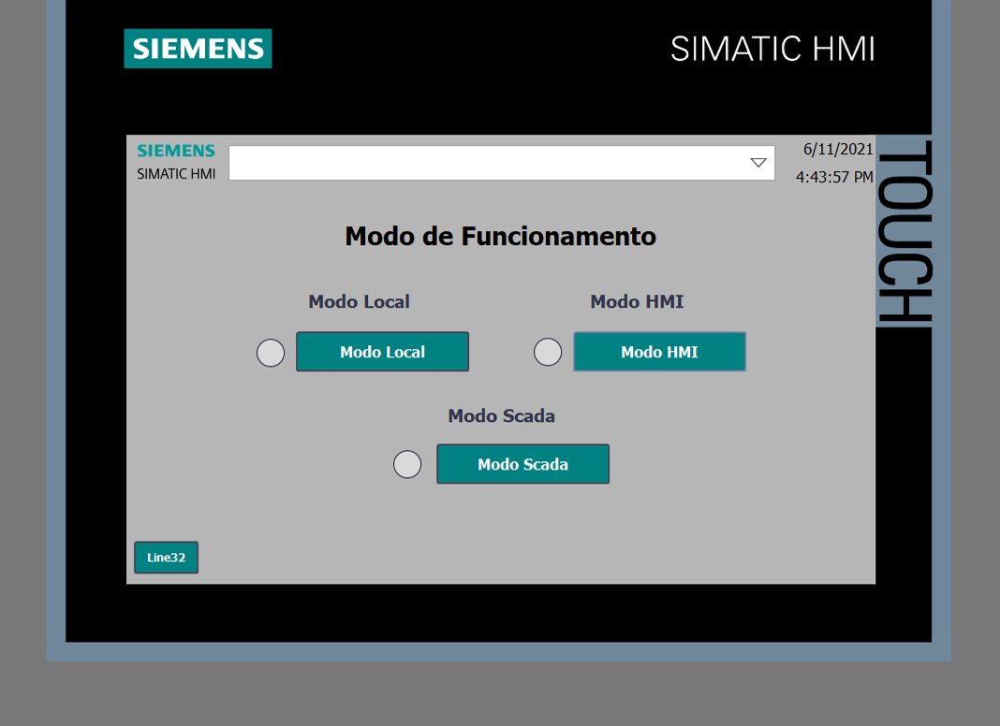

*Imagem do Ecrã - Modo de Funcionamento*

- **Peças**, neste ecrã podemos controlar o **número de peças produzidas**, **saber que tipo de peças foram produzidas** e as **peças com defeito**. Caso se pretenda começar uma nova contagem é possivel dar *reset* aos contadores, através do botão **Reset dos Contadores**. Assim que concluida a consulta do controlo das peças podemos voltar a o ecrã da Line32 ou para as estações (Menu com todas as Estações).

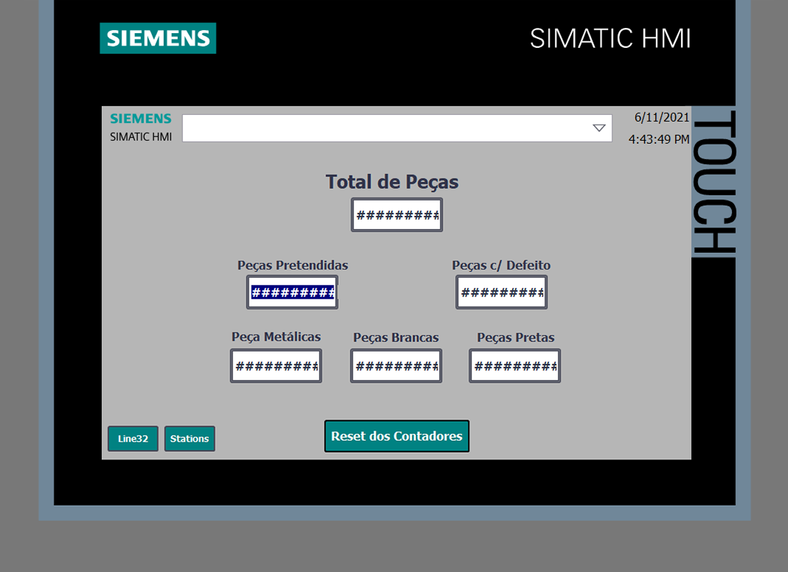

*Imagem do Ecrã - Peças*

- **Line 32**, ecrã principal da linha 32. Neste ecrã podemos: 

    - Fazer o Start/Stop da linha; 
    - Entrar em emergência;
    - Saber o estado da linha;
    - Escolher o modo de marcha;
    - Entrar em modo manual;
    - Dar a ordem de inicialização manual para todas as estações;
    - Trocar para 5 ecrãs: Stations, Peças, Modo de Funcionamento, Testes e Home (Root Screen).

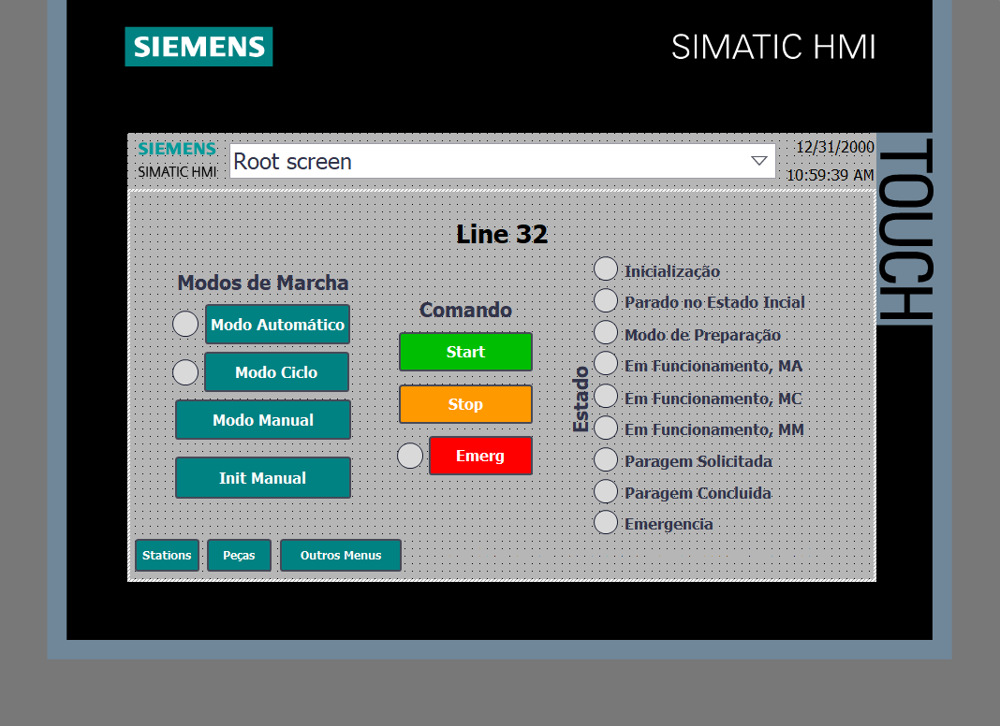

*Imagem do Ecrã - Line32*

- **Stations - Modo Manual**, após da seleção do **Modo Manual** no ecrã da Line 32, este ecrã irá aparecer. Neste ecrã é possivel fazer a escolha da estação a operar em modo manual, antes da escolha da estação é necessário fazer a ativação do modo manual, através do botão a baixo. Assim que concluido o funcionamento em modo manual, podemos voltar a o ecrã da Line.

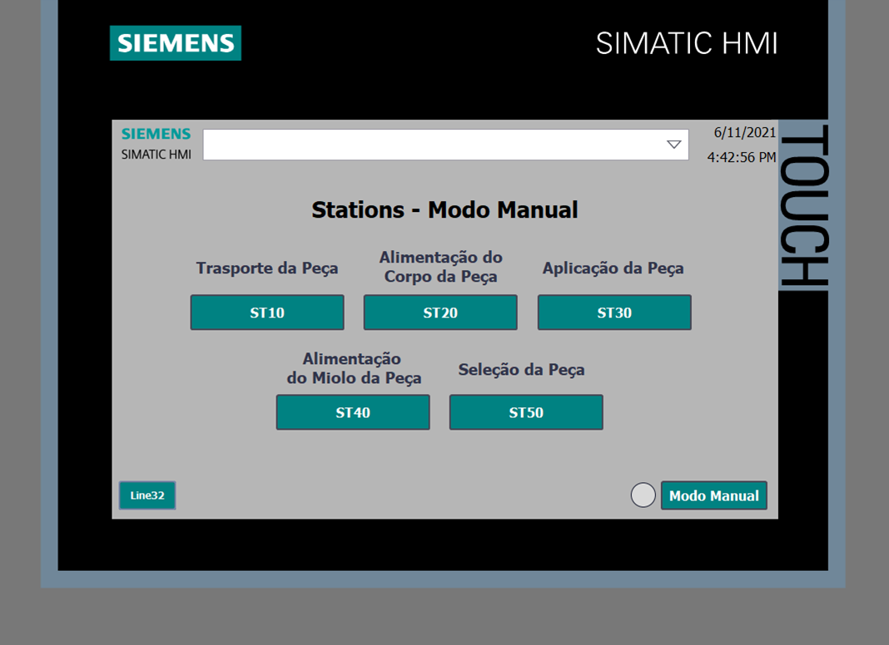

*Imagem do Ecrã - Stations - Modo Manual*

- **ST10 - Modo Manual**, neste ecrã podemos controlar todos os cilindros, consultar o estado de todos os sensores e carregando no botão **Robô** podemos controlar o Robô.

    - ON/OFF do MC_Power;
    - Levar o Robô para a posição de Home;
    - ON/OFF do MC_Reset;
    - Paragem do Robô;
    - Mover livremente o Robô para a esquerda ou para a direita (Necessário aplicar velocidade (Máx: 400));
    - Mover o Robô para uma posição absoluta (Necessário aplicar velocidade (Máx: 400) e escolher uma posição (Máx: 1051.727));
    - Mover o Robô para uma posição relativa (Necessário aplicar velocidade (Máx: 400) e escolher uma posição, pode ser uma posição negativa ou positiva dependendo do sentido pretendido);
    - Através do Botões: **P_ST20**, **P_ST30**, **P_ST40**, **P_ST50** o Robô vai se movimentar para a posição absoluta da ST20 ou ST30 ou ST40 ou ST50, dependendo da escolha; 

Assim que concluidos os testes, podemos voltar ao ecrã da Line32, Stations - Modo Manual (Menu com todas as Estações em Modo Manual) e ST10 (No Ecrã do Robô).

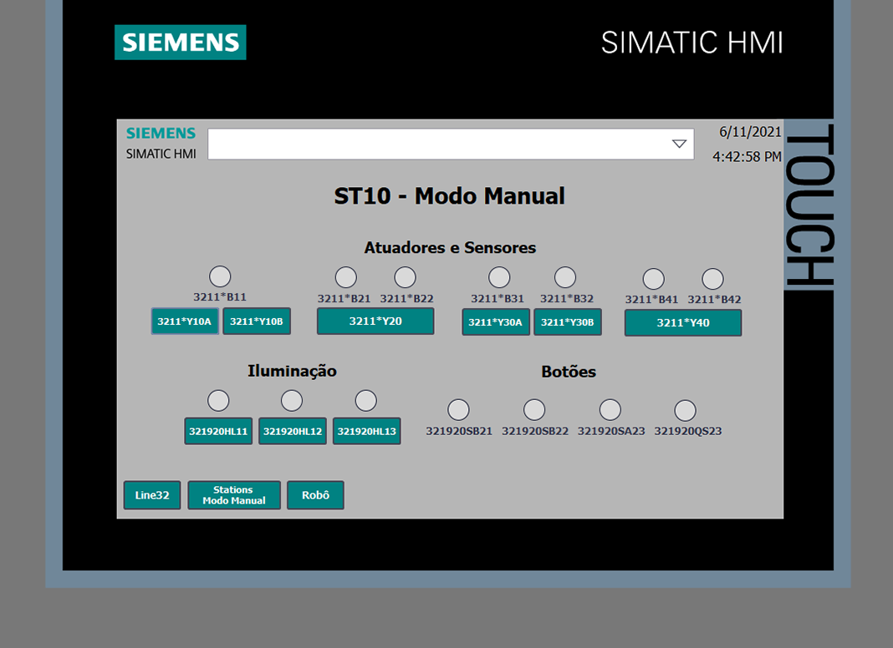

*Imagem do Ecrã - ST10 - Modo Manual*

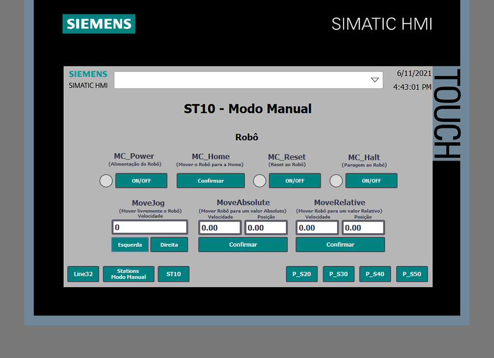

*Imagem do Ecrã - ST10 - Modo Manual (Robô)*

- **ST20 - Modo Manual**, neste ecrã podemos controlar todos os cilindros e consultar o estado de todos os sensores. Assim que concluidos os testes, podemos voltar ao ecrã da Line32 ou Stations - Modo Manual (Menu com todas as Estações em Modo Manual)).

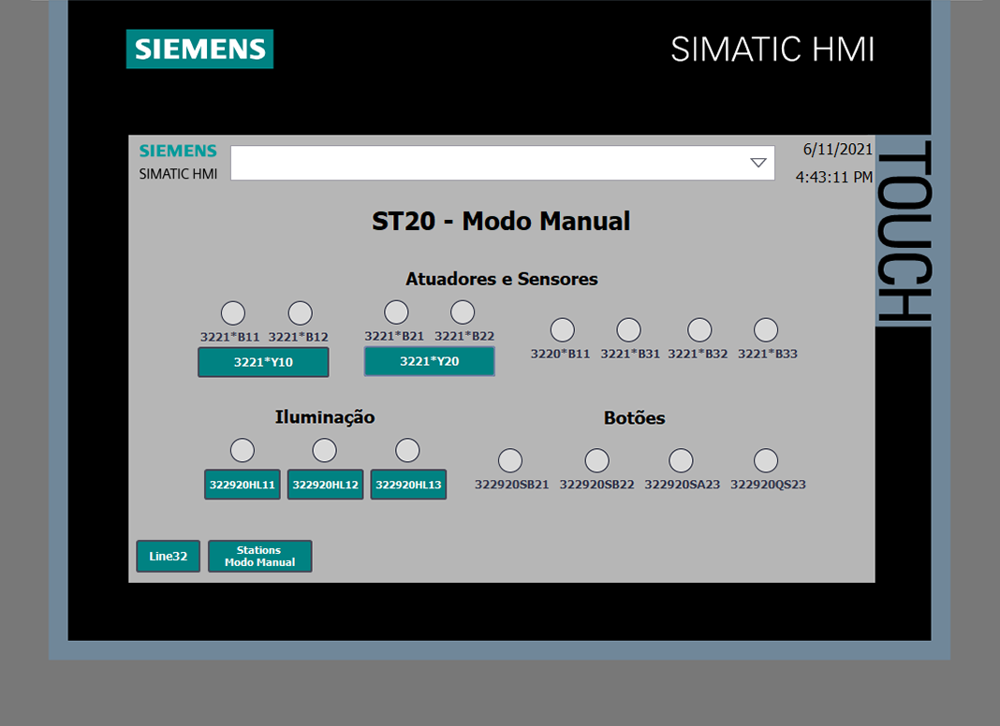

*Imagem do Ecrã - ST20 - Modo Manual*

- **ST30 - Modo Manual**, neste ecrã podemos controlar todos os cilindros e consultar o estado de todos os sensores. Assim que concluidos os testes, podemos voltar ao ecrã da Line32 ou Stations - Modo Manual (Menu com todas as Estações em Modo Manual)).

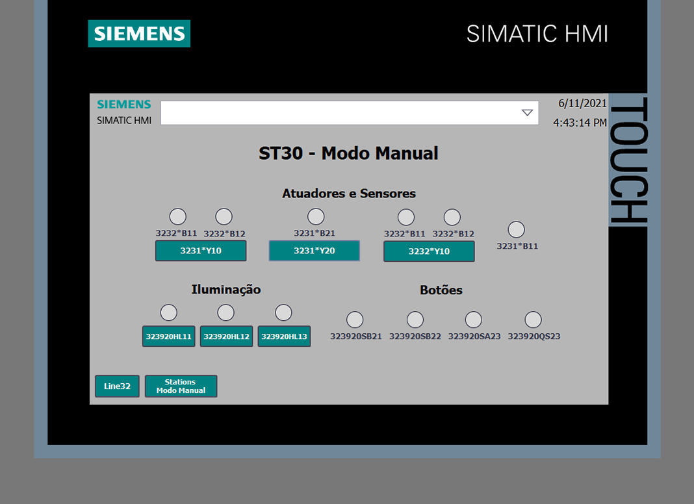

*Imagem do Ecrã - ST30 - Modo Manual*

- **ST40 - Modo Manual**, neste ecrã podemos controlar todos os cilindros e consultar o estado de todos os sensores. A Estação 40 como possui muitos cilindros e sensores, existem dois ecrãs: **Subestação 41** e **Subestação 42**. Assim que concluidos os testes, podemos voltar ao ecrã da Line32 ou Stations - Modo Manual (Menu com todas as Estações em Modo Manual)).

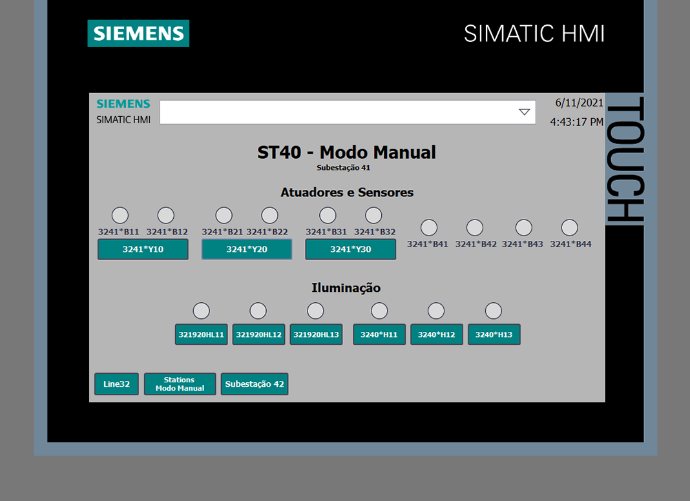

*Imagem do Ecrã - ST40 - Modo Manual (Subestação 41)*

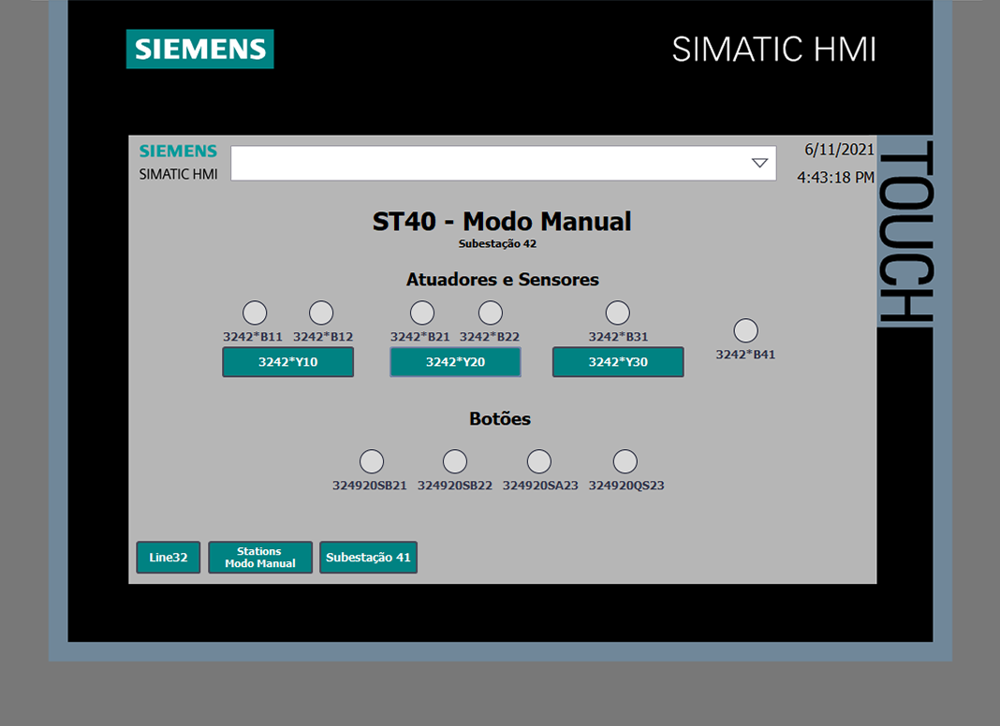

*Imagem do Ecrã - ST40 - Modo Manual (Subestação 42)*

- **ST10 - Modo Manual**, neste ecrã podemos controlar todos os cilindros, consultar o estado de todos os sensores e carregando no botão **Tapete** podemos controlar o Tapete.

    - Start/Stop do Tapete;
    - Aplicar velocidade no Tapete (Máx: 30000);
    - Saber o valor do Contador, sendo possivel fazer o Reset do mesmo.

Assim que concluidos os testes, podemos voltar ao ecrã da Line32, Stations - Modo Manual (Menu com todas as Estações em Modo Manual) e ST10 (No Ecrã do Robô).

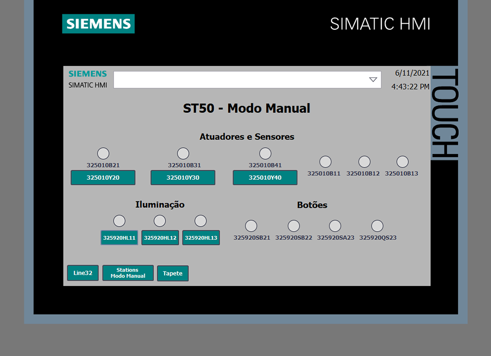

*Imagem do Ecrã - ST50 - Modo Manual*

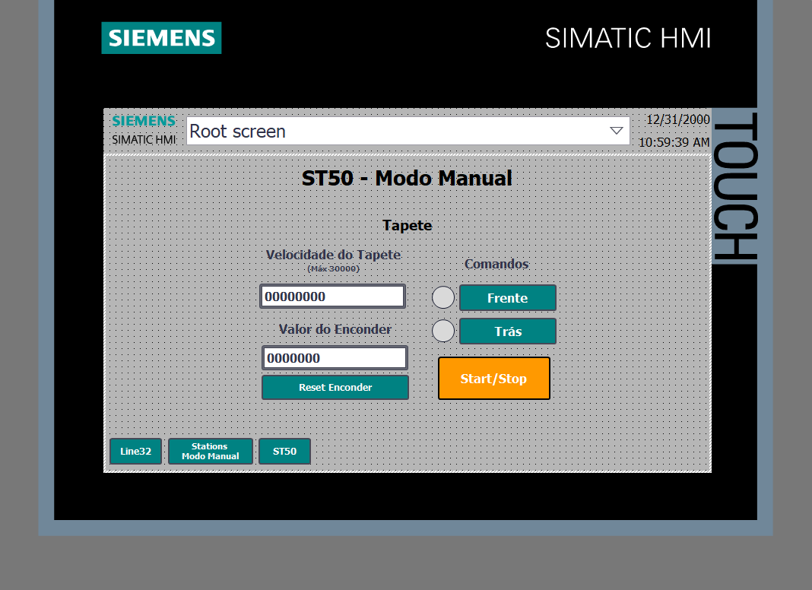

*Imagem do Ecrã - ST50 - Modo Manual (Tapete)*

- **Stations**, neste ecrã é possivel fazer a escolha da estação a operar. 

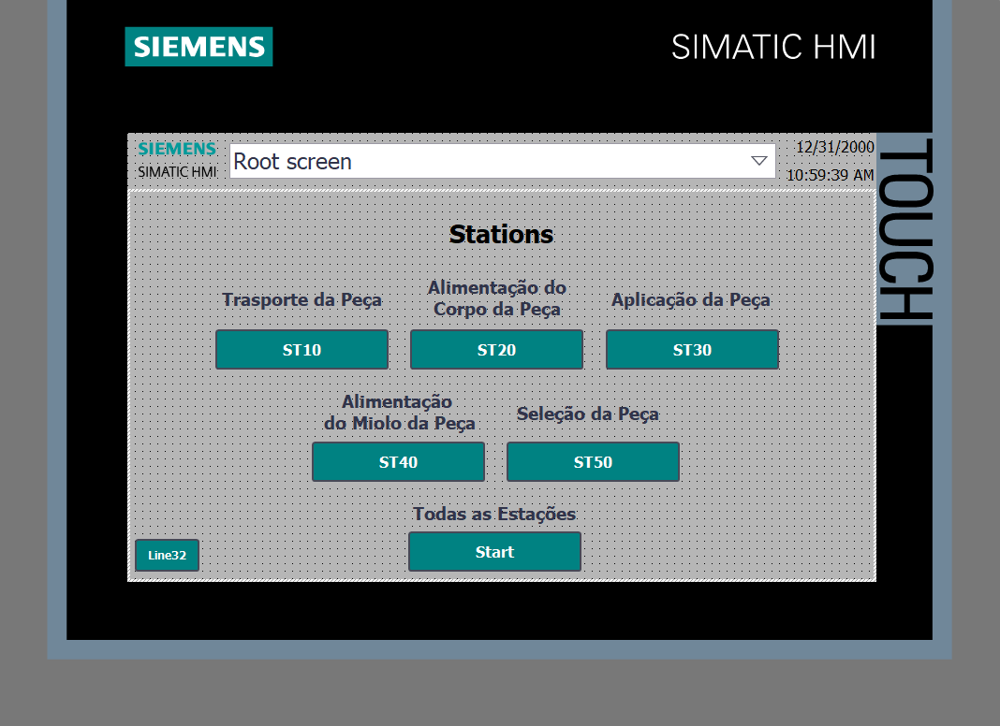

*Imagem do Ecrã - Stations*

- **ST10**, **ST20**, **ST30**, **ST40**, **ST50**, nestes ecrãs podemos controlar a estação 10, 20, 30, 40, 50. Neste ecrã podemos: 

    - Fazer o Start/Stop da estação; 
    - Entrar em emergência;
    - Saber o estado da estação;
    - Saber qual modo de marcha está selecionado;
    - Dar ordem de Home do Carro (Na Estação 10); 
    - Dar a ordem de inicialização manual da estação;
    - Trocar para 5 ecrãs: Stations, Peças, Lin32 e ST20 ou ST30 ou ST40 ou ST50.

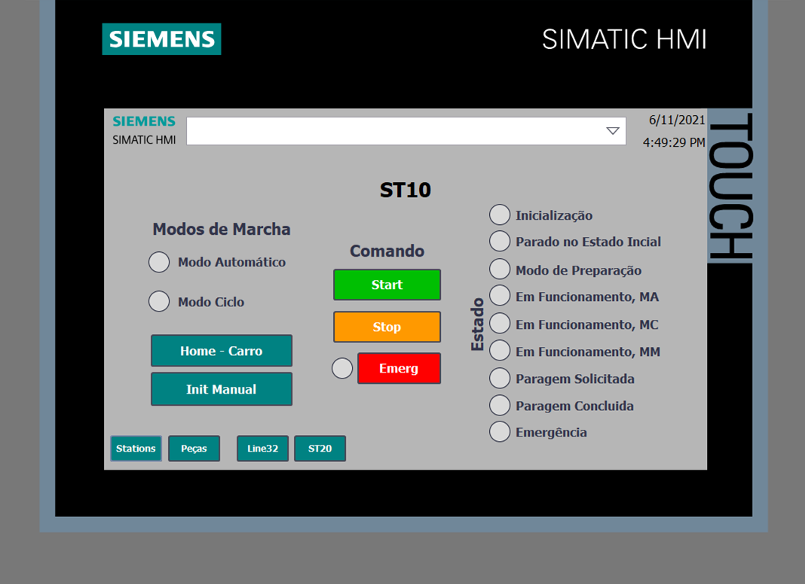

*Imagem do Ecrã - ST10*

*Imagem do Ecrã - ST20*

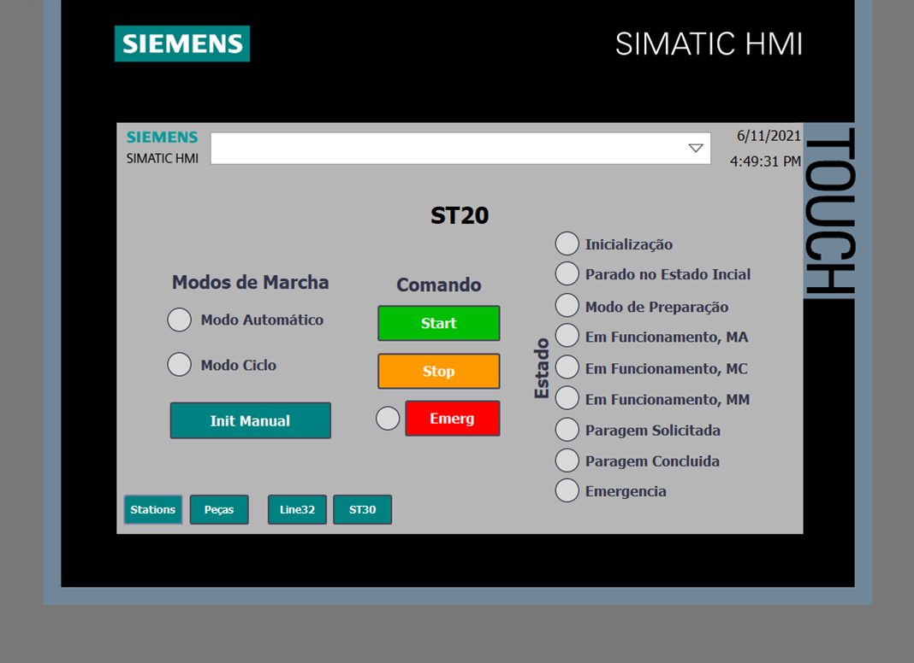

*Imagem do Ecrã - ST30*

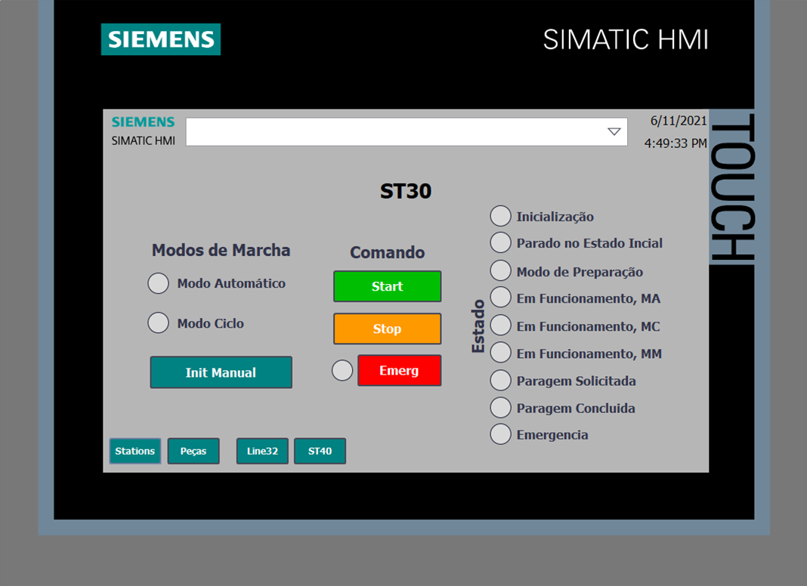

*Imagem do Ecrã - ST40*

*Imagem do Ecrã - ST50*

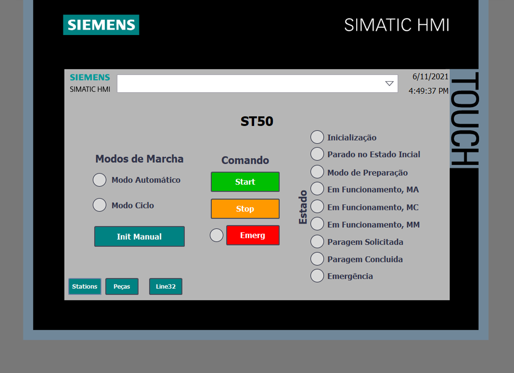

#### Tesla Scada

O Modo de Funcionamento do Tesla Scada é muito identico ao do HMI. Consiste num Software que permite o controlo e supervisão em tempo real de sistemas e processos industriais baseados em PLC. 

##### Servidor

Antes de começar a configurar o Tesla Scada é preciso garantir que no TIA Portal, o Servidor Modbus está configurado. Inicialmente é necessário criar um **Data Block (DB)** com 3 paramentros: 

- **mb_data**, um Array de 0 a 20 de Reais, permitindo assim *operar* no Espaço de Endereços dos Holding register (40001 - 49999);
- **connect**, em que o Data Type é um **TCON_IP_V4**. No connect é onde serão inseridos os dados para a criação do servidor:
    - Interfaceld: 64, definido pelo Sistema. Pode ser consultado em **Device Configuration**, dois cliques no PLC, e **System Constants**;
    - ID: 2, Identifica exclusivamente uma conexão no PLC. Este ID pode ir de 1 a 4095;
    - ConnectionType: 11, definido pelo Sistema. **Type of connection:** 11=TCP/IP, 19=UDP (17=TCP/IP);
    - Local Port: 502, por defeito, Local Portal é 502.
- **status**, permite saber o estado do servidor. 

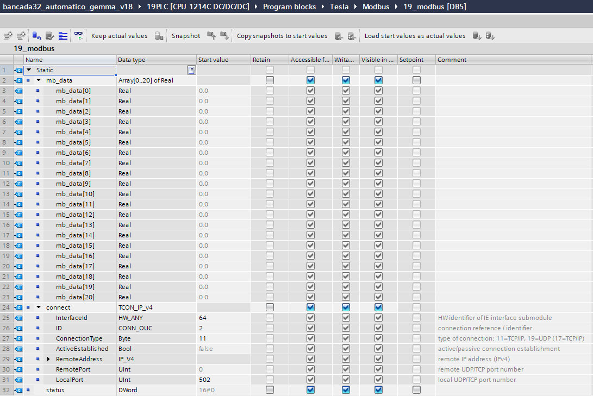

Depois do **Data Block (DB)** criado, basta *chamar* o **MB_Server** para a Network e fazer corresponder o parametros criados no **Data Block (DB)** ao MB_Server.

Com o servidor criado do lado do TIA Portal, passamos para o Tesla Scada. Do lado esquerdo em **Servers**, botão direito, **New Server > Modbus TCP (UDP)**

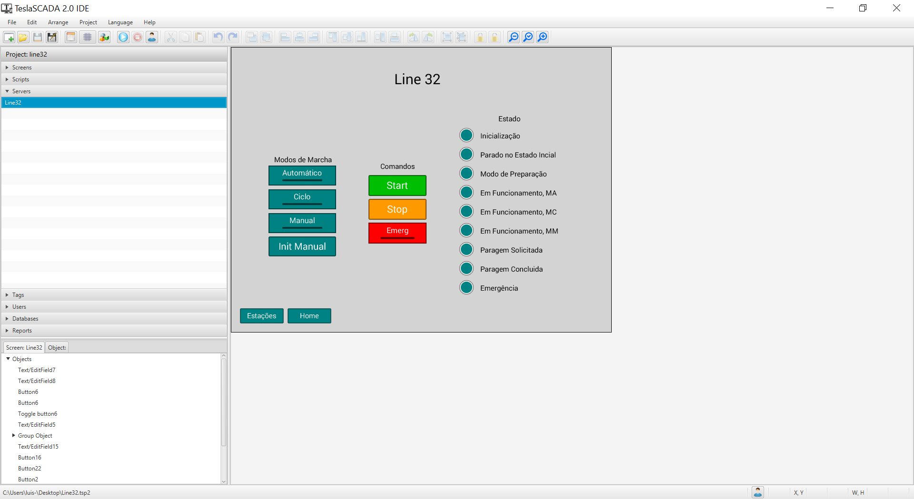
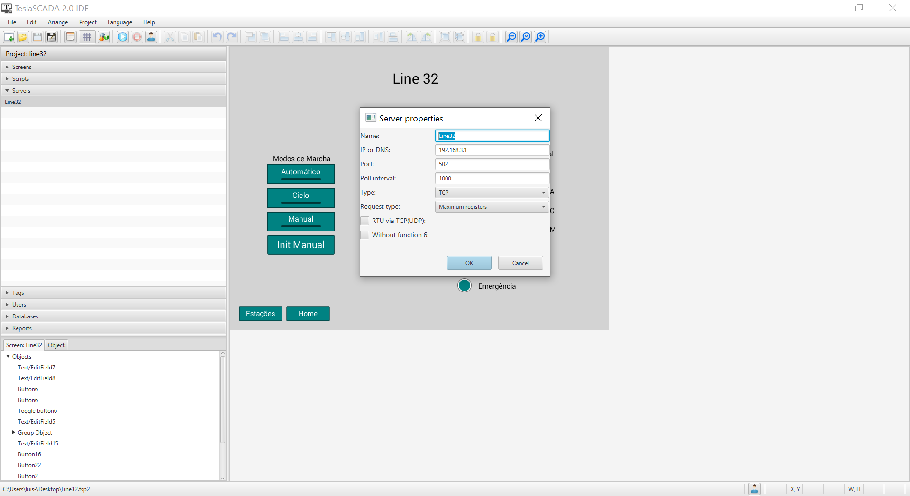

- **Name:** Nome do Servidor;
- **IP or DNS:** Neste caso, é o IP do PLC onde está configurado o **MB_Server**;
- **Port:** Por defeito, a Local Portal é 502 (Como no Tia Portal);
- **Pool Interval:** Intervalo dos pedidos do servidor. Quando maior, mais eficaz é a comunicação.
- **Type:** Protocolo de comunicação do servidor Modbus, TCP ou UDP. Como no Tia Portal definimos a comunicação por TCP, aqui no Tesla, essa escolha tèm que ser correspondida.
- **Request Type:** Maximum Registers, durante o envio/receção de informação, enviará o máximo de informação em apenas um pedido.

##### Classificação

| Name                      | Data Type | Access Mode | PV Input Server  | PV Input Tag        |
|:-------------------------:|:---------:|:-----------:|:----------------:|:-------------------:|
| Scada_Init_Manual_All_STS | Boolean   | ReadWrite   | Line32           | s=1;pt=1;o=16;dt=1; |
| Scada_Init_Manual_ST10    | Boolean   | ReadWrite   | Line32           | s=1;pt=1;o=17;dt=1; |
| Scada_Init_Manual_ST20    | Boolean   | ReadWrite   | Line32           | s=1;pt=1;o=18;dt=1; |
| Scada_Init_Manual_ST30    | Boolean   | ReadWrite   | Line32           | s=1;pt=1;o=19;dt=1; |
| Scada_Init_Manual_ST40    | Boolean   | ReadWrite   | Line32           | s=1;pt=1;o=20;dt=1; |
| Scada_Init_Manual_ST50    | Boolean   | ReadWrite   | Line32           | s=1;pt=1;o=21;dt=1; |
| Scada_O_Emerg_Master      | Boolean   | ReadWrite   | Line32           | s=1;pt=1;o=22;dt=1; |
| Scada_O_Emerg_ST10        | Boolean   | ReadWrite   | Line32           | s=1;pt=1;o=23;dt=1; |
| Scada_O_Emerg_ST20        | Boolean   | ReadWrite   | Line32           | s=1;pt=1;o=24;dt=1; |
| Scada_O_Emerg_ST30        | Boolean   | ReadWrite   | Line32           | s=1;pt=1;o=25;dt=1; |
| Scada_O_Emerg_ST40        | Boolean   | ReadWrite   | Line32           | s=1;pt=1;o=26;dt=1; |
| Scada_O_Emerg_ST50        | Boolean   | ReadWrite   | Line32           | s=1;pt=1;o=27;dt=1; |
| Scada_O_Start_Master      | Boolean   | ReadWrite   | Line32           | s=1;pt=1;o=28;dt=1; |
| Scada_O_Start_ST10        | Boolean   | ReadWrite   | Line32           | s=1;pt=1;o=29;dt=1; |
| Scada_O_Start_ST20        | Boolean   | ReadWrite   | Line32           | s=1;pt=1;o=30;dt=1; |
| Scada_O_Start_ST30        | Boolean   | ReadWrite   | Line32           | s=1;pt=1;o=31;dt=1; |
| Scada_O_Start_ST40        | Boolean   | ReadWrite   | Line32           | s=1;pt=1;o=32;dt=1; |
| Scada_O_Start_ST50        | Boolean   | ReadWrite   | Line32           | s=1;pt=1;o=33;dt=1; |
| Scada_O_Stop_Master       | Boolean   | ReadWrite   | Line32           | s=1;pt=1;o=34;dt=1; |
| Scada_O_Stop_ST10         | Boolean   | ReadWrite   | Line32           | s=1;pt=1;o=35;dt=1; |
| Scada_O_Stop_ST20         | Boolean   | ReadWrite   | Line32           | s=1;pt=1;o=36;dt=1; |
| Scada_O_Stop_ST30         | Boolean   | ReadWrite   | Line32           | s=1;pt=1;o=37;dt=1; |
| Scada_O_Stop_ST40         | Boolean   | ReadWrite   | Line32           | s=1;pt=1;o=38;dt=1; |
| Scada_O_Stop_ST50         | Boolean   | ReadWrite   | Line32           | s=1;pt=1;o=39;dt=1; |
| Scada_MM_Automatico       | Boolean   | ReadWrite   | Line32           | s=1;pt=1;o=40;dt=1; |
| Scada_MM_Ciclo            | Boolean   | ReadWrite   | Line32           | s=1;pt=1;o=41;dt=1; |
| Scada_MM_Manual           | Boolean   | ReadWrite   | Line32           | s=1;pt=1;o=42;dt=1; |
| Scada_MC_Home_Execute     | Boolean   | ReadWrite   | Line32           | s=1;pt=1;o=43;dt=1; |

---
**Legenda (Coluna PV Input Tag)**

- **s** - SlaveID, por definição é 1.
- **pt** - Point Type, pode ser definido de 1 a 4.
    - 1 - Holding Coil             
    - 2 - Discrete input   
    - 3 - Holding register
    - 4 - Input register
- **o** - Offset, corresponde ao registro Modbus. No meu caso, estou a usar **Holding Coils**, *mexendo* diretamente em Bits. O meu primeiro Bit, do lado do TIA Portal (Servidor), correponde ao Q2.0. Desta forma, o offset, do lado Tesla Scada, corresponderá a 16. (Como um Byte são 8 Bits, logo 8*2=16)
- **dt** - Data type, corresponde ao tipo de dados usados nos Holding register e nos Input register.

##### Ecrãs

- **Root Screen**, ecrã principal do Tesla Scada. Neste ecrã podemos ser encaminhados para outros 2 ecrãs: **Line32** ou **Estações**

*Imagem do Root Screen*

- **Line 32**, ecrã principal da linha 32. Neste ecrã podemos: 

    - Fazer o Start/Stop da linha; 
    - Entrar em emergência;
    - Escolher o modo de marcha;
    - Entrar em modo manual;
    - Dar a ordem de inicialização manual para todas as estações;
    - Trocar para 2 ecrãs: Estações e Home (Root Screen).

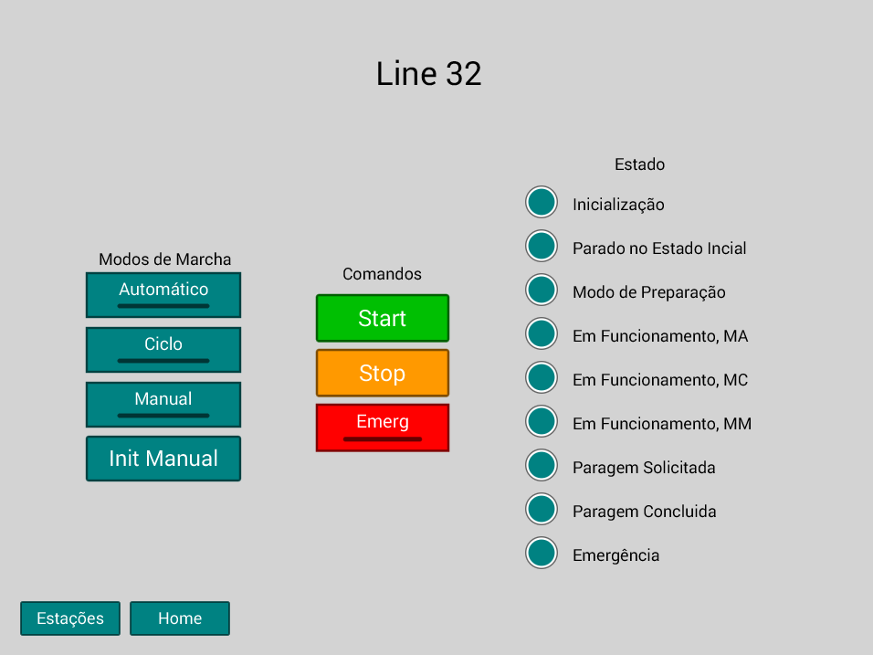

*Imagem do Ecrã - Line32*

- **Stations**, neste ecrã é possivel fazer a escolha da estação a operar. 

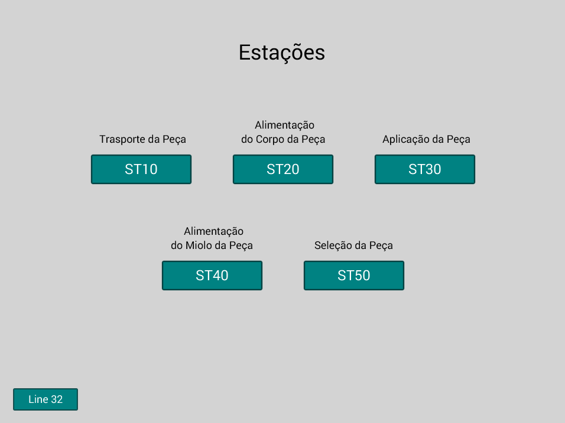

*Imagem do Ecrã - Stations*

- **ST10**, **ST20**, **ST30**, **ST40**, **ST50**, nestes ecrãs podemos controlar a estação 10, 20, 30, 40, 50. Neste ecrã podemos: 

    - Fazer o Start/Stop da estação; 
    - Entrar em emergência;
    - Saber qual modo de marcha está selecionado;
    - Dar ordem de Home do Carro (Na Estação 10); 
    - Dar a ordem de inicialização manual da estação;
    - Trocar para 5 ecrãs: Estações, Lin32 e ST20 ou ST30 ou ST40 ou ST50.

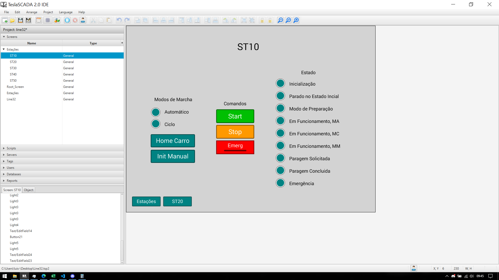

*Imagem do Ecrã - ST10*

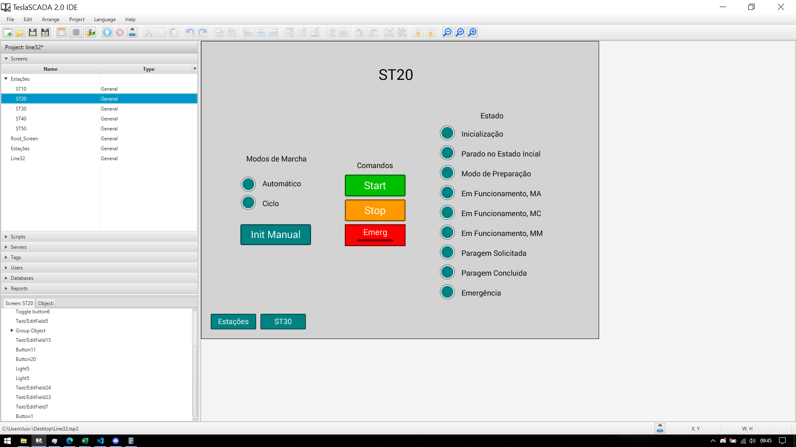

*Imagem do Ecrã - ST20*

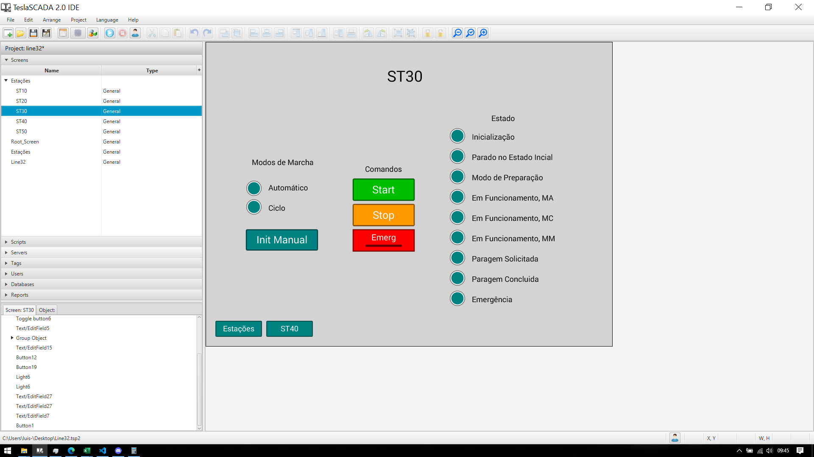

*Imagem do Ecrã - ST30*

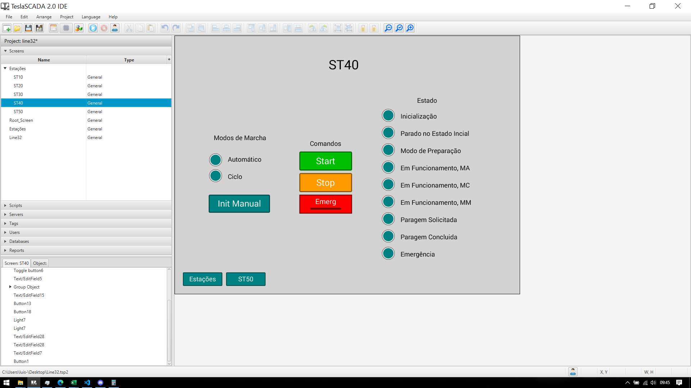

*Imagem do Ecrã - ST40*

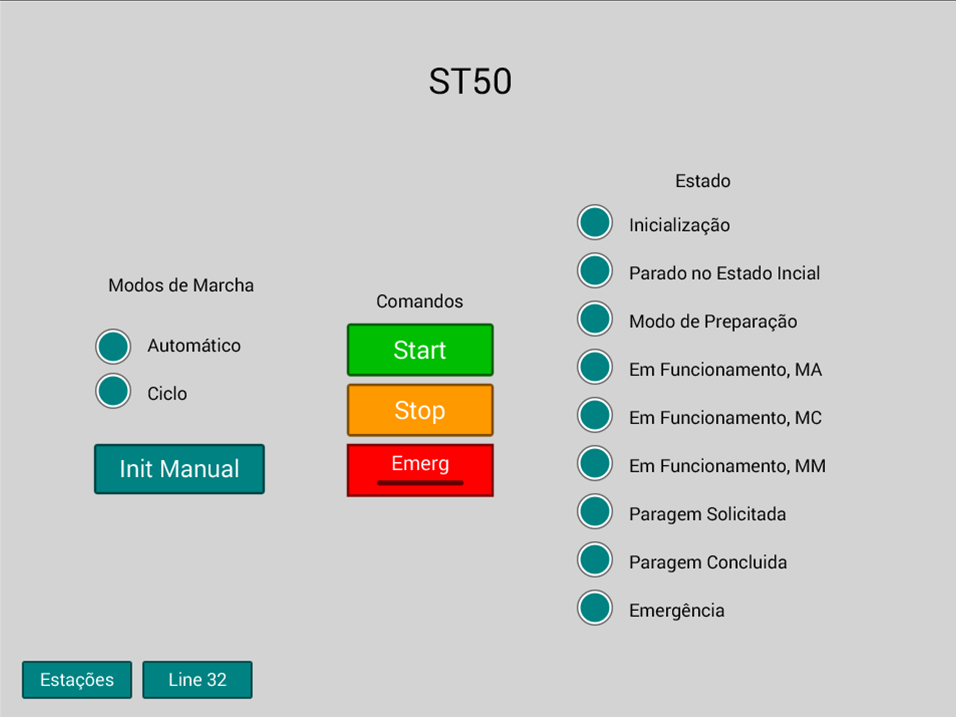

*Imagem do Ecrã - ST50*

## Anexos

