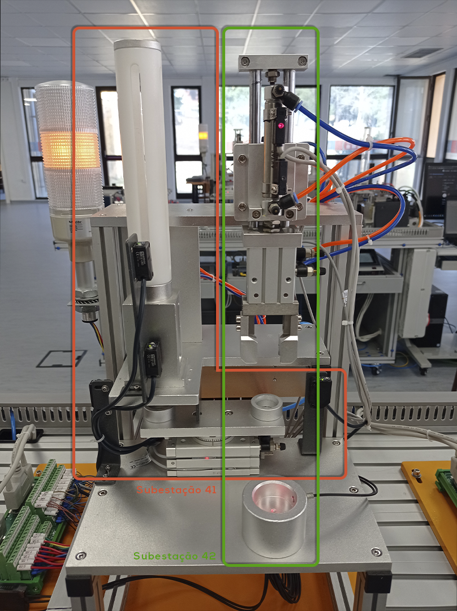
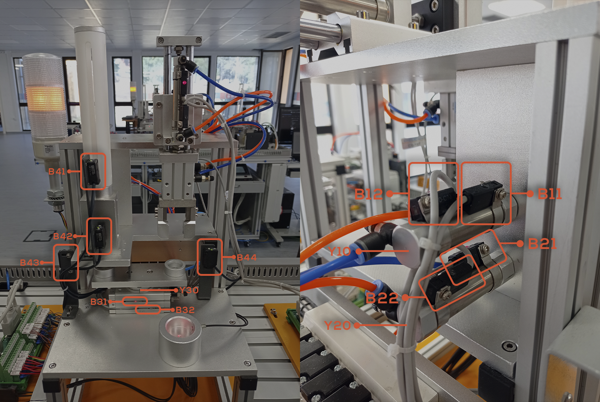
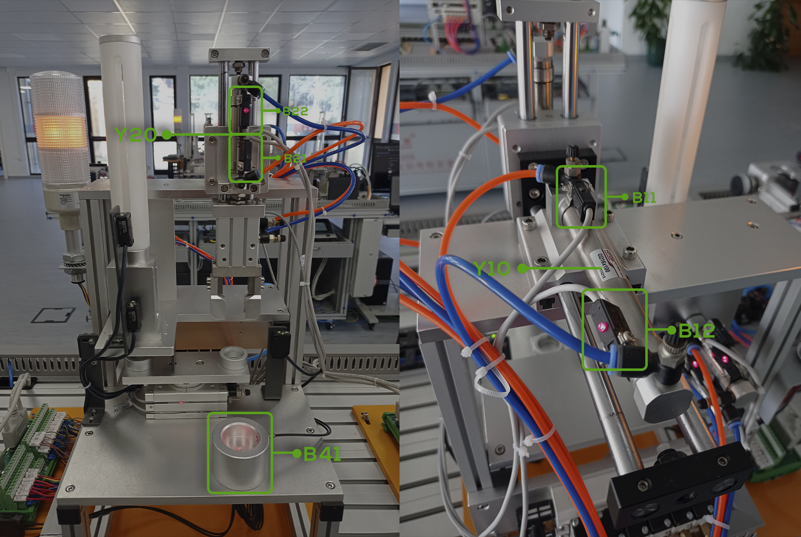
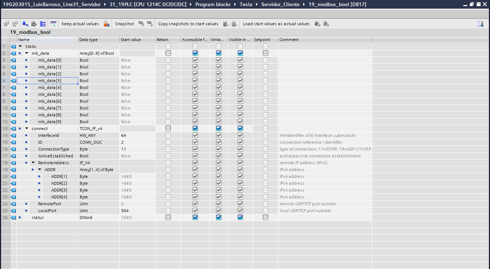
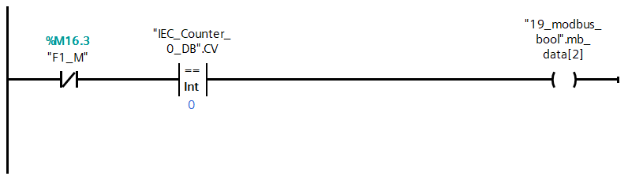
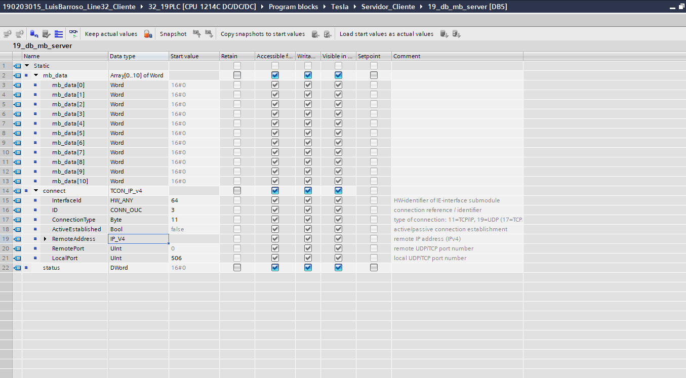

# Line 32

**Autor:** *Luís Barroso*

*Last Upgrade: 30/07/2021, 16h57*

- [Introdução](#introducao)
- [Processo](#processo)
    - [Peças](#pecas)
    - [Estações](#estacoes)
        - [Estação 10](#est-estacao-10)
        - [Estação 20](#est-estacao-20)
        - [Estação 30](#est-estacao-30)
        - [Estação 40](#est-estacao-40)
        - [Estação 50](#est-estacao-50)
    - [Modo de Funcionamento](#modo-de-funcionamento)
    - [Comunicações](#comunicacoes)
        - [Modbus](#modbus)
            - [Zonas de Comunicação](#modbus-zonas-de-comunicacao)
        - [Profinet](#profinet)
            - [Zonas de Comunicação](#profinet-zonas-de-comunicacao)
- [Trabalho Realizado](#trabalho-realizado)
    - [Modelo de Classificação](#modelo-de-classificacao)
        - [Exemplo de Aplicação do Modelo de Classificação](#exemplo-de-aplicacao-do-modelo-de-classificacao)
    - [Classificação](#classificacao)
        - [Estação 10](#class-est10)
            - [Entradas e Saidas (PLC)](#est-10-entradas-e-saidas-plc)
            - [Memórias](#est-10-memorias)
            - [Comunicações](#est-10-comunicacoes)
        - [Estação 20](#class-est20)
            - [Entradas e Saidas (PLC)](#est-20-entradas-e-saidas-plc)
            - [Memórias](#est-20-memorias)
            - [Comunicações](#est-20-comunicacoes)
        - [Estação 30](#class-est30)
            - [Entradas e Saidas (PLC)](#est-30-entradas-e-saidas-plc)
            - [Memórias](#est-30-memorias)
            - [Comunicações](#est-30-comunicacoes)
        - [Estação 40](#class-est40)
            - [Entradas e Saidas (PLC)](#est-40-entradas-e-saidas-plc)
            - [Memórias](#est-40-memorias)
            - [Comunicações](#est-40-comunicacoes)
        - [Estação 50](#class-est50)
            - [Entradas e Saidas (PLC)](#est-50-entradas-e-saidas-plc)
            - [Memórias](#est-50-memorias)
            - [Comunicações](#est-50-comunicacoes)  
    - [Software](#software)
        - [Grafcets](#grafcets)
            - [Estação 10](#graf-estacao-10)
            - [Estação 20](#graf-estacao-20)
            - [Estação 30](#graf-estacao-30) 
            - [Estação 40](#graf-estacao-40)
            - [Estação 50](#graf-estacao-50)
        - [Gemma](#gemma)
            - [Esquema](#esquema)
            - [Guia de Iluminação](#guia-de-iluminacao)
            - [Modos de Marcha](#modos-de-marcha)   
            - [Grafcet’s - Funcionamento Gemma](#grafcets-funcionamento-gemma)
                - [Gemma Master](#gemma-master)
                - [Gemma Estações](#gemma-estacoes)
            - [Grafcet’s - Iluminação Gemma](#grafcets-iluminacao-gemma)
                - [Gemma Master](#gemma-master)
                - [Gemma Estações](#gemma-estacoes)
        - [Modo Distribuído](#modo-distribuido)        
        - [Programação](#programacao)
            - [Estação 10](#prog-estacao-10)
            - [Estação 50](#prog-estacao-50)
            - [Inicialização](#inicializacao)        
            - [Modos de Funcionamento](#prog-modo-de-funcionamento)
            - [Modos de Marcha](#modos-de-marcha)
            - [Botões](#botoes)
        - [HMI](#hmi)
            - [Classificação](#hmi-classificacao)
            - [Ecrãs](#hmi-ecras)
        - [Tesla Scada](#tesla-scada)
            - [Servidor](#servidor)   
            - [Classificação](#scada-classificacao)
            - [Ecrãs](#scada-ecras)
        - [Operar a Linha 32](#operar-a-linha-32)
- [Anexos](#anexos)

## Introdução

A Linha 32 é uma das Linhas do Grupo 30. Divida em 5 estações das quais resultam: **Transporte (Estação 10)**, **Aplicação (Estação 30)**, **Alimentação do Corpo (Estação 20) e do Miolo (Estação 40)** e **Seleção (Estação 50)**.

## Processo

A Linha 32, do Grupo 30, consiste num conjunto de estações, **cada uma com Equipamentos/Componentes independentes**. A Linha 32, assim com cada uma da estações, funcionam usando **sistemas pneumáticos** e **sistemas eletromecânicos**.

Os **sistemas pneumáticos** estão presentes em todas as estações. Responsáveis pelos movimentos dos Cilindros, o avanço e recuo. Já os **sistemas eletromecânicos** só estão presentes nas estações 10 e 50. Na estação 10, são responsáveis pelo movimento do **robô**. Este robô é utilizado para o transporte das peças pelas diversas estações. Acoplado ao robô, temos uma **garra**, sendo assim possível realizar as tarefas pretendidas, com por exemplo, o avança e recuo da garra. Para se deslocar pelas diversas estações, o robô, está conectado a um **Servo Motor** (Simotics S-1FL6) e um **Inversor de Frequência** (Siemens V90); Na estação 50, são responsáveis pelo movimento do tapete. Para o movimento deste tapete é usado um **Motor Trifásico** que acoplado tem um **Enconder**, que, através da sua posição é possível fazer o encaminhamento das peças. Para a movimento do Motor é utilizado um **Inversor de Frequência** (Siemens G120C), que converte o sinal elétrico em sinal analógico sendo assim possível fazer o movimento do tapete e controlo da velocidade.

Para o controlo das peças são usados Sensores, como: **Sensores Fotoelétricos**, usados para a deteção das peças em determinadas posições; **Sensores Indutivos** usados para distinguir as peças metálicas das peças de plástico; **Sensores Óticos** usados para distinguir a peças brancas das peças pretas e **Sensores Magnéticos** usados para detetar a posição da haste do cilindro.

Para a comunicação entre as diversas estações é usado o protocolo de comunicação **PROFINET**, este protocolo é baseado em **Ethernet**, ou seja, todas as comunicações entre PC/PLC ou PLC/PLC são feitas em rede. No programa TIA Portal é definida uma área de transferência de Bytes, desta forma, tanto o Master com os *Slaves* podem operar na zona definida. 

### Peças

Peças, constituídas por Corpo (Parte Exterior) e por um Miolo (Parte Interior). Representa o objeto processado na Linha 32, quando os elementos são unificados representam o produto final. Podem ser classificadas de 9 maneiras, como nos mostra a tabela abaixo.

|          | Metálico | Branco | Preto |
|:--------:|:--------:|:------:|:-----:|
| Metálico | **x**    | x      | x     |
| Branco   | x        | **x**  | x     |
| Preto    | x        | x      | **x** |

Os **x** a negrito indicam-nos as combinações pretendidas, quando essas combinações são processadas são encaminhadas para o respetivo armazém.

### Estações
#### Estação 10

A Estação 10, **estação de transporte da peça**, desde a sua fase inicial até à sua finalização. A Estação 10 é constituída por 7 sensores e 6 cilindros, dos quais resultam: Sensor de Garra em baixo, Sensor de Garra em cima, Sensor de Garra de rotação à esquerda, Sensor de Garra de rotação à direita, Sensor de Garra avançada, Sensor de Garra recuada, Sensor de Garra fechada; Cilindro de Garra subida e descida, Cilindro de rotação à esquerda da Garra, Cilindro de rotação à direita da Garra, Cilindro de Garra avançada e recuada, Cilindro de fecho da Garra, Cilindro de abertura da Garra.

#### Estação 20

A Estação 20, **estação de alimentação do corpo da peça**, o corpo da peça, é colocado no funil para ser processado. A Estação 20 é constituída por 8 sensores e 2 cilindros, dos quais resultam: Sensor de Peça à Frente, Sensor Cilindro1 Avançado, Sensor Cilindro1 Recuado, Sensor Cilindro2 Avançado, Sensor Cilindro2 Recuado, Sensor no Funil (Cima), Sensor no Funil (Baixo), Sensor de Peça Metálica; Cilindro 1, Cilindro 2.

#### Estação 30

A Estação 30, **estação de aplicação**, é aplicada uma *cola* para fixar o miolo ao corpo da peça. A Estação 30 é constituída por 7 sensores e 6 cilindros, dos quais resultam: Sensor de peça na Pinça, Sensor de Pinça aberta e fechada, Sensor de Pinça avançada, Sensor de Pinça recuada, Sensor de Prensa subida, Sensor de Prensa descida; Cilindro de fecho da Pinça, Cilindro de Pinça avançada e recuada, Cilindro da Prensa subida e descida.

#### Estação 40

A Estação 40, **estação de alimentação do miolo da peça**, o miolo da peça, é colocado na funil para ser processado. A Estação 40 é constituída por 16 sensores e 6 cilindros, dos quais resultam: Sensor Cilindro1 Avançado, Sensor Cilindro1 Recuado, Sensor Cilindro2 Avançado, Sensor Cilindro2 Recuado, Sensor Prato de rotação à esquerda, Sensor Prato de rotação à direita, Sensor copo em cima, Sensor copo em baixo, Sensor do Prato à esquerda, Sensor do Prato à direita, Sensor de Garra avançada, Sensor de Garra recuada, Sensor de Garra subida, Sensor de Garra descida, Sensor de Garra fechada, Sensor de Peça à frente; Cilindro 1, Cilindro 2, Cilindro Prato, Cilindro da Garra avançada e recuada, Cilindro da Garra subida e descida, Cilindro da Garra aberta e fechada.

#### Estação 50

A Estação 50, **estação de seleção**, responsável por ordenar as peças no respetivo armazém.  Estação 40 é constituída por 6 sensores e 3 cilindros, dos quais resultam:
Sensor de Peça no Tapete, Sensor de Peça Metálica, Sensor de Peça Branca/Metálica, Sensor Cilindro1 Avançado, Sensor Cilindro2 Avançado, Sensor Cilindro3 Avançado; Cilindro 1, Cilindro 2, Cilindro 3.

### Modo de Funcionamento

Assim que a Estação 20 for alimentada com o corpo da peça, essa informação é enviada para o PLC Master (Estação 10), assim que recebida, a Estação 20 processa a peça. Quando concluído o processamento, a peça, esta pronta para o robô a processar e avançar para a próxima estação. Quando o robô estiver na posição relativa à estação 30, a garra avança e pousa a peça na pinça e a peça é processada. Quando concluído o processamento, a peça, esta pronta para o robô a processar e avançar para a próxima estação. Quando o robô estiver na posição relativa à estação 40, a garra avança e pousa a peça no *suporte*. Assim que o corpo da peça for recebido pela estação 40, a estação entra em processamento, ou seja, o miolo é colocado no corpo da peça. Quando concluído o processamento, a peça, esta pronta para o robô a processar e avançar para a próxima estação. Quando o robô estiver na posição relativa à estação 50, a garra avança e pousa a peça no tapete. O tapete entra em funcionamento, a peça é identificada, pelos sensores e encaminhada. Caso for uma peça pretendida (Metálico/Metálico; Branco/Branco; Preto/Preto) é encaminhada para o respetivo armazém, senão, a peça é rejeitada. Depois do robô, pousar a peça no tapete da estação 50, retorna para a sua posição de *home* e desta forma o ciclo foi concluído e pronto a realizar um novo ciclo. 

A Linha 32 é composta por 3 modos de funcionamento: **Local**, **HMI** e **Remoto**. **No Modo de Funcionamento Local**, os comandos para as estações são dados através da Botoneiras. Já os comandos para a linha são dados pela HMI. **No Modo de Funcionamento HMI**, todos os comandos, tanto para as estações como para a linha, são dados pela HMI. **No Modo de Funcionamento Remoto**, todos os comandos, tanto para as estações como para a linha, são dados remotamente, usando o software Tesla Scada. Quando um destes Modos de Funcionamento é selecionado, na HMI, os outros dois modos, mesmo que sejam selecionados, não terão efeito, prevenido assim qualquer acidente ou falha no sistema. Por exemplo: se estivermos a funcionar em modo HMI, se forem dados comandos através da Botoneiras ou através do Tesla Scada, este comandos não funcionaram, pois o Modo HMI está selecionado. 

Através da visualização dos 5 vídeos abaixo apresentados é possível perceber melhor o funcionamento da Linha 32.

**Modos de Marcha**

*Modo Automático*

*Modo Ciclo*

*Rejeição de Peças c/ Defeito*

**Paragens**

*Paragem Solicitada*

*Paragem Emergência*

### Comunicações

A linha 32, usa dois protocolos de comunicação: **Profinet** e **Modbus**.

### Modbus

ModBus é um protocolo de comunicação de *Send/Receive* que utiliza um relacionamento **Master/Slave**. A comunicação **Master/Slave** ocorre em pares, ou seja, assim que o **Slave** fizer um pedido, fica aguardar a resposta por parte do **Master**. Assim que **Master** receber este pedido envia a informação pretendida para o **Slave**.

O Modbus é constituído por 4 zonas de memorias, como mostra a tabela abaixo: 

| Tipo de Objeto   | Acesso     | Tamanho    | Espaço de Endereços |
|:----------------:|:----------:|:----------:|:-------------------:|
| Holding Coil     | Read-write | 1 bit      | 00001 - 09999       |
| Discrete input   | Read-only  | 1 bit      | 10001 - 19999       |
| Input register   | Read-only  | 16 bits    | 30001 - 39999       |
| Holding register | Read-write | 16 bits    | 40001 - 49999       |

Este protocolo de comunicação é usado pelo software Tesla Scada, permitindo assim que ordens para a linha ou para as Estações sejam dadas remotamente.

#### Zonas de Comunicação

| Label                            | Endereço | Comentário                                                                         |
|:--------------------------------:|:--------:|:----------------------------------------------------------------------------------:|
| Reset\_Scada\_Memorys            | %QB2     | Byte dos Inputs, usado na Inicialização para garantir que todos o Bits estão a 0   |
| Scada\_Init\_Manual\_All\_STS    | %Q2.0    | Ordem de Inicialização para o Master, dada pelo Tesla Scada                        |
| Scada\_Init\_Manual\_ST10        | %Q2.1    | Ordem de Inicialização para a ST10, dada pelo Tesla Scada                          |
| Scada\_Init\_Manual\_ST20        | %Q2.2    | Ordem de Inicialização para a ST20, dada pelo Tesla Scada                          |
| Scada\_Init\_Manual\_ST30        | %Q2.3    | Ordem de Inicialização para a ST30, dada pelo Tesla Scada                          |
| Scada\_Init\_Manual\_ST40        | %Q2.4    | Ordem de Inicialização para a ST40, dada pelo Tesla Scada                          |
| Scada\_Init\_Manual\_ST50        | %Q2.5    | Ordem de Inicialização para a ST50, dada pelo Tesla Scada                          |
| Scada\_O\_Emerg\_Master          | %Q2.6    | Ordem de Stop, dada pelo Tesla Scada para o Master                                 |
| Scada\_O\_Emerg\_ST10            | %Q2.7    | Ordem de Emergência, dada pelo Tesla Scada para a ST10                             |
| Reset\_Scada\_Memorys\_1         | %QB3     | Byte dos Inputs, usado na Inicialização para garantir que todos o Bits estão a 0   |
| Scada\_O\_Emerg\_ST20            | %Q3.0    | Ordem de Emergência, dada pelo Tesla Scada para a ST20                             |
| Scada\_O\_Emerg\_ST30            | %Q3.1    | Ordem de Emergência, dada pelo Tesla Scada para a ST30                             |
| Scada\_O\_Emerg\_ST40            | %Q3.2    | Ordem de Emergência, dada pelo Tesla Scada para a ST40                             |
| Scada\_O\_Emerg\_ST50            | %Q3.3    | Ordem de Emergência, dada pelo Tesla Scada para a ST50                             |
| Scada\_O\_Start\_Master          | %Q3.4    | Ordem de Start, dada pelo Tesla Scada para o Master                                |
| Scada\_O\_Start\_ST10            | %Q3.5    | Ordem de Start, dada pelo Tesla Scada para a ST10                                  |
| Scada\_O\_Start\_ST20            | %Q3.6    | Ordem de Start, dada pelo Tesla Scada para a ST20                                  |
| Scada\_O\_Start\_ST30            | %Q3.7    | Ordem de Start, dada pelo Tesla Scada para a ST30                                  |
| Reset\_Scada\_Memorys\_2         | %QB4     | Byte dos Inputs, usado na Inicialização para garantir que todos o Bits estão a 0   |
| Scada\_O\_Start\_ST40            | %Q4.0    | Ordem de Start, dada pelo Tesla Scada para a ST40                                  |
| Scada\_O\_Start\_ST50            | %Q4.1    | Ordem de Start, dada pelo Tesla Scada para a ST50                                  |
| Scada\_O\_Stop\_Master           | %Q4.2    | Ordem de Stop, dada pelo Tesla Scada para a ST10                                   |
| Scada\_O\_Stop\_ST10             | %Q4.3    | Ordem de Stop, dada pelo Tesla Scada para a ST10                                   |
| Scada\_O\_Stop\_ST20             | %Q4.4    | Ordem de Stop, dada pelo Tesla Scada para a ST20                                   |
| Scada\_O\_Stop\_ST30             | %Q4.5    | Ordem de Stop, dada pelo Tesla Scada para a ST30                                   |
| Scada\_O\_Stop\_ST40             | %Q4.6    | Ordem de Stop, dada pelo Tesla Scada para a ST40                                   |
| Scada\_O\_Stop\_ST50             | %Q4.7    | Ordem de Stop, dada pelo Tesla Scada para a ST50                                   |
| Reset\_Scada\_Memorys\_3         | %QB5     | Byte dos Inputs, usado na Inicialização para garantir que todos o Bits estão a 0   |
| Scada\_MM\_Automatico            | %Q5.0    | Ordem de Marcha, Automático,  dada pelo Tesla Scada                                |
| Scada\_MM\_Ciclo                 | %Q5.1    | Ordem de Marcha, Ciclo, dada pelo Tesla Scada                                      |
| Scada\_MM\_Manual                | %Q5.2    | Ordem de Marcha, Manual, dada pelo Tesla Scada                                     |
| Scada\_MC\_Home\_Execute         | %Q5.3    | Ordem de Home para o Robô, dada pelo Tesla Scada                                   |
| Reset\_Scada\_Memorys\_4         | %QB6     | Byte dos Inputs, usado na Inicialização para garantir que todos o Bits estão a 0   |
| Scada\_MC\_Power\_Enable         | %Q6.0    | No Tesla Scada, output que permite o Enable do MC\_Power                           |
| Scada\_MC\_Home\_Execute         | %Q6.1    | No Tesla Scada, output que permite o homing do Robô                                |
| Scada\_MC\_Reset\_Execute        | %Q6.2    | No Tesla Scada, output que permite o Execute do MC\_Reset                          |
| Scada\_MC\_Halt\_Execute         | %Q6.3    | No Tesla Scada, output que permite o Execute do MC\_Halt                           |
| Scada\_MC\_MoveJog\_Esq          | %Q6.4    | No Tesla Scada, output que permite o movimento para a Esquerda do Robô             |
| Scada\_MC\_MoveJog\_Drt          | %Q6.5    | No Tesla Scada, output que permite o movimento para a Direita do Robô              |
| Scada\_MC\_MoveAbsolute\_Execute | %Q6.6    | No Tesla Scada, output que permite o Execute do MC\_MoveAbsolute                   |
| Reset\_Scada\_Memorys\_6         | %QB7     | Byte dos Inputs, usado na Inicialização para garantir que todos o Bits estão a 0   |
| Scada\_O\_Start\_All\_Sts        | %Q7.0    | Ordem de Start, dada pelo Tesla Scada para todas as Estações                       |
| Scada\_Modo\_Distribuido         | %Q7.1    | Seleção do Modo Distribuo pelo Tesla Scada                                         |
| Scada\_O\_Start\_ST10\_ST20      | %Q106.4  | Ordem de Start, dada Tesla Scada, da ST10 para a ST20                              |
| Scada\_O\_Stop\_ST10\_ST20       | %Q106.5  | Ordem de Stop, dada Tesla Scada, da ST10 para a ST20                               |
| Scada\_O\_Emerg\_ST10\_ST20      | %Q106.6  | Ordem de Emergência, dada Tesla Scada, da ST10 para a ST20                         |
| Scada\_Init\_Manual\_ST10\_ST20  | %Q106.7  | Ordem de Inicialização Manual, dada Tesla Scada, da ST10 para a ST20               |
| Scada\_O\_Start\_ST10\_ST30      | %Q110.4  | Ordem de Start, dada Tesla Scada, da ST10 para a ST30                              |
| Scada\_O\_Stop\_ST10\_ST30       | %Q110.5  | Ordem de Stop, dada Tesla Scada, da ST10 para a ST30                               |
| Scada\_O\_Emerg\_ST10\_ST30      | %Q110.6  | Ordem de Emergência, dada Tesla Scada, da ST10 para a ST30                         |
| Scada\_Init\_Manual\_ST10\_ST30  | %Q110.7  | Ordem de Inicialização Manual, dada Tesla Scada, da ST10 para a ST30               |
| Scada\_O\_Start\_ST10\_ST40      | %Q115.5  | Ordem de Start, dada Tesla Scada, da ST10 para a ST40                              |
| Scada\_O\_Stop\_ST10\_ST40       | %Q115.6  | Ordem de Stop, dada Tesla Scada, da ST10 para a ST40                               |
| Scada\_O\_Emerg\_ST10\_ST40      | %Q115.7  | Ordem de Emergência, dada Tesla Scada, da ST10 para a ST40                         |
| Scada\_Init\_Manual\_ST10\_ST40  | \-       | Ordem de Inicialização Manual, dada Tesla Scada, da ST10 para a ST40               |
| Scada\_O\_Start\_ST10\_ST50      | %Q118.4  | Ordem de Start, dada Tesla Scada, da ST10 para a ST50                              |
| Scada\_O\_Stop\_ST10\_ST50       | %Q118.5  | Ordem de Stop, dada Tesla Scada, da ST10 para a ST50                               |
| Scada\_O\_Emerg\_ST10\_ST50      | %Q118.6  | Ordem de Emergência, dada Tesla Scada, da ST10 para a ST50                         |
| Scada\_Init\_Manual\_ST10\_ST50  | %Q118.7  | Ordem de Inicialização Manual, dada Tesla Scada, da ST10 para a ST50               |

        NOTA: Tabela vista do lado do Master.

### Profinet

Profinet é um protocolo de comunicação baseado em **Ethernet**, este protocolo destina-se ao **controle de dispositivos de campo** como: Cilindros, Motores, Inversores, Válvulas, Sensores, entre outros, como acontece na linha 32. O Profinet, assim como o ModBus, é um protocolo de comunicação de *Send/Receive* que utiliza um relacionamento **Master/Slave**. O 19PLC, o PLC da ST10, foi definido como o PLC Master, responsável por receber e enviar ordem de todas as estações, que foram definidas como Slaves. 

Em todos os PLC's foi definida uma Área de Transferência de Bytes, para que estas comunicações ocorram de forma segura e eficaz, como podemos observar na tabela abaixo.

#### Zonas de Comunicação

| PLC   | Address in I/O Controller  |   | Address in I-Device      |
|:-----:|:--------------------------:|:-:|:------------------------:|
| 19PLC | I100, I101, I102, I103     | ← | Q100, Q101, Q102, Q103   |
| -     | Q100, Q101, Q102, Q103     | → | I100, I101, I102, I103   |
| 29PLC | I104, I105, I106, I107     | ← | Q104, I105, Q106, Q107   |
| -     | Q104, I105, Q106, Q107     | → | I104, I105, I106, I107   |
| 39PLC | I108, I109, I110, I111     | ← | Q108, Q109, Q110, Q111   |
| -     | Q108, Q109, Q110, Q111     | → | I108, I109, I110, I111   |
| 49PLC | I112, I113, I114, I115     | ← | Q112, Q113, Q114, Q115   |
| -     | Q112, Q113, Q114, Q115     | → | I112, I113, I114, I115   |
| 59PLC | I116, I117, I118, I119     | ← | Q116, Q117, Q118, Q119   |
| -     | Q116, Q117, Q118, Q119     | → | I116, I117, I118, I119   |

Por exemplo: a ST20 envia uma informação para o PLC Master, usando uma saída. O PLC Master recebe esta informação, em Input. O contrário também é valido, pou seja, o PLC Master envia uma informação para a ST20, usando uma saída. A ST20 recebe esta informação, em Input.

## Trabalho Realizado
## Modelo de Classificação

Para identificar cada componente mais facilmente, seja localmente ou no software, foi criado na Luban um meta-modelo que permite construir modelos de classificação mediante o contexto de aplicação nomeadamente: processo; ferramentas e componentes; armazém; mobiliário; entre outros. O meta-modelo baseia-se em grupos, sub-grupos e extensões de grupos e sub-grupos. No caso dos processos, que será o único caso abordado neste texto, foi criado um modelo baseado em quatro grupos: Linha; Estação; Equipamento; Componente.

**Grupo de Linhas:** Consiste no conjunto de Linhas, cujo processo é idêntico. No caso da LuBan existem 5 tipos de processos diferentes: processo farmacêutico, processo industrial com robô e visão, processo com células flexíveis, processo elétrico e potência e processo PowerOn (lego). Para cada tipo de processo existem três linhas idênticas. Os Grupos de Linhas cujo processo é idêntico, classificam-se com um número (N) e um zero (0). Por exemplo: Grupo 10 (linhas farmacêuticas), Grupo 20 (linhas com robô e visão) e Grupo 30 (linhas com processamento flexível).

**Linha:** Corresponde ao processo em si, onde estão incluídas todas as Estações, Equipamentos e Componentes essenciais para o funcionamento da Linha. As Linhas, classificam-se com um número (N) e outro número diferente de N (M). Por exemplo: Linha 31, Linha 32, Linha 33.

**Estação:** Local onde ocorre o processamento de uma ou várias partes do produto produzido na Linha. As Estações, classificam-se com um número (N) e um zero (0). Por exemplo: Estação 10, Estação 20, Estação 30.

**Subestação:** Corresponde à divisão da estação em unidades de processamento menores ou mais finas as quais correspondem a etapas intermédias de transformações bem definidas do produto. Pode acontecer que o processamento das subestações de uma estação se faça em paralelo permitindo melhorar o tempo de ciclo da mesma. As Subestações, classificam-se com um número (N) e outro número diferente de N (M). Por exemplo: Subestação 11, Subestação 21.

**Equipamento:** É todo o elemento composto por componentes que servem de interface com o mesmo. Os Equipamentos, classificam-se com um número (N) e um zero (0). Por exemplo: Equipamento 10, Equipamento 20. No Software, os equipamentos, podem ser classificados como: Tapetes (Letra: TAP) ou motor (Letra: M).
Subequipamento: É todo o equipamento que faz parte de um grupo de equipamentos mas cuja identificação deve ser individualizada por conter componentes de interface com o mesmo.  Os Subequipamentos, classificam-se com um número (N) e outro número diferente de N (M). Por exemplo: Subequipamento 31, Subequipamento 32.

**Componentes:** Elemento que serve de interface aos sinais de comando. Neste sentido, um sensor é um componente de entrada e um atuador é um componente de saída. Os Componentes, classificam-se com um número (N) e um zero (0). Por exemplo: Componente 10, Componente 20. No Software, os componentes podem ser classificados como: Sensores (Letra: B), Válvulas (Letra: Y) ou motor (Letra: M)
Subcomponente: É todo o componente que por razões funcionais pertence a um grupo de componentes cujos sinais de interface com o automatismo estão correlacionados, facilitando assim a sua localização no campo ou, no caso do software, a associação entre os diversos componentes e subcomponentes pela forma como são atribuídos os nomes dos sinais de comando na tabela de variáveis. Por exemplo, nos cilindros os sensores de fim de curso são normalmente agrupados ao cilindro permitindo assim que, no campo, facilmente se identifique os cilindros e os respetivos sensores e, no software, facilmente se percebe a que cilindro corresponde um qualquer sensor de fim de curso dada a forma como é construído o nome destas variáveis.  Os Subcomponentes, classificam-se com um número (N) e outro número diferente de N (M). Por exemplo: Subcomponente 11, Subcomponente 32.

### Exemplo de Aplicação do Modelo de Classificação

A classificação dos Grupos, Estações, Equipamentos, Componentes, Subcomponente vai depender a sua localização e da sua função. Para perceber melhor este conceito olhemos para as imagens, da estação 40. A Estação 40 pode ser dividida em 2 Subestações, porque acontecem dois processos diferentes: o **Armazenamento do Miolo da Peça** e a sua **colocação no Corpo da Peça**. A **Cinzento** temos a **Subestação 41** e **Preto** temos a **Subestação 42**.

*Estação 40. divida nas duas subestações*

A Subestação 41 possui **10 sensores e 3 cilindros**, classificados de cima para baixo e da esquerda para a direita, começando pelos sensores que estão associados aos cilindros: Temos os **Sensores B11 e B12**, que estão associados ao **cilindro Y10**; os **Sensores B21 e B22**, que estão associados ao **cilindro Y20**; os **Sensores B31 e B32**, que estão associados ao **cilindro Y30** e por último o **Grupo de Sensores B40**, constituídos pelo **B41, B42, B43, B44**. Estes sensores como não estão associados a nenhum cilindro e como pertencem à Subestação foram agrupados e seguem a numeração.

*Subestação 41*

- A Subestação 42 possui **5 sensores e 2 cilindros**, classificados de cima para baixo e da esquerda para a direita, começando pelos sensores que estão associados aos cilindros: Temos os **Sensores B11 e B12**, que estão associados ao **cilindro Y10**; os **Sensores B21 e B22**, que estão associados ao **cilindro Y20** e por último o **Sensor B31**. Este sensor como não está associado a nenhum cilindro, mas como pertencem à Subestação, seguem a numeração.

*Subestação 42*

Depois de classificar cada um dos componentes, a *Label* deve apresentar o seguinte formato: 

*Cilindro 20*

*Sensores do Cilindro 20, avanço e recuo*

### Classificação

A Classificação das 5 Estações divide-se em 3 grupo: **Entradas e Saídas do PLC**, **Memórias** e **Comunicações**.

#### Estação 10

##### Entradas e Saídas (PLC)

|                                | Entradas |                                                                                    |       
|:------------------------------:|:--------:|:----------------------------------------------------------------------------------:|
| Label                          | Endereço | Comentário                                                                         |
| 3210\*B13                      | %I0.0    | Sensor Home                                                                        |
| 3210\*B12                      | %I0.1    | Fim de Curso Direito                                                               |
| 3210\*B11                      | %I0.2    | Fim de Curso Esquerdo                                                              |
| 3211\*B42                      | %I0.3    | Sensor de Garra em Baixo                                                           |
| 3211\*B41                      | %I0.4    | Sensor de Garra em Cima                                                            |
| 3211\*B32                      | %I0.5    | Sensor de Rotação da Garra à Esquerda                                              |
| 3211\*B31                      | %I0.6    | Sensor de Rotação da Garra à Direita                                               |
| 3211\*B21                      | %I0.7    | Sensor de Garra avançada                                                           |
| 3211\*B22                      | %I1.0    | Sensor de Garra recuada                                                            |
| 3211\*B11                      | %I1.1    | Sensor de Garra Fechada                                                            |
| Reset\_HMI\_Inputs             | %IB2     | Byte dos Inputs, usado na Inicialização para gararantir que todos o Bits estão a 0 |
| HMI\_SB1                       | %I2.0    | Input de Start do Gemma Master                                                     |
| HMI\_SB2                       | %I2.1    | Input de Stop do Gemma Master                                                      |
| HMI\_QS                        | %I2.2    | Input de Emergencia do Gemma Master                                                |
| HMI\_SB1\_ST10                 | %I2.3    | Input de Start do Gemma Master                                                     |
| HMI\_SB2\_ST10                 | %I2.4    | Input de Stop do Gemma                                                             |
| HMI\_QS\_ST10                  | %I2.5    | Input de Emergencia do Gemma                                                       |
| Reset\_HMI\_Inputs\_2          | %IB3     | Byte dos Inputs, usado na Inicialização para gararantir que todos o Bits estão a 0 |
| Init\_Manual                   | %I3.1    | Input que permite na Inicialização manual da ST10                                  |
| HMI\_MM\_Automatico            | %I3.2    | Input de seleção do modo de marcha                                                 |
| HMI\_MM\_Ciclo                 | %I3.3    | Input de seleção do modo de marcha                                                 |
| HMI\_MM\_Manual                | %I3.4    | Input de seleção do modo de marcha                                                 |
| HMI\_MC\_Power\_Enable         | %I3.5    | Em Modo Manual, input que permite o Enable do MC\_Power                            |
| HMI\_MC\_Home\_Execute\_A      | %I3.6    | Input que permite o homing do Robô                                                 |
| HMI\_MC\_Home\_Execute         | %I3.7    | Em Modo Manual, input que permite o homing do Robô                                 |
| Reset\_HMI\_Inputs\_3          | %IB4     | Byte dos Inputs, usado na Inicialização para gararantir que todos o Bits estão a 0 |
| HMI\_MC\_Reset\_Execute        | %I4.0    | Em Modo Manual, input que permite o Execcute do MC\_Reset                          |
| HMI\_MC\_MoveJog\_Esq          | %I4.1    | Em Modo Manual, input que permite o movimento para a Esquerda do Robô              |
| HMI\_MC\_MoveJog\_Drt          | %I4.2    | Em Modo Manual, input que permite o movimento para a Direita do Robô               |
| HMI\_MC\_MoveAbsolute\_Execute | %I4.3    | Em Modo Manual, input que permite o Execute do MC\_MoveAbsolute                    |
| HMI\_MC\_MoveRelative\_Execute | %I4.4    | Em Modo Manual, input que permite o Execute do MC\_MoveRelative                    |
| HMI\_MC\_Halt\_Execute         | %I4.5    | Em Modo Manual, input que permite o Execute do MC\_Halt                            |
| HMI\_Posicao\_ST20             | %I4.7    | Em Modo Manual, Posição Absoluta da ST20                                           |
| Reset\_HMI\_Inputs\_4          | %IB5     | Byte dos Inputs, usado na Inicialização para gararantir que todos o Bits estão a 0 |
| HMI\_Posicao\_ST30             | %I5.0    | Em Modo Manual, Posição Absoluta da ST30                                           |
| HMI\_Posicao\_ST40             | %I5.1    | Em Modo Manual, Posição Absoluta da ST40                                           |
| HMI\_Posicao\_ST50             | %I5.2    | Em Modo Manual, Posição Absoluta da ST50                                           |
| HMI\_Teste\_Luzes              | %I5.3    | Botão de Teste de toda a Iluminação                                                |
| HMI\_Init\_Manual\_All\_STS    | %I5.4    | Inicialização Manual de todas as ST (Ordem do Master)                              |
| HMI\_Modo\_HMI                 | %I7.0    | Input de seleção do modo de funcionamento                                          |
| HMI\_Modo\_Local               | %I7.1    | Input de seleção do modo de funcionamento                                          |
| HMI\_Modo\_Scada               | %I7.2    | Input de seleção do modo de funcionamento                                          |
| 321920SB22                     | %I8.4    | Botao Vermelho                                                                     |
| 321920SB21                     | %I8.5    | Botao Verde                                                                        |
| 321920QS24                     | %I8.6    | Botao Emergencia                                                                   |
| 321920SA23                     | %I8.7    | SA                                                                                 |
| Reset\_HMI\_Inputs\_5          | %IB9     | Byte dos Inputs, usado na Inicialização para gararantir que todos o Bits estão a 0 |
| HMI\_Modo\_Distribuido         | %I9.0    | Input de seleção do modo de distribuido                                            |

|            | Saidas   |                                     |
|:----------:|:--------:|:-----------------------------------:|
| Label      | Endereço | Comentário                          |
| 3211*Y40   | %Q0.3    | Sobe e Baixa Garra                  |
| 3211*Y30B  | %Q0.4    | Rodar Esquerda Garra                |
| 3211*Y30A  | %Q0.5    | Rodar Direita Garra                 |
| 3211*Y20   | %Q0.6    | Frente e Atrás Garra                |
| 3211*Y10B  | %Q0.7    | Fechar Garra                        |
| 3211*Y10A  | %Q1.0    | Abrir Garra                         |
| 321920HL11 | %Q8.5    | Painel Luz Laranja                  |
| 321920HL12 | %Q8.6    | Painel Luz Verde                    |
| 321920HL13 | %Q8.7    | Painel Luz Vermelha                 |

##### Memórias

| Label                           | Endereço | Comentário                                                                                                                              |
|:-------------------------------:|:--------:|:---------------------------------------------------------------------------------------------------------------------------------------:|
| Grafcet\_10                     | %MB10    | Byte das Etapas do Grafcet de Funcionamento, usado na Inicialização para gararantir que todos o Bits estão a 0                          |
| E10                             | %M10.0   | Etapa de Grafcet de Funcionamento                                                                                                       |
| E11                             | %M10.1   | Etapa de Grafcet de Funcionamento                                                                                                       |
| E12                             | %M10.2   | Etapa de Grafcet de Funcionamento                                                                                                       |
| E13                             | %M10.3   | Etapa de Grafcet de Funcionamento                                                                                                       |
| E14                             | %M10.4   | Etapa de Grafcet de Funcionamento                                                                                                       |
| E15                             | %M10.5   | Etapa de Grafcet de Funcionamento                                                                                                       |
| E16                             | %M10.6   | Etapa de Grafcet de Funcionamento                                                                                                       |
| E17                             | %M10.7   | Etapa de Grafcet de Funcionamento                                                                                                       |
| Grafcet\_10\_1                  | %MB11    | Etapa de Grafcet de Funcionamento                                                                                                       |
| E18                             | %M11.0   | Etapa de Grafcet de Funcionamento                                                                                                       |
| E19                             | %M11.1   | Etapa de Grafcet de Funcionamento                                                                                                       |
| E20                             | %M11.2   | Etapa de Grafcet de Funcionamento                                                                                                       |
| E21                             | %M11.3   | Etapa de Grafcet de Funcionamento                                                                                                       |
| E22                             | %M11.4   | Etapa de Grafcet de Funcionamento                                                                                                       |
| E23                             | %M11.5   | Etapa de Grafcet de Funcionamento                                                                                                       |
| E24                             | %M11.6   | Etapa de Grafcet de Funcionamento                                                                                                       |
| E25                             | %M11.7   | Etapa de Grafcet de Funcionamento                                                                                                       |
| Grafcet\_10\_2                  | %MB12    | Byte das Etapas do Grafcet de Funcionamento, usado na Inicialização para gararantir que todos o Bits estão a 0                          |
| E26                             | %M12.0   | Etapa de Grafcet de Funcionamento                                                                                                       |
| E27                             | %M12.1   | Etapa de Grafcet de Funcionamento                                                                                                       |
| E28                             | %M12.2   | Etapa de Grafcet de Funcionamento                                                                                                       |
| E29                             | %M12.3   | Etapa de Grafcet de Funcionamento                                                                                                       |
| E30                             | %M12.4   | Etapa de Grafcet de Funcionamento                                                                                                       |
| E31                             | %M12.5   | Etapa de Grafcet de Funcionamento                                                                                                       |
| E32                             | %M12.6   | Etapa de Grafcet de Funcionamento                                                                                                       |
| E33                             | %M12.7   | Etapa de Grafcet de Funcionamento                                                                                                       |
| Grafcet\_10\_3                  | %MB13    | Byte das Etapas do Grafcet de Funcionamento, usado na Inicialização para gararantir que todos o Bits estão a 0                          |
| E34                             | %M13.0   | Etapa de Grafcet de Funcionamento                                                                                                       |
| E35                             | %M13.1   | Etapa de Grafcet de Funcionamento                                                                                                       |
| E36                             | %M13.2   | Etapa de Grafcet de Funcionamento                                                                                                       |
| E37                             | %M13.3   | Etapa de Grafcet de Funcionamento                                                                                                       |
| E38                             | %M13.4   | Etapa de Grafcet de Funcionamento                                                                                                       |
| E39                             | %M13.5   | Etapa de Grafcet de Funcionamento                                                                                                       |
| E40                             | %M13.6   | Etapa de Grafcet de Funcionamento                                                                                                       |
| E41                             | %M13.7   | Etapa de Grafcet de Funcionamento                                                                                                       |
| Grafcet\_10\_4                  | %MB14    | Byte das Etapas do Grafcet de Funcionamento, usado na Inicialização para gararantir que todos o Bits estão a 0                          |
| E42                             | %M14.0   | Etapa de Grafcet de Funcionamento                                                                                                       |
| E43                             | %M14.1   | Etapa de Grafcet de Funcionamento                                                                                                       |
| E44                             | %M14.2   | Etapa de Grafcet de Funcionamento                                                                                                       |
| E45                             | %M14.3   | Etapa de Grafcet de Funcionamento                                                                                                       |
| E46                             | %M14.4   | Etapa de Grafcet de Funcionamento                                                                                                       |
| Grafcet\_Gemma\_M               | %MB16    | Byte das Etapas do Grafcet Gemma Master, usado na Inicialização para gararantir que todos o Bits estão a 0                              |
| A6\_M                           | %M16.0   | Etapa de Grafcet do Gemma Master                                                                                                        |
| A1\_M                           | %M16.1   | Etapa de Grafcet do Gemma Master                                                                                                        |
| F2\_M                           | %M16.2   | Etapa de Grafcet do Gemma Master                                                                                                        |
| F1\_M                           | %M16.3   | Etapa de Grafcet do Gemma Master                                                                                                        |
| F5\_M                           | %M16.4   | Etapa de Grafcet do Gemma Master                                                                                                        |
| F6\_M                           | %M16.5   | Etapa de Grafcet do Gemma Master                                                                                                        |
| A3\_M                           | %M16.6   | Etapa de Grafcet do Gemma Master                                                                                                        |
| A4\_M                           | %M16.7   | Etapa de Grafcet do Gemma Master                                                                                                        |
| Grafcet\_Gemma\_M\_1            | %MB17    | Byte das Etapas do Grafcet Gemma Master, usado na Inicialização para gararantir que todos o Bits estão a 0                              |
| D1\_M                           | %M17.0   | Etapa de Grafcet do Gemma Master                                                                                                        |
| Grafcet\_Gemma                  | %MB18    | Byte das Etapas do Grafcet Gemma, usado na Inicialização para gararantir que todos o Bits estão a 0                                     |
| A6                              | %M18.0   | Etapa de Grafcet do Gemma                                                                                                               |
| A1                              | %M18.1   | Etapa de Grafcet do Gemma                                                                                                               |
| F2                              | %M18.2   | Etapa de Grafcet do Gemma                                                                                                               |
| F1                              | %M18.3   | Etapa de Grafcet do Gemma                                                                                                               |
| F1\_1                           | %M18.4   | Etapa de Grafcet do Gemma                                                                                                               |
| F5                              | %M18.5   | Etapa de Grafcet do Gemma                                                                                                               |
| A3                              | %M18.6   | Etapa de Grafcet do Gemma                                                                                                               |
| A4                              | %M18.7   | Etapa de Grafcet Gemma                                                                                                                  |
| Grafcet\_Gemma\_1               | %MB19    | Byte das Etapas do Grafcet Gemma, usado na Inicialização para gararantir que todos o Bits estão a 0                                     |
| D1                              | %M19.0   | Etapa de Grafcet Gemma                                                                                                                  |
| Reset\_ST10\_Memorys            | %MB20    | Byte das memórias usadas na ST10, usado na Inicialização para gararantir que todos o Bits estão a 0                                     |
| Grafcet\_Parado                 | %M20.0   | Grafcet Parado por ordem do Gemma                                                                                                       |
| Grafcet\_Emergencia             | %M20.1   | Grafcet em Emergencia por ordem do Gemma                                                                                                |
| O\_Start                        | %M20.2   | Ordem de Start, dada pela HMI, Tesla ou Localmente para o Gemma                                                                         |
| O\_Stop                         | %M20.3   | Ordem de Stop, dada pela HMI, Tesla ou Localmente  para o Gemma                                                                         |
| O\_Emerg                        | %M20.4   | Ordem de Emergencia, dada pela HMI, Tesla ou Localmente  para o Gemma                                                                   |
| O\_Marcha\_A                    | %M20.5   | Ordem de Marcha, Automático, dada pelo Gemma Master                                                                                     |
| O\_Marcha\_C                    | %M20.6   | Ordem de Marcha, Ciclo, dada pelo Gemma Master                                                                                          |
| A6\_ST10                        | %M20.7   | Informação do estado da Etapa, que será enviada para o Gemma Master                                                                     |
| Reset\_ST10\_Memorys\_1         | %MB21    | Byte das memórias usadas na ST10, usado na Inicialização para gararantir que todos o Bits estão a 0                                     |
| A1\_ST10                        | %M21.0   | Informação do estado da Etapa, que será enviada para o Gemma Master                                                                     |
| F2\_ST10                        | %M21.1   | Informação do estado da Etapa, que será enviada para o Gemma Master                                                                     |
| F1\_ST10                        | %M21.2   | Informação do estado da Etapa, que será enviada para o Gemma Master                                                                     |
| F5\_ST10                        | %M21.3   | Informação do estado da Etapa, que será enviada para o Gemma Master                                                                     |
| A3\_ST10                        | %M21.5   | Informação do estado da Etapa, que será enviada para o Gemma Master                                                                     |
| A4\_ST10                        | %M21.6   | Informação do estado da Etapa, que será enviada para o Gemma Master                                                                     |
| D1\_ST10                        | %M21.7   | Informação do estado da Etapa, que será enviada para o Gemma Master                                                                     |
| Reset\_ST10\_Memorys\_2         | %MB22    | Byte das memórias usadas na ST10, usado na Inicialização para gararantir que todos o Bits estão a 0                                     |
| Emerg\_M\_ST10                  | %M22.0   | Ordem de Emergencia, dada pelo Gemma Master                                                                                             |
| Stop\_M\_ST10                   | %M22.1   | Ordem de Stop, dada pelo Gemma Master                                                                                                   |
| Init\_M\_ST10                   | %M22.2   | Ordem de Inicialização Manual, dada pelo Gemma Master                                                                                   |
| MM\_A\_ST10                     | %M22.3   | Ordem de Marcha, Automático, dada pelo Gemma Master.                                                                                    |
| MM\_C\_ST10                     | %M22.4   | Ordem de Marcha, Ciclo, dada pelo Gemma Master                                                                                          |
| MM\_M\_ST10                     | %M22.5   | Ordem de Marcha, Manual, dada pelo Gemma Master                                                                                         |
| MF\_HMI\_ST10                   | %M22.6   | Ordem de Funcionamento, Modo HMI, dada pelo Gemma Master                                                                                |
| MF\_SCADA\_ST10                 | %M22.7   | Ordem de Funcionamento, Modo Scada, dada pelo Gemma Master                                                                              |
| Reset\_ST10\_Memorys\_3         | %MB23    | Byte das memórias usadas na ST10, usado na Inicialização para gararantir que todos o Bits estão a 0                                     |
| MF\_Local\_ST10                 | %M23.0   | Ordem de Funcionamento, Modo Local, dada pelo Gemma Master                                                                              |
| O\_Start\_M                     | %M23.1   | Ordem de Start, dada pela HMI, para o Gemma Master                                                                                      |
| O\_Stop\_M                      | %M23.2   | Ordem de Stop, dada pela HMI, para o Gemma Master                                                                                       |
| O\_Emerg\_M                     | %M23.3   | Ordem de Emergencia, dada pela HMI, para o Gemma Master                                                                                 |
| HMI\_Inf\_MF                    | %M23.4   | Informação se algum Modo de Funcionamento está selecionado                                                                              |
| O\_Modo\_Distribuido            | %M23.5   | Ordem de Funcionamento de forma distribuida                                                                                             |
| HL11\_Cond                      | %M30.0   | Memória do estado da Iluminação HL11                                                                                                    |
| HL12\_Cond                      | %M30.1   | Memória do estado da Iluminação HL12                                                                                                    |
| HL13\_Cond                      | %M30.2   | Memória do estado da Iluminação HL13                                                                                                    |
| MC\_Absolute\_Done              | %M31.0   | Confirmação do Movimento Absoluto do Robô                                                                                               |
| MC\_Relative\_Done              | %M31.1   | Confirmação do Movimento Relativo do Robô                                                                                               |
| MC\_Home\_Done                  | %M31.2   | Confirmação da posição de Home do Robô                                                                                                  |
| MC\_Halt\_Done                  | %M31.3   | Confirmação da paB6:D50                                                                                                                 |
| Grafcet\_Master\_Line30         | %MB51    | Byte das memórias usadas na ST10, usado na Inicialização para gararantir que todos o Bits estão a 0                                     |
| EG10                            | %M51.0   | Etapa de Grafcet do Modo Distribuído                                                                                                    |
| EG11                            | %M51.1   | Etapa de Grafcet do Modo Distribuído                                                                                                    |
| EG12                            | %M51.2   | Etapa de Grafcet do Modo Distribuído                                                                                                    |
| EG13                            | %M51.3   | Etapa de Grafcet do Modo Distribuído                                                                                                    |
| MC\_MoveAbsolute\_Position      | %MD300   | Memoria onde é guardado o valor da posições em modo Automático ou Ciclo                                                                 |
| HMI\_MC\_MoveRelative\_Distance | %MD304   | Em Modo Manual, no Display Númerico é possivel fazer a escolha da posição relativa. Esse valor é guardado nesta memória                 |
| HMI\_MC\_MoveAbsolute\_Position | %MD308   | Em Modo Manual, no Display Númerico é possivel fazer a escolha da posição absoluta (Máx: 1051.727). Esse valor é guardado nesta memória |
| HMI\_MC\_MoveRelative\_Velocity | %MD312   | Em Modo Manual, no Display Númerico é possivel fazer a escolha da velocidade (Máx: 400). Esse valor é guardado nesta memória            |
| HMI\_MC\_MoveAbsolute\_Velocity | %MD316   | Em Modo Manual, no Display Númerico é possivel fazer a escolha da velocidade (Máx: 400). Esse valor é guardado nesta memória            |
| HMI\_MC\_MoveJog\_Velocity      | %MD320   | Em Modo Manual, no Display Númerico é possivel fazer a escolha da velocidade (Máx: 400). Esse valor é guardado nesta memória            |

##### Comunicações

|             | Entradas |                                                                             |
|:-----------:|:--------:|:---------------------------------------------------------------------------:|
| Label       | Endereço | Comentário                                                                  |
| NA          | %IB100   | Não aplicado, esta Zona está reservada caso se pretenda trocar o PLC Master |
| NA          | %IB101   | Não aplicado, esta Zona está reservada caso se pretenda trocar o PLC Master |
| NA          | %IB102   | Não aplicado, esta Zona está reservada caso se pretenda trocar o PLC Master |
| NA          | %IB103   | Não aplicado, esta Zona está reservada caso se pretenda trocar o PLC Master |
| ST20_ST10_1 | %IB104   | Byte de Comunicação, a ST20 envia informação para a ST10 (Master)           |
| ST20_Ok     | %I104.1  | Informação que a ST20 está pronta a operar                                  |
| A6_ST20     | %I104.2  | Informação do estado da Etapa do Grafcet do Gemma (ST20)                    |
| A1_ST20     | %I104.3  | Informação do estado da Etapa do Grafcet do Gemma (ST20)                    |
| F2_ST20     | %I104.4  | Informação do estado da Etapa do Grafcet do Gemma (ST20)                    |
| F1_ST20     | %I104.5  | Informação do estado da Etapa do Grafcet do Gemma (ST20)                    |
| A3_ST20     | %I104.6  | Informação do estado da Etapa do Grafcet do Gemma (ST20)                    |
| F5_ST20     | %I104.7  | Informação do estado da Etapa do Grafcet do Gemma (ST20)                    |
| ST20_ST10_2 | %IB105   | Byte de Comunicação, a ST20 envia informação para a ST10 (Master)           |
| A4_ST20     | %I105.0  | Informação do estado da Etapa do Grafcet do Gemma (ST20)                    |
| D1_ST20     | %I105.1  | Informação do estado da Etapa do Grafcet do Gemma (ST20)                    |
| ST20_ST10_3 | %IB106   | Byte de Comunicação, a ST20 envia informação para a ST10 (Master)           |
| ST20_ST10_4 | %IB107   | Byte de Comunicação, a ST20 envia informação para a ST10 (Master)           |
| ST30_ST10_1 | %IB108   | Byte de Comunicação, a ST30 envia informação para a ST10 (Master)           |
| ST30_Ok     | %I108.1  | Informação que a ST30 está pronta a operar                                  |
| A6_ST30     | %I108.2  | Informação do estado da Etapa do Grafcet do Gemma (ST30)                    |
| A1_ST30     | %I108.3  | Informação do estado da Etapa do Grafcet do Gemma (ST30)                    |
| F2_ST30     | %I108.4  | Informação do estado da Etapa do Grafcet do Gemma (ST30)                    |
| F1_ST30     | %I108.5  | Informação do estado da Etapa do Grafcet do Gemma (ST30)                    |
| F5_ST30     | %I108.6  | Informação do estado da Etapa do Grafcet do Gemma (ST30)                    |
| A3_ST30     | %I108.7  | Informação do estado da Etapa do Grafcet do Gemma (ST30)                    |
| ST30_ST10_2 | %IB109   | Byte de Comunicação, a ST30 envia informação para a ST10 (Master)           |
| A4_ST30     | %I109.0  | Informação do estado da Etapa do Grafcet do Gemma (ST30)                    |
| D1_ST30     | %I109.1  | Informação do estado da Etapa do Grafcet do Gemma (ST30)                    |
| ST30_ST10_3 | %IB110   | Byte de Comunicação, a ST30 envia informação para a ST10 (Master)           |
| ST30_ST10_4 | %IB111   | Byte de Comunicação, a ST30 envia informação para a ST10 (Master)           |
| ST40_ST10_1 | %IB112   | Byte de Comunicação, a ST40 envia informação para a ST10 (Master)           |
| ST40_Ok     | %I112.1  | Informação que a ST40 está pronta a operar                                  |
| A6_ST40     | %I112.2  | Informação do estado da Etapa do Grafcet do Gemma (ST40)                    |
| A1_ST40     | %I112.3  | Informação do estado da Etapa do Grafcet do Gemma (ST40)                    |
| F2_ST40     | %I112.4  | Informação do estado da Etapa do Grafcet do Gemma (ST40)                    |
| F1_ST40     | %I112.5  | Informação do estado da Etapa do Grafcet do Gemma (ST40)                    |
| F5_ST40     | %I112.6  | Informação do estado da Etapa do Grafcet do Gemma (ST40)                    |
| A4_ST40     | %I112.7  | Informação do estado da Etapa do Grafcet do Gemma (ST40)                    |
| ST40_ST10_2 | %IB113   | Byte de Comunicação, a ST40 envia informação para a ST10 (Master)           |
| A3_ST40     | %I113.0  | Informação do estado da Etapa do Grafcet do Gemma (ST40)                    |
| D1_ST40     | %I113.1  | Informação do estado da Etapa do Grafcet do Gemma (ST40)                    |
| ST40_ST10_3 | %IB114   | Byte de Comunicação, a ST40 envia informação para a ST10 (Master)           |
| ST40_ST10_4 | %IB115   | Byte de Comunicação, a ST40 envia informação para a ST10 (Master)           |
| ST50_ST10_1 | %IB116   | Byte de Comunicação, a ST50 envia informação para a ST10 (Master)           |
| ST50_Ok     | %I116.1  | Informação que a ST40 está pronta a operar                                  |
| A6_ST50     | %I116.2  | Informação do estado da Etapa do Grafcet do Gemma (ST50)                    |
| A1_ST50     | %I116.3  | Informação do estado da Etapa do Grafcet do Gemma (ST50)                    |
| F2_ST50     | %I116.4  | Informação do estado da Etapa do Grafcet do Gemma (ST50)                    |
| F1_ST50     | %I116.5  | Informação do estado da Etapa do Grafcet do Gemma (ST50)                    |
| F5_ST50     | %I116.6  | Informação do estado da Etapa do Grafcet do Gemma (ST50)                    |
| A3_ST50     | %I116.7  | Informação do estado da Etapa do Grafcet do Gemma (ST50)                    |
| ST50_ST10_2 | %IB117   | Byte de Comunicação, a ST50 envia informação para a ST10 (Master)           |
| A4_ST50     | %I117.0  | Informação do estado da Etapa do Grafcet do Gemma (ST50)                    |
| D1_ST50     | %I117.1  | Informação do estado da Etapa do Grafcet do Gemma (ST50)                    |
| ST50_ST10_3 | %IB118   | Byte de Comunicação, a ST50 envia informação para a ST10 (Master)           |
| ST50_ST10_4 | %IB119   | Byte de Comunicação, a ST50 envia informação para a ST10 (Master)           |

|                             | Saidas   |                                                                                   |
|:---------------------------:|:--------:|:---------------------------------------------------------------------------------:|
| Label                       | Endereço | Comentário                                                                        |
| NA                          | %QB100   | Não aplicado, esta Zona está reservada caso se pretenda trocar o PLC Master       |
| NA                          | %QB101   | Não aplicado, esta Zona está reservada caso se pretenda trocar o PLC Master       |
| NA                          | %QB102   | Não aplicado, esta Zona está reservada caso se pretenda trocar o PLC Master       |
| NA                          | %QB103   | Não aplicado, esta Zona está reservada caso se pretenda trocar o PLC Master       |
| ST10_ST20_1                 | %QB104   | Byte de Comunicação, a ST10 recebe informação da ST20                             |
| ST10_Ok_ST20                | %Q104.0  | Informação que o Robô está em posição para operar na ST20                         |
| ST10_ST20_2                 | %QB105   | Byte de Comunicação, a ST10 recebe informação da ST20                             |
| Emerg_M_ST20                | %Q105.2  | Ordem de Emergencia, dada pelo Gemma Master para a ST20                           |
| Stop_M_ST20                 | %Q105.3  | Ordem de Stop, dada pelo Gemma Master para a ST20                                 |
| Init_M_ST20                 | %Q105.4  | Ordem de Inicialização Manual, dada pelo Gemma Master para a ST20                 |
| MM_A_ST20                   | %Q105.5  | Modo de Macha Automático, escolhido pelo Gemma Master para a ST20                 |
| MM_C_ST20                   | %Q105.6  | Modo de Macha Ciclo, escolhido pelo Gemma Master para a ST20                      |
| MM_M_ST20                   | %Q105.7  | Modo de Macha Manual, escolhido pelo Gemma Master para a ST20                     |
| ST10_ST20_3                 | %QB106   | Byte de Comunicação, a ST10 recebe informação da ST20                             |
| MF_HMI_ST20                 | %Q106.0  | Modo de Funcionamento HMI, escolhido pelo Gemma Master para a ST20                |
| MF_SCADA_ST20               | %Q106.1  | Modo de Funcionamento SCADA, escolhido pelo Gemma Master para a ST20              |
| MF_Local_ST20               | %Q106.2  | Modo de Funcionamento Local, escolhido pelo Gemma Master para a ST20              |
| HLs_ST20                    | %Q106.3  | Ordem de teste da Iluminação na ST20                                              |
| Scada_O_Start_ST10_ST20     | %Q106.4  | Ordem de Start, dada Tesla Scada, da ST10 para a ST20                             |
| Scada_O_Stop_ST10_ST20      | %Q106.5  | Ordem de Stop, dada Tesla Scada, da ST10 para a ST20                              |
| Scada_O_Emerg_ST10_ST20     | %Q106.6  | Ordem de Emergencia, dada Tesla Scada, da ST10 para a ST20                        |
| Scada_Init_Manual_ST10_ST20 | %Q106.7  | Ordem de Inicialização Manual, dada Tesla Scada, da ST10 para a ST20              |
| ST10_ST20_4                 | %QB107   | Byte de Comunicação, a ST10 recebe informação da ST20                             |
| ST10_ST30_1                 | %QB108   | Byte de Comunicação, a ST10 recebe informação da ST30                             |
| ST10_Ok_ST30                | %Q108.0  | Informação que o Robô está em posição para operar na ST30                         |
| ST10_ST30_2                 | %QB109   | Byte de Comunicação, a ST10 recebe informação da ST30                             |
| Emerg_M_ST30                | %Q109.2  | Ordem de Emergencia, dada pelo Gemma Master para a ST30                           |
| Stop_M_ST30                 | %Q109.3  | Ordem de Stop, dada pelo Gemma Master para a ST30                                 |
| Init_M_ST30                 | %Q109.4  | Ordem de Inicialização Manual, dada pelo Gemma Master para a ST30                 |
| MM_A_ST30                   | %Q109.5  | Modo de Macha Automático, escolhido pelo Gemma Master para a ST30                 |
| MM_C_ST30                   | %Q109.6  |  Modo de Macha Ciclo, escolhido pelo Gemma Master para a ST30                     |
| MM_M_ST30                   | %Q109.7  | Modo de Macha Manual, escolhido pelo Gemma Master para a ST30                     |
| ST10_ST30_3                 | %QB110   | Byte de Comunicação, a ST10 recebe informação da ST30                             |
| MF_HMI_ST30                 | %Q110.0  | Modo de Funcionamento HMI, escolhido pelo Gemma Master para a ST30                |
| MF_Local_ST30               | %Q110.1  | Modo de Funcionamento Local, escolhido pelo Gemma Master para a ST30              |
| MF_SCADA_ST30               | %Q110.2  | Modo de Funcionamento SCADA, escolhido pelo Gemma Master para a ST30              |
| HLs_ST30                    | %Q110.3  | Ordem de teste da Iluminação na ST30                                              |
| Scada_O_Start_ST10_ST30     | %Q110.4  | Ordem de Start, dada Tesla Scada, da ST10 para a ST30                             |
| Scada_O_Stop_ST10_ST30      | %Q110.5  | Ordem de Stop, dada Tesla Scada, da ST10 para a ST30                              |
| Scada_O_Emerg_ST10_ST30     | %Q110.6  | Ordem de Emergencia, dada Tesla Scada, da ST10 para a ST30                        |
| Scada_Init_Manual_ST10_ST30 | %Q110.7  | Ordem de Inicialização Manual, dada Tesla Scada, da ST10 para a ST30              |
| ST10_ST30_4                 | %QB111   | Byte de Comunicação, a ST10 recebe informação da ST30                             |
| ST10_ST40_1                 | %QB112   | Byte de Comunicação, a ST10 recebe informação da ST40                             |
| ST10_Ok_ST40                | %Q112.0  | Informação que o Robô está em posição para operar na ST40                         |
| ST10_ST40_2                 | %QB113   | Byte de Comunicação, a ST10 recebe informação da ST40                             |
| A6_M_ST40                   | %Q113.2  | Informação do estado da Etapa do Grafcet do Gemma Master, usada para a Iluminação |
| A1_M_ST40                   | %Q113.3  | Informação do estado da Etapa do Grafcet do Gemma Master, usada para a Iluminação |
| F2_M_ST40                   | %Q113.4  | Informação do estado da Etapa do Grafcet do Gemma Master, usada para a Iluminação |
| F1_M_ST40                   | %Q113.5  | Informação do estado da Etapa do Grafcet do Gemma Master, usada para a Iluminação |
| F5_M_ST40                   | %Q113.6  | Informação do estado da Etapa do Grafcet do Gemma Master, usada para a Iluminação |
| F6_M_ST40                   | %Q113.7  | Informação do estado da Etapa do Grafcet do Gemma Master, usada para a Iluminação |
| ST10_ST40_3                 | %QB114   | Byte de Comunicação, a ST10 recebe informação da ST40                             |
| A3_M_ST40                   | %Q114.0  | Informação do estado da Etapa do Grafcet do Gemma Master, usada para a Iluminação |
| A4_M_ST40                   | %Q114.1  | Informação do estado da Etapa do Grafcet do Gemma Master, usada para a Iluminação |
| D1_M_ST40                   | %Q114.2  | Informação do estado da Etapa do Grafcet do Gemma Master, usada para a Iluminação |
| Emerg_M_ST40                | %Q114.3  | Ordem de Emergencia, dada pelo Gemma Master para a ST40                           |
| Stop_M_ST40                 | %Q114.4  | Ordem de Stop, dada pelo Gemma Master para a ST40                                 |
| Init_M_ST40                 | %Q114.5  | Ordem de Inicialização Manual, dada pelo Gemma Master para a ST40                 |
| MM_A_ST40                   | %Q114.6  | Modo de Macha Automático, escolhido pelo Gemma Master para a ST40                 |
| MM_C_ST40                   | %Q114.7  | Modo de Macha Ciclo, escolhido pelo Gemma Master para a ST40                      |
| ST10_ST40_4                 | %QB115   | Byte de Comunicação, a ST10 recebe informação da ST40                             |
| MM_M_ST40                   | %Q115.0  | Modo de Macha Manual, escolhido pelo Gemma Master para a ST40                     |
| MF_HMI_ST40                 | %Q115.1  | Modo de Funcionamento HMI, escolhido pelo Gemma Master para a ST40                |
| MF_SCADA_ST40               | %Q115.2  | Modo de Funcionamento SCADA, escolhido pelo Gemma Master para a ST40              |
| MF_Local_ST40               | %Q115.3  | Modo de Funcionamento Local, escolhido pelo Gemma Master para a ST40              |
| HLs_ST40                    | %Q115.4  | Ordem de teste da Iluminação na ST40                                              |
| Scada_O_Start_ST10_ST40     | %Q115.5  | Ordem de Start, dada Tesla Scada, da ST10 para a ST40                             |
| Scada_O_Stop_ST10_ST40      | %Q115.6  | Ordem de Stop, dada Tesla Scada, da ST10 para a ST40                              |
| Scada_O_Emerg_ST10_ST40     | %Q115.7  | Ordem de Emergencia, dada Tesla Scada, da ST10 para a ST40                        |
| ST10_ST50_1                 | %QB116   | Byte de Comunicação, a ST10 recebe informação da ST50                             |
| ST10_Ok_ST50                | %Q116.0  | Informação que o Robô está em posição para operar na ST50                         |
| ST10_ST50_2                 | %QB117   | Byte de Comunicação, a ST10 recebe informação da ST50                             |
| Emerg_M_ST50                | %Q117.2  | Ordem de Emergencia, dada pelo Gemma Master para a ST50                           |
| Stop_M_ST50                 | %Q117.3  | Ordem de Stop, dada pelo Gemma Master para a ST50                                 |
| Init_M_ST50                 | %Q117.4  | Ordem de Inicialização Manual, dada pelo Gemma Master para a ST50                 |
| MM_A_ST50                   | %Q117.5  | Modo de Macha Automático, escolhido pelo Gemma Master para a ST50                 |
| MM_C_ST50                   | %Q117.6  | Modo de Macha Ciclo, escolhido pelo Gemma Master para a ST50                      |
| MM_M_ST50                   | %Q117.7  | Modo de Macha Manual, escolhido pelo Gemma Master para a ST50                     |
| ST10_ST50_3                 | %QB118   | Byte de Comunicação, a ST10 recebe informação da ST50                             |
| MF_HMI_ST50                 | %Q118.0  | Modo de Funcionamento HMI, escolhido pelo Gemma Master para a ST50                |
| MF_SCADA_ST50               | %Q118.1  | Modo de Funcionamento SCADA, escolhido pelo Gemma Master para a ST50              |
| MF_Local_ST50               | %Q118.2  | Modo de Funcionamento Local, escolhido pelo Gemma Master para a ST50              |
| HLs_ST50                    | %Q118.3  | Ordem de teste da Iluminação na ST50                                              |
| Scada_O_Start_ST10_ST50     | %Q118.4  | Ordem de Start, dada Tesla Scada, da ST10 para a ST50                             |
| Scada_O_Stop_ST10_ST50      | %Q118.5  | Ordem de Stop, dada Tesla Scada, da ST10 para a ST50                              |
| Scada_O_Emerg_ST10_ST50	  | %Q118.6  | Ordem de Emergencia, dada Tesla Scada, da ST10 para a ST50                        |
| Scada_Init_Manual_ST10_ST50 | %Q118.7  | Ordem de Inicialização Manual, dada Tesla Scada, da ST10 para a ST50              |
| ST10_ST50_4                 | %QB119   | Byte de Comunicação, a ST10 recebe informação da ST50                             |

#### Estação 20

##### Entradas e Saídas (PLC)

|                  | Entradas |                                                                                    |          
|:----------------:|:--------:|:----------------------------------------------------------------------------------:|
| Label            | Endereço | Comentário                                                                         |
| 3221*B11         | %I0.0    | Sensor Cilindro1 Avancado                                                          |
| 3221*B12         | %I0.1    | Sensor Cilindro1 Recuado                                                           |
| 3221*B21         | %I0.2    | Sensor Cilindro2 Avancado                                                          |
| 3221*B22         | %I0.3    | Sensor Cilindro2 Recuado                                                           |
| 3220*B11         | %I0.4    | Sensor Peca Frente                                                                 |
| 3221*B31         | %I0.5    | Sensor Funil Cima                                                                  |
| 3221*B32         | %I0.6    | Sensor Funil Baixo                                                                 |
| 3221*B33         | %I0.7    | Sensor Peça Metalica                                                               |
| 322920SB22       | %I1.2    | Botao Vermelho                                                                     |
| 322920SB21       | %I1.3    | Botao Verde                                                                        |
| 322920QS24       | %I1.4    | Botao Emergencia                                                                   |
| 322920SA23       | %I1.5    | SA                                                                                 |
| Reset_HMI_Inputs | %IB2     | Byte dos Inputs, usado na Inicialização para gararantir que todos o Bits estão a 0 |
| HMI_SB1          | %I2.0    | Input de Start do Gemma Master                                                     |
| HMI_SB2          | %I2.1    | Input de Stop do Gemma                                                             |
| HMI_QS           | %I2.2    | Input de Emergencia do Gemma                                                       |
| Init_Manual      | %I2.3    | Input que permite na Inicialização manual                                          |

|            | Saidas   |                     |        
|:----------:|:--------:|:-------------------:|
| Label      | Endereço | Comentário          |
| 3221*Y10   | %Q0.0    | Cilindro 1          |
| 3221*Y20   | %Q0.1    | Cilindro 2          |
| 322920HL11 | %Q0.7    | Painel Luz Laranja  |
| 322920HL12 | %Q1.0    | Painel Luz Verde    |
| 322920HL13 | %Q1.1    | Painel Luz Vermelha |

##### Memórias

| Label              | Endereço | Comentário                                                                                                     |
|:------------------:|:--------:|:--------------------------------------------------------------------------------------------------------------:|
| E10                | %M10.0   | Etapa de Grafcet (Funcionamento)                                                                               |
| E11                | %M10.1   | Etapa de Grafcet (Funcionamento)                                                                               |
| E12                | %M10.2   | Etapa de Grafcet (Funcionamento)                                                                               |
| E13                | %M10.3   | Etapa de Grafcet (Funcionamento)                                                                               |
| E14                | %M10.4   | Etapa de Grafcet (Funcionamento)                                                                               |
| E15                | %M10.5   | Etapa de Grafcet (Funcionamento)                                                                               |
| E16                | %M10.6   | Etapa de Grafcet (Funcionamento)                                                                               |
| E17                | %M10.7   | Etapa de Grafcet (Funcionamento)                                                                               |
| Grafcet_10_1       | %MB11    | Byte das Etapas do Grafcet de Funcionamento, usado na Inicialização para gararantir que todos o Bits estão a 0 |
| E18                | %M11.0   | Etapa de Grafcet (Funcionamento)                                                                               |
| Grafcet_Gemma      | %MB12    | Byte das Etapas do Grafcet Gemma, usado na Inicialização para gararantir que todos o Bits estão a 0            |
| A6                 | %M12.0   | Etapa de Grafcet do Gemma                                                                                      |
| A1                 | %M12.1   | Etapa de Grafcet do Gemma                                                                                      |
| F2                 | %M12.2   | Etapa de Grafcet do Gemma                                                                                      |
| F1                 | %M12.3   | Etapa de Grafcet do Gemma                                                                                      |
| F1_1               | %M12.4   | Etapa de Grafcet do Gemma                                                                                      |
| F5                 | %M12.5   | Etapa de Grafcet do Gemma                                                                                      |
| A3                 | %M12.6   | Etapa de Grafcet do Gemma                                                                                      |
| A4                 | %M12.7   | Etapa de Grafcet do Gemma                                                                                      |
| Grafcet_Gemma_1    | %MB13    | Byte das Etapas do Grafcet Gemma, usado na Inicialização para gararantir que todos o Bits estão a 0            |
| D1                 | %M13.0   | Etapa de Grafcet do Gemma                                                                                      |
| Reset_ST20_Memorys | %MB14    | Byte das Etapas do Grafcet Gemma, usado na Inicialização para gararantir que todos o Bits estão a 0            |
| Grafcet_Parado     | %M14.0   | Grafcet Parado por ordem do Gemma                                                                              |
| Grafcet_Emergencia | %M14.1   | Grafcet em Emergencia por ordem do Gemma                                                                       |
| O_Start            | %M14.2   | Ordem de Start, dada pela HMI, Tesla ou Localmente para o Gemma                                                |
| O_Stop             | %M14.3   | Ordem de Stop, dada pela HMI, Tesla ou Localmente  para o Gemma                                                |
| O_Emerg            | %M14.4   | Ordem de Emergencia, dada pela HMI, Tesla ou Localmente  para o Gemma                                          |
| O_Marcha_A         | %M14.5   | Ordem de Marcha, Automático, dada pelo Gemma Master                                                            |
| O_Marcha_C         | %M14.6   | Ordem de Marcha, Ciclo, dada pelo Gemma Master                                                                 |
| HL11_Cond          | %M15.0   | Memória do estado da Iluminação HL11                                                                           |
| HL12_Cond          | %M15.1   | Memória do estado da Iluminação HL12                                                                           |
| HL13_Cond          | %M15.2   | Memória do estado da Iluminação HL13                                                                           |
	
##### Comunicações

|                        | Entradas |                                                                      |
|:----------------------:|:--------:|:--------------------------------------------------------------------:|
| Label                  | Endereço | Comentário                                                           |
| ST20_ST10_1            | %IB108   | Byte de Comunicação, a ST10 recebe informação da ST20                |
| ST10_Ok_ST20           | %I108.0  | Informação que o Robô está em posição para operar na ST20            |
| ST20_ST10_2            | %IB109   | Byte de Comunicação, a ST10 recebe informação da ST20                |
| Emerg_M_ST20           | %I109.2  | Ordem de Emergencia, dada pelo Gemma Master para a ST20              |
| Stop_M_ST20            | %I109.3  | Ordem de Stop, dada pelo Gemma Master para a ST20                    |
| Init_M_ST20            | %I109.4  | Ordem de Inicialização Manual, dada pelo Gemma Master para a ST20    |
| MM_A_ST20              | %I109.5  | Modo de Macha Automático, escolhido pelo Gemma Master para a ST20    |
| MM_C_ST20              | %I109.6  | Modo de Macha Ciclo, escolhido pelo Gemma Master para a ST20         |
| MM_M_ST20              | %I109.7  | Modo de Macha Manual, escolhido pelo Gemma Master para a ST20        |
| ST20_ST10_3            | %IB110   | Byte de Comunicação, a ST10 recebe informação da ST20                |
| MF_HMI_ST20            | %I110.0  | Modo de Funcionamento HMI, escolhido pelo Gemma Master para a ST20   |
| MF_SCADA_ST20          | %I110.1  | Modo de Funcionamento SCADA, escolhido pelo Gemma Master para a ST20 |
| MF_Local_ST20          | %I110.2  | Modo de Funcionamento Local, escolhido pelo Gemma Master para a ST20 |
| HLs_ST20               | %I110.3  | Ordem de teste da Iluminação na ST20                                 |
| Scada_O_Start_ST20     | %I110.4  | Byte de Comunicação, a ST10 recebe informação da ST20                |
| Scada_O_Start_ST20     | %I110.5  | Ordem de Start, dada Tesla Scada, da ST10 para a ST20                |
| Scada_O_Stop_ST20      | %I110.6  | Ordem de Stop, dada Tesla Scada, da ST10 para a ST20                 |
| Scada_O_Emerg_ST20     | %I110.7  | Ordem de Emergencia, dada Tesla Scada, da ST10 para a ST20           |
| Scada_Init_Manual_ST20 | %IB111   | Ordem de Inicialização Manual, dada Tesla Scada, da ST10 para a ST20 |

|             | Saidas   |                                                                   |
|:-----------:|:--------:|:-----------------------------------------------------------------:|
| Label       | Endereço | Comentário                                                        |
| ST10_ST20_1 | %QB104   | Byte de Comunicação, a ST20 envia informação para a ST10 (Master) |
| ST20_Ok     | %Q104.1  | Informação que a ST20 está pronta a operar                        |
| A6_ST20     | %Q104.2  | Informação do estado da Etapa do Grafcet do Gemma (ST20)          |
| A1_ST20     | %Q104.3  | Informação do estado da Etapa do Grafcet do Gemma (ST20)          |
| F2_ST20     | %Q104.4  | Informação do estado da Etapa do Grafcet do Gemma (ST20)          |
| F1_ST20     | %Q104.5  | Informação do estado da Etapa do Grafcet do Gemma (ST20)          |
| A3_ST20     | %Q104.6  | Informação do estado da Etapa do Grafcet do Gemma (ST20)          |
| F5_ST20     | %Q104.7  | Informação do estado da Etapa do Grafcet do Gemma (ST20)          |
| ST10_ST20_2 | %QB105   | Byte de Comunicação, a ST20 envia informação para a ST10 (Master) |
| A4_ST20     | %Q105.0  | Informação do estado da Etapa do Grafcet do Gemma (ST20)          |
| D1_ST20     | %Q105.1  | Informação do estado da Etapa do Grafcet do Gemma (ST20)          |
| ST10_ST20_3 | %QB106   | Byte de Comunicação, a ST20 envia informação para a ST10 (Master) |
| ST10_ST20_4 | %QB107   | Byte de Comunicação, a ST20 envia informação para a ST10 (Master) |

#### Estação 30

##### Entradas e Saídas (PLC)

|                  | Entradas |                                                                                    |
|:----------------:|:--------:|:----------------------------------------------------------------------------------:|
| Label            | Endereço | Comentário                                                                         |
| 3231*B11         | %I0.0    | Sensor Peca                                                                        |
| 3231*B21         | %I0.1    | Sensor de Abertura e Fecho da Pinca                                                |
| 3231*B31         | %I0.2    | Sensor de Pinca Avancada                                                           |
| 3231*B32         | %I0.3    | Sensor de Pinca Recuado                                                            |
| 3232*B11         | %I0.4    | Sensor de Prensa Subida                                                            |
| 3232*B12         | %I0.5    | Sensor de Prensa Descida                                                           |
| 323920SB22       | %I1.2    | Botao Vermelho                                                                     |
| 323920SB21       | %I1.3    | Botao Verde                                                                        |
| 323920QS24       | %I1.4    | Botao Emergencia                                                                   |
| 323920SA23       | %I1.5    | SA                                                                                 |
| Reset_HMI_Inputs | %IB2     | Byte dos Inputs, usado na Inicialização para gararantir que todos o Bits estão a 0 |
| HMI_SB1          | %I2.0    | Input de Start do Gemma Master                                                     |
| HMI_SB2          | %I2.1    | Input de Stop do Gemma                                                             |
| HMI_QS           | %I2.2    | Input de Emergencia do Gemma                                                       |
| Init_Manual      | %I2.3    | Input que permite na Inicialização manual                                          |

|            | Saidas   |                                    |
|:----------:|:--------:|:----------------------------------:|
| Label      | Endereço | Comentário                         |
| 3231*Y20   | %Q0.0    | Cilindro de Fechar a Pinça         |
| 3231*Y20   | %Q0.2    | Cilindro da Pinça (Avanço e Recuo) |
| 3232*Y10   | %Q0.3    | Cilindro da Prensa (Sobe e Desce)  |
| 323920HL11 | %Q0.7    | Painel Luz Laranja                 |
| 323920HL12 | %Q1.0    | Painel Luz Verde                   |
| 323920HL13 | %Q1.1    | Painel Luz Vermelha                |

##### Memórias

| Label              | Endereço | Comentário                                                                                                     |
|:------------------:|:--------:|:--------------------------------------------------------------------------------------------------------------:|
| Grafcet_10         | %MB10    | Byte das Etapas do Grafcet de Funcionamento, usado na Inicialização para gararantir que todos o Bits estão a 0 |
| E10                | %M10.0   | Etapa de Grafcet (Funcionamento)                                                                               |
| E11                | %M10.1   | Etapa de Grafcet (Funcionamento)                                                                               |
| E12                | %M10.2   | Etapa de Grafcet (Funcionamento)                                                                               |
| E13                | %M10.3   | Etapa de Grafcet (Funcionamento)                                                                               |
| E14                | %M10.4   | Etapa de Grafcet (Funcionamento)                                                                               |
| E15                | %M10.5   | Etapa de Grafcet (Funcionamento)                                                                               |
| E16                | %M10.6   | Etapa de Grafcet (Funcionamento)                                                                               |
| E17                | %M10.7   | Etapa de Grafcet (Funcionamento)                                                                               |
| Grafcet_10_1       | %MB11    | Byte das Etapas do Grafcet de Funcionamento, usado na Inicialização para gararantir que todos o Bits estão a 0 |
| E18                | %M11.0   | Etapa de Grafcet (Funcionamento)                                                                               |
| E19                | %M11.1   | Etapa de Grafcet (Funcionamento)                                                                               |
| Grafcet_Gemma      | %MB12    | Byte das Etapas do Grafcet Gemma, usado na Inicialização para gararantir que todos o Bits estão a 0            |
| A6                 | %M12.0   | Etapa de Grafcet do Gemma                                                                                      |
| A1                 | %M12.1   | Etapa de Grafcet do Gemma                                                                                      |
| F2                 | %M12.2   | Etapa de Grafcet do Gemma                                                                                      |
| F1                 | %M12.3   | Etapa de Grafcet do Gemma                                                                                      |
| F1_1               | %M12.4   | Etapa de Grafcet do Gemma                                                                                      |
| F5                 | %M12.5   | Etapa de Grafcet do Gemma                                                                                      |
| A3                 | %M12.6   | Etapa de Grafcet do Gemma                                                                                      |
| A4                 | %M12.7   | Etapa de Grafcet do Gemma                                                                                      |
| Grafcet_Gemma_1    | %MB13    | Byte das Etapas do Grafcet Gemma, usado na Inicialização para gararantir que todos o Bits estão a 0            |
| D1                 | %M13.0   | Etapa de Grafcet do Gemma                                                                                      |
| Reset_ST30_Memorys | %MB14    | Byte das memórias usadas na ST20, usado na Inicialização para gararantir que todos o Bits estão a 0            |
| Grafcet_Parado     | %M14.0   | Grafcet Parado por ordem do Gemma                                                                              |
| Grafcet_Emergencia | %M14.1   | Grafcet em Emergencia por ordem do Gemma                                                                       |
| O_Start            | %M14.2   | Ordem de Start, dada pela HMI, Tesla ou Localmente para o Gemma                                                |
| O_Stop             | %M14.3   | Ordem de Stop, dada pela HMI, Tesla ou Localmente  para o Gemma                                                |
| O_Emerg            | %M14.4   | Ordem de Emergencia, dada pela HMI, Tesla ou Localmente  para o Gemma                                          |
| O_Marcha_A         | %M14.5   | Ordem de Marcha, Automático, dada pelo Gemma Master                                                            |
| O_Marcha_C         | %M14.6   | Ordem de Marcha, Ciclo, dada pelo Gemma Master                                                                 |
| HL11_Cond          | %M15.0   | Memória do estado da Iluminação HL11                                                                           |
| HL12_Cond          | %M15.1   | Memória do estado da Iluminação HL12                                                                           |
| HL13_Cond          | %M15.2   | Memória do estado da Ilumina

##### Comunicações

|                        | Entradas |                                                                      |
|:----------------------:|:--------:|:--------------------------------------------------------------------:|
| Label                  | Endereço | Comentário                                                           |
| ST30_ST10_1            | %IB108   | Byte de Comunicação, a ST10 recebe informação da ST30                |
| ST10_Ok_ST30           | %I108.0  | Informação que o Robô está em posição para operar na ST30            |
| ST30_ST10_2            | %IB109   | Byte de Comunicação, a ST10 recebe informação da ST30                |
| Emerg_M_ST30           | %I109.2  | Ordem de Emergencia, dada pelo Gemma Master para a ST30              |
| Stop_M_ST30            | %I109.3  | Ordem de Stop, dada pelo Gemma Master para a ST30                    |
| Init_M_ST30            | %I109.4  | Ordem de Inicialização Manual, dada pelo Gemma Master para a ST30    |
| MM_A_ST30              | %I109.5  | Modo de Macha Automático, escolhido pelo Gemma Master para a ST30    |
| MM_C_ST30              | %I109.6  | Modo de Macha Ciclo, escolhido pelo Gemma Master para a ST30         |
| MM_M_ST30              | %I109.7  | Modo de Macha Manual, escolhido pelo Gemma Master para a ST30        |
| ST30_ST10_3            | %IB110   | Byte de Comunicação, a ST10 recebe informação da ST30                |
| MF_HMI_ST30            | %I110.0  | Modo de Funcionamento HMI, escolhido pelo Gemma Master para a ST30   |
| MF_Local_ST30          | %I110.1  | Modo de Funcionamento Local, escolhido pelo Gemma Master para a ST30 |
| MF_SCADA_ST30          | %I110.2  | Modo de Funcionamento SCADA, escolhido pelo Gemma Master para a ST30 |
| HLs_ST30               | %I110.3  | Ordem de teste da Iluminação na ST30                                 |
| Scada_O_Start_ST30     | %I110.4  | Ordem de Start, dada pelo Tesla Scada para a ST30                    |
| Scada_O_Stop_ST30      | %I110.5  | Ordem de Start, dada Tesla Scada, da ST10 para a ST30                |
| Scada_O_Emerg_ST30     | %I110.6  | Ordem de Stop, dada Tesla Scada, da ST10 para a ST30                 |
| Scada_Init_Manual_ST30 | %I110.7  | Ordem de Emergencia, dada Tesla Scada, da ST10 para a ST30           |
| ST30_ST10_4            | %IB111   | Ordem de Inicialização Manual, dada Tesla Scada, da ST10 para a ST30 |

|             | Saidas   |                                                                   |
|:-----------:|:--------:|:-----------------------------------------------------------------:|
| Label       | Endereço | Comentário                                                        |
| ST10_ST30_1 | %QB108   | Byte de Comunicação, a ST30 envia informação para a ST10 (Master) |
| ST30_Ok     | %Q108.1  | Informação que a ST30 está pronta a operar                        |
| A6_ST30     | %Q108.2  | Informação do estado da Etapa do Grafcet do Gemma (ST30)          |
| A1_ST30     | %Q108.3  | Informação do estado da Etapa do Grafcet do Gemma (ST30)          |
| F2_ST30     | %Q108.4  | Informação do estado da Etapa do Grafcet do Gemma (ST30)          |
| F1_ST30     | %Q108.5  | Informação do estado da Etapa do Grafcet do Gemma (ST30)          |
| F5_ST30     | %Q108.6  | Informação do estado da Etapa do Grafcet do Gemma (ST30)          |
| A3_ST30     | %Q108.7  | Informação do estado da Etapa do Grafcet do Gemma (ST30)          |
| ST10_ST30_2 | %QB109   | Byte de Comunicação, a ST30 envia informação para a ST10 (Master) |
| A4_ST30     | %Q109.0  | Informação do estado da Etapa do Grafcet do Gemma (ST30)          |
| D1_ST30     | %Q109.1  | Informação do estado da Etapa do Grafcet do Gemma (ST30)          |
| ST10_ST30_3 | %QB110   | Byte de Comunicação, a ST30 envia informação para a ST10 (Master) |
| ST10_ST30_4 | %QB111   | Byte de Comunicação, a ST30 envia informação para a ST10 (Master) |

#### Estação 40

##### Entradas e Saídas (PLC)

|                  | Entradas |                                                                                    |
|:----------------:|:--------:|:----------------------------------------------------------------------------------:|
| Label            | Endereço | Comentário                                                                         |
| 3241*B41         | %I0.0    | Sensor Cima Funil                                                                  |
| 3241*B42         | %I0.1    | Sensor Baixo Funil                                                                 |
| 3241*B43         | %I0.2    | Sensor Miolo Esquerdo                                                              |
| 3241*B44         | %I0.3    | Sensor Miolo Direito                                                               |
| 3242*B41         | %I0.4    | Sensor Frente Peca                                                                 |
| 3241*B11         | %I0.5    | Sensor Cilindro1 Frente                                                            |
| 3241*B12         | %I0.6    | Sensor Cilindro1 Atras                                                             |
| 3241*B21         | %I0.7    | Sensor Cilindro2 Frente                                                            |
| 3241*B22         | %I1.0    | Sensor Cilindro2 Atras                                                             |
| 3241*B31         | %I1.1    | Sensor BaseMiolo Inicial                                                           |
| 3241*B32         | %I1.2    | Sensor BaseMiolo Rotacao                                                           |
| 3242*B31         | %I1.3    | Sensor Abrir Fechar Pinca                                                          |
| 3242*B22         | %I1.4    | Sensor Baixo Pinca                                                                 |
| 3242*B21         | %I1.5    | Sensor Cima Pinca                                                                  |
| Reset_HMI_Inputs | %IB2     | Byte dos Inputs, usado na Inicialização para gararantir que todos o Bits estão a 0 |
| HMI_SB1          | %I2.0    | Input de Start do Gemma Master                                                     |
| HMI_SB2          | %I2.1    | Input de Stop do Gemma                                                             |
| HMI_QS           | %I2.2    | Input de Emergencia do Gemma                                                       |
| Init_Manual      | %I2.3    | Input que permite na Inicialização manual                                          |
| 3242*B12         | %I8.0    | Sensor Atras Pinca                                                                 |
| 3242*B11         | %I8.1    | Sensor Frente Pinca                                                                |
| 324920SB22       | %I8.4    | Botao Vermelho                                                                     |
| 324920SB21       | %I8.5    | Botao Verde                                                                        |
| 324920QS24       | %I8.6    | Botao de Emergencia                                                                |
| 324920SA23       | %I8.7    | SA                                                                                 |

|            | Saidas   |                      |
|:----------:|:--------:|:--------------------:|
| Label      | Endereço | Comentário           |
| 3241*Y20   | %Q0.0    | Cilindro 2           |
| 3241*Y10   | %Q0.1    | Cilindro 1           |
| 3241*Y30   | %Q0.2    | Base Miolo           |
| 3242*Y30   | %Q0.3    | Abrir e Fechar Pinca |
| 3242*Y20   | %Q0.4    | Cima e Baixo Pinca   |
| 3242*Y10   | %Q0.5    | Frente e Tras Pinca  |
| 3240*H13   | %Q0.6    | Semáforo Vermelho    |
| 3240*H12   | %Q0.7    | Semáforo Amarelo     |
| 3240*H11   | %Q1.0    | Semáforo Verde       |
| 324920HL11 | %Q8.5    | Painel Luz Laranja   |
| 324920HL12 | %Q8.6    | Painel Luz Verde     |
| 324920HL13 | %Q8.7    | Painel Luz Vermelha  |

##### Memórias

| Label                 | Endereço | Comentário                                                                                                     |
|:---------------------:|:--------:|:--------------------------------------------------------------------------------------------------------------:|
| Grafcet_10            | %MB10    | Byte das Etapas do Grafcet de Funcionamento, usado na Inicialização para gararantir que todos o Bits estão a 0 |
| E10                   | %M10.0   | Etapa de Grafcet de Funcionamento                                                                              |
| E11                   | %M10.1   | Etapa de Grafcet de Funcionamento                                                                              |
| E12                   | %M10.2   | Etapa de Grafcet de Funcionamento                                                                              |
| E13                   | %M10.3   | Etapa de Grafcet de Funcionamento                                                                              |
| E14                   | %M10.4   | Etapa de Grafcet de Funcionamento                                                                              |
| E15                   | %M10.5   | Etapa de Grafcet de Funcionamento                                                                              |
| Grafcet_20            | %MB11    | Byte das Etapas do Grafcet de Funcionamento, usado na Inicialização para gararantir que todos o Bits estão a 0 |
| E20                   | %M11.0   | Etapa de Grafcet de Funcionamento                                                                              |
| E21                   | %M11.1   | Etapa de Grafcet de Funcionamento                                                                              |
| E22                   | %M11.2   | Etapa de Grafcet de Funcionamento                                                                              |
| E23                   | %M11.3   | Etapa de Grafcet de Funcionamento                                                                              |
| Grafcet_30            | %MB12    | Byte das Etapas do Grafcet de Funcionamento, usado na Inicialização para gararantir que todos o Bits estão a 0 |
| E30                   | %M12.0   | Etapa de Grafcet de Funcionamento                                                                              |
| E31                   | %M12.1   | Etapa de Grafcet de Funcionamento                                                                              |
| E32                   | %M12.2   | Etapa de Grafcet de Funcionamento                                                                              |
| E33                   | %M12.3   | Etapa de Grafcet de Funcionamento                                                                              |
| E34                   | %M12.4   | Etapa de Grafcet de Funcionamento                                                                              |
| E35                   | %M12.5   | Etapa de Grafcet de Funcionamento                                                                              |
| E36                   | %M12.6   | Etapa de Grafcet de Funcionamento                                                                              |
| E37                   | %M12.7   | Etapa de Grafcet de Funcionamento                                                                              |
| Grafcet_30_1          | %MB13    | Byte das Etapas do Grafcet de Funcionamento, usado na Inicialização para gararantir que todos o Bits estão a 0 |
| E38                   | %M13.0   | Etapa de Grafcet (Funcionamento)                                                                               |
| Grafcet_Gemma         | %MB14    | Byte das Etapas do Grafcet Gemma, usado na Inicialização para gararantir que todos o Bits estão a 0            |
| A6                    | %M14.0   | Etapa de Grafcet do Gemma                                                                                      |
| A1                    | %M14.1   | Etapa de Grafcet do Gemma                                                                                      |
| F2                    | %M14.2   | Etapa de Grafcet do Gemma                                                                                      |
| F1                    | %M14.3   | Etapa de Grafcet do Gemma                                                                                      |
| F1_1                  | %M14.4   | Etapa de Grafcet do Gemma                                                                                      |
| F5                    | %M14.5   | Etapa de Grafcet do Gemma                                                                                      |
| A3                    | %M14.6   | Etapa de Grafcet do Gemma                                                                                      |
| A4                    | %M14.7   | Etapa de Grafcet do Gemma                                                                                      |
| Grafcet_Gemma_1       | %MB15    | Byte das Etapas do Grafcet Gemma, usado na Inicialização para gararantir que todos o Bits estão a 0            |
| D1                    | %M15.0   | Etapa de Grafcet do Gemma                                                                                      |
| Reset_ST40_Memorys    | %MB16    | Byte das memórias usadas na ST20, usado na Inicialização para gararantir que todos o Bits estão a 0            |
| Grafcet_Parado        | %M16.0   | Grafcet Parado por ordem do Gemma                                                                              |
| Grafcet_Emergencia    | %M16.1   | Grafcet em Emergencia por ordem do Gemma                                                                       |
| O_Start               | %M16.2   | Ordem de Start, dada pela HMI, Tesla ou Localmente para o Gemma                                                |
| O_Stop                | %M16.3   | Ordem de Stop, dada pela HMI, Tesla ou Localmente  para o Gemma                                                |
| O_Emerg               | %M16.4   | Ordem de Emergencia, dada pela HMI, Tesla ou Localmente  para o Gemma                                          |
| O_Marcha_A            | %M16.5   | Ordem de Marcha, Automático, dada pelo Gemma Master                                                            |
| O_Marcha_C            | %M16.6   | Ordem de Marcha, Ciclo, dada pelo Gemma Master                                                                 |
| Grafcet_Funcionamento | %M16.7   |                                                                                                                |
| HL11_M_Cond           | %M17.0   | Memória do estado da Iluminação HL11 (Gemma Master)                                                            |
| HL11_Cond             | %M17.1   | Memória do estado da Iluminação HL11 (Gemma)                                                                   |
| HL12_M_Cond           | %M17.2   | Memória do estado da Iluminação HL12 (Gemma Master)                                                            |
| HL12_Cond             | %M17.3   | Memória do estado da Iluminação HL12 (Gemma)                                                                   |
| HL13_M_Cond           | %M17.4   | Memória do estado da Iluminação HL13 (Gemma)                                                                   |
| HL13_Cond             | %M17.5   | Memória do estado da Iluminação HL13 (Gemma)                                                                   |

##### Comunicações

|                    | Entradas |                                                                                   |
|:------------------:|:--------:|:---------------------------------------------------------------------------------:|
| Label              | Endereço | Comentário                                                                        |
| ST10_Ok_ST40       | %IB112   | Byte de Comunicação, a ST10 recebe informação da ST40                             |
| ST40_ST10_2        | %I112.0  | Informação que o Robô está em posição para operar na ST40                         |
| A6_M_ST40          | %IB113   | Byte de Comunicação, a ST10 recebe informação da ST40                             |
| A1_M_ST40          | %I113.2  | Informação do estado da Etapa do Grafcet do Gemma Master, usada para a Iluminação |
| F2_M_ST40          | %I113.3  | Informação do estado da Etapa do Grafcet do Gemma Master, usada para a Iluminação |
| F1_M_ST40          | %I113.4  | Informação do estado da Etapa do Grafcet do Gemma Master, usada para a Iluminação |
| F5_M_ST40          | %I113.5  | Informação do estado da Etapa do Grafcet do Gemma Master, usada para a Iluminação |
| F6_M_ST40          | %I113.6  | Informação do estado da Etapa do Grafcet do Gemma Master, usada para a Iluminação |
| ST40_ST10_3        | %I113.7  | Informação do estado da Etapa do Grafcet do Gemma Master, usada para a Iluminação |
| A3_M_ST40          | %IB114   | Byte de Comunicação, a ST10 recebe informação da ST40                             |
| A4_M_ST40          | %I114.0  | Informação do estado da Etapa do Grafcet do Gemma Master, usada para a Iluminação |
| D1_M_ST40          | %I114.1  | Informação do estado da Etapa do Grafcet do Gemma Master, usada para a Iluminação |
| Emerg_M_ST40       | %I114.2  | Informação do estado da Etapa do Grafcet do Gemma Master, usada para a Iluminação |
| Stop_M_ST40        | %I114.3  | Ordem de Emergencia, dada pelo Gemma Master para a ST40                           |
| Init_M_ST40        | %I114.4  | Ordem de Stop, dada pelo Gemma Master para a ST40                                 |
| MM_A_ST40          | %I114.5  | Ordem de Inicialização Manual, dada pelo Gemma Master para a ST40                 |
| MM_C_ST40          | %I114.6  | Modo de Macha Automático, escolhido pelo Gemma Master para a ST40                 |
| ST40_ST10_4        | %I114.7  | Byte de Comunicação, a ST10 recebe informação da ST40                             |
| MM_M_ST40          | %IB115   | Modo de Macha Ciclo, escolhido pelo Gemma Master para a ST40                      |
| MF_HMI_ST40        | %I115.0  | Modo de Macha Manual, escolhido pelo Gemma Master para a ST40                     |
| MF_SCADA_ST40      | %I115.1  | Modo de Funcionamento HMI, escolhido pelo Gemma Master para a ST40                |
| MF_Local_ST40      | %I115.2  | Modo de Funcionamento SCADA, escolhido pelo Gemma Master para a ST40              |
| HLs_ST40           | %I115.3  | Modo de Funcionamento Local, escolhido pelo Gemma Master para a ST40              |
| Scada_O_Start_ST40 | %I115.4  | Ordem de Start, dada Tesla Scada, da ST10 para a ST40                             |
| Scada_O_Stop_ST40  | %I115.5  | Ordem de Stop, dada Tesla Scada, da ST10 para a ST40                              |
| Scada_O_Emerg_ST40 | %I115.6  | Ordem de Emergencia, dada Tesla Scada, da ST10 para a ST40                        |

|             | Saidas   |                                                                   |
|:-----------:|:--------:|:-----------------------------------------------------------------:|
| Label       | Endereço | Comentário                                                        |
| ST10_ST40_1 | %QB112   | Byte de Comunicação, a ST40 envia informação para a ST10 (Master) |
| ST40_Ok     | %Q112.1  | Informação que a ST40 está pronta a operar                        |
| A6_ST40     | %Q112.2  | Informação do estado da Etapa do Grafcet do Gemma (ST40)          |
| A1_ST40     | %Q112.3  | Informação do estado da Etapa do Grafcet do Gemma (ST40)          |
| F2_ST40     | %Q112.4  | Informação do estado da Etapa do Grafcet do Gemma (ST40)          |
| F1_ST40     | %Q112.5  | Informação do estado da Etapa do Grafcet do Gemma (ST40)          |
| F5_ST40     | %Q112.6  | Informação do estado da Etapa do Grafcet do Gemma (ST40)          |
| A4_ST40     | %Q112.7  | Informação do estado da Etapa do Grafcet do Gemma (ST40)          |
| ST10_ST40_2 | %QB113   | Byte de Comunicação, a ST40 envia informação para a ST10 (Master) |
| A3_ST40     | %Q113.0  | Informação do estado da Etapa do Grafcet do Gemma (ST40)          |
| D1_ST40     | %Q113.1  | Informação do estado da Etapa do Grafcet do Gemma (ST40)          |
| ST10_ST40_3 | %QB114   | Byte de Comunicação, a ST40 envia informação para a ST10 (Master) |
| ST10_ST40_4 | %QB115   | Byte de Comunicação, a ST40 envia informação para a ST10 (Master) |

#### Estação 50

##### Entradas e Saídas (PLC)

|                  | Entradas |                                                                                    |         
|:----------------:|:--------:|:----------------------------------------------------------------------------------:|
| Label            | Endereço | Comentário                                                                         |
| Enconder_A       | %I0.0    | Enconder A                                                                         |
| Enconder_B       | %I0.1    | Enconder B                                                                         |
| Enconder_Z       | %I0.2    | Enconder Z                                                                         |
| 325010B11        | %I0.3    | Sensor de Peca                                                                     |
| 325010B13        | %I0.4    | Sensor Metalico                                                                    |
| 325010B12        | %I0.5    | Sensor Otico                                                                       |
| 325010B21        | %I0.7    | Sensor Cilindro 1 Avancado                                                         |
| 325010B31        | %I1.0    | Sensor Cilindro 2 Avancado                                                         |
| 325010B41        | %I1.1    | Sensor Cilindro 3 Avancado                                                         |
| 325920SB22       | %I1.2    | Botao Vermelho                                                                     |
| 325920SB21       | %I1.3    | Botao Verde                                                                        |
| 325920QS24       | %I1.4    | Botao Emergencia                                                                   |
| 325920SA23       | %I1.5    | Seletor                                                                            |
| Reset_HMI_Inputs | %IB2     | Byte dos Inputs, usado na Inicialização para gararantir que todos o Bits estão a 0 |
| HMI_SB1          | %I2.0    | Input de Start do Gemma Master                                                     |
| HMI_SB2          | %I2.1    | Input de Stop do Gemma                                                             |
| HMI_QS           | %I2.2    | Input de Emergencia do Gemma                                                       |
| Init_Manual      | %I2.3    | Input que permite na Inicialização manual                                          |
| Reset_Contadores | %I2.4    | Reset a todos os Contador                                                          |
| HMI_CV           | %I2.5    | Em Modo Manual, botão de reset do Contador                                         |
| HMI_Start_Tapete | %I2.6    | Em Modo Manual, Start Tapete ST50                                                  |
| HMI_Stop_Tapete  | %I2.7    | Em Modo Manual, Stop Tapete ST50                                                   |

|            | Saidas   |                                   |
|:----------:|:--------:|:---------------------------------:|
| Label      | Endereço | Comentário                        |
| 3250M51A   | %Q0.0    | Inversores de Frequencia (Frente) |
| 3250M51B   | %Q0.1    | Inversores de Frequencia (Atras)  |
| 325010Y20  | %Q0.4    | Cilindro 1                        |
| 325010Y30  | %Q0.5    | Cilindro 2                        |
| 325010Y40  | %Q0.6    | Cilindro 3                        |
| 325920HL11 | %Q0.7    | Painel Luz Laranja                |
| 325920HL12 | %Q1.0    | Painel Luz Verde                  |
| 325920HL13 | %Q1.1    | Painel Luz Vermelha               |

##### Memórias

| Label                 | Endereço | Comentário                                                                                                                     |
|:---------------------:|:--------:|:------------------------------------------------------------------------------------------------------------------------------:|
| Grafcet_10            | %MB10    | Byte das Etapas do Grafcet de Funcionamento, usado na Inicialização para gararantir que todos o Bits estão a 0                 |
| E10                   | %M10.0   | Etapa de Grafcet de Funcionamento                                                                                              |
| E11                   | %M10.1   | Etapa de Grafcet de Funcionamento                                                                                              |
| E12                   | %M10.2   | Etapa de Grafcet de Funcionamento                                                                                              |
| E13                   | %M10.3   | Etapa de Grafcet de Funcionamento                                                                                              |
| E14                   | %M10.4   | Etapa de Grafcet de Funcionamento                                                                                              |
| E15                   | %M10.5   | Etapa de Grafcet de Funcionamento                                                                                              |
| E16                   | %M10.6   | Etapa de Grafcet de Funcionamento                                                                                              |
| E17                   | %M10.7   | Etapa de Grafcet de Funcionamento                                                                                              |
| Grafcet_10_1          | %MB11    | Byte das Etapas do Grafcet de Funcionamento, usado na Inicialização para gararantir que todos o Bits estão a 0                 |
| E18                   | %M11.0   | Etapa de Grafcet de Funcionamento                                                                                              |
| E19                   | %M11.1   | Etapa de Grafcet de Funcionamento                                                                                              |
| E20                   | %M11.2   | Etapa de Grafcet de Funcionamento                                                                                              |
| E21                   | %M11.3   | Etapa de Grafcet de Funcionamento                                                                                              |
| E22                   | %M11.4   | Etapa de Grafcet de Funcionamento                                                                                              |
| E23                   | %M11.5   | Etapa de Grafcet de Funcionamento                                                                                              |
| E24                   | %M11.6   | Etapa de Grafcet de Funcionamento                                                                                              |
| E25                   | %M11.7   | Etapa de Grafcet de Funcionamento                                                                                              |
| Grafcet_10_2          | %MB12    | Byte das Etapas do Grafcet de Funcionamento, usado na Inicialização para gararantir que todos o Bits estão a 0                 |
| E26                   | %M12.0   | Etapa de Grafcet de Funcionamento                                                                                              |
| E27                   | %M12.1   | Etapa de Grafcet de Funcionamento                                                                                              |
| E28                   | %M12.2   | Etapa de Grafcet de Funcionamento                                                                                              |
| E29                   | %M12.3   | Etapa de Grafcet de Funcionamento                                                                                              |
| Grafcet_Funcionamento | %M12.4   | Etapa de Informação sobre o estado do Grafcet                                                                                  |
| Grafcet_Gemma         | %MB13    | Byte das Etapas do Grafcet Gemma, usado na Inicialização para gararantir que todos o Bits estão a 0                            |
| A6                    | %M13.0   | Etapa de Grafcet do Gemma                                                                                                      |
| A1                    | %M13.1   | Etapa de Grafcet do Gemma                                                                                                      |
| F2                    | %M13.2   | Etapa de Grafcet do Gemma                                                                                                      |
| F1                    | %M13.3   | Etapa de Grafcet do Gemma                                                                                                      |
| F1_1                  | %M13.4   | Etapa de Grafcet do Gemma                                                                                                      |
| F5                    | %M13.5   | Etapa de Grafcet do Gemma                                                                                                      |
| A3                    | %M13.6   | Etapa de Grafcet do Gemma                                                                                                      |
| A4                    | %M13.7   | Etapa de Grafcet do Gemma                                                                                                      |
| Grafcet_Gemma_1       | %MB14    | Byte das Etapas do Grafcet Gemma, usado na Inicialização para gararantir que todos o Bits estão a 0                            |
| D1                    | %M14.0   | Etapa de Grafcet do Gemma                                                                                                      |
| Reset_ST50_Memorys    | %MB15    | Byte das Etapas do Grafcet Gemma, usado na Inicialização para gararantir que todos o Bits estão a 0                            |
| Grafcet_Parado        | %M15.0   | Grafcet Parado por ordem do Gemma                                                                                              |
| Grafcet_Emergencia    | %M15.1   | Grafcet em Emergencia por ordem do Gemma                                                                                       |
| O_Start               | %M15.2   | Ordem de Start, dada pela HMI, Tesla ou Localmente para o Gemma                                                                |
| O_Stop                | %M15.3   | Ordem de Stop, dada pela HMI, Tesla ou Localmente  para o Gemma                                                                |
| O_Emerg               | %M15.4   | Ordem de Emergencia, dada pela HMI, Tesla ou Localmente  para o Gemma                                                          |
| O_Marcha_A            | %M15.5   | Ordem de Marcha, Automático, dada pelo Gemma Master                                                                            |
| O_Marcha_C            | %M15.6   | Ordem de Marcha, Ciclo, dada pelo Gemma Master                                                                                 |
| HL11_M_Cond           | %M16.0   | Memória do estado da Iluminação HL11                                                                                           |
| HL12_M_Cond           | %M16.1   | Memória do estado da Iluminação HL12                                                                                           |
| HL13_M_Cond           | %M16.2   | Memória do estado da Iluminação HL13                                                                                           |
| HMI_Velocidade_Tapete | %MD300   | Em Modo Manual, no Display Númerico é possivel fazer a escolha da velocidade (Máx: 30000). Esse valor é guardado nesta memória |

##### Comunicações

|                        | Entradas |                                                                      |
|:----------------------:|:--------:|:--------------------------------------------------------------------:|
| Label                  | Endereço | Comentário                                                           |
| ST50_ST10_1            | %IB116   | Byte de Comunicação, a ST10 recebe informação da ST50                |
| ST10_Ok_ST50           | %I116.0  | Informação que o Robô está em posição para operar na ST50            |
| ST50_ST10_2            | %IB117   | Byte de Comunicação, a ST10 recebe informação da ST50                |
| Emerg_M_ST50           | %I117.2  | Ordem de Emergencia, dada pelo Gemma Master para a ST50              |
| Stop_M_ST50            | %I117.3  | Ordem de Stop, dada pelo Gemma Master para a ST50                    |
| Init_M_ST50            | %I117.4  | Ordem de Inicialização Manual, dada pelo Gemma Master para a ST50    |
| MM_A_ST50              | %I117.5  | Modo de Macha Automático, escolhido pelo Gemma Master para a ST50    |
| MM_C_ST50              | %I117.6  | Modo de Macha Ciclo, escolhido pelo Gemma Master para a ST50         |
| MM_M_ST50              | %I117.7  | Modo de Macha Manual, escolhido pelo Gemma Master para a ST50        |
| ST50_ST10_3            | %IB118   | Byte de Comunicação, a ST10 recebe informação da ST50                |
| MF_HMI_ST50            | %I118.0  | Modo de Funcionamento HMI, escolhido pelo Gemma Master para a ST50   |
| MF_SCADA_ST50          | %I118.1  | Modo de Funcionamento SCADA, escolhido pelo Gemma Master para a ST50 |
| MF_Local_ST50          | %I118.2  | Modo de Funcionamento Local, escolhido pelo Gemma Master para a ST50 |
| HLs_ST50               | %I118.3  | Ordem de teste da Iluminação na ST50                                 |
| Scada_O_Start_ST50     | %I118.4  | Ordem de Start, dada Tesla Scada, da ST10 para a ST30                |
| Scada_O_Stop_ST50      | %I118.5  | Ordem de Stop, dada Tesla Scada, da ST10 para a ST50                 |
| Scada_O_Emerg_ST50     | %I118.6  | Ordem de Emergencia, dada Tesla Scada, da ST10 para a ST50           |
| Scada_Init_Manual_ST50 | %I118.7  | Ordem de Inicialização Manual, dada Tesla Scada, da ST10 para a ST50 |
| ST50_ST10_4            | %IB119   | Byte de Comunicação, a ST10 recebe informação da ST50                |

|             | Saidas   |                                                                   |
|:-----------:|:--------:|:-----------------------------------------------------------------:|
| Label       | Endereço | Comentário                                                        |
| ST10_ST50_1 | %QB116   | Byte de Comunicação, a ST50 envia informação para a ST10 (Master) |
| ST50_Ok     | %Q116.0  | Informação que a ST40 está pronta a operar                        |
| A6_ST50     | %Q116.2  | Informação do estado da Etapa do Grafcet do Gemma (ST50)          |
| A1_ST50     | %Q116.3  | Informação do estado da Etapa do Grafcet do Gemma (ST50)          |
| F2_ST50     | %Q116.4  | Informação do estado da Etapa do Grafcet do Gemma (ST50)          |
| F1_ST50     | %Q116.5  | Informação do estado da Etapa do Grafcet do Gemma (ST50)          |
| F5_ST50     | %Q116.6  | Informação do estado da Etapa do Grafcet do Gemma (ST50)          |
| A3_ST50     | %Q116.7  | Informação do estado da Etapa do Grafcet do Gemma (ST50)          |
| ST10_ST50_2 | %QB117   | Byte de Comunicação, a ST50 envia informação para a ST10 (Master) |
| A4_ST50     | %Q117.0  | Informação do estado da Etapa do Grafcet do Gemma (ST50)          |
| D1_ST50     | %Q117.1  | Informação do estado da Etapa do Grafcet do Gemma (ST50)          |
| ST10_ST50_3 | %QB118   | Byte de Comunicação, a ST50 envia informação para a ST10 (Master) |
| ST10_ST50_4 | %QB119   | Byte de Comunicação, a ST50 envia informação para a ST10 (Master) |

### Software
#### Grafcets
##### Estação 10
 

Assim que o corpo da peça é processado pela estação 20, a garra avança, fecha e soube. Assim que concluído este processo avança para a próxima estação. Já na estação 30, a garra avança, baixa, abre, recua e aguarda que a peça seja processada pela estação 30. Assim que concluído este processo, a garra avança, fecha, soube, recua e avança para a próxima estação. Já na estação 40, a garra avança, baixa, abre, recua e aguarda que a peça seja processada pela estação 40. Assim que concluído este processo, a garra avança, baixa, fecha, soube, recua, roda para a esquerda e avança para a próxima estação. Já na estação 50, a garra avança, baixa, abre, recua. Assim que concluído este processo, retorna para a sua posição de home. Quando alcançar a posição de home, a garra, roda para a direita, desta forma, está pronta para começar um novo ciclo.

*Grafcet de Funcionamento, Estação 10*

##### Estação 20
 

Assim que o corpo da peça é detetado pelo sensor (Sensor no Copo em Baixo), o Cilindro 2 avança, isto para evitar que a segunda peça caia antes do Cilindro 1 recuar. Com o Cilindro 2 avançado, o Cilindro 1 avança, colocando a peça á frente, em posição para a Estação 10 a processar. Enquanto a peça se encontrar á frente não será processada mais nenhuma peça. Quando esta peça for retirada pelo robô, uma nova peça ser processada.

*Grafcet de Funcionamento, Estação 20*

##### Estação 30 
 

Assim que o corpo da peça é detetado pelo sensor (Sensor de peça na Pinça), a Pinça fecha e recua. Quando for deteta pelo sensor (Sensor de Pinça recuada), a peça, é processada pela prensa. Assim que concluído este processamento, a pinça, avança e abre para que o corpo da peça possa seguir para a próxima estação.

*Grafcet de Funcionamento, Estação 30*

##### Estação 40 
 

Assim que o miolo da peça é detetado pelo sensor (Sensor copo em baixo), o miolo é processado, ou seja, cai e o prato roda para que depois seja colocado no corpo da peça. Esta informação fica guardada e assim que o corpo da peça foi recebido pela estação, a garra processa o miolo, colocando-o no corpo da peça. Assim que concluído este processo a peça esta concluída e pronta a seguir para a próxima estação.

*Grafcet de Funcionamento, Estação 40*

##### Estação 50 
 

Assim que a peça é detetada pelo sensor (Sensor de Peça no Tapete), o tapete entra em funcionamento, a peça é identificada, pelos sensores e encaminhada. Caso for uma peça pretendida (Metálico/Metálico; Branco/Branco; Preto/Preto) é encaminhada para o respetivo armazém, senão, a peça é rejeitada.

*Grafcet de Funcionamento, Estação 50*

#### Gemma

O Gemma consiste num Guia de estudo dos modos de Marcha e Paragem. Num processo automatizado, por necessidade, é necessário prever todos os estados possíveis, desta forma, com o Gemma, é possível executar arranques ou paragens de forma segura sem prejudicar ou Homem ou a Máquina.

Como podemos observar na figura a baixo, o Gemma, divide-se em 3 grande blocos: “Procedimentos de paragem”, “Procedimentos de execução”, “Procedimentos de falha” e a cada um dele correspondem um conjunto de funções/tarefas.

Considerações:
- Modos de Marcha: Automático, Ciclo e Manual
- Modos de Paragem: Solicitada e Emergência
- Implementação de Sinalização

##### Esquema  

**Proposta Inicial:**

**Conseguido:**

##### Guia de Iluminação 

| Amarelo        | Verde          | Vermelho | Função                          | Código Gemma | Observaçõe                     |
|:--------------:|:--------------:|:--------:|:-------------------------------:|:------------:|:------------------------------:|
| Fixo           | -              | -        | Parado no estado inicial        | A1           |                                |
| Piscar (500ms) | Fixo           | -        | Paragem solicitada              | A3           |                                |
| Piscar (500ms) | Piscar (500ms) | -        | Paragem finalizada              | A4           |                                |
| Piscar (500ms) | -              | -        | Colocação no estado inicial     | A6           |                                |
| -              | -              | Fixo     | Paragem de emergência           | D1           |                                |
| -              | Fixo           | -        | Marcha de produção com ordem    | F1           |                                |
| Fixo           | Piscar (500ms) | -        | Marcha de preparação            | F2           |                                |
| -              | Piscar (500ms) | -        | Marcha de verificação com Ordem | F5           | Apenas na Sinalização da linha |
| Piscar (500ms) | Piscar (500ms) | -        | Marchas de teste                | F6           | Apenas na Sinalização da linha |

##### Modos de Marcha

A linha 32 pode operar em 3 modos diferentes: **Automático, Ciclo, Manual.** 

No **Modo Automático** a linha está a funcionar de forma automática, ou seja, não é necessária qualquer Ordem de Start; No **Modo Ciclo** a linha está a funcionar de forma cíclica, ou seja, é necessária a **Ordem de Start** na etapa inicial do Grafcet de Funcionamento; No **Modo Manual** é possível fazer a ativação de qualquer cilindro ou lâmpada, consultar o estado de um sensor, comandar o robô, ativar/desativar o tapete e consultar o valor do enconder. Para evitar conflitos, o Grafcet de Funcionamento é *comentado*. Para fazer a escolha do Modo de Marcha é usada a HMI.

##### Grafcet’s - Funcionamento Gemma
###### Gemma Master

O Grafcet Gemma Master é responsável por observar o estado das etapas de todos os gemmas das estações. Assim que o PLC entrar em **Modo Run**, a **Function (FC) Init** é executada, assim que todas as estações estiverem inicializadas o Grafcet Gemma Master evolui para a próxima etapa, **parado no estado inicial (A1)**. Em A1, depois de verificar que o processo está pronto a funcionar, é dada a Ordem de Start (Que pode ser dada localmente, remotamente ou através da HMI, dependendo do Modo de Funcionamento selecionado) permitindo assim, o arranque o processo. Depois de A1 ser executado, entramos em **Marcha de preparação (F2)**, nesta etapa, com a Ordem de Start executada, verificamos se a **Estação 10 está na posição de Home**, **Estação 20 e 40 contém peças**, **Estação 30 não têm peças na Pinça** e a **Estação 50 não têm peças no tapete**, com estás verificações feitas, para dar inicio ao processamento das peças é necessário selecionar um Modo de Marcha: **Marcha de produção com ordem (F1)**, nesta etapa, o processo está a funcionar de forma automática, ou seja, não é necessária qualquer Ordem de Start; **Marchas de verificação com ordem (F5)**, nesta etapa, o processo está a funcionar de forma cíclica, ou seja, é necessária a Ordem de Start na Etapa Inicial do Grafcet de Funcionamento. 

Ainda no Grafcet Gemma Master estão implementadas **2 paragens**: **Paragem Solicitada (A4)**, em funcionamento, é possível parar o processo no seu estado atual. Após paragem solicitada estar concluída e como o Modo de Marcha selecionado, voltamos à Marcha de produção com ordem (F1) ou à Marchas de verificação com ordem (F5), dependendo do Modo de Marcha selecionado, voltando assim o processo a ser executado no estado onde ficou parado; **Paragem de emergência (D1)**, através da Ordem de Emergência, á semelhança da Ordem de Start, pode ser dada localmente, remotamente ou através da HMI, é possível proceder a paragem de emergência da linha e das estações. Assim que a linha e as estações saírem da situação de emergência, a etapa A6 é executada, ou seja, a Function (FC) Init é executada, voltado ao início do Grafcet.

*Grafcet de Funcionamento (Gemma Master)*

###### Gemma Estações

O princípio de funcionamento dos **Grafcets Gemma das estações** é muito **idêntico ao Gemma Master**, a duas principais diferenças estão nas condições das etapas, ou seja, as estações não vão verificar os estado das outras estações mas sim enviar informações do seu estado para o Master e também em F2 onde cada estação verificar a sua condição de preparação: **Estação 10: Se o robô na posição Home; Estação 20: Se a estação contém peças, corpo da peça; Estação 30: Se não há peça na pinça; Estação 40: Se a estação contém peças, miolo da peça; Estação 50: Se não há peça no tapete**.

*Grafcet de Funcionamento (Gemma ST10)*

*Grafcet de Funcionamento (Gemma ST20)*

*Grafcet de Funcionamento (Gemma ST30)*

*Grafcet de Funcionamento (Gemma ST40)*

*Grafcet de Funcionamento (Gemma ST50)*

##### Grafcet’s - Iluminação Gemma

O principio de funcionamento dos Grafcets de Iluminação do Gemma, tanto no Master como nas Estações, baseiam-se em iluminação Pisca-Pisca. Para uma determinada **condição de ON/OFF** e um **contacto normalmente fechado** (servirá com memória do estado da lâmpada), assim que a condição de ON/OFF for ativa a lâmpada acende. Com a lâmpada acessa e com o auxilio de um **Temporizador On-delay**, fazemos o **Set** da **Memória do estado da lâmpada** (Por exemplo, no Master, HL11_M_Cond). Com o **Set** desta memória a lâmpada irá desligar, devido ao contacto normalmente fechado aplicado no incio. Com o **Set** desta memória e com o auxilio de um outro **Temporizador On-delay**, fazemos o **Reset** da **Memória do estado da lâmpada**, permitido assim que a Lampada volte a acender. Com isto concluido voltarmos a incio do grafcet.

Este principio também pode ser aplicado para a iluminação fixa, como por exemplo, na Iluminação Verde do Master. Os estados **F1 e A3**, são estados que a iluminação verde está fixa, para isso basta adicionar um **contacto normalmente fechado** na etapa de  **Set** da **Memória do estado da lâmpada**, assim a iluminação mantém-se fixa a ordem em contrário.

O Estado de cada uma das lâmpada para uma deternidada condição nos Grafcets de Iluminação do Gemma, pode ser consultada no [Guia de Iluminação](#guia-de-iluminacao)

###### Gemma Master

*Grafcet's de Iluminação (Master), HL11 - Verde; HL12 - Amarela; HL13 - Vermelha*

###### Gemma Estações

**Estação 10**

*Grafcet's de Iluminação (ST10), HL11 - Amarela; HL12 - Verde; HL13 - Vermelha*

**Estação 20**

*Grafcet's de Iluminação (ST20), HL11 - Amarela; HL12 - Verde; HL13 - Vermelha*

**Estação 30**

*Grafcet's de Iluminação (ST30), HL11 - Amarela; HL12 - Verde; HL13 - Vermelha*

**Estação 40**

*Grafcet's de Iluminação (ST40), HL11 - Amarela; HL12 - Verde; HL13 - Vermelha*

**Estação 50**

*Grafcet's de Iluminação (ST50), HL11 - Amarela; HL12 - Verde; HL13 - Vermelha*

#### Modo Distribuído

O Modo distribuído consiste na Linha 31 e 32 funcionarem de forma sincronizada. Para as duas linhas comunicarem foi implementado o protocolo de comunicação Modbus (Servidor/Cliente). A Linha 32 ficou definida como Cliente, ou seja, foi na Linha 32 onde foi implementado o Grafcet e a Linha 31 ficou definida como Servidor.

*Data Block MB_Client*

---
**Legenda**

**mb_mode**, define a função do Modbus. Para o funcionamento deste modo usamos o MB_Mode 103 e 106.
- **103:** Leitura de 1 a 125 holding registers.
- **106:** Escrever de 1 a 125 holding registers.

**mb_data_addr**, espaço de endereços onde Servidor/Cliente vai operar. Com o mb_mode igual a 103/106 este espaço pode ir de 0 a 65,535.
**mb_data_len**, diz-nos o quantidade de dados a ler/escrever. Com o mb_mode igual a 103, o mb_data_len, pode ir de 1 a 125; já com o mb_mode igual a 106, o mb_data_len, só pode ser 1.
mb_data_ptr, um Array de 0 a 9 de Bools, permitindo assim operar no espaço de endereços dos Holding register (0 to 65,535), definida pelo próprio TIA Portal.

**connect**, em que o Data Type é um TCON_IP_V4. No connect é onde serão inseridos os dados para a criação do servidor:
- **Interfaceld: 64**, definido pelo Sistema. Pode ser consultado em Device Configuration, dois cliques no PLC, e System Constants;
- **ID: 2**, Identifica exclusivamente uma conexão no PLC. Este ID pode ir de 1 a 4095;
- **Connection Type**: 11, definido pelo Sistema. Type of connection: 11=TCP/IP, 19=UDP (17=TCP/IP);
- **Remote Adress:** Aqui é colocado o IP do MB_Server. Sendo o IP 192.168.31.1 deve ser feita a divisão do IP com é apresentado no Data Blocks (DB);
- **Remote Port:** 504, corresponde a Local Portal do MB_Server.

*Data Block MB_Server*

---
**Legenda**

**mb_data**, um Array de 0 a 9 de Bools, permitindo assim operar no espaço de endereços dos Holding register (0 to 65,535), definida pelo próprio TIA Portal.
**connect**, em que o Data Type é um TCON_IP_V4. No connect é onde serão inseridos os dados para a criação do servidor:
- **Interfaceld:** 64, definido pelo Sistema. Pode ser consultado em Device Configuration, dois cliques no PLC, e System Constants;
- **ID:** 2, Identifica exclusivamente uma conexão no PLC. Este ID pode ir de 1 a 4095;
- **Connection Type:** 11, definido pelo Sistema. Type of connection: 11=TCP/IP, 19=UDP (17=TCP/IP);
- **Local Port:** 504, consiste no “local” onde são verificadas as solicitações de conexão do cliente Modbus. A Local Portal pode ir de 1 a 49151. Por defeito, Local Portal é 502.

Depois do Data Block (DB) criado, basta chamar o MB_Server (Linha 31) e MB_Cliente (Linha 32) para a Network e fazer corresponder os parâmetros criados no Data Block (DB) ao MB_Server e MB_Client. Com a Implementação do Servidor/Cliente nas duas Linhas, foi desenvolvido o Grafcet que permite a sincronização das duas linhas como é apresentado nas imagens abaixo. 

*Informação que a Linha 31 está sem peça*

*Grafcet do Modo Distribuido*

Ambas a linhas estão a trabalhar em simultâneo, de forma, automática, assim que este modo é ativado a Linha 31 entra em paragem e ficando apenas a Linha 32 a produzir. Quando a Linha 32 acabar a sua produção a Linha 31 entra em produção. Também existe a possibilidade de inicialmente começar a produção em Modo Distribuído e depois trocar para Modo Automático, onde ambas a linhas trabalham em simultâneo. C1 e C2 correspondem às condições que nos indicam que a Linha 32 (C1) ou a Linha 31 (C2) estão sem peças. A implementação do contador acaba por ser mais uma garantia da falta de peça na Linha, ou seja, assim que entra o corpo da peça na estação 20, o contador incrementa uma peça, quando a peça é selecionada, seja para o armazém ou rejeitada, o contador, decrementa essa peça. 

O mb_data_ptr consiste na troca de informações, usando os registos do modbus, entre a duas linhas, como nos mostra a tabela abaixo.

|                             | Cliente |       | Servidor |       |
|-----------------------------|---------|-------|----------|-------|
|                             | Read    | Write | Read     | Write |
| MB_DATA_PTR[0] (MB_DATA[0]) | -       | EG10  | EG10     | -     |
| MB_DATA_PTR[1] (MB_DATA[1]) | -       | EG12  | EG12     | -     |
| MB_DATA_PTR[2] (MB_DATA[2]) | C2      | -     | -        | C2    |

*Zonas de Comunicação entre a Linha 31 e 32*

Analisando a tabela e conjunto com o Grafcet, quando estamos em EG10, diz-nos que o estamos a operar em Modo Automático, o Modo distribuído não foi selecionado e essa informação e enviada para a Linha 31. Quando selecionado, caso a Linha 32 tiver peças, a mesma entra em produção. Quando chegar a fim dessa produção, essa informação é enviada para a Linha 31, através do EG12 e a Linha 31 entra em produção. Assim que a Linha 31 ficar sem peças, essa informação é enviada para a Linha 32, através do C2, onde o MB_Cliente vai ler essa informação.

Através do vídeo abaixo apresentados e possível perceber melhor o Modo Distribuido.

**Modos de Marcha**

*Modo Distribuido*

#### Programação

A programação das linha 32 foi feita usando o programa TIA Portal. A Programação pode ser encontrada na integra na parte dos anexos. Desta forma, aqui, serão apenas abordados o blocos mais importantes e fundamentais para o funcionamento da linha 32.

##### Estação 10

Como já foi dito anteriormente a estação 10 possui um robô. Para a realização dos seus movimentos são necessários alguns blocos, como: **MC_Power**, **MC_Home**, **MC_Reset**, **MC_Halt**, **MC_MoveAbsolute**.

**MC_Power** – é uma função que deve ser chamada e ligada antes de qualquer instrução de movimento, sem ela não será possível comando o servo.

**Principais parâmetros:**
- **Axis:** Nome do servo/eixo configurado
- **Enable:** Entrada do sinal que irá ligar o servo

**MC_Home** – é a função responsável de levar o servo até ao local onde está situado o sensor configurado para “homing”, a sua posição inicial.

**Principais parâmetros:**
- **Axis:** Nome do servo/eixo configurado
- **Execute:** Entrada do sinal que irá ditar a ordem de movimento do servo
- **Position:** Valor absoluto da localização do servo, após ter chegado à posição home (coordenada absoluta de home)
- **Mode:** Permite escolher entre os diferentes tipos de **“homing”**

**MC_Reset** – é a função que permite ignorar erros causados pela paragem do servo ao entrar em contacto com um fim de curso ou erros de configuração.

**Principais parâmetros:**
- **Axis:** Nome do servo/eixo configurado
- **Enable:** Entrada do sinal que irá ditar a ordem de reset

**MC_Halt** – é a função que para os movimentos do servo.

**Principais parâmetros:**
- **Axis:** Nome do servo/eixo configurado
- **Enable:** Entrada do sinal que irá parar o servo

**MC_MoveAbsolute** – é a função responsável por levar o servo até uma posição absoluta através de uma coordenada.

**Principais parâmetros:**
- **Axis:** Nome do servo/eixo configurado
- **Execute:** Entrada do sinal que irá ditar a ordem de movimento do servo
- **Position:** Coordenada absoluta para a qual o servo se irá mover
- **Velocity:** Velocidade com a qual o servo executará o movimento

Para não sobrecarregar o código com 4 funções **MC_MoveAbsolute** foi criado com conjunto de **Moves** (como o próprio nome indica, mover valores de entrada de forma a serem aplicados numa saída) na entrada é colocado o valor, em mm, da posição do carro relativa a cada estação; na saída é colocado uma memória do tipo Real, com a função de guardar esse valor e enviar para o  **MC_MoveAbsolute**.

##### Estação 50
 

Como já foi dito anteriormente a estação 50 possui um tapete para transporte das peças processadas. Para o controlo da velocidade do tapete é usada uma função **Move** (como o próprio nome indica, mover valores de entrada de forma a serem aplicados numa saída) na entrada é colocado o valor analógico da velocidade; na saída é saída do Inversor de Frequência. Este valor analógico é enviado para o Inversor de Frequência e convertido em tensão.

*Controlo da velocidade do tapete*

Assim que este tapete é posto em funcionamento, por sua vez, o enconder, acoplado ao motor entra em funcionamento. Para analise das posições do enconder é usado um CTRL_HSC, quando configurado, torna-se num contador de alta velocidade. Desta forma, como os valores do enconder, é possível fazer o encaminhamento de cada peça. 

*Contador de Alta Velocidade*

##### Inicialização

A Inicialização é um processo bastante importante para o bom funcionamento do automatismo, através da inicialização, conseguimos garantir que todos os Bits se encontram a 0 ou que o primeiro bit de um byte se contra a 1, como acontece para o Grafcets. 

A Inicialização na linha 32 pode ser feita de duas maneiras: 

**No inicio do processo, através de uma 0B100**. Assim que o PLC entra em Modo Run a OB100 é executada, quando concluido este processo, a 0B100 nunca mais volta a ser executada. Para isso foi cridada uma *Function (FC)* (Onde está incluido todo o código para a inicialização) por sua vez esta *Function (FC)* é *chamada* para a OB100.

*Função Init a ser "chamada" na OB1000*

**Manualmente**, em algumas situação é necessário inicializar a Line ou alguma estação, para isso foi criado mecanismo que permite isso sem recorrer ao Stop/Run do PLC. A Inicialização, pode ser feita de 3 maneiras: **por ordem do Master**, assim que está ordem for dada é enviada para todas as estações, desta forma todas as estações são inicializadas; **ordem remota**, assim que está ordem for dada é enviada para todas as estações, desta forma todas as estações são inicializadas. A ordem remota também pode ser dada individualmente para cada estação, permitindo assim que só a estação em específico seja inicializada; **localmente (através da HMI)**, assim que está ordem for dada, a estação em específico é inicializada; 

*Ordem de Inicialização para todos as Estações, por parte do Master ou Ordem Remota*

*Inicialização da ST10, por Ordem Local, Ordem do Master ou Ordem Remota*

*Codigo de Inicialização da ST10*

*Codigo de Inicialização da ST10*

*Codigo de Inicialização da ST10*

*Codigo de Inicialização da ST10*

*Codigo de Inicialização da ST10*

        NOTA: A Inicialização das outras estações segue o mesmo princípio.

##### Modo de Funcionamento

Como já foi explicado anteriormente, a linha 32 é composta por 3 modos de funcionamento: **Local**, **HMI** e **Remoto**. **No Modo de Funcionamento Local**. Quando um destes Modos de Funcionamento é selecionado, na HMI, os outros dois modos, mesmo que sejam selecionados, não terão efeito, prevenido assim qualquer acidente ou falha no sistema. Quando selecionado o Modo de Funcionamento essa informação é enviada para todas as Estações, como demonstra a imagem abaixo.

*Modos de Funcionamento*

##### Modo de Marcha

Como já foi explicado anteriormente, a linha 32 é composta por 3 modos de marcha: **Automático, Ciclo, Manual.** . Quando um destes Modos de Funcionamento é selecionado, na HMI pela Lina, os outros dois modos, mesmo que sejam selecionados, não terão efeito, prevenido assim qualquer acidente ou falha no sistema. Quando selecionado o Modo de Marcha essa informação é enviada para todas as Estações, como demonstra a imagem abaixo.

*Modos de Marcha*

##### Botões

Como o Modo de funcionamento selecionado os comandos para a estações vão depender desse modo, por exemplo, se estivermos a funcionar em Modo HMI, todos os comandos dados para as estações têm que ser dados pela a HMI e não remotamente ou localmente. Para prevenir qualquer acidente ou falha no sistema, quando um Modo de Funcionamento, os comandos dos outros dois modos, ficam desativados, como demonstra a imagem abaixo.

*Ordem de Start - Master*

*Ordem de Stop - Master*

*Ordem de Emergência - Master*

*Ordem de Start - Estações*

*Ordem de Stop - Estações*

*Ordem de Emergência - Estações*

#### HMI

HMI significa **H**uman **M**achine **I**nterface (Interface Homem-Máquina), consiste num painel que permite o operador comunicar com a máquina. Antes de começar a criar os *Screens*, foi necessário definir as **conexões** na HMI, permitindo que a HMI comunique o todos os PLC da linha.

*Conexões HMI*

Assim que as **conexões** foram definidas, comecei a criar as **tags** que vão estar associadas a Botões, Iluminacação, Displays, entre outros, desta forma, é possivel controlar e supervisionar a linha cada uma das estações. 

*Tags HMI*

Com as **conexões** e as **tags** defenidas já foi possivel começar a criação dos ecrãs. 

##### Classificação

| Name                            | Connection         | PLC Name | PLC Tag                         |                                                                                                                                         | Data Type |
|:-------------------------------:|:------------------:|:--------:|:-------------------------------:|:---------------------------------------------------------------------------------------------------------------------------------------:|:---------:|
| 3210\*B11                       | HMI\_Connection\_1 | 19PLC    | 3210\*B11                       | Fim de Curso (Esquerda)                                                                                                                 | Bool      |
| 3210\*B12                       | HMI\_Connection\_1 | 19PLC    | 3210\*B12                       | Fim de Curso (Direita)                                                                                                                  | Bool      |
| 3210\*B13                       | HMI\_Connection\_1 | 19PLC    | 3210\*B13                       | Sensor Home                                                                                                                             | Bool      |
| 3211\*B11                       | HMI\_Connection\_1 | 19PLC    | 3211\*B11                       | Sensor Garra Fechada                                                                                                                    | Bool      |
| 3211\*B21                       | HMI\_Connection\_1 | 19PLC    | 3211\*B21                       | Sensor Garra Frente                                                                                                                     | Bool      |
| 3211\*B22                       | HMI\_Connection\_1 | 19PLC    | 3211\*B22                       | Sensor Garra Atras                                                                                                                      | Bool      |
| 3211\*B31                       | HMI\_Connection\_1 | 19PLC    | 3211\*B31                       | Sensor Garra Posicao Inicial                                                                                                            | Bool      |
| 3211\*B32                       | HMI\_Connection\_1 | 19PLC    | 3211\*B32                       | Sensor Garra Esquerda                                                                                                                   | Bool      |
| 3211\*B41                       | HMI\_Connection\_1 | 19PLC    | 3211\*B41                       | Sensor Garra Cima                                                                                                                       | Bool      |
| 3211\*B42                       | HMI\_Connection\_1 | 19PLC    | 3211\*B42                       | Sensor Garra Baixo                                                                                                                      | Bool      |
| 3211\*Y10A                      | HMI\_Connection\_1 | 19PLC    | 3211\*Y10A                      | Abrir Garra                                                                                                                             | Bool      |
| 3211\*Y10B                      | HMI\_Connection\_1 | 19PLC    | 3211\*Y10B                      | Fechar Garra                                                                                                                            | Bool      |
| 3211\*Y20                       | HMI\_Connection\_1 | 19PLC    | 3211\*Y20                       | Frente e Atrás Garra                                                                                                                    | Bool      |
| 3211\*Y30A                      | HMI\_Connection\_1 | 19PLC    | 3211\*Y30A                      | Posiçao Incial Garra                                                                                                                    | Bool      |
| 3211\*Y30B                      | HMI\_Connection\_1 | 19PLC    | 3211\*Y30B                      | Rodar Esquerda Garra                                                                                                                    | Bool      |
| 3211\*Y40                       | HMI\_Connection\_1 | 19PLC    | 3211\*Y40                       | Sobe e Baixa Garra                                                                                                                      | Bool      |
| 321920HL11                      | HMI\_Connection\_1 | 19PLC    | 321920HL11                      | Painel Luz Laranja                                                                                                                      | Bool      |
| 321920HL12                      | HMI\_Connection\_1 | 19PLC    | 321920HL12                      | Painel Luz Verde                                                                                                                        | Bool      |
| 321920HL13                      | HMI\_Connection\_1 | 19PLC    | 321920HL13                      | Painel Luz Vermelha                                                                                                                     | Bool      |
| 321920QS24                      | HMI\_Connection\_1 | 19PLC    | 321920QS24                      | Botao Emergencia                                                                                                                        | Bool      |
| 321920SA23                      | HMI\_Connection\_1 | 19PLC    | 321920SA23                      | SA                                                                                                                                      | Bool      |
| 321920SB21                      | HMI\_Connection\_1 | 19PLC    | 321920SB21                      | Botao Verde                                                                                                                             | Bool      |
| 321920SB22                      | HMI\_Connection\_1 | 19PLC    | 321920SB22                      | Botao Vermelho                                                                                                                          | Bool      |
| 3220\*B11                       | HMI\_Connection\_2 | 29PLC    | 3220\*B11                       | Sensor Peca Frente                                                                                                                      | Bool      |
| 3221\*B11                       | HMI\_Connection\_2 | 29PLC    | 3221\*B11                       | Sensor Cilindro1 Avancado                                                                                                               | Bool      |
| 3221\*B12                       | HMI\_Connection\_2 | 29PLC    | 3221\*B12                       | Sensor Cilindro1 Recuado                                                                                                                | Bool      |
| 3221\*B21                       | HMI\_Connection\_2 | 29PLC    | 3221\*B21                       | Sensor Cilindro2 Avancado                                                                                                               | Bool      |
| 3221\*B22                       | HMI\_Connection\_2 | 29PLC    | 3221\*B22                       | Sensor Cilindro2 Recuado                                                                                                                | Bool      |
| 3221\*B31                       | HMI\_Connection\_2 | 29PLC    | 3221\*B31                       | Sensor Funil Cima                                                                                                                       | Bool      |
| 3221\*B32                       | HMI\_Connection\_2 | 29PLC    | 3221\*B32                       | Sensor Funil Baixo                                                                                                                      | Bool      |
| 3221\*B33                       | HMI\_Connection\_2 | 29PLC    | 3221\*B33                       | Sensor Peça Metalica                                                                                                                    | Bool      |
| 3221\*Y10                       | HMI\_Connection\_2 | 29PLC    | 3221\*Y10                       | Cilindro 1                                                                                                                              | Bool      |
| 3221\*Y20                       | HMI\_Connection\_2 | 29PLC    | 3221\*Y20                       | Cilindro 2                                                                                                                              | Bool      |
| 322920HL11                      | HMI\_Connection\_2 | 29PLC    | 322920HL11                      | Painel Luz Laranja                                                                                                                      | Bool      |
| 322920HL12                      | HMI\_Connection\_2 | 29PLC    | 322920HL12                      | Painel Luz Verde                                                                                                                        | Bool      |
| 322920HL13                      | HMI\_Connection\_2 | 29PLC    | 322920HL13                      | Painel Luz Vermelha                                                                                                                     | Bool      |
| 322920QS24                      | HMI\_Connection\_2 | 29PLC    | 322920QS24                      | Botao Emergencia                                                                                                                        | Bool      |
| 322920SA23                      | HMI\_Connection\_2 | 29PLC    | 322920SA23                      | SA                                                                                                                                      | Bool      |
| 322920SB21                      | HMI\_Connection\_2 | 29PLC    | 322920SB21                      | Botao Verde                                                                                                                             | Bool      |
| 322920SB22                      | HMI\_Connection\_2 | 29PLC    | 322920SB22                      | Botao Vermelho                                                                                                                          | Bool      |
| 3231\*B11                       | HMI\_Connection\_3 | 39PLC    | 3231\*B11                       | Sensor Peca                                                                                                                             | Bool      |
| 3231\*B21                       | HMI\_Connection\_3 | 39PLC    | 3231\*B21                       | Sensor Abrir Fechar Pinca                                                                                                               | Bool      |
| 3231\*B31                       | HMI\_Connection\_3 | 39PLC    | 3231\*B31                       | Sensor Avancado Pinca                                                                                                                   | Bool      |
| 3231\*B32                       | HMI\_Connection\_3 | 39PLC    | 3231\*B32                       | Sensor Recuado Pinca                                                                                                                    | Bool      |
| 3231\*Y20                       | HMI\_Connection\_3 | 39PLC    | 3231\*Y20                       | Abrir e Fechar a Pinca                                                                                                                  | Bool      |
| 3231\*Y30                       | HMI\_Connection\_3 | 39PLC    | 3231\*Y30                       | Avanca e Recua a Pinca                                                                                                                  | Bool      |
| 3232\*B11                       | HMI\_Connection\_3 | 39PLC    | 3232\*B11                       | Sensor Subido Prensa                                                                                                                    | Bool      |
| 3232\*B12                       | HMI\_Connection\_3 | 39PLC    | 3232\*B12                       | Sensor Descido Prensa                                                                                                                   | Bool      |
| 3232\*Y10                       | HMI\_Connection\_3 | 39PLC    | 3232\*Y10                       | Sobe e Desce Prensa                                                                                                                     | Bool      |
| 323920HL11                      | HMI\_Connection\_3 | 39PLC    | 323920HL11                      | Painel Luz Laranja                                                                                                                      | Bool      |
| 323920HL12                      | HMI\_Connection\_3 | 39PLC    | 323920HL12                      | Painel Luz Verde                                                                                                                        | Bool      |
| 323920HL13                      | HMI\_Connection\_3 | 39PLC    | 323920HL13                      | Painel Luz Vermelha                                                                                                                     | Bool      |
| 323920QS24                      | HMI\_Connection\_3 | 39PLC    | 323920QS24                      | Botao Emergencia                                                                                                                        | Bool      |
| 323920SA23                      | HMI\_Connection\_3 | 39PLC    | 323920SA23                      | SA                                                                                                                                      | Bool      |
| 323920SB21                      | HMI\_Connection\_3 | 39PLC    | 323920SB21                      | Botao Verde                                                                                                                             | Bool      |
| 323920SB22                      | HMI\_Connection\_3 | 39PLC    | 323920SB22                      | Botao Vermelho                                                                                                                          | Bool      |
| 3240\*H11                       | HMI\_Connection\_4 | 49PLC    | 3240\*H11                       | Semáforo Verde                                                                                                                          | Bool      |
| 3240\*H12                       | HMI\_Connection\_4 | 49PLC    | 3240\*H12                       | Semáforo Amarelo                                                                                                                        | Bool      |
| 3240\*H13                       | HMI\_Connection\_4 | 49PLC    | 3240\*H13                       | Semáforo Vermelho                                                                                                                       | Bool      |
| 3241\*B11                       | HMI\_Connection\_4 | 49PLC    | 3241\*B11                       | Sensor Cilindro1 Frente                                                                                                                 | Bool      |
| 3241\*B12                       | HMI\_Connection\_4 | 49PLC    | 3241\*B12                       | Sensor Cilindro1 Atras                                                                                                                  | Bool      |
| 3241\*B21                       | HMI\_Connection\_4 | 49PLC    | 3241\*B21                       | Sensor Cilindro2 Frente                                                                                                                 | Bool      |
| 3241\*B22                       | HMI\_Connection\_4 | 49PLC    | 3241\*B22                       | Sensor Cilindro2 Atras                                                                                                                  | Bool      |
| 3241\*B31                       | HMI\_Connection\_4 | 49PLC    | 3241\*B31                       | Sensor BaseMiolo Inicial                                                                                                                | Bool      |
| 3241\*B32                       | HMI\_Connection\_4 | 49PLC    | 3241\*B32                       | Sensor BaseMiolo Rotacao                                                                                                                | Bool      |
| 3241\*B41                       | HMI\_Connection\_4 | 49PLC    | 3241\*B41                       | Sensor Cima Funil                                                                                                                       | Bool      |
| 3241\*B42                       | HMI\_Connection\_4 | 49PLC    | 3241\*B42                       | Sensor Baixo Funil                                                                                                                      | Bool      |
| 3241\*B43                       | HMI\_Connection\_4 | 49PLC    | 3241\*B43                       | Sensor Miolo Esquerdo                                                                                                                   | Bool      |
| 3241\*B44                       | HMI\_Connection\_4 | 49PLC    | 3241\*B44                       | Sensor Miolo Direito                                                                                                                    | Bool      |
| 3241\*Y10                       | HMI\_Connection\_4 | 49PLC    | 3241\*Y10                       | Cilindro 1                                                                                                                              | Bool      |
| 3241\*Y20                       | HMI\_Connection\_4 | 49PLC    | 3241\*Y20                       | Cilindro 2                                                                                                                              | Bool      |
| 3241\*Y30                       | HMI\_Connection\_4 | 49PLC    | 3241\*Y30                       | Base Miolo                                                                                                                              | Bool      |
| 3242\*B11                       | HMI\_Connection\_4 | 49PLC    | 3242\*B11                       | Sensor Frente Pinca                                                                                                                     | Bool      |
| 3242\*B12                       | HMI\_Connection\_4 | 49PLC    | 3242\*B12                       | Sensor Atras Pinca                                                                                                                      | Bool      |
| 3242\*B21                       | HMI\_Connection\_4 | 49PLC    | 3242\*B21                       | Sensor Cima Pinca                                                                                                                       | Bool      |
| 3242\*B22                       | HMI\_Connection\_4 | 49PLC    | 3242\*B22                       | Sensor Baixo Pinca                                                                                                                      | Bool      |
| 3242\*B31                       | HMI\_Connection\_4 | 49PLC    | 3242\*B31                       | Sensor Abrir Fechar Pinca                                                                                                               | Bool      |
| 3242\*B41                       | HMI\_Connection\_4 | 49PLC    | 3242\*B41                       | Sensor Frente Peca                                                                                                                      | Bool      |
| 3242\*Y10                       | HMI\_Connection\_4 | 49PLC    | 3242\*Y10                       | Frente e Tras Pinca                                                                                                                     | Bool      |
| 3242\*Y20                       | HMI\_Connection\_4 | 49PLC    | 3242\*Y20                       | Cima e Baixo Pinca                                                                                                                      | Bool      |
| 3242\*Y30                       | HMI\_Connection\_4 | 49PLC    | 3242\*Y30                       | Abrir e Fechar Pinca                                                                                                                    | Bool      |
| 324920HL11                      | HMI\_Connection\_4 | 49PLC    | 324920HL11                      | Painel Luz Laranja                                                                                                                      | Bool      |
| 324920HL12                      | HMI\_Connection\_4 | 49PLC    | 324920HL12                      | Painel Luz Verde                                                                                                                        | Bool      |
| 324920HL13                      | HMI\_Connection\_4 | 49PLC    | 324920HL13                      | Painel Luz Vermelha                                                                                                                     | Bool      |
| 324920QS24                      | HMI\_Connection\_4 | 49PLC    | 324920QS24                      | Botao de Emergencia                                                                                                                     | Bool      |
| 324920SA23                      | HMI\_Connection\_4 | 49PLC    | 324920SA23                      | SA                                                                                                                                      | Bool      |
| 324920SB21                      | HMI\_Connection\_4 | 49PLC    | 324920SB21                      | Botao Verde                                                                                                                             | Bool      |
| 324920SB22                      | HMI\_Connection\_4 | 49PLC    | 324920SB22                      | Botao Vermelho                                                                                                                          | Bool      |
| 325010B11                       | HMI\_Connection\_5 | 59PLC    | 325010B11                       | Sensor de Peca                                                                                                                          | Bool      |
| 325010B12                       | HMI\_Connection\_5 | 59PLC    | 325010B12                       | Sensor Otico (Branco e Metalico)                                                                                                        | Bool      |
| 325010B13                       | HMI\_Connection\_5 | 59PLC    | 325010B13                       | Sensor Metalico                                                                                                                         | Bool      |
| 325010B21                       | HMI\_Connection\_5 | 59PLC    | 325010B21                       | Sensor Cilindro 1 Frente                                                                                                                | Bool      |
| 325010B31                       | HMI\_Connection\_5 | 59PLC    | 325010B31                       | Sensor Cilindro 2 Frente                                                                                                                | Bool      |
| 325010B41                       | HMI\_Connection\_5 | 59PLC    | 325010B41                       | Sensor Cilindro 3 Frente                                                                                                                | Bool      |
| 325010Y20                       | HMI\_Connection\_5 | 59PLC    | 325010Y20                       | Cilindro 1                                                                                                                              | Bool      |
| 325010Y30                       | HMI\_Connection\_5 | 59PLC    | 325010Y30                       | Cilindro 2                                                                                                                              | Bool      |
| 325010Y40                       | HMI\_Connection\_5 | 59PLC    | 325010Y40                       | Cilindro 3                                                                                                                              | Bool      |
| 3250M51A                        | HMI\_Connection\_5 | 59PLC    | 3250M51A                        | Inversores de Frequencia (Frente)                                                                                                       | Bool      |
| 3250M51B                        | HMI\_Connection\_5 | 59PLC    | 3250M51B                        | Inversores de Frequencia (Atras)                                                                                                        | Bool      |
| 325920HL11                      | HMI\_Connection\_5 | 59PLC    | 325920HL11                      | Painel Luz Laranja                                                                                                                      | Bool      |
| 325920HL12                      | HMI\_Connection\_5 | 59PLC    | 325920HL12                      | Painel Luz Verde                                                                                                                        | Bool      |
| 325920HL13                      | HMI\_Connection\_5 | 59PLC    | 325920HL13                      | Painel Luz Vermelha                                                                                                                     | Bool      |
| 325920QS24                      | HMI\_Connection\_5 | 59PLC    | 325920QS24                      | Botao Emergencia                                                                                                                        | Bool      |
| 325920SA23                      | HMI\_Connection\_5 | 59PLC    | 325920SA23                      | Seletor                                                                                                                                 | Bool      |
| 325920SB21                      | HMI\_Connection\_5 | 59PLC    | 325920SB21                      | Botao Verde                                                                                                                             | Bool      |
| 325920SB22                      | HMI\_Connection\_5 | 59PLC    | 325920SB22                      | Botao Vermelho                                                                                                                          | Bool      |
| A1\_M                           | HMI\_Connection\_1 | 19PLC    | A1\_M                           | Etapa de Grafcet do Gemma Master                                                                                                        | Bool      |
| A1\_ST10                        | HMI\_Connection\_1 | 19PLC    | A1                              | Etapa de Grafcet do Gemma                                                                                                               | Bool      |
| A1\_ST20                        | HMI\_Connection\_2 | 29PLC    | A1                              | Etapa de Grafcet do Gemma                                                                                                               | Bool      |
| A1\_ST30                        | HMI\_Connection\_3 | 39PLC    | A1                              | Etapa de Grafcet do Gemma                                                                                                               | Bool      |
| A1\_ST40                        | HMI\_Connection\_4 | 49PLC    | A1                              | Etapa de Grafcet do Gemma                                                                                                               | Bool      |
| A1\_ST50                        | HMI\_Connection\_5 | 59PLC    | A1                              | Etapa de Grafcet do Gemma                                                                                                               | Bool      |
| A3\_M                           | HMI\_Connection\_1 | 19PLC    | A3\_M                           | Etapa de Grafcet do Gemma Master                                                                                                        | Bool      |
| A3\_ST10                        | HMI\_Connection\_1 | 19PLC    | A3                              | Etapa de Grafcet do Gemma                                                                                                               | Bool      |
| A3\_ST20                        | HMI\_Connection\_2 | 29PLC    | A3                              | Etapa de Grafcet do Gemma                                                                                                               | Bool      |
| A3\_ST30                        | HMI\_Connection\_3 | 39PLC    | A3                              | Etapa de Grafcet do Gemma                                                                                                               | Bool      |
| A3\_ST40                        | HMI\_Connection\_4 | 49PLC    | A3                              | Etapa de Grafcet do Gemma                                                                                                               | Bool      |
| A3\_ST50                        | HMI\_Connection\_5 | 59PLC    | A3                              | Etapa de Grafcet do Gemma                                                                                                               | Bool      |
| A4\_M                           | HMI\_Connection\_1 | 19PLC    | A4\_M                           | Etapa de Grafcet do Gemma Master                                                                                                        | Bool      |
| A4\_ST10                        | HMI\_Connection\_1 | 19PLC    | A4                              | Etapa de Grafcet Gemma                                                                                                                  | Bool      |
| A4\_ST20                        | HMI\_Connection\_2 | 29PLC    | A4                              | Etapa de Grafcet do Gemma                                                                                                               | Bool      |
| A4\_ST30                        | HMI\_Connection\_3 | 39PLC    | A4                              | Etapa de Grafcet do Gemma                                                                                                               | Bool      |
| A4\_ST40                        | HMI\_Connection\_4 | 49PLC    | A4                              | Etapa de Grafcet do Gemma                                                                                                               | Bool      |
| A4\_ST50                        | HMI\_Connection\_5 | 59PLC    | A4                              | Etapa de Grafcet do Gemma                                                                                                               | Bool      |
| A6\_M                           | HMI\_Connection\_1 | 19PLC    | A6\_M                           | Etapa de Grafcet do Gemma Master                                                                                                        | Bool      |
| A6\_ST10                        | HMI\_Connection\_1 | 19PLC    | A6                              | Etapa de Grafcet do Gemma                                                                                                               | Bool      |
| A6\_ST20                        | HMI\_Connection\_2 | 29PLC    | A6                              | Etapa de Grafcet do Gemma                                                                                                               | Bool      |
| A6\_ST30                        | HMI\_Connection\_3 | 39PLC    | A6                              | Etapa de Grafcet do Gemma                                                                                                               | Bool      |
| A6\_ST40                        | HMI\_Connection\_4 | 49PLC    | A6                              | Etapa de Grafcet do Gemma                                                                                                               | Bool      |
| A6\_ST50                        | HMI\_Connection\_5 | 59PLC    | A6                              | Etapa de Grafcet do Gemma                                                                                                               | Bool      |
| D1\_M                           | HMI\_Connection\_1 | 19PLC    | D1\_M                           | Etapa de Grafcet do Gemma Master                                                                                                        | Bool      |
| D1\_ST10                        | HMI\_Connection\_1 | 19PLC    | D1                              | Etapa de Grafcet Gemma                                                                                                                  | Bool      |
| D1\_ST20                        | HMI\_Connection\_2 | 29PLC    | D1                              | Etapa de Grafcet do Gemma                                                                                                               | Bool      |
| D1\_ST30                        | HMI\_Connection\_3 | 39PLC    | D1                              | Etapa de Grafcet do Gemma                                                                                                               | Bool      |
| D1\_ST40                        | HMI\_Connection\_4 | 49PLC    | D1                              | Etapa de Grafcet do Gemma                                                                                                               | Bool      |
| D1\_ST50                        | HMI\_Connection\_5 | 59PLC    | D1                              | Etapa de Grafcet do Gemma                                                                                                               | Bool      |
| F1\_M                           | HMI\_Connection\_1 | 19PLC    | F1\_M                           | Etapa de Grafcet do Gemma Master                                                                                                        | Bool      |
| F1\_ST10                        | HMI\_Connection\_1 | 19PLC    | F1                              | Etapa de Grafcet do Gemma                                                                                                               | Bool      |
| F1\_ST20                        | HMI\_Connection\_2 | 29PLC    | F1                              | Etapa de Grafcet do Gemma                                                                                                               | Bool      |
| F1\_ST30                        | HMI\_Connection\_3 | 39PLC    | F1                              | Etapa de Grafcet do Gemma                                                                                                               | Bool      |
| F1\_ST40                        | HMI\_Connection\_4 | 49PLC    | F1                              | Etapa de Grafcet do Gemma                                                                                                               | Bool      |
| F1\_ST50                        | HMI\_Connection\_5 | 59PLC    | F1                              | Etapa de Grafcet do Gemma                                                                                                               | Bool      |
| F2\_M                           | HMI\_Connection\_1 | 19PLC    | F2\_M                           | Etapa de Grafcet do Gemma Master                                                                                                        | Bool      |
| F2\_ST10                        | HMI\_Connection\_1 | 19PLC    | F2                              | Etapa de Grafcet do Gemma                                                                                                               | Bool      |
| F2\_ST20                        | HMI\_Connection\_2 | 29PLC    | F2                              | Etapa de Grafcet do Gemma                                                                                                               | Bool      |
| F2\_ST30                        | HMI\_Connection\_3 | 39PLC    | F2                              | Etapa de Grafcet do Gemma                                                                                                               | Bool      |
| F2\_ST40                        | HMI\_Connection\_4 | 49PLC    | F2                              | Etapa de Grafcet do Gemma                                                                                                               | Bool      |
| F2\_ST50                        | HMI\_Connection\_5 | 59PLC    | F2                              | Etapa de Grafcet do Gemma                                                                                                               | Bool      |
| F5\_M                           | HMI\_Connection\_1 | 19PLC    | F5\_M                           | Etapa de Grafcet do Gemma Master                                                                                                        | Bool      |
| F5\_ST10                        | HMI\_Connection\_1 | 19PLC    | F5                              | Etapa de Grafcet do Gemma                                                                                                               | Bool      |
| F5\_ST20                        | HMI\_Connection\_2 | 29PLC    | F5                              | Etapa de Grafcet do Gemma                                                                                                               | Bool      |
| F5\_ST30                        | HMI\_Connection\_3 | 39PLC    | F5                              | Etapa de Grafcet do Gemma                                                                                                               | Bool      |
| F5\_ST40                        | HMI\_Connection\_4 | 49PLC    | F5                              | Etapa de Grafcet do Gemma                                                                                                               | Bool      |
| F5\_ST50                        | HMI\_Connection\_5 | 59PLC    | F5                              | Etapa de Grafcet do Gemma                                                                                                               | Bool      |
| F6\_M                           | HMI\_Connection\_1 | 19PLC    | F6\_M                           | Etapa de Grafcet do Gemma Master                                                                                                        | Bool      |
| HMI\_CV                         | HMI\_Connection\_5 | 59PLC    | HMI\_CV                         | Em Modo Manual, botão de reset do Contador                                                                                              | Bool      |
| HMI\_Inf\_MF                    | HMI\_Connection\_1 | 19PLC    | HMI\_Inf\_MF                    | Informação se algum Modo de Funcionamento está selecionado                                                                              | Bool      |
| HMI\_Init\_Manual\_All\_STS     | HMI\_Connection\_1 | 19PLC    | HMI\_Init\_Manual\_All\_STS     | Inicialização Manual de todas as ST (Ordem do Master)                                                                                   | Bool      |
| HMI\_Init\_Manual\_ST10         | HMI\_Connection\_1 | 29PLC    | Init\_Manual                    | Input que permite na Inicialização manual da ST10                                                                                       | Real      |
| HMI\_Init\_Manual\_ST20         | HMI\_Connection\_2 | 29PLC    | Init\_Manual                    | Input que permite na Inicialização manual                                                                                               | Bool      |
| HMI\_Init\_Manual\_ST30         | HMI\_Connection\_3 | 39PLC    | Init\_Manual                    | Input que permite na Inicialização manual                                                                                               | Bool      |
| HMI\_Init\_Manual\_ST40         | HMI\_Connection\_4 | 49PLC    | Init\_Manual                    | Input que permite na Inicialização manual                                                                                               | Bool      |
| HMI\_Init\_Manual\_ST50         | HMI\_Connection\_5 | 59PLC    | Init\_Manual                    | Input que permite na Inicialização manual                                                                                               | Bool      |
| HMI\_MC\_Halt\_Execute          | HMI\_Connection\_1 | 19PLC    | HMI\_MC\_Halt\_Execute          | Em Modo Manual, input que permite o Execute do MC\_Halt                                                                                 | Bool      |
| HMI\_MC\_Home\_Execute          | HMI\_Connection\_1 | 19PLC    | HMI\_MC\_Home\_Execute          | Em Modo Manual, input que permite o homing do Robô                                                                                      | Bool      |
| HMI\_MC\_Home\_Execute\_A       | HMI\_Connection\_1 | 19PLC    | HMI\_MC\_Home\_Execute\_A       | Input que permite o homing do Robô                                                                                                      | Bool      |
| HMI\_MC\_MoveAbsolute\_Execute  | HMI\_Connection\_1 | 19PLC    | HMI\_MC\_MoveAbsolute\_Execute  | Em Modo Manual, input que permite o Execute do MC\_MoveAbsolute                                                                         | Bool      |
| HMI\_MC\_MoveAbsolute\_Position | HMI\_Connection\_1 | 19PLC    | HMI\_MC\_MoveAbsolute\_Position | Em Modo Manual, no Display Númerico é possivel fazer a escolha da posição absoluta (Máx: 1051.727). Esse valor é guardado nesta memória | Bool      |
| HMI\_MC\_MoveAbsolute\_Velocity | HMI\_Connection\_1 | 19PLC    | HMI\_MC\_MoveAbsolute\_Velocity | Em Modo Manual, no Display Númerico é possivel fazer a escolha da velocidade (Máx: 400). Esse valor é guardado nesta memória            | Bool      |
| HMI\_MC\_MoveJog\_Drt           | HMI\_Connection\_1 | 19PLC    | HMI\_MC\_MoveJog\_Drt           | Em Modo Manual, input que permite o movimento para a Direita do Robô                                                                    | Bool      |
| HMI\_MC\_MoveJog\_Esq           | HMI\_Connection\_1 | 19PLC    | HMI\_MC\_MoveJog\_Esq           | Em Modo Manual, input que permite o movimento para a Esquerda do Robô                                                                   | Bool      |
| HMI\_MC\_MoveJog\_Velocity      | HMI\_Connection\_1 | 19PLC    | HMI\_MC\_MoveJog\_Velocity      | Em Modo Manual, no Display Númerico é possivel fazer a escolha da velocidade (Máx: 400). Esse valor é guardado nesta memória            | Bool      |
| HMI\_MC\_MoveRelative\_Distance | HMI\_Connection\_1 | 19PLC    | HMI\_MC\_MoveRelative\_Distance | Em Modo Manual, no Display Númerico é possivel fazer a escolha da posição relativa. Esse valor é guardado nesta memória                 | Bool      |
| HMI\_MC\_MoveRelative\_Execute  | HMI\_Connection\_1 | 19PLC    | HMI\_MC\_MoveRelative\_Execute  | Em Modo Manual, input que permite o Execute do MC\_MoveRelative                                                                         | Bool      |
| HMI\_MC\_MoveRelative\_Velocity | HMI\_Connection\_1 | 19PLC    | HMI\_MC\_MoveRelative\_Velocity | Em Modo Manual, no Display Númerico é possivel fazer a escolha da velocidade (Máx: 400). Esse valor é guardado nesta memória            | Bool      |
| HMI\_MC\_Power\_Enable          | HMI\_Connection\_1 | 19PLC    | HMI\_MC\_Power\_Enable          | Em Modo Manual, input que permite o Enable do MC\_Power                                                                                 | Bool      |
| HMI\_MC\_Reset\_Execute         | HMI\_Connection\_1 | 19PLC    | HMI\_MC\_Reset\_Execute         | Em Modo Manual, input que permite o Execcute do MC\_Reset                                                                               | Real      |
| HMI\_MM\_Automatico             | HMI\_Connection\_1 | 19PLC    | HMI\_MM\_Automatico             | Input de seleção do modo de marcha                                                                                                      | Bool      |
| HMI\_MM\_Ciclo                  | HMI\_Connection\_1 | 19PLC    | HMI\_MM\_Ciclo                  | Input de seleção do modo de marcha                                                                                                      | Bool      |
| HMI\_MM\_Manual                 | HMI\_Connection\_1 | 19PLC    | HMI\_MM\_Manual                 | Input de seleção do modo de marcha                                                                                                      | Bool      |
| HMI\_Modo\_Distribuido          | HMI\_Connection\_1 | 19PLC    | HMI\_Modo\_Distribuido          | Input de seleção do modo distruido                                                                                                      | Bool      |
| HMI\_Modo\_HMI                  | HMI\_Connection\_1 | 19PLC    | HMI\_Modo\_HMI                  | Input de seleção do modo de funcionamento                                                                                               | Bool      |
| HMI\_Modo\_Local                | HMI\_Connection\_1 | 19PLC    | HMI\_Modo\_Local                | Input de seleção do modo de funcionamento                                                                                               | Bool      |
| HMI\_Modo\_Scada                | HMI\_Connection\_1 | 19PLC    | HMI\_Modo\_Scada                | Input de seleção do modo de funcionamento                                                                                               | Bool      |
| HMI\_Posicao\_ST20              | HMI\_Connection\_1 | 19PLC    | HMI\_Posicao\_ST20              | Em Modo Manual, Posição Absoluta da ST20                                                                                                | Bool      |
| HMI\_Posicao\_ST30              | HMI\_Connection\_1 | 19PLC    | HMI\_Posicao\_ST30              | Em Modo Manual, Posição Absoluta da ST30                                                                                                | Bool      |
| HMI\_Posicao\_ST40              | HMI\_Connection\_1 | 19PLC    | HMI\_Posicao\_ST40              | Em Modo Manual, Posição Absoluta da ST40                                                                                                | Bool      |
| HMI\_Posicao\_ST50              | HMI\_Connection\_1 | 19PLC    | HMI\_Posicao\_ST50              | Em Modo Manual, Posição Absoluta da ST50                                                                                                | Bool      |
| HMI\_QS                         | HMI\_Connection\_1 | 19PLC    | HMI\_QS                         | Input de Emergencia do Gemma Master                                                                                                     | Bool      |
| HMI\_QS\_ST10                   | HMI\_Connection\_1 | 19PLC    | HMI\_QS\_ST10                   | Input de Emergencia do Gemma                                                                                                            | Bool      |
| HMI\_QS\_ST20                   | HMI\_Connection\_2 | 29PLC    | HMI\_QS                         | Input de Emergencia do Gemma                                                                                                            | Bool      |
| HMI\_QS\_ST30                   | HMI\_Connection\_3 | 39PLC    | HMI\_QS                         | Input de Emergencia do Gemma                                                                                                            | Bool      |
| HMI\_QS\_ST40                   | HMI\_Connection\_4 | 49PLC    | HMI\_QS                         | Input de Emergencia do Gemma                                                                                                            | Bool      |
| HMI\_QS\_ST50                   | HMI\_Connection\_5 | 59PLC    | HMI\_QS                         | Input de Emergencia do Gemma                                                                                                            | Bool      |
| HMI\_Reset\_Contadores          | HMI\_Connection\_5 | 59PLC    | Reset\_Contadores               | Reset a todos os Contador                                                                                                               | Bool      |
| HMI\_SB1                        | HMI\_Connection\_1 | 19PLC    | HMI\_SB1                        | Input de Start do Gemma Master                                                                                                          | Bool      |
| HMI\_SB1\_ST10                  | HMI\_Connection\_1 | 19PLC    | HMI\_SB1\_ST10                  | Input de Start do Gemma Master                                                                                                          | Bool      |
| HMI\_SB1\_ST20                  | HMI\_Connection\_2 | 29PLC    | HMI\_SB1                        | Input de Start do Gemma Master                                                                                                          | Bool      |
| HMI\_SB1\_ST30                  | HMI\_Connection\_3 | 39PLC    | HMI\_SB1                        | Input de Start do Gemma Master                                                                                                          | Bool      |
| HMI\_SB1\_ST40                  | HMI\_Connection\_4 | 29PLC    | HMI\_SB1                        | Input de Start do Gemma Master                                                                                                          | Bool      |
| HMI\_SB1\_ST50                  | HMI\_Connection\_5 | 59PLC    | HMI\_SB1                        | Input de Start do Gemma Master                                                                                                          | Bool      |
| HMI\_SB2                        | HMI\_Connection\_1 | 19PLC    | HMI\_SB2                        | Input de Stop do Gemma Master                                                                                                           | Bool      |
| HMI\_SB2\_ST10                  | HMI\_Connection\_1 | 19PLC    | HMI\_SB2\_ST10                  | Input de Stop do Gemma                                                                                                                  | Bool      |
| HMI\_SB2\_ST20                  | HMI\_Connection\_2 | 29PLC    | HMI\_SB2                        | Input de Stop do Gemma                                                                                                                  | Bool      |
| HMI\_SB2\_ST30                  | HMI\_Connection\_3 | 39PLC    | HMI\_SB2                        | Input de Stop do Gemma                                                                                                                  | Bool      |
| HMI\_SB2\_ST40                  | HMI\_Connection\_4 | 49PLC    | HMI\_SB2                        | Input de Stop do Gemma                                                                                                                  | Bool      |
| HMI\_SB2\_ST50                  | HMI\_Connection\_5 | 59PLC    | HMI\_SB2                        | Input de Stop do Gemma                                                                                                                  | Real      |
| HMI\_Start\_Tapete              | HMI\_Connection\_5 | 59PLC    | HMI\_Start\_Tapete              | Em Modo Manual, Start Tapete ST50                                                                                                       | Real      |
| HMI\_Stop\_Tapete               | HMI\_Connection\_5 | 59PLC    | HMI\_Stop\_Tapete               | Em Modo Manual, Stop Tapete ST50                                                                                                        | Real      |
| HMI\_Teste\_Luzes               | HMI\_Connection\_1 | 19PLC    | HMI\_Teste\_Luzes               | Botão de Teste de toda a Iluminação                                                                                                     | DWord     |
| HMI\_Velocidade\_Tapete         | HMI\_Connection\_5 | 59PLC    | HMI\_Velocidade\_Tapete         | Em Modo Manual, no Display Númerico é possivel fazer a escolha da velocidade (Máx: 30000). Esse valor é guardado nesta memória          | Int       |
| Input\_Encoder                  | HMI\_Connection\_5 | 59PLC    | Input\_Encoder                  | Valor do Contador                                                                                                                       | Int       |
| Pecas\_Brancas                  | HMI\_Connection\_5 | 59PLC    | IEC\_Counter\_0\_DB\_1.CV       | Valor do Enconder                                                                                                                       | DWord     |
| Pecas\_Defeito                  | HMI\_Connection\_5 | 59PLC    | IEC\_Counter\_0\_DB\_5.CV       | Contador de Peças Brancas                                                                                                               | Int       |
| Pecas\_Metalicas                | HMI\_Connection\_5 | 59PLC    | IEC\_Counter\_0\_DB.CV          | Contador de Peças Metalicas                                                                                                             | Int       |
| Pecas\_Pretas                   | HMI\_Connection\_5 | 59PLC    | IEC\_Counter\_0\_DB\_2.CV       | Contador de Peças Pretas                                                                                                                | Int       |
| Pecas\_Pretendidas              | HMI\_Connection\_5 | 59PLC    | IEC\_Counter\_0\_DB\_4.CV       | Reset a todos os Contador                                                                                                               | Bool      |
| Total\_Pecas                    | HMI\_Connection\_5 | 59PLC    | IEC\_Counter\_0\_DB\_3.CV       | Total de Pecas                                                                                                                          | Int       |

##### Ecrãs

A HMI é constituida por 19 ecrãs dos quais resultam:

- **Root Screen**, ecrã principal da HMI. Neste ecrã podemos ser encaminhados para outros 3 ecrãs: **Line32**, **Peças** e **Modo de Funcionamento**

*Imagem do Root Screen*

- **Modo de Funcionamento**, neste ecrã podemos escolher o modo de operação da linha 32 e das estações: **Modo Local**, **Modo HMI** e **Modo Scada**

*Imagem do Ecrã - Modo de Funcionamento*

- **Peças**, neste ecrã podemos controlar o **número de peças produzidas**, **saber que tipo de peças foram produzidas** e as **peças com defeito**. Caso se pretenda começar uma nova contagem é possivel dar *reset* aos contadores, através do botão **Reset dos Contadores**. Assim que concluida a consulta do controlo das peças podemos voltar a o ecrã da Line32 ou para as estações (Menu com todas as Estações).

*Imagem do Ecrã - Peças*

- **Line 32**, ecrã principal da linha 32. Neste ecrã podemos: 

    - Fazer o Start/Stop da linha; 
    - Entrar em emergência;
    - Saber o estado da linha;
    - Escolher o modo de marcha;
    - Entrar em modo manual;
    - Dar a ordem de inicialização manual para todas as estações;
    - Trocar para 5 ecrãs: Stations, Peças, Modo de Funcionamento, Testes e Home (Root Screen).

*Imagem do Ecrã - Line32*

- **Stations - Modo Manual**, após da seleção do **Modo Manual** no ecrã da Line 32, este ecrã irá aparecer. Neste ecrã é possivel fazer a escolha da estação a operar em modo manual, antes da escolha da estação é necessário fazer a ativação do modo manual, através do botão a baixo. Assim que concluido o funcionamento em modo manual, podemos voltar a o ecrã da Line.

*Imagem do Ecrã - Stations - Modo Manual*

- **ST10 - Modo Manual**, neste ecrã podemos controlar todos os cilindros, consultar o estado de todos os sensores e carregando no botão **Robô** podemos controlar o Robô.

    - ON/OFF do MC_Power;
    - Levar o Robô para a posição de Home;
    - ON/OFF do MC_Reset;
    - Paragem do Robô;
    - Mover livremente o Robô para a esquerda ou para a direita (Necessário aplicar velocidade (Máx: 400));
    - Mover o Robô para uma posição absoluta (Necessário aplicar velocidade (Máx: 400) e escolher uma posição (Máx: 1051.727));
    - Mover o Robô para uma posição relativa (Necessário aplicar velocidade (Máx: 400) e escolher uma posição, pode ser uma posição negativa ou positiva dependendo do sentido pretendido);
    - Através do Botões: **P_ST20**, **P_ST30**, **P_ST40**, **P_ST50** o Robô vai se movimentar para a posição absoluta da ST20 ou ST30 ou ST40 ou ST50, dependendo da escolha; 

Assim que concluidos os testes, podemos voltar ao ecrã da Line32, Stations - Modo Manual (Menu com todas as Estações em Modo Manual) e ST10 (No Ecrã do Robô).

*Imagem do Ecrã - ST10 - Modo Manual*

*Imagem do Ecrã - ST10 - Modo Manual (Robô)*

- **ST20 - Modo Manual**, neste ecrã podemos controlar todos os cilindros e consultar o estado de todos os sensores. Assim que concluidos os testes, podemos voltar ao ecrã da Line32 ou Stations - Modo Manual (Menu com todas as Estações em Modo Manual)).

*Imagem do Ecrã - ST20 - Modo Manual*

- **ST30 - Modo Manual**, neste ecrã podemos controlar todos os cilindros e consultar o estado de todos os sensores. Assim que concluidos os testes, podemos voltar ao ecrã da Line32 ou Stations - Modo Manual (Menu com todas as Estações em Modo Manual)).

*Imagem do Ecrã - ST30 - Modo Manual*

- **ST40 - Modo Manual**, neste ecrã podemos controlar todos os cilindros e consultar o estado de todos os sensores. A Estação 40 como possui muitos cilindros e sensores, existem dois ecrãs: **Subestação 41** e **Subestação 42**. Assim que concluidos os testes, podemos voltar ao ecrã da Line32 ou Stations - Modo Manual (Menu com todas as Estações em Modo Manual)).

*Imagem do Ecrã - ST40 - Modo Manual (Subestação 41 e 42)*

- **ST50 - Modo Manual**, neste ecrã podemos controlar todos os cilindros, consultar o estado de todos os sensores e carregando no botão **Tapete** podemos controlar o Tapete.

    - Start/Stop do Tapete;
    - Aplicar velocidade no Tapete (Máx: 30000);
    - Saber o valor do Contador, sendo possivel fazer o Reset do mesmo.

Assim que concluidos os testes, podemos voltar ao ecrã da Line32, Stations - Modo Manual (Menu com todas as Estações em Modo Manual) e ST10 (No Ecrã do Robô).

*Imagem do Ecrã - ST50 - Modo Manual*

*Imagem do Ecrã - ST50 - Modo Manual (Tapete)*

- **Stations**, neste ecrã é possivel fazer a escolha da estação a operar. 

*Imagem do Ecrã - Stations*

- **ST10**, **ST20**, **ST30**, **ST40**, **ST50**, nestes ecrãs podemos controlar a estação 10, 20, 30, 40, 50. Neste ecrã podemos: 

    - Fazer o Start/Stop da estação; 
    - Entrar em emergência;
    - Saber o estado da estação;
    - Saber qual modo de marcha está selecionado;
    - Dar ordem de Home do Carro (Na Estação 10); 
    - Dar a ordem de inicialização manual da estação;
    - Trocar para 5 ecrãs: Stations, Peças, Lin32 e ST20 ou ST30 ou ST40 ou ST50.

*Imagem do Ecrã - ST10*

*Imagem do Ecrã - ST20*

*Imagem do Ecrã - ST30*

*Imagem do Ecrã - ST40*

*Imagem do Ecrã - ST50*

#### Tesla Scada

O Modo de Funcionamento do Tesla Scada é muito idêntico ao do HMI. Consiste num Software que permite o controlo e supervisão em tempo real de sistemas e processos industriais baseados em PLC. O Tesla Scada foi implementado para o controlo e supervisão da Linha 31 e 32. 

##### Servidor

Antes de começar a configurar o Tesla Scada é preciso garantir que no TIA Portal, o Servidor Modbus está configurado, tanto na Linha 31 e 32. Inicialmente é necessário criar um **Data Block (DB)** com 3 parâmetros:

*Data Block MB_Server (Tesla Scada)*

---
**Legenda**

**mb_data**, um Array de 0 a 10 de Words, permitindo assim operar no espaço de endereços dos Holding Register (40001 – 49999) definidos pelo Modbus.
**connect**, em que o Data Type é um TCON_IP_V4. No connect é onde serão inseridos os dados para a criação do servidor:
- **Interfaceld: 64**, definido pelo Sistema. Pode ser consultado em Device Configuration, dois cliques no PLC, e System Constants;
- **ID: 3**, Identifica exclusivamente uma conexão no PLC. Este ID pode ir de 1 a 4095;
- **Connection Type: 11**, definido pelo Sistema. Type of connection: 11=TCP/IP, 19=UDP (17=TCP/IP);
- **Local Port: 506**, consiste no “local” onde são verificadas as solicitações de conexão do cliente Modbus. A Local Portal pode ir de 1 a 49151. Por defeito, Local Portal é 502.
**status**, permite saber o estado do servidor. 

Depois do **Data Block (DB)** criado, basta *chamar* o **MB_Server** para a Network e fazer corresponder o parametros criados no **Data Block (DB)** ao MB_Server. Com o servidor criado do lado do TIA Portal, passamos para o Tesla Scada. Do lado esquerdo em **Servers**, botão direito, **New Server > Modbus TCP (UDP)**

*Configuração do Servidor, Tesla Scada*

---
**Legenda**

**Name:** MB_Server_Line31 e MB_Server_Line32, nome do Servidor.

**IP or DNS:** 192.168.31.11 e 192.168.31.1, é o IP do PLC onde está configurado o MB_Server;

**Port:** 502 e 506, por defeito, a Local Portal é 502 (Como no Tia Portal);

**Pool Interval:** Intervalo dos pedidos do servidor. Quando maior, mais eficaz é a comunicação.

**Type:** TCP, Protocolo de comunicação do servidor Modbus, TCP ou UDP. Como no Tia Portal definimos a comunicação por TCP, aqui no Tesla, essa escolha tèm que ser correspondida.

**Request Type:** Maximum Registers, durante o envio/receção de informação, enviará o máximo de informação em apenas um pedido.

##### Classificação

| Group   | Label                          | Data Type | Access Mode | PV Input Server    | PV Input Tag        |
|:-------:|:------------------------------:|:---------:|:-----------:|:------------------:|:-------------------:|
|         | Modo\_Distribuido              | 0         | 1           | MB\_Server\_Line32 | s=1;pt=1;o=57;dt=1; |
| Line 31 | Init\_Manual\_All\_STS\_Line31 | 0         | 1           | MB\_Server\_Line31 | s=1;pt=1;o=16;dt=1; |
| Line 31 | MM\_Automatico\_Line31         | 0         | 1           | MB\_Server\_Line31 | s=1;pt=1;o=40;dt=1; |
| Line 31 | MM\_Ciclo\_Line31              | 0         | 1           | MB\_Server\_Line31 | s=1;pt=1;o=41;dt=1; |
| Line 31 | O\_Emerg\_Master\_Line31       | 0         | 1           | MB\_Server\_Line31 | s=1;pt=1;o=22;dt=1; |
| Line 31 | O\_Start\_All\_Sts\_Line31     | 0         | 1           | MB\_Server\_Line31 | s=1;pt=1;o=56;dt=1; |
| Line 31 | O\_Start\_Master\_Line31       | 0         | 1           | MB\_Server\_Line31 | s=1;pt=1;o=28;dt=1; |
| Line 31 | O\_Stop\_Master\_Line31        | 0         | 1           | MB\_Server\_Line31 | s=1;pt=1;o=34;dt=1; |
| Line 32 | Init\_Manual\_All\_STS\_Line32 | 0         | 1           | MB\_Server\_Line32 | s=1;pt=1;o=16;dt=1; |
| Line 32 | MM\_Automatico\_Line32         | 0         | 1           | MB\_Server\_Line32 | s=1;pt=1;o=40;dt=1; |
| Line 32 | MM\_Ciclo\_Line32              | 0         | 1           | MB\_Server\_Line32 | s=1;pt=1;o=41;dt=1; |
| Line 32 | O\_Emerg\_Master\_Line32       | 0         | 1           | MB\_Server\_Line32 | s=1;pt=1;o=22;dt=1; |
| Line 32 | O\_Start\_All\_Sts\_Line32     | 0         | 1           | MB\_Server\_Line32 | s=1;pt=1;o=56;dt=1; |
| Line 32 | O\_Start\_Master\_Line32       | 0         | 1           | MB\_Server\_Line32 | s=1;pt=1;o=28;dt=1; |
| Line 32 | O\_Stop\_Master\_Line32        | 0         | 1           | MB\_Server\_Line32 | s=1;pt=1;o=34;dt=1; |

---
**Legenda**

**Data type:** Boolean=0; Byte=1; Short=2; Integer=3; Long=4; Float=5; Double=6; String=7; Array=8

**Access Mod:** ReadOnly=0; ReadWrite=1; WriteOnly=2

**PV Input Tag**:
- **s** - SlaveID, por definição é 1.
- **pt** - Point Type.  Holding Coil=1; Discrete input=2; Holding register=3; Input register=4
- **o** - Offset, corresponde ao registo Modbus. No meu caso, estou a usar **Holding Coils**, *mexendo* diretamente em Bits. O meu primeiro Bit, do lado do TIA Portal (Servidor), correponde ao Q2.0. Desta forma, o offset, do lado Tesla Scada, corresponderá a 16. (Como um Byte são 8 Bits, logo 8*2=16)

**dt** - Data type, corresponde ao tipo de dados usados nos Holding register e nos Input register.

##### Ecrãs

O Tesla Scada é constituido por 2 ecrãs, a sua visualização pode ser feita através da leitura dos códigos QR. Dos 2 ecrãs resultam:

- **Root Screen**, ecrã principal do Tesla Scada. Neste ecrã podemos ser encaminhados para o outro ecrãs: Line 31 & 32 ou Estações.

*Imagem do Root Screen*

- **Line 32**, ecrã principal da linha 32. Neste ecrã podemos: 

    - Fazer o Start/Stop da linha; 
    - Entrar em emergência;
    - Escolher o modo de marcha;
    - Entrar em modo manual;
    - Dar a ordem de inicialização manual para todas as estações;
    - Trocar para 2 ecrãs: Estações e Home (Root Screen).

*Imagem do Ecrã - Line31 & 32*

#### Operar a Linha 32

Através do 5 passos abaixo explicados, é possivel perceber como deve ser operada a Linha 32.

1. Na fase inicial do processo, deve executar o **Init Manual** presente no **Screen Line32**, de forma a garantir que todos os **Input's**, **Output's** e **Memórias** estão *limpos*
2. Com a inicilização feita, procedemos a seleção do Modo de Funcionamento: **Local, Scada, HMI**;
3. Depois de selecionado o Modo de Funcionamento, procedemos à **Ordem Start** de todas as estações, no **Screen Stations** é possivel dar a **Ordem de Start de duas maneiras:**

	- Através do *Start - Todas as Estações*, como o nome indica dar a Ordem de Start a todas a estações simulatanenamente; 
	- Através do ecrã de cada uma das estações, dando a Ordem de Start uma a uma.
	
Depois deste Start realizado, cada uma das Estações vai apresentar a iluminação **Amarelo Fixo** e **Verde a Pisca**; O Semáforo, presente na Estação 40, apresentará a cor **Amarelo Fixo**, indicando que a Ordem de Start na Linha ainda não foi dada, para isso basta dar a Ordem de Start no **Screen Line32** e desta forma o Semaforo irá apresentar a iluminação **Amarelo Fixo** e **Verde a Pisca**. Na HMI também é possivel observar a evolução do Estado da Linha, passado assim para a Etapa **Modo de Preparação**.
4. Depois do processo anterior realizado, procedemos a seleção do Modo de Marcha: Automatico ou Ciclo.
5. Caso o processo contenha peças, o **Corpo da Peça na Estação 20** e o **Miolo da Peça na Estação 40** o processo entra em funcionamento, apresentando a iluminação **Verde fixa no Semaforo (Modo Automatico)** ou **Verde a Piscar (Modo Ciclo)**. Caso estas condições não sejam cumpridas o processo não entrará em funcionamneto.

		Estes procedimentos tanto de aplicam para o Modo de Funcionamento na HMI ou no Tesla Scada
